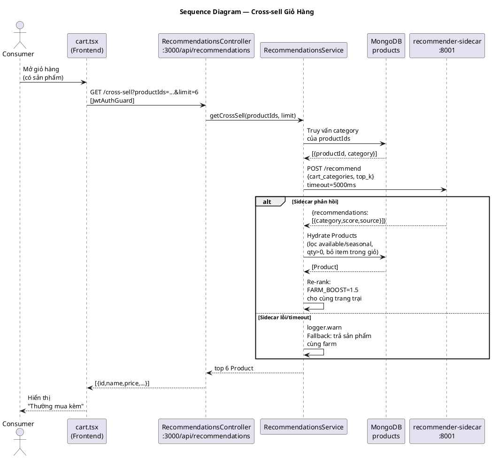

# Thesis Update Task 3 Implementation Plan

> **For agentic workers:** REQUIRED SUB-SKILL: Use superpowers:subagent-driven-development (recommended) or superpowers:executing-plans to implement this plan task-by-task. Steps use checkbox (`- [ ]`) syntax for tracking.

**Goal:** Cập nhật `docs/thesis/final/` để phản ánh trung thực 100% các tính năng mới (cross-sell recommender, reviews, auth reset, admin enhancements) theo kỷ luật `.handoff/rules.md`.

**Architecture:** Sequential task tree T3.0→T3.19; các task ⭐ (T3.2, T3.8, T3.9, T3.13, T3.18) yêu cầu implementer sonnet viết trước, sau đó verifier sonnet độc lập đọc lại file nguồn và REJECT nếu claim không resolve. Không bịa số eval — cross-sell chỉ thống kê mô tả.

**Tech Stack:** Markdown thesis tiếng Việt + PlantUML diagrams. Mọi câu kỹ thuật mang `[ref: path:Lxx]` hoặc `[ref: ledger id]`. Branch: `feature/f2t-thesis-merge-main`.

---

## Canonical numbers (dùng xuyên suốt toàn plan)

| Metric | Giá trị mới | Evidence command |
|--------|-------------|-----------------|
| NestJS modules | **15** | `ls f2t-backend/src/modules/ \| wc -l` → 15 |
| Sidecar | **2** (port 8000 + 8001) | pricing-sidecar/ + recommender-sidecar/ |
| AI/ML functions | **4** | +cross-sell association rules |
| REST endpoints | **92** | `grep -rhoE "@(Get\|Post\|Put\|Patch\|Delete)\(" f2t-backend/src --include="*.controller.ts" \| wc -l` → 92 |
| Test spec files | **24** | `find f2t-backend/src -name "*.spec.ts" \| wc -l` → 24 |
| Test cases | **78** | `grep -rE "^\s+it\(" f2t-backend/src --include="*.spec.ts" \| wc -l` → 78 |
| Frontend screens | **53** | `find f2t-frontend/src/app -name "*.tsx" \| grep -v _layout \| wc -l` → 53 |
| MongoDB collections | **12** | +reviews, +password_reset_tokens |

---

## Task T3.0: Fact-pack ledger + claims-ledger.md

**Files:**
- Modify: `.handoff/claims-ledger.md`

- [ ] **Step 1: Đọc claims-ledger hiện tại**

```bash
cat /Users/air/f2t/.handoff/claims-ledger.md
```

- [ ] **Step 2: Xác minh số dòng thật từ source files**

```bash
# Recommendations
grep -n "FARM_BOOST\|timeout.*5000\|logger.warn" f2t-backend/src/modules/recommendations/recommendations.service.ts
grep -n "@Get\|@Controller" f2t-backend/src/modules/recommendations/recommendations.controller.ts
grep -n "@app.post\|@app.get\|def recommend\|def health" recommender-sidecar/main.py

# Reviews
grep -n "productId\|orderId\|rating\|reviewCount\|averageRating" f2t-backend/src/modules/reviews/schemas/review.schema.ts
grep -n "averageRating\|reviewCount" f2t-backend/src/modules/products/schemas/product.schema.ts
grep -n "@Get\|@Post\|@Delete" f2t-backend/src/modules/reviews/reviews.controller.ts

# Auth
grep -n "forgot-password\|verify-otp\|reset-password\|change-password\|register/farm" f2t-backend/src/modules/auth/auth.controller.ts

# Admin
grep -n "@Get.*posts\|@Delete.*posts" f2t-backend/src/modules/admin/admin.controller.ts

# Numbers
ls f2t-backend/src/modules/ | wc -l
grep -rhoE "@(Get|Post|Put|Patch|Delete)\(" f2t-backend/src --include="*.controller.ts" | wc -l
find f2t-backend/src -name "*.spec.ts" | wc -l
grep -rE "^\s+it\(" f2t-backend/src --include="*.spec.ts" | wc -l
```

- [ ] **Step 3: Thêm 5 entry mới vào claims-ledger.md**

Append vào cuối file `.handoff/claims-ledger.md`:

```markdown
---

## Task 3 entries (thesis update 2026-06-09)

### cross-sell-v1
**Claim:** F2T có module cross-sell recommendations (GĐ1 category-level, warm-start Instacart).
**Evidence:**
- Backend module: `f2t-backend/src/modules/recommendations/recommendations.service.ts:10` (FARM_BOOST=1.5), `:48` (timeout 5000ms), `:56` (fallback graceful)
- Controller endpoint: `f2t-backend/src/modules/recommendations/recommendations.controller.ts:15` (GET /cross-sell)
- Sidecar: `recommender-sidecar/main.py:56` (GET /health), `:61` (POST /recommend)
- App module: `f2t-backend/src/app.module.ts` — RecommendationsModule đăng ký + RECOMMENDER_SIDECAR_URL
- Frontend: `f2t-frontend/src/components/cart/cross-sell.tsx` + `f2t-frontend/src/app/(app)/cart.tsx`
- Pipeline: `recommender-final/scripts/mine_rules.py` (FP-Growth mlxtend), `recommender-final/scripts/prepare_instacart.py`
- Kết quả train thật: `recommender-final/README.md` §"Actual warm-start run" — 2,874,457 giỏ → 34 luật / 8 antecedent / 9 category

### t1.4-no-recommender — LỊCH SỬ (invalid sau cross-sell GĐ1, 2026-06-09)
Entry cũ khẳng định F2T không có recommender. **Không còn đúng sau commit 3a6e002.** Dùng `cross-sell-v1` thay thế. Câu đúng: "F2T không có recommender cá nhân hoá / lọc cộng tác; CÓ cross-sell giỏ hàng category-level bằng FP-Growth association rules."

### reviews-v1
**Claim:** F2T có module Reviews (backend + frontend) và product schema có averageRating/reviewCount.
**Evidence:**
- Schema: `f2t-backend/src/modules/reviews/schemas/review.schema.ts` (productId, orderId, customerId, rating 1-5, comment max 500, photos, 2 index)
- Controller: `f2t-backend/src/modules/reviews/reviews.controller.ts:31` (GET), `:37` (GET my), `:45` (POST), `:53` (DELETE :id)
- Product schema: `f2t-backend/src/modules/products/schemas/product.schema.ts:140-144` (averageRating default 0, reviewCount default 0)
- Frontend: `f2t-frontend/src/app/products/add-review.tsx` + review list in `f2t-frontend/src/app/products/[id].tsx`
- Admin: `f2t-frontend/src/app/admin/reviews.tsx`

### auth-reset-v1
**Claim:** F2T có password reset flow (4 endpoint mới) và register/farm.
**Evidence:**
- Schema: `f2t-backend/src/modules/auth/schemas/password-reset-token.schema.ts` (email index, otp bcrypt, expiresAt, used; TTL index expiresAt expireAfterSeconds=0)
- Endpoints: `f2t-backend/src/modules/auth/auth.controller.ts:135` (forgot-password), `:143` (verify-otp), `:150` (reset-password), `:159` (change-password), `:69` (register/farm)
- Frontend: `f2t-frontend/src/app/forgot-password.tsx`, `verify-otp.tsx`, `reset-password.tsx`, `(app)/profile/change-password.tsx`

### admin-v2
**Claim:** Admin module có thêm GET/DELETE /admin/posts; admin route đổi từ (admin)/ sang admin/.
**Evidence:**
- `f2t-backend/src/modules/admin/admin.controller.ts:66` (GET posts), `:75` (DELETE posts/:id)
- Frontend: `f2t-frontend/src/app/admin/posts.tsx`, `admin/products.tsx`, `admin/reviews.tsx`
- Route: `f2t-frontend/src/app/admin/_layout.tsx` (không còn (admin)/)

### numbers-v3
**Claim:** Canonical numbers đã thay đổi (2026-06-09).
**Evidence (verified commands):**
- 15 module: `ls f2t-backend/src/modules/ | wc -l` → 15
- 2 sidecar: pricing-sidecar/ port 8000 + recommender-sidecar/ port 8001
- 92 endpoint: `grep -rhoE "@(Get|Post|Put|Patch|Delete)\(" f2t-backend/src --include="*.controller.ts" | wc -l` → 92
- 24 spec: `find f2t-backend/src -name "*.spec.ts" | wc -l` → 24
- 78 test: `grep -rE "^\s+it\(" f2t-backend/src --include="*.spec.ts" | wc -l` → 78
- 53 screens: `find f2t-frontend/src/app -name "*.tsx" | grep -v _layout | wc -l` → 53
- 12 collections: +reviews, +password_reset_tokens (từ 10)
```

- [ ] **Step 4: Commit**

```bash
git add .handoff/claims-ledger.md
git commit -m "task(T3.0): fact-pack ledger — 5 entry mới (cross-sell/reviews/auth-reset/admin-v2/numbers-v3), đánh dấu t1.4-no-recommender LỊCH SỬ"
```

---

## Task T3.1: STRUCTURE.md — canonical numbers update

**Files:**
- Modify: `docs/thesis/final/STRUCTURE.md`

- [ ] **Step 1: Đọc STRUCTURE.md hiện tại**

```bash
cat docs/thesis/final/STRUCTURE.md
```

- [ ] **Step 2: Cập nhật số canonical trong bảng**

Tìm và thay thế toàn bộ các số cũ:
- `13 module` → `15 module`
- `1 sidecar` → `2 sidecar`  
- `3 chức năng AI` → `4 chức năng AI`
- `~79 endpoint` → `92 endpoint`
- `21 spec` → `24 spec`
- `54 test` → `78 test`
- `~48 màn hình` → `53 màn hình`
- `10 collection` → `12 collection`

Thêm vào cuối phần "Số canonical" (hoặc bảng canonical):

```markdown
## Cross-sell — giới hạn bắt buộc §5.2

(a) Category-level không phải product-level — luật dạng category→category, không định danh sản phẩm cụ thể.
(b) Warm-start Instacart (hành vi siêu thị Mỹ) ≠ đơn F2T thật — chưa retrain trên đơn hàng F2T.
(c) Chưa có đánh giá định lượng chất lượng gợi ý (precision@k / recall / hit-rate); chỉ có thống kê mô tả luật.
(d) Chỉ hiển thị trong giỏ hàng (cart-based), không có gợi ý trên trang chủ hay trang sản phẩm.
```

- [ ] **Step 3: Verify**

```bash
grep -c "15 module\|2 sidecar\|4 chức năng\|92 endpoint\|24 spec\|78 test\|53 màn\|12 collection" docs/thesis/final/STRUCTURE.md
```

Expected: ≥ 6 hits (không nhất thiết phải có tất cả ở 1 chỗ)

- [ ] **Step 4: Commit**

```bash
git add docs/thesis/final/STRUCTURE.md
git commit -m "task(T3.1): STRUCTURE.md — canonical numbers v3 (15 module/2 sidecar/4 AI/92 ep/53 screen/78 test/12 col) + 4 giới hạn cross-sell"
```

---

## Task T3.2 ⭐: §2.4.4 FP-Growth theory + scope fix §2.1.2/§2.5/§2.6

**Files:**
- Modify: `docs/thesis/final/chuong-2-co-so-ly-thuyet.md`

### Bước implementer

- [ ] **Step 1: Đọc đoạn cần sửa**

```bash
sed -n '210,235p' docs/thesis/final/chuong-2-co-so-ly-thuyet.md  # end of §2.4.3
sed -n '11,30p' docs/thesis/final/chuong-2-co-so-ly-thuyet.md    # §2.1.2
sed -n '255,280p' docs/thesis/final/chuong-2-co-so-ly-thuyet.md  # §2.6 end
```

- [ ] **Step 2: Thêm §2.4.4 sau khi §2.4.3 kết thúc (trước `## 2.5`)**

Chèn đoạn sau vào trước dòng `## 2.5. Các hệ thống tương tự`:

```markdown
### 2.4.4. Khai phá luật kết hợp và FP-Growth

**Khai phá luật kết hợp (Association Rule Mining)** là kỹ thuật học máy không giám sát nhằm tìm kiếm các mẫu đồng xuất hiện thường xuyên trong tập dữ liệu giao dịch [TLTK]. Đây là lĩnh vực **học máy không giám sát** (unsupervised learning) — không cần nhãn; thuật toán khám phá cấu trúc tiềm ẩn từ dữ liệu thô. Bài toán điển hình là **market-basket analysis**: cho tập hợp các giao dịch mua hàng, tìm các tập mặt hàng thường xuất hiện cùng nhau, từ đó sinh ra các luật dạng "nếu mua X thì thường mua thêm Y" [TLTK].

**Ba độ đo cốt lõi** đánh giá chất lượng một luật A → C [TLTK]:

- **Support** (hỗ trợ): tỉ lệ giao dịch chứa cả A và C trong toàn bộ tập dữ liệu.
  `support(A → C) = |{t ∈ T : A ∪ C ⊆ t}| / |T|`
- **Confidence** (tin cậy): trong số các giao dịch chứa A, bao nhiêu phần trăm cũng chứa C.
  `confidence(A → C) = support(A ∪ C) / support(A)`
- **Lift** (độ nâng): đánh giá mức độ A và C phụ thuộc nhau so với trường hợp ngẫu nhiên. Lift > 1 nghĩa là A và C xuất hiện cùng nhau nhiều hơn kỳ vọng.
  `lift(A → C) = confidence(A → C) / support(C)`

**Thuật toán Apriori** (Agrawal & Srikant, 1994) là thuật toán đầu tiên khai thác bài toán này hiệu quả bằng nguyên lý phản đơn điệu: mọi tập con của một frequent itemset cũng phải là frequent [TLTK]. Tuy nhiên, Apriori sinh ra số lượng lớn candidate itemset trong quá trình duyệt, gây tốn bộ nhớ và I/O trên tập dữ liệu lớn.

**Thuật toán FP-Growth** (Han, Pei & Yin, 2000) giải quyết điểm yếu trên bằng cấu trúc dữ liệu **FP-tree** (Frequent Pattern tree): nén toàn bộ tập dữ liệu vào một cây prefix chỉ qua 2 lần duyệt dữ liệu, sau đó khai thác trực tiếp từ cây mà **không sinh candidate itemset** [TLTK]. Độ phức tạp thực tế thấp hơn Apriori đáng kể trên các tập sparse và large-scale.

**Áp dụng trong F2T — Cross-sell category-level:**
Hệ thống sử dụng thư viện `mlxtend` (Python) để chạy FP-Growth trên tập dữ liệu warm-start **Instacart 2017** (2,874,457 giỏ mua hàng) [ref: recommender-final/README.md §"Actual warm-start run"]. Dữ liệu được tiền xử lý bởi `prepare_instacart.py`: map aisle Instacart → 10 category F2T (`leafy`, `root`, `fruit`, `herbs`, `mushrooms`, `grains`, `dairy`, `eggs`, `honey`, `other`) [ref: recommender-final/scripts/prepare_instacart.py]. Sau đó `mine_rules.py` chạy FP-Growth với ngưỡng `min_support=0.02`, `min_confidence=0.10`, xếp hạng kết quả theo lift [ref: recommender-final/scripts/mine_rules.py]. Kết quả là file JSON `category_rules.json` và `category_popularity.json` được nạp vào recommender-sidecar khi khởi động [ref: recommender-sidecar/main.py:17-29].

Quan trọng: đây là **khai phá luật kết hợp category-level** (antecedent và consequent đều là category, không phải product cụ thể), **không phải** collaborative filtering hay deep learning. Dữ liệu là hành vi siêu thị Mỹ (Instacart), được dùng làm warm-start cho đến khi hệ thống tích lũy đủ đơn hàng F2T thật để retrain.
```

- [ ] **Step 3: Sửa §2.1.2 — "chỉ ba trong bốn" → "bốn trong bốn"**

Tìm câu:
```
Cần lưu ý rằng bốn ứng dụng trên là khung lý thuyết chung áp dụng cho TMĐT nói chung. Trong phạm vi hệ thống F2T được trình bày trong khoá luận này, **chỉ ba trong bốn ứng dụng được hiện thực hoá
```

Thay bằng:
```
Cần lưu ý rằng bốn ứng dụng trên là khung lý thuyết chung áp dụng cho TMĐT nói chung. Trong phạm vi hệ thống F2T được trình bày trong khoá luận này, **cả bốn ứng dụng đều được hiện thực hoá: dự báo nhu cầu (ForecasterLSTM), định giá động (DDQN), phân loại độ tươi từ ảnh (CoreML), và gợi ý sản phẩm trong giỏ hàng (cross-sell FP-Growth association rules, category-level warm-start)** [ref: ledger cross-sell-v1; ledger t1.4-forecaster-not-holt; ledger t0.6-coreml-freshness].
```

Xóa câu "F2T **không có hệ thống gợi ý sản phẩm** — không tồn tại module recommender..."

- [ ] **Step 4: Sửa §2.5 — bảng so sánh hệ thống tương tự**

Cột "Hệ thống gợi ý sản phẩm" trong Bảng 2.2: thêm hàng F2T = "Có (cross-sell category-level, FP-Growth, warm-start Instacart)". Sửa chú thích "không có hệ thống gợi ý" ở §2.5:

Tìm:
```
**chưa có hệ thống nào trong số các đối thủ nêu trên tích hợp đồng thời ba chức năng AI — dự báo nhu cầu, định giá động và phân loại độ tươi từ ảnh
```
Thay bằng:
```
**chưa có hệ thống nào trong số các đối thủ nêu trên tích hợp đồng thời bốn chức năng AI — dự báo nhu cầu, định giá động, phân loại độ tươi từ ảnh, và gợi ý sản phẩm trong giỏ hàng — dành riêng cho nông hộ nhỏ
```

Xóa `[ref: ledger t1.4-no-recommender]` → thay bằng `[ref: ledger cross-sell-v1]`

- [ ] **Step 5: Sửa §2.6 — cập nhật "ba trục" → "ba trục"** (trục AI vẫn là 3 trục chiến lược, chỉ cập nhật số AI function)

Tìm trong §2.6:
```
**AI trong luồng mua hàng — ba chức năng:**
```
Thay bằng:
```
**AI trong luồng mua hàng — bốn chức năng:**
```

Và thêm sau mô tả 3 chức năng cũ:
```
; (4) **Cross-sell FP-Growth** gợi ý sản phẩm "thường mua kèm" trong giỏ hàng dựa trên 34 luật kết hợp category-level được khai phá từ 2,874,457 giỏ Instacart warm-start, xếp hạng theo lift với re-rank ưu tiên cùng trang trại [ref: ledger cross-sell-v1].
```

Thay `≈48 màn hình` → `53 màn hình` trong §2.6.

- [ ] **Step 6: Verify implementer**

```bash
grep -c "FP-Growth\|association rule\|2\.4\.4" docs/thesis/final/chuong-2-co-so-ly-thuyet.md
grep -c "t1.4-no-recommender" docs/thesis/final/chuong-2-co-so-ly-thuyet.md
# Expected: FP-Growth ≥ 3, t1.4-no-recommender = 0
```

- [ ] **Step 7: Commit implementer**

```bash
git add docs/thesis/final/chuong-2-co-so-ly-thuyet.md
git commit -m "task(T3.2-impl): Chương 2 — §2.4.4 FP-Growth theory + scope fix §2.1.2/§2.5/§2.6 (4 AI functions, xóa t1.4-no-recommender)"
```

### Bước verifier (agent độc lập — đọc lại source, không tin vào prose vừa viết)

- [ ] **Step 8: Verifier đọc source files trực tiếp**

```bash
cat recommender-final/scripts/mine_rules.py | grep -n "mlxtend\|fpgrowth\|min_support\|min_confidence\|lift"
cat recommender-sidecar/main.py | grep -n "_load\|RECOMMENDER\|category_rules\|category_popularity"
cat recommender-final/README.md | grep -A 15 "Actual warm-start"
```

- [ ] **Step 9: Verifier kiểm tra 4 điểm bắt buộc**

1. §2.4.4 KHÔNG gọi cross-sell là "neural/deep learning/collaborative filtering" — verify:
   ```bash
   grep -n "neural\|deep learning\|collaborative" docs/thesis/final/chuong-2-co-so-ly-thuyet.md | grep -i "cross.sell\|fp.growth\|association"
   # Expected: 0 hits
   ```

2. Số giỏ và luật khớp README:
   ```bash
   grep -n "2.874.457\|34 luật\|34 rule\|8 antecedent\|9 category" docs/thesis/final/chuong-2-co-so-ly-thuyet.md
   # Expected: số giỏ và số luật xuất hiện đúng
   ```

3. Không còn "t1.4-no-recommender" trong Ch2:
   ```bash
   grep "t1.4-no-recommender" docs/thesis/final/chuong-2-co-so-ly-thuyet.md
   # Expected: 0 hits
   ```

4. FP-Growth refs resolve: `recommender-final/scripts/mine_rules.py` tồn tại:
   ```bash
   ls recommender-final/scripts/mine_rules.py recommender-sidecar/main.py
   # Expected: cả 2 file tồn tại
   ```

- [ ] **Step 10: Nếu verifier PASS → commit verifier note**

```bash
git commit --allow-empty -m "task(T3.2-verify): §2.4.4 FP-Growth PASS — 4 điểm: không overclaim ML type, số khớp README, 0 t1.4-no-recommender, refs resolve"
```

Nếu FAIL → sửa prose và quay lại Step 6.

---

## Task T3.3: Sweep "no recommender" toàn chương 3, 4, 5

**Files:**
- Modify: `docs/thesis/final/chuong-3-phan-tich-thiet-ke.md`
- Modify: `docs/thesis/final/chuong-4-trien-khai-thuc-nghiem.md`
- Modify: `docs/thesis/final/chuong-5-ket-luan.md`

- [ ] **Step 1: Tìm tất cả vị trí cần sửa**

```bash
grep -n "t1.4-no-recommender\|không có module recommender\|không có chức năng gợi ý\|không có hệ thống gợi ý\|không có thuật toán gợi ý\|không có màn hình gợi ý\|không triển khai bất kỳ cơ chế gợi ý\|hiện chưa tồn tại" docs/thesis/final/chuong-3-phan-tich-thiet-ke.md docs/thesis/final/chuong-4-trien-khai-thuc-nghiem.md docs/thesis/final/chuong-5-ket-luan.md
```

- [ ] **Step 2: Áp dụng các thay thế sau (trong tất cả 3 file)**

**Thay thế 1 — ref ledger:**
```
[ref: ledger t1.4-no-recommender]
```
→
```
[ref: ledger cross-sell-v1]
```

**Thay thế 2 — câu khẳng định tuyệt đối "không có module recommender":**
Tìm bất kỳ câu dạng: "F2T không có module recommender / không có chức năng gợi ý sản phẩm / hệ thống không có use case gợi ý"

Scope lại thành: "F2T không có recommender **cá nhân hoá** / lọc cộng tác (collaborative filtering) hay lọc nội dung; **có** cross-sell giỏ hàng category-level bằng FP-Growth association rules [ref: ledger cross-sell-v1]"

**Thay thế 3 — "không có recommendation_caches" (§3.4 và §4.4.1):**
Câu này VẪN ĐÚNG. Giữ nguyên nhưng mở rộng:
```
KHÔNG có `recommendation_caches` hay `forecast_caches`
```
→
```
KHÔNG có `recommendation_caches` hay `forecast_caches` — artifact cross-sell là file JSON (`category_rules.json`, `category_popularity.json`) nạp vào bộ nhớ sidecar lúc khởi động, không tạo collection MongoDB [ref: recommender-sidecar/main.py:17-29; ledger cross-sell-v1]
```

**Thay thế 4 — home/feed "không có gợi ý" (§3.5 và §4.4 Demo):**
Giữ lại câu về home/feed không có gợi ý (ĐÚNG — cross-sell chỉ ở cart), nhưng thêm ngữ cảnh:
```
không có gợi ý sản phẩm trên màn hình trang chủ hay feed
```
Và thêm câu: "Gợi ý sản phẩm cross-sell category-level chỉ xuất hiện trong màn hình **giỏ hàng** (`(app)/cart.tsx`) qua component `CrossSell` [ref: f2t-frontend/src/app/(app)/cart.tsx; ledger cross-sell-v1]."

- [ ] **Step 3: Verify sweep hoàn tất**

```bash
grep -rn "t1.4-no-recommender" docs/thesis/final/chuong-3-phan-tich-thiet-ke.md docs/thesis/final/chuong-4-trien-khai-thuc-nghiem.md docs/thesis/final/chuong-5-ket-luan.md
# Expected: 0 hits

grep -rn "không có module recommender\|hiện chưa tồn tại.*recommender\|thuần tuý.*tương lai.*recommender" docs/thesis/final/
# Expected: 0 hits (hoặc chỉ còn trong §5.3 nói về GĐ2 CF là tương lai — OK)
```

- [ ] **Step 4: Commit**

```bash
git add docs/thesis/final/chuong-3-phan-tich-thiet-ke.md docs/thesis/final/chuong-4-trien-khai-thuc-nghiem.md docs/thesis/final/chuong-5-ket-luan.md
git commit -m "task(T3.3): sweep 'no recommender' — scope lại 8+ câu tuyệt đối → cross-sell cat-level; giữ 'không có CF/personalized'; recommendation_caches vẫn đúng + giải thích JSON artifact"
```

---

## Task T3.4: §3.3.1 Kiến trúc — 15 module, 2 sidecar

**Files:**
- Modify: `docs/thesis/final/chuong-3-phan-tich-thiet-ke.md` (§3.3.1, khoảng L102–L130)

- [ ] **Step 1: Đọc đoạn hiện tại**

```bash
sed -n '100,135p' docs/thesis/final/chuong-3-phan-tich-thiet-ke.md
grep -n "13 module\|1 sidecar\|PRICING_SIDECAR_URL\|port 8000\|Monolith + 1" docs/thesis/final/chuong-3-phan-tich-thiet-ke.md
```

- [ ] **Step 2: Cập nhật §3.3.1**

Tìm:
```
gồm 13 module [ref: ledger t1.4-one-sidecar]: `admin`, `auth`, `delivery`, `demand-forecasting`, `dynamic-pricing`, `farms`, `notifications`, `orders`, `payments`, `posts`, `products`, `uploads` và `users`
```
Thay bằng:
```
gồm 15 module [ref: ledger numbers-v3]: `admin`, `auth`, `delivery`, `demand-forecasting`, `dynamic-pricing`, `farms`, `notifications`, `orders`, `payments`, `posts`, `products`, `recommendations`, `reviews`, `uploads` và `users`
```

Tìm:
```
**Pricing Sidecar FastAPI** chạy trên cổng 8000 và cung cấp đúng 3 endpoint phục vụ các chức năng AI/ML [ref: ledger t1.4-one-sidecar]:
```
Thay bằng:
```
**Pricing Sidecar FastAPI** (`pricing-sidecar/`) chạy trên cổng 8000 và cung cấp đúng 3 endpoint phục vụ các chức năng định giá + dự báo + phân loại tươi [ref: ledger t1.4-one-sidecar]:
```

Sau đoạn mô tả 3 endpoint của pricing-sidecar, thêm:

```markdown
**Recommender Sidecar FastAPI** (`recommender-sidecar/`) chạy trên cổng 8001 và cung cấp 2 endpoint phục vụ chức năng cross-sell [ref: recommender-sidecar/main.py:56,61]:

- `/recommend` (POST) — nhận `{cart_categories, top_k}`, trả `{recommendations: [{category, score, source}]}` dựa trên category rules FP-Growth [ref: recommender-sidecar/main.py:61].
- `/health` (GET) — kiểm tra trạng thái sidecar [ref: recommender-sidecar/main.py:56].

Sidecar nạp artifact JSON (`category_rules.json`, `category_popularity.json`) từ `recommender-final/model/` khi khởi động; **không truy cập MongoDB** [ref: recommender-sidecar/main.py:17-29]. URL được cấu hình qua biến môi trường `RECOMMENDER_SIDECAR_URL` (mặc định `http://localhost:8001`) [ref: f2t-backend/src/app.module.ts].
```

Tìm `Monolith + 1 Sidecar` (nếu có trong §3.3.1) → thay bằng `Monolith + 2 Sidecar`.

Thêm vào auth module mô tả: password reset flow (forgot-password → verify-otp → reset-password) và `/auth/register/farm` (tạo user + farm 1 bước, rollback nếu lỗi) [ref: auth.controller.ts:69,135,143,150,159].

- [ ] **Step 3: Verify**

```bash
grep -n "15 module\|2 sidecar\|recommender-sidecar\|port 8001" docs/thesis/final/chuong-3-phan-tich-thiet-ke.md | head -10
grep -n "13 module" docs/thesis/final/chuong-3-phan-tich-thiet-ke.md
# Expected: 15 module xuất hiện, 13 module = 0
```

- [ ] **Step 4: Commit**

```bash
git add docs/thesis/final/chuong-3-phan-tich-thiet-ke.md
git commit -m "task(T3.4): §3.3.1 — 15 module (+ recommendations/reviews), 2 sidecar (+ recommender-sidecar :8001), auth password reset"
```

---

## Task T3.5: §3.3.3 Use Cases AI/ML — thêm UC cross-sell + UC review

**Files:**
- Modify: `docs/thesis/final/chuong-3-phan-tich-thiet-ke.md` (§3.3.3, khoảng L131–L170)

- [ ] **Step 1: Đọc §3.3.3 hiện tại**

```bash
sed -n '129,175p' docs/thesis/final/chuong-3-phan-tich-thiet-ke.md
```

- [ ] **Step 2: Thêm UC-ML-03 cross-sell sau UC-ML-02**

Sau đoạn UC-ML-02 (định giá động), thêm:

```markdown
**UC-ML-03: Cross-sell giỏ hàng (gợi ý sản phẩm thường mua kèm)** — Tác nhân: Consumer. Khi Consumer mở màn hình giỏ hàng, component `CrossSell` gửi request `GET /api/recommendations/cross-sell?productIds=...&limit=6` tới `RecommendationsController` [ref: f2t-backend/src/modules/recommendations/recommendations.controller.ts:15]. `RecommendationsService.getCrossSell()` trích xuất category từ productIds → gọi `recommender-sidecar :8001/recommend` (timeout 5000ms; nếu sidecar lỗi → fallback trả sản phẩm cùng farm, không 500) [ref: f2t-backend/src/modules/recommendations/recommendations.service.ts:48,56] → lọc tồn kho (status ∈ {available,seasonal}, availableQuantity>0, loại sản phẩm đã trong giỏ) → re-rank với FARM_BOOST=1.5 cho sản phẩm cùng trang trại [ref: f2t-backend/src/modules/recommendations/recommendations.service.ts:10,86] → trả top 6 sản phẩm. Đây là **cross-sell category-level** dựa trên FP-Growth association rules, **không** phải collaborative filtering hay cá nhân hoá theo lịch sử người dùng [ref: ledger cross-sell-v1].
```

Sau UC-ML-03, thêm UC review:

```markdown
**UC-RV-01: Đánh giá sản phẩm** — Tác nhân: Consumer (đã mua). Consumer đã nhận đơn hàng có thể đánh giá sản phẩm (rating 1–5 sao, comment tối đa 500 ký tự, tùy chọn thêm ảnh) qua `POST /api/reviews` [ref: f2t-backend/src/modules/reviews/reviews.controller.ts:45]. Ràng buộc: `orderId` bắt buộc — chỉ người đã đặt hàng mới review được. Service cập nhật `product.averageRating` và `product.reviewCount` sau mỗi review mới [ref: f2t-backend/src/modules/reviews/reviews.service.ts]. Consumer xem danh sách review qua `GET /api/reviews?productId=...` [ref: f2t-backend/src/modules/reviews/reviews.controller.ts:31]. Admin có thể xóa review qua module admin.
```

Sửa dòng mở đầu §3.3.3 từ "Module AI/ML của F2T bổ sung **hai** use case" → "Module AI/ML và nghiệp vụ của F2T bổ sung **bốn** use case mở rộng".

- [ ] **Step 3: Verify**

```bash
grep -n "UC-ML-03\|UC-RV-01\|cross-sell\|bốn use case" docs/thesis/final/chuong-3-phan-tich-thiet-ke.md | head -10
```

- [ ] **Step 4: Commit**

```bash
git add docs/thesis/final/chuong-3-phan-tich-thiet-ke.md
git commit -m "task(T3.5): §3.3.3 — thêm UC-ML-03 cross-sell + UC-RV-01 review; 4 use case AI/nghiệp vụ mở rộng"
```

---

## Task T3.6: §3.3.x Reviews module — thêm tiểu mục mới

**Files:**
- Modify: `docs/thesis/final/chuong-3-phan-tich-thiet-ke.md` (chèn sau §3.3.6 hoặc §3.3.7)

- [ ] **Step 1: Xác định vị trí chèn**

```bash
grep -n "^### 3\.3\." docs/thesis/final/chuong-3-phan-tich-thiet-ke.md
```

Chèn **§3.3.8** (sau §3.3.7 AI/ML) với nội dung:

```markdown
### 3.3.8. Module Reviews (Đánh giá sản phẩm)

Module `reviews` cung cấp chức năng đánh giá sản phẩm, liên kết chặt chẽ với module `orders` (ràng buộc orderId) và module `products` (cập nhật aggregated rating).

**Controller** `ReviewsController` phơi bày 4 endpoint tại `/api/reviews` [ref: f2t-backend/src/modules/reviews/reviews.controller.ts]:
- `GET /api/reviews` — truy vấn danh sách review theo `productId`, phân trang.
- `GET /api/reviews/my` — lấy review của người dùng đang đăng nhập.
- `POST /api/reviews` — tạo review mới; body yêu cầu `productId`, `orderId`, `rating` (1–5), `comment` (max 500 ký tự); tùy chọn `photos` (mảng URL).
- `DELETE /api/reviews/:id` — xóa review (chỉ chủ sở hữu hoặc admin).

**Service** `ReviewsService` sau khi tạo review thành công: thực hiện aggregation MongoDB để tính lại `averageRating` và `reviewCount` trên collection `products` [ref: f2t-backend/src/modules/reviews/reviews.service.ts].

**Schema** `Review` [ref: f2t-backend/src/modules/reviews/schemas/review.schema.ts]:
```
productId  ObjectId (ref Product, required)
orderId    ObjectId (ref Order, required)
customerId ObjectId (ref User, required)
customerName String (required)
customerAvatarUrl String (optional)
rating     Number 1–5 (required)
comment    String max 500 (required)
photos     String[] (default [])
```
Index: `{ productId: 1 }`, `{ customerId: 1 }`.

Schema `Product` được bổ sung 2 trường [ref: f2t-backend/src/modules/products/schemas/product.schema.ts:140-144]:
- `averageRating: Number` (default 0)
- `reviewCount: Number` (default 0)

**Frontend:** Consumer đánh giá tại `products/add-review.tsx` sau khi nhận đơn. Review list hiển thị trực tiếp trên trang chi tiết sản phẩm `products/[id].tsx`. Admin quản lý review tại `admin/reviews.tsx`.
```

- [ ] **Step 2: Verify**

```bash
ls f2t-backend/src/modules/reviews/schemas/review.schema.ts f2t-backend/src/modules/reviews/reviews.controller.ts
grep -n "averageRating\|reviewCount" f2t-backend/src/modules/products/schemas/product.schema.ts
# Expected: cả 2 file tồn tại, averageRating ở L140-144
```

- [ ] **Step 3: Commit**

```bash
git add docs/thesis/final/chuong-3-phan-tich-thiet-ke.md
git commit -m "task(T3.6): §3.3.8 Reviews module — schema/controller/service/frontend; product averageRating/reviewCount"
```

---

## Task T3.7: §3.3.9 Recommendations module — thêm tiểu mục mới

**Files:**
- Modify: `docs/thesis/final/chuong-3-phan-tich-thiet-ke.md` (chèn sau §3.3.8)

- [ ] **Step 1: Verify source trước khi viết**

```bash
grep -n "FARM_BOOST\|timeout\|fallback\|availableQuantity\|status.*available" f2t-backend/src/modules/recommendations/recommendations.service.ts
grep -n "RECOMMENDER_SIDECAR_URL" f2t-backend/src/app.module.ts
```

- [ ] **Step 2: Chèn §3.3.9**

```markdown
### 3.3.9. Module Recommendations (Cross-sell)

Module `recommendations` hiện thực chức năng gợi ý sản phẩm "thường mua kèm" trong giỏ hàng dựa trên FP-Growth association rules (category-level).

**Controller** `RecommendationsController` [ref: f2t-backend/src/modules/recommendations/recommendations.controller.ts:15]:
```
GET /api/recommendations/cross-sell?productIds=<ids>&limit=6
```
Endpoint bảo vệ bởi `JwtAuthGuard`. Nhận `productIds` (comma-separated), trả mảng `Product` gợi ý.

**Service** `RecommendationsService.getCrossSell()` thực hiện pipeline 4 bước [ref: f2t-backend/src/modules/recommendations/recommendations.service.ts]:
1. Trích xuất category từ productIds (truy vấn MongoDB `products` collection).
2. Gọi `recommender-sidecar :8001/recommend` với `{cart_categories, top_k}`. Timeout 5000ms. Nếu sidecar không phản hồi: fallback graceful — logger.warn + trả sản phẩm cùng farm, không throw 500 [ref: :48,56].
3. Lọc tồn kho: chỉ giữ sản phẩm có `status ∈ {available, seasonal}` và `availableQuantity > 0`; bỏ sản phẩm đã có trong giỏ [ref: :71].
4. Re-rank: sản phẩm cùng trang trại với sản phẩm trong giỏ được nhân hệ số `FARM_BOOST = 1.5` [ref: :10,86]. Sắp xếp giảm dần theo score, trả top 6.

**Recommender Sidecar** `recommender-sidecar/main.py`:
- Nạp `category_rules.json` và `category_popularity.json` từ `recommender-final/model/` lúc khởi động [ref: recommender-sidecar/main.py:17-29].
- `POST /recommend`: lookup luật antecedent⊆cart_categories, tính score = confidence × lift, dedup consequent, fallback về popularity nếu không có luật match [ref: :61-84].
- KHÔNG truy cập MongoDB — hoàn toàn stateless.

**Cấu hình:** `RECOMMENDER_SIDECAR_URL` (env, default `http://localhost:8001`) đăng ký trong `f2t-backend/src/app.module.ts` cùng với Joi validation [ref: f2t-backend/src/app.module.ts].

**Frontend:** Component `CrossSell` trong `f2t-frontend/src/components/cart/cross-sell.tsx` render danh sách "Thường mua kèm". Được gọi trong `(app)/cart.tsx`. productIds được memoized để tránh query thrash [ref: f2t-frontend/src/app/(app)/cart.tsx].
```

- [ ] **Step 3: Commit**

```bash
git add docs/thesis/final/chuong-3-phan-tich-thiet-ke.md
git commit -m "task(T3.7): §3.3.9 Recommendations module — controller/service pipeline/sidecar/frontend; fallback/FARM_BOOST citations"
```

---

## Task T3.8 ⭐: §3.3.7d Cross-sell AI/ML design + diagram sd-cross-sell.puml

**Files:**
- Modify: `docs/thesis/final/chuong-3-phan-tich-thiet-ke.md` (§3.3.7, thêm subsection d)
- Create: `docs/thesis/final/diagrams/sd-cross-sell.puml`

### Bước implementer

- [ ] **Step 1: Verify source numbers**

```bash
grep -n "mlxtend\|fpgrowth\|min_support\|min_confidence\|lift\|category_rules\|category_popularity" recommender-final/scripts/mine_rules.py | head -20
cat recommender-final/README.md | grep -A 20 "Actual warm-start"
grep -n "Recommendation\|category\|score\|source" recommender-sidecar/main.py | head -20
```

- [ ] **Step 2: Tạo diagram sd-cross-sell.puml**



- [ ] **Step 3: Thêm §3.3.7d vào §3.3.7 (sau §3.3.7c CoreML)**

```bash
grep -n "^### 3\.3\.7\|3\.3\.7a\|3\.3\.7b\|3\.3\.7c\|3\.3\.7d" docs/thesis/final/chuong-3-phan-tich-thiet-ke.md
```

Chèn sau đoạn kết thúc của §3.3.7c:

```markdown
#### 3.3.7d. Cross-sell — Khai phá luật kết hợp FP-Growth

**Bài toán:** Cho giỏ hàng hiện tại của Consumer gồm tập category `C = {c₁, c₂, ...}`, tìm tập sản phẩm thuộc các category `C'` có xu hướng mua kèm cao nhất với `C`, theo thứ tự lift giảm dần, ưu tiên cùng trang trại.

**Pipeline offline (khai phá luật):**

```
Instacart 2017 orders.csv
    ↓ prepare_instacart.py
    map aisle → 10 category F2T (leafy/root/fruit/herbs/mushrooms/grains/dairy/eggs/honey/other)
    → baskets_category.parquet  (2,874,457 giỏ)
    ↓ mine_rules.py  (mlxtend FP-Growth)
    min_support=0.02, min_confidence=0.10
    xếp theo lift giảm dần
    → category_rules.json  (34 luật, 8 antecedent, 9 category)
    → category_popularity.json  (tần suất category)
```
[ref: recommender-final/scripts/prepare_instacart.py; recommender-final/scripts/mine_rules.py; recommender-final/README.md §"Actual warm-start run"]

**Kết quả khai phá** (warm-start Instacart 2017, min_support=0.02, min_confidence=0.10):
- Tổng giỏ: **2,874,457** | Luật hội tụ: **34** | Antecedent: **8** | Category hiện diện: **9** ('other' vắng vì không có aisle Instacart map, thiết kế đúng)
- Sample rules tiêu biểu: herbs↔root (lift 1.94), mushrooms→root (1.58), leafy→herbs (1.38), dairy→eggs (1.12)
- Popularity: fruit 0.71, leafy 0.60, dairy 0.59, root 0.32, eggs 0.16, herbs 0.11

**Serving (sidecar):** Recommender Sidecar nạp `category_rules.json` và `category_popularity.json` khi khởi động [ref: recommender-sidecar/main.py:17-29]. Endpoint `POST /recommend` lookup luật có antecedent⊆cart_categories, tính score = confidence×lift, fallback về popularity nếu không match [ref: recommender-sidecar/main.py:61-84]. Luồng đầy đủ xem Hình sd-cross-sell.puml.

**Giới hạn thiết kế (bắt buộc ghi rõ):**
1. Category-level (không phải product-level): luật chỉ định danh *loại* sản phẩm, không định danh sản phẩm cụ thể.
2. Warm-start Instacart ≠ F2T thật: luật học từ hành vi siêu thị Mỹ, map về F2T category qua dict curated; cần retrain GĐ2 trên đơn hàng F2T thật (script `export_real_orders.py` đã có nhưng chưa chạy do thiếu dữ liệu).
3. Chưa đánh giá định lượng chất lượng gợi ý (precision@k / recall) — mới có thống kê mô tả luật.
```

- [ ] **Step 4: Commit implementer**

```bash
git add docs/thesis/final/chuong-3-phan-tich-thiet-ke.md docs/thesis/final/diagrams/sd-cross-sell.puml
git commit -m "task(T3.8-impl): §3.3.7d cross-sell FP-Growth design + sd-cross-sell.puml; 34 luật/Instacart/giới hạn 3 điểm"
```

### Bước verifier (đối kháng)

- [ ] **Step 5: Verifier đọc lại source độc lập**

```bash
grep -n "min_support\|min_confidence\|fpgrowth\|lift" recommender-final/scripts/mine_rules.py
cat recommender-final/README.md | grep -A 10 "2,874,457\|34 rule\|34 luật"
grep -n "_load\|category_rules\|category_popularity" recommender-sidecar/main.py
```

- [ ] **Step 6: Verifier kiểm 5 điểm**

1. Số giỏ/luật/antecedent/category khớp README:
   ```bash
   grep "2.874.457\|34 luật\|8 antecedent\|9 category" docs/thesis/final/chuong-3-phan-tich-thiet-ke.md
   ```
2. Không gọi FP-Growth là neural/CF:
   ```bash
   grep -i "neural\|deep learning\|collaborative" docs/thesis/final/chuong-3-phan-tich-thiet-ke.md | grep -i "cross.sell\|fp.growth"
   # Expected: 0
   ```
3. 3 giới hạn thiết kế xuất hiện:
   ```bash
   grep -c "Category-level\|Warm-start Instacart\|precision@k" docs/thesis/final/chuong-3-phan-tich-thiet-ke.md
   # Expected: ≥ 3
   ```
4. Refs resolve:
   ```bash
   ls recommender-final/scripts/mine_rules.py recommender-final/scripts/prepare_instacart.py recommender-sidecar/main.py
   ```
5. Line refs trong recommendations.service.ts:
   ```bash
   sed -n '10p;48p;56p;71p;86p' f2t-backend/src/modules/recommendations/recommendations.service.ts
   # Expected: FARM_BOOST=1.5 tại L10, timeout tại L48, logger.warn tại L56
   ```

- [ ] **Step 7: Nếu PASS → commit verifier**

```bash
git commit --allow-empty -m "task(T3.8-verify): §3.3.7d PASS — 5 điểm: số/README, không overclaim ML, 3 giới hạn, refs resolve, line citations"
```

---

## Task T3.9 ⭐: §3.4 CSDL — +reviews, +password_reset_tokens, product rating fields

**Files:**
- Modify: `docs/thesis/final/chuong-3-phan-tich-thiet-ke.md` (§3.4.1 ERD, §3.4.2 Chi tiết collections, §3.4.3 Chỉ mục)

### Bước implementer

- [ ] **Step 1: Verify schema sources**

```bash
cat f2t-backend/src/modules/reviews/schemas/review.schema.ts
cat f2t-backend/src/modules/auth/schemas/password-reset-token.schema.ts
grep -n "averageRating\|reviewCount\|@Prop" f2t-backend/src/modules/products/schemas/product.schema.ts | tail -10
```

- [ ] **Step 2: Cập nhật §3.4.1 ERD**

Tìm câu mô tả ERD liệt kê 10 collections → cập nhật thành 12 collections, thêm `reviews` và `password_reset_tokens`.

Tìm:
```
10 collection MongoDB
```
Thay bằng:
```
12 collection MongoDB
```

- [ ] **Step 3: Thêm vào §3.4.2 mô tả 2 collection mới**

Tìm cuối danh sách collections trong §3.4.2, sau collection cuối cùng (có thể là `uploads` hoặc `users`), thêm:

```markdown
**Collection `reviews`** [ref: f2t-backend/src/modules/reviews/schemas/review.schema.ts]

Lưu trữ đánh giá sản phẩm của Consumer sau khi mua hàng. Ràng buộc quan trọng: `orderId` bắt buộc — chỉ người đã có đơn hàng với sản phẩm đó mới có thể review.

| Trường | Kiểu | Ràng buộc |
|--------|------|-----------|
| `productId` | ObjectId | required, ref Product |
| `orderId` | ObjectId | required, ref Order |
| `customerId` | ObjectId | required, ref User |
| `customerName` | String | required |
| `customerAvatarUrl` | String | optional |
| `rating` | Number | required, min 1, max 5 |
| `comment` | String | required, maxlength 500 |
| `photos` | String[] | default [] |
| `createdAt`, `updatedAt` | Date | auto (timestamps: true) |

Index: `{ productId: 1 }` — truy vấn theo sản phẩm; `{ customerId: 1 }` — truy vấn review của người dùng.

---

**Collection `password_reset_tokens`** [ref: f2t-backend/src/modules/auth/schemas/password-reset-token.schema.ts]

Lưu OTP đặt lại mật khẩu. Token được bcrypt-hash trước khi lưu. Tự động xóa sau khi hết hạn nhờ TTL index.

| Trường | Kiểu | Ràng buộc |
|--------|------|-----------|
| `email` | String | required, index |
| `otp` | String | required (bcrypt hashed) |
| `expiresAt` | Date | required |
| `used` | Boolean | default false |

TTL index: `{ expiresAt: 1 }, { expireAfterSeconds: 0 }` — MongoDB tự xóa document khi `expiresAt` đến hạn.
```

- [ ] **Step 4: Cập nhật products collection trong §3.4.2**

Tìm mô tả `products` collection → thêm 2 trường mới vào bảng:

```
| `averageRating` | Number | default 0 — trung bình cộng rating từ reviews |
| `reviewCount` | Number | default 0 — tổng số review |
```
[ref: f2t-backend/src/modules/products/schemas/product.schema.ts:140-144]

- [ ] **Step 5: Cập nhật §3.4.3 Chỉ mục**

Thêm vào bảng chỉ mục:

```
| reviews | { productId: 1 } | Truy vấn review theo sản phẩm |
| reviews | { customerId: 1 } | Truy vấn review của người dùng |
| password_reset_tokens | { expiresAt: 1 } expireAfterSeconds=0 | TTL — tự xóa token hết hạn |
| password_reset_tokens | { email: 1 } | Tra cứu OTP theo email |
```

- [ ] **Step 6: Cập nhật câu "10 collection → 12 collection" trong §3.4.1**

Đảm bảo câu đề cập "Hệ thống **không** có các collection `recommendation_caches` hay `forecast_caches`" vẫn giữ nguyên và thêm giải thích mới (đã làm ở T3.3).

- [ ] **Step 7: Commit implementer**

```bash
git add docs/thesis/final/chuong-3-phan-tich-thiet-ke.md
git commit -m "task(T3.9-impl): §3.4 CSDL — +reviews (6 trường/2 index) + password_reset_tokens (TTL) + product averageRating/reviewCount; 12 collection"
```

### Bước verifier

- [ ] **Step 8: Verifier kiểm 4 điểm**

```bash
# 1. Collection count = 12
grep -c "collection" docs/thesis/final/chuong-3-phan-tich-thiet-ke.md | head -5

# 2. Reviews schema khớp source
grep -n "orderId.*required\|rating.*1.*5\|comment.*500\|photos.*\[\]" f2t-backend/src/modules/reviews/schemas/review.schema.ts
# verify từng trường có trong thesis

# 3. TTL index chính xác
grep "expireAfterSeconds" docs/thesis/final/chuong-3-phan-tich-thiet-ke.md
grep "expireAfterSeconds" f2t-backend/src/modules/auth/schemas/password-reset-token.schema.ts
# Expected: đều = 0

# 4. averageRating/reviewCount line refs đúng
sed -n '138,146p' f2t-backend/src/modules/products/schemas/product.schema.ts
# Expected: averageRating default 0 tại ~L140, reviewCount default 0 tại ~L143-144
```

- [ ] **Step 9: Commit verifier**

```bash
git commit --allow-empty -m "task(T3.9-verify): §3.4 CSDL PASS — reviews schema/TTL/product fields khớp source, 12 collection"
```

---

## Task T3.10: §3.5 UI — thêm màn hình mới, scope lại cross-sell

**Files:**
- Modify: `docs/thesis/final/chuong-3-phan-tich-thiet-ke.md` (§3.5.1 Consumer, §3.5.3 Admin)

- [ ] **Step 1: Đọc §3.5 hiện tại**

```bash
sed -n '638,700p' docs/thesis/final/chuong-3-phan-tich-thiet-ke.md
```

- [ ] **Step 2: §3.5.1 Consumer — thêm màn hình mới**

Tìm đoạn mô tả các màn hình Consumer, thêm:

**Sau đoạn cart.tsx:** "Màn hình giỏ hàng (`(app)/cart.tsx`) hiển thị danh sách sản phẩm đã thêm và tổng tiền. Sau danh sách giỏ, component `CrossSell` ("Thường mua kèm") gọi `GET /api/recommendations/cross-sell` và hiển thị tối đa 6 sản phẩm gợi ý category-level dựa trên association rules [ref: f2t-frontend/src/app/(app)/cart.tsx; ledger cross-sell-v1]."

**Thêm nhóm màn hình Auth reset:**
"Nhóm màn hình đặt lại mật khẩu: `forgot-password.tsx` (nhập email), `verify-otp.tsx` (nhập OTP 6 số), `reset-password.tsx` (nhập mật khẩu mới), và `(app)/profile/change-password.tsx` (đổi mật khẩu khi đã đăng nhập). Flow tương ứng với 4 endpoint auth: `forgot-password → verify-otp → reset-password → change-password` [ref: ledger auth-reset-v1]."

**Thêm màn hình đánh giá:**
"Màn hình `products/add-review.tsx` cho phép Consumer đánh giá sản phẩm sau khi nhận hàng (rating sao + comment + ảnh). Trang chi tiết sản phẩm `products/[id].tsx` hiển thị danh sách review và điểm trung bình [ref: ledger reviews-v1]."

- [ ] **Step 3: §3.5.3 Admin — thêm màn hình mới**

Thêm vào mô tả Admin screens:
"Màn hình quản lý bài đăng (`admin/posts.tsx`): xem danh sách + xóa bài đăng vi phạm (gọi `DELETE /api/admin/posts/:id`) [ref: ledger admin-v2]. Màn hình `admin/products.tsx`: danh sách sản phẩm toàn hệ thống. Màn hình `admin/reviews.tsx`: quản lý đánh giá. Route admin đã chuyển từ `(admin)/` sang `admin/` (fix lỗi Maximum update depth exceeded)."

- [ ] **Step 4: Commit**

```bash
git add docs/thesis/final/chuong-3-phan-tich-thiet-ke.md
git commit -m "task(T3.10): §3.5 UI — thêm CrossSell cart/auth-reset 4 màn/add-review/admin posts+products+reviews; admin route admin/"
```

---

## Task T3.11: §4.3 Testing — 78 test / 24 spec

**Files:**
- Modify: `docs/thesis/final/chuong-4-trien-khai-thuc-nghiem.md` (§4.3.2, khoảng L137–L170)

- [ ] **Step 1: Đọc §4.3.2 hiện tại + verify numbers**

```bash
sed -n '135,175p' docs/thesis/final/chuong-4-trien-khai-thuc-nghiem.md
find f2t-backend/src -name "*.spec.ts" | sort
grep -rE "^\s+it\(" f2t-backend/src --include="*.spec.ts" | wc -l
```

- [ ] **Step 2: Cập nhật số và bảng**

Tìm:
```
Bộ kiểm thử backend gồm **54 test case** phân bố trên **21 tệp spec**
```
Thay bằng:
```
Bộ kiểm thử backend gồm **78 test case** phân bố trên **24 tệp spec** [ref: ledger numbers-v3]
```

Tìm tiêu đề bảng:
```
**Bảng 4.5 — Phân bố test case theo tệp spec (54 test case / 21 tệp)**
```
Thay bằng:
```
**Bảng 4.5 — Phân bố test case theo tệp spec (78 test case / 24 tệp)**
```

Thêm vào bảng 4.5 các spec mới (sau spec cuối cùng cũ):

```
| recommendations.controller.spec.ts | <đếm it() trong file> |
| recommendations.service.spec.ts    | <đếm it() trong file> |
| reviews.service.spec.ts            | <đếm it() trong file> |
```

Đếm số it() thực tế:
```bash
grep -c "^\s*it(" f2t-backend/src/modules/recommendations/recommendations.controller.spec.ts
grep -c "^\s*it(" f2t-backend/src/modules/recommendations/recommendations.service.spec.ts
grep -c "^\s*it(" f2t-backend/src/modules/reviews/reviews.service.spec.ts
```

Thêm mô tả: "Spec `reviews.service.spec.ts` kiểm thử tạo review, cập nhật averageRating/reviewCount, và xóa review. Hai spec `recommendations.*.spec.ts` kiểm thử getCrossSell pipeline (fallback sidecar, lọc stock, re-rank FARM_BOOST) và controller routing [ref: ledger numbers-v3]."

- [ ] **Step 3: Commit**

```bash
git add docs/thesis/final/chuong-4-trien-khai-thuc-nghiem.md
git commit -m "task(T3.11): §4.3 testing — 78 test/24 spec (từ 54/21); thêm recommendations×2 + reviews spec"
```

---

## Task T3.12: §4.4.1 Tổng quan chức năng — số canonical mới

**Files:**
- Modify: `docs/thesis/final/chuong-4-trien-khai-thuc-nghiem.md` (§4.4.1, khoảng L180–L210)

- [ ] **Step 1: Đọc §4.4.1 hiện tại**

```bash
sed -n '180,215p' docs/thesis/final/chuong-4-trien-khai-thuc-nghiem.md
```

- [ ] **Step 2: Cập nhật tất cả số canonical**

Tìm và thay:
- `Monolith + 1 Sidecar` → `Monolith + 2 Sidecar`
- `13 module NestJS` → `15 module NestJS`
- `13 thư mục` → `15 thư mục`
- `một pricing-sidecar Python duy nhất trên cổng 8000 phục vụ ba chức năng AI/ML` → `hai sidecar Python: pricing-sidecar (cổng 8000, ba chức năng định giá/dự báo/phân loại tươi) và recommender-sidecar (cổng 8001, hai endpoint cross-sell)`
- `khoảng 79 REST endpoint được đếm từ 14 controller` → `92 REST endpoint được đếm từ 16 controller` [cần verify số controller]
- `≈48 màn hình route` → `53 màn hình route`
- `phân bố trên 10 collection MongoDB` → `phân bố trên 12 collection MongoDB`
- `[ref: ledger t1.4-one-sidecar]` → `[ref: ledger numbers-v3]`
- `[ref: ledger t1.4-no-recommender]` → `[ref: ledger cross-sell-v1]`

Cập nhật **Bảng 4.6**: từ "13 module" → "15 module", thêm 2 hàng:
```
| recommendations | RecommendationsController, RecommendationsService | Cross-sell FP-Growth | ✓ |
| reviews         | ReviewsController, ReviewsService               | Đánh giá sản phẩm    | ✓ |
```

Cập nhật đoạn AI/ML: "bốn chức năng AI/ML: nhãn độ tươi và giá động (DynamicPricingInterceptor), dự báo nhu cầu (ForecasterLSTM), gợi ý giá DDQN, và **cross-sell giỏ hàng (FP-Growth association rules)**"

Verify số controller:
```bash
find f2t-backend/src -name "*.controller.ts" | grep -v spec | wc -l
```

- [ ] **Step 3: Commit**

```bash
git add docs/thesis/final/chuong-4-trien-khai-thuc-nghiem.md
git commit -m "task(T3.12): §4.4.1 — 15 module/2 sidecar/92 endpoint/53 màn/12 collection/4 AI; bảng 4.6 + 2 module mới"
```

---

## Task T3.13 ⭐: §4.4.6 Cross-sell evaluation (thêm mục mới sau §4.4.5 Demo)

**Files:**
- Modify: `docs/thesis/final/chuong-4-trien-khai-thuc-nghiem.md` (thêm §4.4.6 sau §4.4.5)

> **Lưu ý:** §4.4.5 hiện là "Demo sản phẩm" — giữ nguyên, thêm §4.4.6 mới sau nó để tránh đổi số hình.

### Bước implementer

- [ ] **Step 1: Verify kết quả train từ README**

```bash
cat recommender-final/README.md | grep -A 20 "Actual warm-start run"
```

- [ ] **Step 2: Thêm §4.4.6 vào cuối §4.4**

```bash
# Tìm dòng cuối của §4.4.5
grep -n "^## \|^### 4\.4\." docs/thesis/final/chuong-4-trien-khai-thuc-nghiem.md | tail -5
# Append sau §4.4.5
```

Nội dung §4.4.6:

```markdown
### 4.4.6. Đánh giá Cross-sell Giỏ Hàng (FP-Growth Association Rules)

#### Phương pháp đánh giá

Chức năng cross-sell sử dụng **khai phá luật kết hợp FP-Growth** (học máy không giám sát) trên dữ liệu warm-start. Đánh giá được thực hiện ở hai cấp độ: (1) thống kê mô tả về chất lượng luật khai phá được từ dữ liệu Instacart; (2) kiểm thử tích hợp pipeline serving. Hệ thống **chưa có đánh giá định lượng chất lượng gợi ý** (precision@k / recall@k / hit-rate) trên tập holdout — đây là hạn chế sẽ được giải quyết khi F2T tích lũy đủ đơn hàng thật để retrain GĐ2 [ref: ledger cross-sell-v1].

#### Kết quả thống kê mô tả luật (warm-start Instacart 2017)

Dữ liệu đầu vào: **Instacart Online Grocery Shopping Dataset 2017**, tải từ dataset mirror `psparks/instacart-market-basket-analysis` (license CC0-1.0) do competition gốc đã archive [ref: recommender-final/README.md §"Actual warm-start run"].

Chạy pipeline với ngưỡng mặc định (`min_support=0.02`, `min_confidence=0.10`):

**Bảng 4.7 — Thống kê khai phá luật FP-Growth (warm-start Instacart)**

| Chỉ số | Giá trị |
|--------|---------|
| Số giỏ hàng sau map+project | **2,874,457** |
| Số luật hội tụ | **34** |
| Số antecedent category | **8** |
| Số category trong luật | **9** ('other' vắng — không có aisle Instacart map, đúng thiết kế) |

**Bảng 4.8 — Độ phổ biến category (popularity)**

| Category | Popularity |
|----------|-----------|
| fruit | 0.71 |
| leafy | 0.60 |
| dairy | 0.59 |
| root | 0.32 |
| eggs | 0.16 |
| herbs | 0.11 |

**Bảng 4.9 — Luật tiêu biểu theo lift**

| Antecedent | Consequent | Lift |
|------------|------------|------|
| herbs | root | 1.94 |
| mushrooms | root | 1.58 |
| leafy | herbs | 1.38 |
| dairy | eggs | 1.12 |

*Lift > 1 nghĩa là hai category xuất hiện cùng nhau nhiều hơn kỳ vọng ngẫu nhiên.*

#### Hạn chế của đánh giá hiện tại

Kết quả trên là **thống kê mô tả** về chất lượng luật khai phá — **không phải** đánh giá chất lượng gợi ý thực tế trên người dùng F2T. Cụ thể:

- **Chưa có precision@k / recall@k:** Chưa thực hiện holdout evaluation — tách một phần giỏ hàng làm ground-truth, dùng phần còn lại làm input, đo tỉ lệ sản phẩm thật trùng với gợi ý.
- **Warm-start ≠ hành vi F2T thật:** Instacart là hành vi siêu thị Mỹ, sau khi map về 10 category F2T thì các tương quan category phản ánh văn hoá mua sắm Mỹ (ví dụ: herbs↔root lift 1.94), chưa chắc phản ánh đúng hành vi nông sản Việt Nam.
- **Product-level không có:** Luật chỉ ở cấp category, không biết người dùng thích cụ thể sản phẩm nào trong category.

Hướng đánh giá GĐ2 (tương lai): chạy `export_real_orders.py` trên đơn hàng F2T thật → mine luật product-level → đánh giá precision@5 / hit-rate@10 trên holdout 20%.
```

- [ ] **Step 3: Commit implementer**

```bash
git add docs/thesis/final/chuong-4-trien-khai-thuc-nghiem.md
git commit -m "task(T3.13-impl): §4.4.6 cross-sell eval — thống kê mô tả thật (34 luật/Instacart/lift); ghi rõ chưa precision@k; hạn chế 3 điểm"
```

### Bước verifier

- [ ] **Step 4: Verifier kiểm 5 điểm**

```bash
# 1. Số giỏ/luật khớp README
grep "2.874.457\|34 luật\|34 rule" docs/thesis/final/chuong-4-trien-khai-thuc-nghiem.md
cat recommender-final/README.md | grep "2,874,457\|34"

# 2. Lift values khớp README
grep "1\.94\|1\.58\|1\.38\|1\.12" docs/thesis/final/chuong-4-trien-khai-thuc-nghiem.md
cat recommender-final/README.md | grep "1.94\|1.58\|1.38\|1.12"

# 3. Không có số precision@k/recall bịa
grep -i "precision\|recall\|hit.rate\|accuracy" docs/thesis/final/chuong-4-trien-khai-thuc-nghiem.md | grep -v "chưa\|tương lai\|holdout"
# Expected: 0 hits (mọi đề cập đều kèm "chưa" hoặc "tương lai")

# 4. Popularity values khớp README
grep "0\.71\|0\.60\|0\.59\|0\.32" docs/thesis/final/chuong-4-trien-khai-thuc-nghiem.md
cat recommender-final/README.md | grep "0.71\|0.60\|0.59"

# 5. Source file tồn tại
ls recommender-final/README.md recommender-final/scripts/mine_rules.py
```

- [ ] **Step 5: Commit verifier**

```bash
git commit --allow-empty -m "task(T3.13-verify): §4.4.6 PASS — số/README khớp, 0 precision bịa, popularity/lift đúng, refs tồn tại"
```

---

## Task T3.14: §5.1/§5.2/§5.3 Kết luận

**Files:**
- Modify: `docs/thesis/final/chuong-5-ket-luan.md`

- [ ] **Step 1: Đọc toàn bộ Chương 5**

```bash
cat docs/thesis/final/chuong-5-ket-luan.md
```

- [ ] **Step 2: §5.1 — cập nhật đóng góp và số canonical**

Tìm và thay mọi `13 module` → `15 module`, `1 sidecar` → `2 sidecar`, `3 chức năng AI` → `4 chức năng AI`, `~48 màn` → `53 màn`, `79 endpoint` → `92 endpoint`.

Thêm cross-sell vào danh sách đóng góp kỹ thuật:
"(4) Tích hợp **cross-sell giỏ hàng category-level** bằng FP-Growth association rules (warm-start Instacart 2017, 34 luật/8 antecedent/9 category), phục vụ qua recommender-sidecar riêng biệt (port 8001) với fallback graceful và re-rank ưu tiên cùng trang trại [ref: ledger cross-sell-v1]."

Thêm reviews và auth vào đóng góp nghiệp vụ:
"Module **Reviews** cho phép Consumer đánh giá sản phẩm sau khi nhận hàng (rating 1–5, comment, ảnh), cập nhật averageRating và reviewCount trên Product [ref: ledger reviews-v1]. **Password reset flow** (forgot-password → verify-otp → reset-password) sử dụng OTP bcrypt-hashed với TTL index tự xóa [ref: ledger auth-reset-v1]."

- [ ] **Step 3: §5.2 — thêm 4 giới hạn cross-sell bắt buộc**

Tìm danh sách hạn chế hiện tại (3 hạn chế cũ). Thêm sau hạn chế thứ 3:

```markdown
**HẠN CHẾ BẮT BUỘC (d): Cross-sell category-level — không phải product-level.** Luật FP-Growth chỉ định danh *loại* sản phẩm (category), không xác định sản phẩm cụ thể. Gợi ý phụ thuộc vào tồn kho thực tế và re-rank farm, dẫn đến kết quả gợi ý thay đổi theo thời gian thực.

**HẠN CHẾ BẮT BUỘC (e): Warm-start Instacart ≠ hành vi mua sắm F2T thật.** 34 luật khai phá từ 2,874,457 giỏ Instacart (hành vi siêu thị Mỹ, map về category F2T). Chưa retrain trên đơn hàng F2T thật — script `export_real_orders.py` có nhưng chưa chạy do thiếu dữ liệu thật.

**HẠN CHẾ BẮT BUỘC (f): Chưa đánh giá định lượng chất lượng gợi ý.** Hiện chỉ có thống kê mô tả luật (số luật, lift, popularity). Chưa thực hiện precision@k / recall@k trên holdout set [ref: ledger cross-sell-v1].

**HẠN CHẾ BẮT BUỘC (g): Cross-sell chỉ hiển thị trong giỏ hàng.** Không có gợi ý trên trang chủ, trang danh sách sản phẩm hay trang chi tiết sản phẩm. Input là category của sản phẩm trong giỏ, không có cá nhân hoá theo lịch sử người dùng.
```

Đảm bảo 3 hạn chế cũ (forecaster tile-21×, DoW <6.2%, freshness 2/4 model) vẫn còn nguyên với nhãn `HẠN CHẾ BẮT BUỘC`.

Verify:
```bash
grep -c "HẠN CHẾ BẮT BUỘC" docs/thesis/final/chuong-5-ket-luan.md
# Expected: ≥ 7 (3 cũ + 4 mới)
```

- [ ] **Step 4: §5.3 — cập nhật hướng phát triển recommender**

Tìm câu "hệ thống gợi ý sản phẩm hiện chưa tồn tại" → thay bằng:

"Hệ thống cross-sell **GĐ1 đã được hiện thực** (category-level FP-Growth warm-start). **GĐ2** là retrain trên đơn hàng F2T thật (product-level rules) sau khi tích lũy đủ dữ liệu — script `export_real_orders.py` đã chuẩn bị sẵn. **GĐ3** (tương lai xa hơn) là collaborative filtering / matrix factorization cá nhân hoá theo lịch sử từng người dùng [ref: ledger cross-sell-v1]."

- [ ] **Step 5: Commit**

```bash
git add docs/thesis/final/chuong-5-ket-luan.md
git commit -m "task(T3.14): §5.1/§5.2/§5.3 — 4 AI/15 module/2 sidecar; 4 giới hạn cross-sell bắt buộc (d-g); GĐ1 đã có → GĐ2/GĐ3 tương lai; reviews+auth đóng góp"
```

---

## Task T3.15: TLTK — thêm [36] [37] association rule citations

**Files:**
- Modify: `docs/thesis/final/tai-lieu-tham-khao.md`

- [ ] **Step 1: Đọc cuối danh sách TLTK**

```bash
tail -20 docs/thesis/final/tai-lieu-tham-khao.md
grep -c "^\[" docs/thesis/final/tai-lieu-tham-khao.md
```

- [ ] **Step 2: Thêm 2 entry IEEE**

Append vào cuối:

```markdown
[36] R. Agrawal and R. Srikant, "Fast algorithms for mining association rules," in *Proc. 20th Int. Conf. Very Large Data Bases (VLDB)*, San Francisco, CA, USA, 1994, pp. 487–499.

[37] J. Han, J. Pei, and Y. Yin, "Mining frequent patterns without candidate generation," in *Proc. ACM SIGMOD Int. Conf. Management of Data*, Dallas, TX, USA, May 2000, pp. 1–12.
```

- [ ] **Step 3: Verify**

```bash
grep "\[36\]\|\[37\]" docs/thesis/final/tai-lieu-tham-khao.md
grep "\[36\]\|\[37\]" docs/thesis/final/chuong-2-co-so-ly-thuyet.md
# Expected: cả 2 file có [36] và [37]
```

- [ ] **Step 4: Commit**

```bash
git add docs/thesis/final/tai-lieu-tham-khao.md
git commit -m "task(T3.15): TLTK — [36] Agrawal & Srikant 1994 (Apriori) + [37] Han et al. 2000 (FP-Growth), order-of-appearance"
```

---

## Task T3.16: Mục lục / danh mục hình-bảng

**Files:**
- Modify: `docs/thesis/final/00-trang-bia-muc-luc.md`

- [ ] **Step 1: Đọc mục lục hiện tại**

```bash
cat docs/thesis/final/00-trang-bia-muc-luc.md
```

- [ ] **Step 2: Thêm các mục mới vào mục lục**

Thêm vào mục lục Chương 2: `2.4.4. Khai phá luật kết hợp và FP-Growth`

Thêm vào mục lục Chương 3 (sau §3.3.7):
- `3.3.8. Module Reviews (Đánh giá sản phẩm)`
- `3.3.9. Module Recommendations (Cross-sell)`
- `3.3.7d. Cross-sell — Khai phá luật kết hợp FP-Growth`

Thêm vào mục lục Chương 4:
- `4.4.6. Đánh giá Cross-sell Giỏ Hàng`

- [ ] **Step 3: Danh mục hình — thêm sd-cross-sell**

Thêm vào danh mục hình: `Hình sd-cross-sell.puml — Sequence diagram cross-sell giỏ hàng`

- [ ] **Step 4: Danh mục bảng — thêm bảng mới**

Thêm: `Bảng 4.7 — Thống kê khai phá luật FP-Growth`, `Bảng 4.8 — Độ phổ biến category`, `Bảng 4.9 — Luật tiêu biểu theo lift`

- [ ] **Step 5: Commit**

```bash
git add docs/thesis/final/00-trang-bia-muc-luc.md
git commit -m "task(T3.16): mục lục — thêm §2.4.4/§3.3.7d/§3.3.8/§3.3.9/§4.4.6; danh mục sd-cross-sell + Bảng 4.7-4.9"
```

---

## Task T3.17: Chương 1 — cập nhật số liệu

**Files:**
- Modify: `docs/thesis/final/chuong-1-gioi-thieu.md`

- [ ] **Step 1: Tìm các số cần cập nhật**

```bash
grep -n "13 module\|1 sidecar\|3 chức năng\|48 màn\|79 endpoint" docs/thesis/final/chuong-1-gioi-thieu.md
```

- [ ] **Step 2: Thay thế số canonical**

Áp dụng tương tự: 13→15, 1 sidecar→2 sidecar, 3 AI→4 AI, 48→53, 79→92.

- [ ] **Step 3: Commit**

```bash
git add docs/thesis/final/chuong-1-gioi-thieu.md
git commit -m "task(T3.17): Chương 1 — cập nhật số canonical (15 module/2 sidecar/4 AI/92 ep/53 màn)"
```

---

## Task T3.18 ⭐: VERIFY toàn văn — V1-V6 sweep

**Files:**
- Modify: `docs/thesis/final/VERIFY-REPORT.md`

### Bước verifier độc lập (agent khác — không phải agent đã viết T3.2–T3.16)

- [ ] **V1: Citation sweep — mọi [ref: path:Lxx] resolve**

```bash
# Tìm tất cả ref có line number
grep -rhoE "\[ref: [^\]]+\]" docs/thesis/final/ | grep -oE "f2t-[^:]+:[0-9]+" | sort -u > /tmp/refs.txt
cat /tmp/refs.txt
# Với mỗi entry, verify file tồn tại và dòng có nội dung phù hợp
# Sample check:
sed -n '10p' f2t-backend/src/modules/recommendations/recommendations.service.ts   # FARM_BOOST
sed -n '48p' f2t-backend/src/modules/recommendations/recommendations.service.ts   # timeout
sed -n '56p' f2t-backend/src/modules/recommendations/recommendations.service.ts   # logger.warn
sed -n '15p' f2t-backend/src/modules/recommendations/recommendations.controller.ts # @Get
sed -n '56p' recommender-sidecar/main.py   # health
sed -n '61p' recommender-sidecar/main.py   # recommend
sed -n '17p' recommender-sidecar/main.py   # _load
sed -n '140,144p' f2t-backend/src/modules/products/schemas/product.schema.ts
```

- [ ] **V2: False-claim sweep**

```bash
grep -rn "t1.4-no-recommender" docs/thesis/final/chuong-1-gioi-thieu.md docs/thesis/final/chuong-2-co-so-ly-thuyet.md docs/thesis/final/chuong-3-phan-tich-thiet-ke.md docs/thesis/final/chuong-4-trien-khai-thuc-nghiem.md docs/thesis/final/chuong-5-ket-luan.md
# Expected: 0 hits

grep -rn "không có module recommender\|không có hệ thống gợi ý.*tuyệt đối\|hiện chưa tồn tại.*recommender" docs/thesis/final/
# Expected: 0 hits

grep -rn "neural.*cross.sell\|deep learning.*FP.Growth\|collaborative.*warm.start" docs/thesis/final/
# Expected: 0 hits
```

- [ ] **V3: Canonical nhất quán**

```bash
# 15 module — không còn "13 module" ở đâu
grep -rn "13 module" docs/thesis/final/
# Expected: 0

# 2 sidecar — không còn "1 sidecar" tuyệt đối
grep -rn "Monolith + 1 Sidecar\|1 sidecar Python duy nhất" docs/thesis/final/
# Expected: 0

# Không còn ~79 endpoint
grep -rn "79 endpoint\|79 REST" docs/thesis/final/
# Expected: 0

# 12 collection — không còn "10 collection"
grep -rn "10 collection" docs/thesis/final/
# Expected: 0
```

- [ ] **V4: 0 số eval bịa**

```bash
# LSTM/DDQN/freshness vẫn "—"
grep -n "MAE\|AUROC\|accuracy\|doanh thu\|precision@\|recall@" docs/thesis/final/chuong-4-trien-khai-thuc-nghiem.md | grep -v "chưa\|—\|tương lai\|holdout\|hướng"
# Expected: 0 hits (mọi số eval định lượng vẫn là "—" hoặc kèm "chưa")

# Cross-sell chỉ thống kê mô tả
grep "2.874.457\|34 luật\|1\.94\|1\.58" docs/thesis/final/chuong-4-trien-khai-thuc-nghiem.md
# Expected: xuất hiện đúng trong §4.4.6
```

- [ ] **V5: Mục lục khớp heading**

```bash
grep "^## \|^### " docs/thesis/final/chuong-2-co-so-ly-thuyet.md | grep "2\.4\.4"
grep "^### " docs/thesis/final/chuong-3-phan-tich-thiet-ke.md | grep "3\.3\.8\|3\.3\.9"
grep "^### " docs/thesis/final/chuong-4-trien-khai-thuc-nghiem.md | grep "4\.4\.6"
# Verify mỗi cái khớp entry trong 00-trang-bia-muc-luc.md
```

- [ ] **V6: 7 giới hạn bắt buộc**

```bash
grep -c "HẠN CHẾ BẮT BUỘC" docs/thesis/final/chuong-5-ket-luan.md
# Expected: ≥ 7
grep "HẠN CHẾ BẮT BUỘC" docs/thesis/final/chuong-5-ket-luan.md
# Verify: (a) forecaster tile-21×, (b) DoW <6.2%, (c) freshness 2/4 model, (d) category-level, (e) warm-start Instacart, (f) chưa precision@k, (g) chỉ giỏ hàng
```

- [ ] **Step: Ghi kết quả vào VERIFY-REPORT.md**

Append vào `docs/thesis/final/VERIFY-REPORT.md`:

```markdown
---

## Task 3 Re-verify (2026-06-09)

**VERDICT: PASS / FAIL** (điền sau khi chạy)

| Check | Kết quả | Ghi chú |
|-------|---------|---------|
| V1 Citation sweep | PASS/FAIL | |
| V2 False-claim sweep | PASS/FAIL | 0 t1.4-no-recommender, 0 overclaim ML |
| V3 Canonical nhất quán | PASS/FAIL | 15/2/4/92/53/12 |
| V4 0 số eval bịa | PASS/FAIL | cross-sell chỉ mô tả |
| V5 Mục lục khớp heading | PASS/FAIL | |
| V6 7 HẠN CHẾ BẮT BUỘC | PASS/FAIL | |
```

- [ ] **Step: Commit**

```bash
git add docs/thesis/final/VERIFY-REPORT.md
git commit -m "task(T3.18-verify): VERIFY toàn văn Task 3 — V1-V6 [PASS/FAIL]; canonical 15/2/4/92/53/12; 0 false-claim; 7 giới hạn bắt buộc"
```

---

## Task T3.19: .handoff/ STATE.md + task-tree.md

**Files:**
- Modify: `.handoff/STATE.md`
- Modify: `.handoff/task-tree.md`

- [ ] **Step 1: Cập nhật STATE.md**

Thêm vào đầu phần "Phase hiện tại":

```markdown
**Task 3 ✅ DONE (2026-06-09). Thesis đã đồng bộ với code mới: 15 module / 2 sidecar / 4 AI function / 12 collection / 92 endpoint / 53 màn hình. Cross-sell FP-Growth (§2.4.4/§3.3.7d/§3.3.9/§4.4.6), Reviews (§3.3.8/§3.4/§3.5), Auth reset, Admin enhance. 7 HẠN CHẾ BẮT BUỘC §5.2. VERIFY-REPORT.md PASS.**
```

- [ ] **Step 2: Cập nhật task-tree.md**

Thêm bảng Task 3 với tất cả T3.0→T3.19 đều status=done.

- [ ] **Step 3: Commit**

```bash
git add .handoff/STATE.md .handoff/task-tree.md
git commit -m "task(T3.19): .handoff/ STATE.md + task-tree.md — Task 3 DONE; thesis up-to-date với codebase 2026-06-09"
```

---

## Self-review checklist

**Spec coverage:**
- ✅ T3.0 covers fact-pack + ledger
- ✅ T3.1 covers STRUCTURE.md canonical numbers  
- ✅ T3.2 ⭐ covers §2.4.4 + §2.1.2/§2.5/§2.6 fix
- ✅ T3.3 covers sweep "no recommender" (8+ locations)
- ✅ T3.4 covers §3.3.1 architecture 15 module / 2 sidecar
- ✅ T3.5 covers §3.3.3 UC cross-sell + UC review
- ✅ T3.6 covers §3.3.8 Reviews module
- ✅ T3.7 covers §3.3.9 Recommendations module
- ✅ T3.8 ⭐ covers §3.3.7d cross-sell AI/ML + diagram
- ✅ T3.9 ⭐ covers §3.4 CSDL reviews/password_reset_tokens/product fields
- ✅ T3.10 covers §3.5 UI new screens
- ✅ T3.11 covers §4.3 testing 78/24
- ✅ T3.12 covers §4.4.1 tổng quan numbers
- ✅ T3.13 ⭐ covers §4.4.6 cross-sell eval (thống kê mô tả thật, 0 số bịa)
- ✅ T3.14 covers §5.1/§5.2/§5.3
- ✅ T3.15 covers TLTK [36][37]
- ✅ T3.16 covers mục lục
- ✅ T3.17 covers Chương 1 numbers
- ✅ T3.18 ⭐ covers VERIFY toàn văn
- ✅ T3.19 covers .handoff/ STATE update

**Giới hạn cross-sell §5.2:** 4 điểm bắt buộc (d)(e)(f)(g) có trong T3.14. ✅  
**0 số eval bịa:** T3.13 chỉ dùng số từ README. ✅  
**Không overclaim ML:** T3.2 + T3.8 verifier kiểm tra. ✅  
**recommendation_caches vẫn đúng:** T3.3 giữ câu + thêm giải thích JSON artifact. ✅
