> ⚠️ THAM KHẢO — chưa fact-check. KHÔNG trích trực tiếp vào dany.md mà chưa verify với code.

BỘ GIÁO DỤC VÀ ĐÀO TẠO

**TRƯỜNG ĐẠI HỌC THĂNG LONG**

**CHUYÊN ĐỀ TỐT NGHIỆP**

**XÂY DỰNG VÀ QUẢN LÝ ỨNG DỤNG ECORMERCE THỰC PHẨM SẠCH**

**GIẢNG VIÊN HƯỚNG DẪN: TS. ĐINH THỊ THUÝ**

**SINH VIÊN THỰC HIỆN: ĐOÀN NAM ANH – A46489 – TI35CL04**

> **HÀ NỘI – 2026**

BỘ GIÁO DỤC VÀ ĐÀO TẠO

**TRƯỜNG ĐẠI HỌC THĂNG LONG**

**CHUYÊN ĐỀ TỐT NGHIỆP**

**XÂY DỰNG VÀ QUẢN LÝ ỨNG DỤNG ECORMERCE THỰC PHẨM SẠCH**

**GIẢNG VIÊN HƯỚNG DẪN: TS. ĐINH THỊ THUÝ**

**SINH VIÊN THỰC HIỆN: ĐOÀN NAM ANH – A46489 – TI35CL04**

> **HÀ NỘI – 2026**

MINISTRY OF EDUCATION AND TRAINING

**THANG LONG UNIVERSITY**

**GRADUATION THESIS**

**BUILDING AND MANAGING FRESH VEGETEBLE ECORMERCE APPLICATION**

**THESIS ADVISOR: TS. ĐINH THỊ THUÝ**

**STUDENTS: ĐOÀN NAM ANH – A46489 – TI35CL04**

**HA NOI – 2025**

# LỜI CẢM ƠN

Trước tiên, em xin gửi lời cảm ơn chân thành tới Trường Đại học Thăng Long đã tạo điều kiện thuận lợi, cung cấp môi trường học tập, rèn luyện và sáng tạo để em có thể phát triển toàn diện về kiến thức lẫn kỹ năng trong suốt quá trình học tập tại trường. Em xin bày tỏ lòng biết ơn sâu sắc đến quý thầy cô trong nhà trường – những người đã luôn tận tình giảng dạy, chia sẻ kiến thức và hỗ trợ em trong quá trình học tập cũng như hoàn thiện đề tài khóa luận.

Đặc biệt, em xin gửi lời cảm ơn chân thành và sâu sắc tới cô Đinh Thị Thuý – người đã trực tiếp hướng dẫn, đồng hành cùng em trong suốt quá trình thực hiện khóa luận. Sự tận tâm, kiến thức chuyên môn vững vàng cùng những lời động viên của cô là nguồn động lực to lớn giúp em hoàn thành đề tài này.

Em cũng xin chân thành cảm ơn Hội đồng chấm khóa luận, quý thầy cô và tất cả những cá nhân đã quan tâm, góp ý và chia sẻ kinh nghiệm quý báu, giúp em nâng cao chất lượng sản phẩm và hoàn thiện bài làm tốt hơn.

Mặc dù đã nỗ lực hết mình để thực hiện và hoàn thành khóa luận, nhưng do hạn chế về thời gian và kinh nghiệm thực tiễn, bài khóa luận của em không thể tránh khỏi những thiếu sót. Em rất mong nhận được những ý kiến đóng góp của quý thầy cô để có thể tiếp tục hoàn thiện, phát triển hơn nữa trong các dự án nghiên cứu tiếp theo.

Em xin chân thành cảm ơn!

*Hà Nội, ngày tháng năm 2025*

> Sinh viên thực hiện
>
> *Đoàn Nam Anh*

#  LỜI CAM ĐOAN

Em xin cam đoan, khóa luận tốt nghiệp này là kết quả của quá trình nghiên cứu và làm việc của bản thân em. Các số liệu, kết quả nghiên cứu và tài liệu tham khảo trong khóa luận đều được trích dẫn nguồn gốc rõ ràng và tuân thủ các quy định về quyền sở hữu trí tuệ.

Em chịu hoàn toàn trách nhiệm về tính trung thực và chính xác của các nội dung trong khóa luận này. Nếu có bất kỳ điều gì sai sót hoặc vi phạm quy định về quyền sở hữu trí tuệ, em xin hoàn toàn chịu trách nhiệm và chấp nhận mọi hình thức xử lý của nhà trường.

> Sinh viên thực hiện

*Đoàn Nam Anh*

# BẢNG PHÂN CÔNG CÔNG VIỆC

<table style="width:100%;">
<colgroup>
<col style="width: 8%" />
<col style="width: 27%" />
<col style="width: 54%" />
<col style="width: 10%" />
</colgroup>
<thead>
<tr>
<th style="text-align: center;">STT</th>
<th style="text-align: center;">Thành viên</th>
<th style="text-align: center;">Công việc</th>
<th style="text-align: center;">Hoàn thành</th>
</tr>
<tr>
<th style="text-align: center;">1</th>
<th style="text-align: left;">
A41415

Đoàn Nam Anh
</th>
<th><ul>
<li>
Lập trình hệ thống (frontend, backend)
</li>
<li>
Cài đặt cơ sở dữ liệu
</li>
<li>
Thiết kế cơ sở dữ liệu
</li>
</ul></th>
<th style="text-align: center;">100%</th>
</tr>
<tr>
<th style="text-align: center;">2</th>
<th style="text-align: left;">
A42052

Đoàn Nam Anh
</th>
<th><ul>
<li>
Thử nghiệm hệ thống
</li>
<li>
Thiết kế giao diện
</li>
<li>
Thiết kế sơ đồ tuần tự
</li>
<li>
Nghiên cứu và phân tích nghiệp vụ
</li>
</ul></th>
<th style="text-align: center;">100%</th>
</tr>
<tr>
<th style="text-align: center;">3</th>
<th style="text-align: left;">
A42328

Đoàn Nam Anh
</th>
<th><ul>
<li>
Viết tài liệu Cơ sở lý thuyết
</li>
<li>
Viết tài liệu cài đặt môi trường
</li>
<li>
Hoàn thiện tài liệu
</li>
<li>
Làm slide và trình bày
</li>
</ul></th>
<th style="text-align: center;">100%</th>
</tr>
</thead>
<tbody>
</tbody>
</table>

> MỤC LỤC

[**CHƯƠNG 1. LUẬN VĂN TỐT NGHIỆP 4**](#_heading=h.tjc75v9mbau1)

[**ĐỀ TÀI: XÂY DỰNG ỨNG DỤNG THƯƠNG MẠI ĐIỆN TỬ NÔNG SẢN TỪ TRANG TRẠI ĐẾN BÀN ĂN (F2T — FARM TO TABLE) 4**](#_heading=h.33t8kxwe1dmy)

[**LỜI CẢM ƠN 4**](#_heading=h.ncfqie5k3yrp)

[**LỜI CAM ĐOAN 4**](#_heading=h.uuuyldfebgd8)

[**BẢNG PHÂN CÔNG CÔNG VIỆC 4**](#_heading=h.yr9lxalz7j5o)

[**DANH MỤC HÌNH ẢNH 5**](#danh-mục-hình-ảnh)

[**DANH MỤC BẢNG BIỂU 6**](#danh-mục-bảng-biểu)

[**DANH MỤC THUẬT NGỮ VÀ TỪ VIẾT TẮT 7**](#_heading=h.174gqoht9fz3)

[**LỜI MỞ ĐẦU 9**](#_heading=h.n6dk9ny7ooc)

[*A. Đặt vấn đề 9*](#a.-đặt-vấn-đề)

[*B. Mục tiêu và phạm vi đề tài 10*](#b.-mục-tiêu-và-phạm-vi-đề-tài)

[*C. Bố cục 10*](#c.-bố-cục)

[**CHƯƠNG 1. CƠ SỞ LÝ THUYẾT 10**](#_heading=h.xuq2qn95x1ml)

[*1.1. Quản lý dự án 10*](#quản-lý-dự-án)

[*1.2. Mô hình phát triển Agile 11*](#mô-hình-phát-triển-agile)

[*1.3. Lựa chọn kiến trúc phần mềm 12*](#lựa-chọn-kiến-trúc-phần-mềm)

[*1.4. React Native & Expo 14*](#react-native-expo)

[*1.5. NestJS 14*](#nestjs)

[*1.6. MongoDB 15*](#mongodb)

[*1.7. Stripe Payment Gateway 16*](#stripe-payment-gateway)

[*1.8. GHN — Giao Hàng Nhanh 17*](#ghn-giao-hàng-nhanh)

[*1.9. Node.js 17*](#node.js)

[*1.10. FastAPI 18*](#fastapi)

[*1.11. PyTorch 18*](#pytorch)

[*1.12. NumPy, scikit-learn, SciPy 19*](#numpy-scikit-learn-scipy)

[*1.13. Cosine Similarity (Độ tương đồng Cosine) 19*](#cosine-similarity-độ-tương-đồng-cosine)

[*1.14. Học tăng cường (Reinforcement Learning) cơ bản 20*](#học-tăng-cường-reinforcement-learning-cơ-bản)

[*1.15. Lọc cộng tác, Two-Tower Networks, và Holt EWMA 21*](#lọc-cộng-tác-two-tower-networks-và-holt-ewma)

[**CHƯƠNG 2. PHÂN TÍCH VÀ ĐẶC TẢ YÊU CẦU 21**](#_heading=h.6reru9tltuan)

[*2.1 Khảo sát hiện trạng 21*](#khảo-sát-hiện-trạng)

[*2.2 Mô tả bài toán 22*](#mô-tả-bài-toán)

[*2.3 Yêu cầu nghiệp vụ 22*](#yêu-cầu-nghiệp-vụ)

[*2.4 Yêu cầu chức năng 23*](#yêu-cầu-chức-năng)

[*2.5 Yêu cầu phi chức năng 25*](#yêu-cầu-phi-chức-năng)

[*2.6 Biểu đồ use case 26*](#biểu-đồ-use-case)

[*2.7 Đặc tả use case chi tiết 31*](#đặc-tả-use-case-chi-tiết)

[**CHƯƠNG 3. THIẾT KẾ HỆ THỐNG 35**](#_heading=h.fin3d6n4ozjb)

[*3.1 Thiết kế cơ sở dữ liệu 35*](#thiết-kế-cơ-sở-dữ-liệu)

[*3.2 Biểu đồ tuần tự (Sequence Diagrams) 42*](#biểu-đồ-tuần-tự-sequence-diagrams)

[*3.3 Biểu đồ hoạt động (Activity Diagrams) 47*](#biểu-đồ-hoạt-động-activity-diagrams)

[*3.4 Kiến trúc triển khai hệ thống 51*](#kiến-trúc-triển-khai-hệ-thống)

[**CHƯƠNG 4. CÀI ĐẶT, THỬ NGHIỆM 52**](#_heading=h.wpwqsccelc1e)

[*4.1. Thư viện và công cụ sử dụng 52*](#thư-viện-và-công-cụ-sử-dụng)

[*4.2. Môi trường thử nghiệm 55*](#môi-trường-thử-nghiệm)

[*4.3. Tài khoản seed cho thử nghiệm 56*](#tài-khoản-seed-cho-thử-nghiệm)

[*4.4. Kết quả kiểm thử 57*](#kết-quả-kiểm-thử)

[*4.5. Cấu trúc mã nguồn 59*](#cấu-trúc-mã-nguồn)

[*4.6. Demo sản phẩm 61*](#demo-sản-phẩm)

[**CHƯƠNG 5. HỆ THỐNG ĐỊNH GIÁ ĐỘNG THÔNG MINH (AI DYNAMIC PRICING) 64**](#_heading=h.zcih302vq7k4)

[*5.1. Tổng quan kiến trúc hệ thống 64*](#tổng-quan-kiến-trúc-hệ-thống)

[*5.2. Phân loại độ tươi sản phẩm 66*](#phân-loại-độ-tươi-sản-phẩm)

[*5.3. Mô hình dự báo nhu cầu ForecasterLSTM 66*](#mô-hình-dự-báo-nhu-cầu-forecasterlstm)

[*5.4. Tác nhân học tăng cường DDQN 67*](#tác-nhân-học-tăng-cường-ddqn)

[*5.5. Lớp an toàn (Safety Layer) 71*](#lớp-an-toàn-safety-layer)

[*5.6. Tích hợp NestJS và vòng đời hệ thống 71*](#tích-hợp-nestjs-và-vòng-đời-hệ-thống)

[*5.7. So sánh với các nghiên cứu liên quan 73*](#so-sánh-với-các-nghiên-cứu-liên-quan)

[**KẾT LUẬN 74**](#_heading=h.fmrmwrvgmlni)

[*Kết quả đạt được 74*](#kết-quả-đạt-được)

[*Hạn chế và hướng phát triển 75*](#hạn-chế-và-hướng-phát-triển)

[**TÀI LIỆU THAM KHẢO 75**](#tài-liệu-tham-khảo)

## DANH MỤC HÌNH ẢNH

[Hình 1.1: Logo React Native & Expo 8](#bookmark=id.nmiy7i5nd5ky)

[Hình 1.2: Logo NestJS 10](#bookmark=id.6uep27pl4ycv)

[Hình 1.3: Logo MongoDB 12](#bookmark=id.yr7s15ddj6qk)

[Hình 1.4: Logo Stripe 14](#bookmark=id.jeufsg93eoub)

[Hình 1.5: Logo GHN (Giao Hàng Nhanh) 15](#bookmark=id.kzt3r0efj0np)

[Hình 1.6: Logo Node.js 16](#bookmark=id.waji2z732vf1)

[Hình 2.1: Biểu đồ use case tổng quan (UC-01) 30](#bookmark=id.nu3bijwoqu7m)

[Hình 2.2: Use case phân rã “Đặt hàng và Thanh toán” (UC-02) 32](#bookmark=id.htjqzxq9tbss)

[Hình 2.3: Use case phân rã “Quản lý sản phẩm” (UC-03) 33](#bookmark=id.3nau22phxsh2)

[Hình 2.4: Use case phân rã “Quản lý trang trại” (UC-04) 34](#bookmark=id.zfyothbh9mrt)

[Hình 2.5: Use case phân rã “Theo dõi giao hàng” (UC-05) 35](#bookmark=id.3mk0uh7mph6q)

[Hình 2.6: Use case phân rã “Quản lý Admin” (UC-06) 36](#bookmark=id.f5oaxjm67leo)

[Hình 2.7: Use case phân rã “Tính năng AI/ML” (UC-07) 37](#bookmark=id.pr6155l86x1u)

[Hình 3.1: Tuần tự: Đăng nhập & làm mới JWT token (SD-01) 46](#bookmark=id.tax8uqkl9nj6)

[Hình 3.2: Tuần tự: Đăng ký tài khoản (SD-02) 47](#bookmark=id.pcegb0kqwo8c)

[Hình 3.3: Tuần tự: Tìm kiếm sản phẩm theo vị trí địa lý (SD-03) 48](#bookmark=id.64nartyit72b)

[Hình 3.4: Tuần tự: Tạo đơn hàng — embedded snapshot (SD-04) 49](#bookmark=id.62rcaijpeivb)

[Hình 3.5: Tuần tự: Thanh toán Stripe Checkout (SD-05) 50](#bookmark=id.stlqvwq3bt0d)

[Hình 3.6: Tuần tự: Tạo vận đơn GHN + webhook (SD-06) 52](#bookmark=id.blvfmvvwyz1f)

[Hình 3.7: Tuần tự: Theo dõi giao hàng (SD-07) 53](#bookmark=id.eu1qmurq33l4)

[Hình 3.8: Tuần tự: Thông báo đẩy Expo Push (SD-08) 54](#bookmark=id.jphboa1blbpr)

[Hình 3.9: Tuần tự: Admin xác thực trang trại (SD-09) 55](#bookmark=id.alaqcsrlo0m6)

[Hình 3.10: Hoạt động: Vòng đời đơn hàng (AD-01) 56](#bookmark=id.9o5tqefo92u6)

[Hình 3.11: Hoạt động: Xác thực JWT (AD-02) 57](#bookmark=id.hd1p8126qhuv)

[Hình 3.12: Hoạt động: Đăng ký & xác thực trang trại (AD-03) 58](#bookmark=id.6flpppl2xxd3)

[Hình 3.13: Hoạt động: Quản lý sản phẩm (AD-04) 59](#bookmark=id.hbqmhql8b9co)

[Hình 3.14: Tuần tự: Kiến trúc triển khai hệ thống (AD-05) 60](#bookmark=id.9u8gqdgyqoh6)

[Hình 4.1: Cấu trúc thư mục Backend 66](#bookmark=id.i5lbjg0e5a9)

[Hình 4.2: Cấu trúc thư mục Frontend 67](#bookmark=id.cwv5905i0nl)

[Hình 5.1: Kiến trúc tổng quan mô hình sidecar 74](#bookmark=id.4e7wx9usq2h3)

[Hình 5.2: Use case Hệ thống gợi ý (UC-ML-01) 76](#bookmark=id.27rrlxugfoy0)

[Hình 5.3: Tuần tự: Gợi ý For-You (SD-ML-01) 78](#bookmark=id.ul66kbdhbdhm)

[Hình 5.4: Tuần tự: Cross-sell giỏ hàng (SD-ML-02) 80](#bookmark=id.imzee8kf25z1)

[Hình 5.5: Tuần tự: Cron huấn luyện lại theo giờ (SD-ML-03) 81](#bookmark=id.57ezsuchktnq)

[Hình 5.6: Hoạt động: Thuật toán gợi ý (AD-ML-01) 82](#bookmark=id.fazk1wpejggn)

[Hình 5.7: Hoạt động: Huấn luyện NeuralCF (AD-ML-02) 84](#bookmark=id.79t4crmtewvl)

[Hình 5.8: Use case Dự báo nhu cầu (UC-ML-02) 86](#bookmark=id.a1nt5xkavvxn)

[Hình 5.9: Tuần tự: Yêu cầu dự báo nhu cầu (SD-ML-04) 88](#bookmark=id.ye5n7quwc33e)

[Hình 5.10: Tuần tự: Cron huấn luyện lại dự báo (SD-ML-05) 89](#bookmark=id.7ycrg53s5dox)

[Hình 5.11: Hoạt động: Thuật toán Holt EWMA + DoW (AD-ML-03) 90](#bookmark=id.21mlftyq7ern)

[Hình 5.12: Use case Định giá động (UC-ML-03) 93](#bookmark=id.arxwpqm6zmr)

[Hình 5.13: Tuần tự: Chu kỳ định giá động (SD-ML-06) 95](#bookmark=id.sx8zwbgq0r1p)

[Hình 5.14: Tuần tự: Quét độ tươi (SD-ML-07) 97](#bookmark=id.5dy9qdnfih0l)

[Hình 5.15: Tuần tự: Chấp nhận/từ chối gợi ý giá (SD-ML-08) 98](#bookmark=id.dp0extu1x3pq)

[Hình 5.16: Hoạt động: Suy luận QMIX + MADDPG (AD-ML-04) 100](#bookmark=id.akqwbnujmq15)

[Hình 5.17: Hoạt động: Lớp an toàn định giá (AD-ML-05) 102](#bookmark=id.h8bv1pq6k74b)

## DANH MỤC BẢNG BIỂU

[Bảng 1.1: So sánh kiến trúc Monolithic, Microservices và Sidecar 7](#bookmark=id.878h4i5ujw47)

[Bảng 2.1: Yêu cầu phi chức năng 28](#bookmark=id.pfhjggmkvmox)

[Bảng 2.2: Đặc tả use case Đăng ký 38](#bookmark=id.f3owd3i20u1k)

[Bảng 2.3: Đặc tả use case Đăng nhập 39](#bookmark=id.gjmkrqxeywi3)

[Bảng 2.4: Đặc tả use case Đặt hàng 40](#bookmark=id.brpm4k2wbn8h)

[Bảng 2.5: Đặc tả use case Thanh toán Stripe 41](#bookmark=id.k8s1ep83esmt)

[Bảng 2.6: Đặc tả use case Quản lý sản phẩm 42](#bookmark=id.8loi4vuc7ngt)

[Bảng 2.7: Đặc tả use case Theo dõi giao hàng 43](#bookmark=id.g5a3u5bb2dyp)

[Bảng 2.8: Đặc tả use case Tính năng AI/ML 44](#bookmark=id.cxu8e6ttvmd7)

[Bảng 3.1: Danh sách 10 collection trong MongoDB 45](#bookmark=id.zda9po94og3j)

[Bảng 3.2: Thiết kế collection Users 45](#bookmark=id.h7cr2iimy09i)

[Bảng 3.3: Thiết kế collection Farms 46](#bookmark=id.30yp20v67xgd)

[Bảng 3.4: Thiết kế collection Products 46](#bookmark=id.fzzvpnpun3sg)

[Bảng 3.5: Thiết kế collection Orders 47](#bookmark=id.bagzv0r28uko)

[Bảng 3.6: Thiết kế collection Posts 47](#bookmark=id.o8rjv4csbz3j)

[Bảng 3.7: Thiết kế collection Notifications 48](#bookmark=id.tf0udygx7qaw)

[Bảng 3.8: Thiết kế collection price_overrides 48](#bookmark=id.b17dz7ni5oa7)

[Bảng 3.9: Thiết kế collection freshness_cache 49](#bookmark=id.4uwe3zmo3sdk)

[Bảng 3.10: Thiết kế collection recommendation_caches 49](#bookmark=id.t729d9jur70v)

[Bảng 3.11: Thiết kế collection forecast_caches 49](#bookmark=id.w2pccan1z475)

[Bảng 4.1: Thư viện và công cụ Backend 62](#bookmark=id.ei2lg2oezkzq)

[Bảng 4.2: Thư viện và công cụ Frontend 63](#bookmark=id.r7dwfbqql26w)

[Bảng 4.3: Tài khoản seed cho thử nghiệm 64](#bookmark=id.co0th8g4y3g8)

[Bảng 4.4: Kết quả unit test theo module (54/54 pass) 65](#bookmark=id.ymwvg2ra68st)

## LỜI MỞ ĐẦU

### A. Đặt vấn đề

Việt Nam là quốc gia nông nghiệp với hơn 60% dân số liên quan đến sản xuất nông sản. Tuy nhiên, chuỗi cung ứng từ trang trại đến người tiêu dùng thường trải qua nhiều khâu trung gian, làm tăng giá thành và giảm độ tươi của sản phẩm. Người tiêu dùng thiếu công cụ trực tiếp kết nối với trang trại để đặt mua nông sản tươi sạch, trong khi các chủ trang trại gặp khó khăn trong việc tiếp cận thị trường rộng lớn hơn, định giá hợp lý theo độ tươi và tồn kho, cũng như dự báo nhu cầu để lên kế hoạch thu hoạch.

Sự bùng nổ của thương mại điện tử di động tại Việt Nam tạo cơ hội xây dựng một nền tảng kết nối trực tiếp trang trại và người tiêu dùng. Hơn nữa, việc ứng dụng Trí tuệ nhân tạo (AI) và Học máy (ML) — gợi ý sản phẩm cá nhân hóa, dự báo nhu cầu, và định giá động theo độ tươi — có thể nâng cao hiệu quả vận hành, giảm lãng phí nông sản và cải thiện trải nghiệm người dùng. Đề tài F2T (Farm to Table) được thực hiện nhằm giải quyết đồng thời bài toán chuỗi cung ứng và bài toán tối ưu hóa bằng AI/ML.

### B. Mục tiêu và phạm vi đề tài

**Mục tiêu:** - Xây dựng ứng dụng di động đa nền tảng (iOS và Android) kết nối trang trại và người tiêu dùng, sử dụng React Native + Expo. - Xây dựng backend NestJS + MongoDB với 14 module nghiệp vụ, tuân thủ kiến trúc REST chuẩn hóa. - Tích hợp thanh toán trực tuyến Stripe (webhook là nguồn xác thực) và vận chuyển GHN với cơ chế fallback Dijkstra. - Xây dựng bảng điều khiển Admin và hệ thống thông báo đẩy qua Expo Push. - **Triển khai ba hệ thống AI/ML dưới dạng sidecar:** - Hệ thống gợi ý (ItemItemCF, NeuralCF Two-Tower, MarketBasketModel). - Dự báo nhu cầu (Holt’s linear EWMA + mùa vụ theo ngày trong tuần). - Định giá động (Multi-Agent RL: QMIX + MADDPG, kèm lớp an toàn) ở chế độ shadow/advisory.

**Phạm vi:** - **Không bao gồm:** xác thực email/SMS (đã xây dựng ở backend nhưng vô hiệu hóa ở frontend), ứng dụng web (chỉ mobile), chế độ định giá “live” (ghi thẳng giá — ngoài phạm vi; đề tài chỉ tới shadow/advisory). - **Môi trường:** phát triển và kiểm thử trên thiết bị thật và emulator; MongoDB 7 cục bộ; ba sidecar FastAPI chạy ở cổng 8000/8001/8002.

### C. Bố cục

Luận văn được tổ chức theo **5 chương**: - **Chương 1 — Cơ sở lý thuyết:** các công nghệ và nền tảng lý thuyết (React Native/Expo, NestJS, MongoDB, Stripe, GHN, FastAPI, PyTorch, Cosine Similarity, Reinforcement Learning, Collaborative Filtering, Holt’s smoothing). - **Chương 2 — Phân tích và đặc tả yêu cầu:** khảo sát hiện trạng, yêu cầu chức năng/phi chức năng, biểu đồ use case và đặc tả use case. - **Chương 3 — Thiết kế hệ thống:** thiết kế cơ sở dữ liệu (10 collection), biểu đồ tuần tự, biểu đồ hoạt động và kiến trúc triển khai. - **Chương 4 — Cài đặt và thử nghiệm:** thư viện/công cụ, môi trường, tài khoản seed, kết quả kiểm thử (54/54 test) và demo sản phẩm. - **Chương 5 — Hệ thống Trí tuệ nhân tạo và Học máy (AI/ML):** trình bày chi tiết toán học và kỹ thuật của ba hệ thống gợi ý, dự báo nhu cầu và định giá động.

## CHƯƠNG 1. CƠ SỞ LÝ THUYẾT

### 1.1. Quản lý dự án

Quản lý dự án phần mềm là một quá trình mang tính hệ thống, bao gồm các hoạt động hoạch định, tổ chức, điều phối, và kiểm soát các nguồn lực để đạt được mục tiêu cụ thể của dự án trong những giới hạn khắt khe về phạm vi (scope), thời gian (time), và chất lượng (quality). Trong bối cảnh phát triển các hệ thống phần mềm hiện đại và phức tạp như F2T (Farm to Table) – một nền tảng thương mại điện tử tích hợp sâu trí tuệ nhân tạo (AI), quản lý dự án đóng vai trò là “xương sống” đảm bảo dự án đi đúng hướng, kiểm soát rủi ro và đáp ứng kỳ vọng của các bên liên quan.

Các khía cạnh cốt lõi của quản lý dự án bao gồm: - **Quản lý phạm vi (Scope Management):** Xác định ranh giới rõ ràng của sản phẩm. Trong F2T, phạm vi được giới hạn chặt chẽ ở việc xây dựng một hệ sinh thái ba bên (người tiêu dùng, chủ trang trại, hệ thống quản trị admin) với các tính năng cốt lõi như thương mại điện tử, mạng xã hội chia sẻ bài viết nội bộ, gợi ý sản phẩm và dự báo nhu cầu. Việc kiểm soát phạm vi giúp tránh hiện tượng “scope creep” (phình to phạm vi không kiểm soát), đảm bảo nguồn lực tập trung vào các chức năng mang lại giá trị cao nhất. - **Quản lý thời gian (Time Management):** Chia nhỏ dự án thành các giai đoạn, từ phân tích thiết kế, lập trình backend, frontend, tích hợp mô hình Machine Learning, cho đến kiểm thử và triển khai. Lịch trình được kiểm soát qua biểu đồ Gantt và các cột mốc (milestones) cụ thể để đảm bảo hệ thống có thể ra mắt đúng tiến độ. - **Quản lý chất lượng (Quality Management):** Được thể hiện qua các tiêu chuẩn khắt khe về mặt mã nguồn, hiệu năng và độ tin cậy. Đối với F2T, chất lượng đồng nghĩa với việc các giao dịch thanh toán phải đạt độ toàn vẹn 100%, hệ thống gợi ý phải đáp ứng thời gian thực (real-time) với độ trễ tối thiểu, và cơ chế định giá động phải hoạt động an toàn trong giới hạn bảo vệ nhà nông. - **Quản lý rủi ro (Risk Management):** Khả năng dự báo và chuẩn bị cho các vấn đề tiềm ẩn. Chẳng hạn, trong quá trình phát triển F2T, một rủi ro lớn là sự mất ổn định của các dịch vụ bên thứ ba (third-party services) như API của Stripe hay Giao Hàng Nhanh (GHN). Do đó, dự án phải thiết kế các kịch bản dự phòng (fallback cơ chế Dijkstra) để đối phó với rủi ro này.

### 1.2. Mô hình phát triển Agile

Agile không chỉ là một phương pháp luận mà là một triết lý phát triển phần mềm linh hoạt, nhấn mạnh vào sự thích ứng nhanh chóng với các thay đổi, tối ưu hóa giao tiếp nội bộ và bàn giao phần mềm hoạt động được theo từng giai đoạn ngắn (incremental and iterative). So với mô hình phát triển tuyến tính truyền thống (Waterfall) thường tiềm ẩn nguy cơ sai lệch yêu cầu vào cuối chu kỳ dự án, Agile cho phép đội ngũ phát triển nhận phản hồi liên tục và tinh chỉnh sản phẩm kịp thời.

Trong dự án F2T, mô hình **Scrum** (một khung làm việc thuộc Agile) được áp dụng một cách triệt để. Scrum vận hành dựa trên ba vai trò chính: Product Owner (Đại diện sản phẩm), Scrum Master (Điều phối viên) và Development Team (Đội ngũ phát triển).

Quá trình phát triển được cấu trúc thành các **Sprint** – những chu kỳ làm việc có độ dài cố định, thường từ 2 đến 4 tuần. Mỗi Sprint bao gồm các hoạt động cốt lõi sau: - **Sprint Planning (Lập kế hoạch Sprint):** Em phát triển lựa chọn các hạng mục từ **Product Backlog** (danh sách yêu cầu sản phẩm) để đưa vào **Sprint Backlog** – những công việc cam kết sẽ hoàn thành trong chu kỳ hiện tại. Đối với F2T, một Sprint có thể tập trung hoàn thiện toàn bộ luồng tạo đơn hàng, trong khi Sprint tiếp theo tập trung vào việc thu thập dữ liệu và huấn luyện mô hình hệ thống gợi ý.

Sự linh hoạt của Agile cho phép dự án F2T dễ dàng điều chỉnh cấu trúc thuật toán Machine Learning hoặc thay đổi luồng thanh toán Stripe khi phát sinh các yêu cầu bảo mật mới mà không làm gián đoạn toàn bộ tiến trình dự án.

### 1.3. Lựa chọn kiến trúc phần mềm

Kiến trúc phần mềm xác định các quy tắc cấu trúc cấp cao của hệ thống, phân chia ứng dụng thành các mô-đun hoặc dịch vụ có sự gắn kết nội bộ và lỏng lẻo với bên ngoài. Lựa chọn một kiến trúc phù hợp là quyết định quan trọng nhất, định đoạt khả năng mở rộng, dễ dàng bảo trì và khả năng chịu tải của hệ thống.

#### 1.3.1. Các mô hình kiến trúc cơ sở

- **Kiến trúc Nguyên khối (Monolith):** Toàn bộ giao diện người dùng, logic nghiệp vụ, quản lý phiên và tương tác cơ sở dữ liệu được biên dịch và chạy như một tiến trình (process) duy nhất. Ưu điểm của Monolith là tính đơn giản trong giai đoạn đầu, dễ triển khai, dễ theo dõi lỗi và đảm bảo tính toàn vẹn dữ liệu cực tốt. Tuy nhiên, khi hệ thống phình to, việc cập nhật một module nhỏ cũng đòi hỏi phải triển khai lại toàn bộ hệ thống.

- **Kiến trúc Vi dịch vụ (Microservices):** Ứng dụng được chia nhỏ thành hàng chục, hàng trăm dịch vụ độc lập, mỗi dịch vụ chạy trong một tiến trình riêng và giao tiếp qua mạng lưới HTTP, gRPC hoặc Message Queue. Microservices giải quyết bài toán mở rộng hệ thống khổng lồ (như Netflix, Uber) và cho phép các em phát triển dùng nhiều ngôn ngữ lập trình khác nhau. Tuy nhiên, kiến trúc này đem lại độ phức tạp cực độ trong khâu quản lý phân tán (distributed tracing, distributed transactions), tăng độ trễ mạng và khó gỡ lỗi.

- **Kiến trúc Sidecar (Sidecar Pattern):** Là một mẫu thiết kế kiến trúc phân tán lai, trong đó các chức năng hỗ trợ (sidecars) được đính kèm vào ứng dụng chính nhằm cung cấp tính năng mở rộng mà không làm phức tạp hóa mã nguồn của ứng dụng chính. Nó kết hợp được tính dễ quản lý của Monolith và tính linh hoạt của Microservices.

#### 1.3.2. Lựa chọn kiến trúc F2T: Monolith kết hợp Sidecar

Dự án F2T quyết định không sử dụng hoàn toàn Monolith hay Microservices, mà áp dụng chiến lược **Monolith lõi kết hợp mô hình Sidecar**. Cụ thể, hệ thống e-commerce (Auth, Users, Farms, Products, Orders) được xây dựng nguyên khối bằng Node.js (NestJS), trong khi 3 tính năng AI độc lập được tách thành các sidecar bằng Python (FastAPI).

Lý do cho sự kết hợp này mang tính thực tiễn kỹ thuật sâu sắc: 1. **Bảo vệ Luồng Sự kiện (Event Loop Protection):** Quá trình huấn luyện các mạng nơ-ron (Two-Tower) hoặc phân tích độ tương đồng ma trận người dùng–sản phẩm (ItemItemCF) là các bài toán thiên về xử lý toán học ma trận khổng lồ. Node.js hoạt động theo mô hình đơn luồng (single-threaded), bất kỳ tác vụ CPU-bound nào cũng sẽ làm nghẽn Event Loop, khiến server không thể phản hồi các yêu cầu API khác. Việc đẩy tác vụ này sang Python sidecar giúp Node.js tiếp tục vận hành luồng I/O mượt mà. 2. **Ngôn ngữ chuyên biệt (Language Fit):** Các thư viện Machine Learning chuẩn công nghiệp như PyTorch, NumPy, scikit-learn hoạt động tốt nhất trên Python. NestJS không phù hợp cho AI. FastAPI giải quyết bài toán này. 3. **Phân rã an toàn (Graceful Degradation):** F2T được thiết kế để không bị sụp đổ toàn hệ thống nếu AI thất bại. Nếu recommender-sidecar gặp sự cố (timeout hoặc offline), backend NestJS bắt lỗi, bỏ qua và tự động chuyển sang fallback trả về dữ liệu danh sách sản phẩm mới nhất. Trải nghiệm người dùng chỉ giảm chất lượng một phần (degradation) thay vì bị lỗi hoàn toàn.

***Bảng 1.1 — So sánh kiến trúc Monolithic, Microservices và Sidecar***

| Tiêu chí phân tích | Kiến trúc Nguyên khối (Monolithic) | Kiến trúc Vi dịch vụ (Microservices) | Monolith + Sidecar (Kiến trúc F2T) |
|----|----|----|----|
| **Độ phức tạp** | Thấp, cấu trúc tập trung | Rất cao, đòi hỏi hạ tầng orchestrator | Trung bình, cô lập mã nguồn rõ ràng |
| **Giao tiếp mạng** | Trực tiếp trong bộ nhớ (Memory) | Giao tiếp qua mạng (HTTP/gRPC/AMQP) | Giao tiếp cục bộ (Local/Internal HTTP) |
| **Công nghệ & Ngôn ngữ** | Khóa chặt vào một ngôn ngữ duy nhất | Hỗ trợ đa ngôn ngữ linh hoạt | Kết hợp hoàn hảo Node.js và Python |
| **Quản trị cơ sở dữ liệu** | Một CSDL tập trung duy nhất | Mỗi dịch vụ tự quản lý CSDL riêng | Monolith làm trung tâm, sidecar đọc dữ liệu |
| **Tính nhất quán dữ liệu** | Rất cao (ACID transactions) | Phức tạp (Eventual Consistency) | Cao, quản lý vòng đời từ một nguồn |

### 1.4. React Native & Expo

React Native là một trong những framework hàng đầu hiện nay dùng để phát triển các ứng dụng di động đa nền tảng (cross-platform), được sáng lập bởi Facebook (Meta). Triết lý của React Native là “Learn once, write anywhere” (Học một lần, viết mọi nơi). Khác biệt lớn nhất của React Native so với các công nghệ web-hybrid (như Cordova hay Ionic) là nó không sử dụng Webview để hiển thị giao diện. Thay vào đó, React Native cung cấp một cơ chế cầu nối (Bridge) hoặc cơ trúc JSI (JavaScript Interface) mới hơn để giao tiếp trực tiếp với các thành phần giao diện gốc (Native UI components) của cả hệ điều hành iOS (Objective-C/Swift) và Android (Java/Kotlin).

***Hình 1.1 — Logo React Native & Expo***

Trong khi React Native cung cấp các hàm API lõi, thì **Expo** (phiên bản SDK 53) là một nền tảng đóng vai trò bao bọc toàn bộ chu trình phát triển. Expo giải quyết phần lớn các khó khăn trong việc cấu hình dự án gốc, cài đặt thư viện thứ ba và tự động hóa biên dịch. Trong F2T, Expo được ứng dụng thông qua các công nghệ chủ chốt: - **Expo Router:** F2T sử dụng hệ thống định tuyến dựa trên cấu trúc tệp (file-based routing) của Expo Router thay vì React Navigation truyền thống. Tương tự như framework Next.js trên web, các đường dẫn URL ứng dụng được tự động ánh xạ thông qua cây thư mục (ví dụ thư mục app/(app)/products/index.tsx tương ứng với giao diện danh sách sản phẩm). - **NativeWind:** Một thư viện giúp mang hệ thống tiện ích (utility classes) của Tailwind CSS vào hệ sinh thái React Native, cho phép lập trình viên F2T áp dụng trực tiếp các class như flex-row, justify-between, text-gray-900 mà không cần viết các StyleSheet object đồ sộ. - **MMKV (react-native-mmkv):** Thay vì sử dụng AsyncStorage vốn tồn tại nhiều vấn đề về hiệu suất đọc/ghi bất đồng bộ chậm, F2T ứng dụng thư viện MMKV được viết bằng C++. Điều này cho phép ứng dụng lưu trữ và trích xuất các chuỗi JWT Bearer token và trạng thái giỏ hàng (Cart) với tốc độ phản hồi cực nhanh, đồng bộ với bộ nhớ. - **EAS (Expo Application Services):** F2T sử dụng nền tảng đám mây EAS để tự động hóa quá trình đóng gói tệp cài đặt .apk (Android) và .ipa (iOS) mà không yêu cầu máy tính của lập trình viên phải thiết lập môi trường hệ điều hành khắt khe.

### 1.5. NestJS

NestJS là một framework mã nguồn mở được phát triển trên nền tảng Node.js, cung cấp kiến trúc cấu trúc thư mục quy chuẩn cao cho phía Backend. Điểm nổi bật nhất của NestJS là nó ứng dụng mạnh mẽ ngôn ngữ TypeScript và mẫu thiết kế Lập trình Hướng đối tượng (OOP), lập trình chức năng (FP) và lập trình phản ứng (FRP).

***Hình 1.2 — Logo NestJS***

Triết lý của NestJS lấy rất nhiều cảm hứng từ Angular, giải quyết dứt điểm tình trạng mã nguồn lộn xộn (spaghetti code) thường thấy trong các ứng dụng Express.js truyền thống. Các khái niệm cốt lõi được F2T áp dụng: - **Dependency Injection (DI) - Tiêm phụ thuộc:** NestJS cung cấp một bộ chứa IoC (Inversion of Control) cực kỳ mạnh mẽ. Lập trình viên không cần khởi tạo thủ công các lớp dịch vụ (Service) thông qua từ khóa new. Thay vào đó, bộ chứa sẽ tự động khởi tạo, quản lý vòng đời (singleton lifecycle) và “tiêm” các dịch vụ này vào Controllers hoặc các Service khác. - **Decorators - Siêu dữ liệu:** Khái niệm này cho phép đính kèm logic hoặc thông tin cấu hình vào các thành phần thông qua ký hiệu @. Ví dụ, @Controller('api/products') để khai báo đường dẫn, hay @Get(), @Post() cho phương thức HTTP. - **Guards - Trình bảo vệ:** Hoạt động dựa trên ExecutionContext, Guard xác định xem một luồng HTTP có được cấp quyền truy cập xử lý (route handler) hay không dựa trên điều kiện xác thực. F2T dùng JwtAuthGuard để chặn các yêu cầu không có token hợp lệ, và RolesGuard để đảm bảo tài nguyên như POST /api/products chỉ dành cho người dùng mang vai trò 'farm'. - **Interceptors - Trình can thiệp:** Cho phép gắn logic trước hoặc sau khi hàm xử lý chính được gọi. TransformInterceptor bọc tất cả phản hồi trong khối JSON cố định { success, data, message? }. Đáng chú ý nhất, DynamicPricingInterceptor can thiệp các API lấy danh sách sản phẩm, tự động kết nối với cơ sở dữ liệu để nhúng thông tin dynamicPrice và nhãn priceTag vào các mặt hàng nếu chúng đang chịu sự ảnh hưởng của AI định giá động. - **Pipes - Trình chuyển đổi và xác thực:** Ứng dụng ValidationPipe toàn cục cùng class-validator, giúp hệ thống từ chối các payload rác, tự động loại bỏ các thuộc tính không có trong DTO (sử dụng cờ whitelist: true, forbidNonWhitelisted: true).

### 1.6. MongoDB

Khác với các hệ cơ sở dữ liệu quan hệ (RDBMS) như MySQL hay PostgreSQL lưu trữ dữ liệu dưới dạng các bảng hai chiều khắt khe, MongoDB là hệ quản trị cơ sở dữ liệu NoSQL hướng tài liệu (Document-oriented). Dữ liệu được lưu trữ dưới định dạng BSON (Binary JSON), cho phép linh hoạt lưu trữ các đối tượng phức tạp, có cấu trúc lồng nhau mà không cần phải thực hiện các phép nối bảng (JOIN) đắt đỏ.

***Hình 1.3 — Logo MongoDB***

Dự án F2T tích hợp MongoDB thông qua thư viện Mongoose (ODM - Object Data Modeling), mang lại lợi thế về việc định nghĩa Schema nghiêm ngặt ngay ở cấp độ ứng dụng. Các đặc tính MongoDB đóng vai trò quyết định trong hệ thống F2T: - **Mô hình tài liệu nhúng (Embedded Documents):** Trong hệ thống thương mại điện tử, giá cả và thông tin của sản phẩm thay đổi liên tục. Nếu đơn hàng (Order) chỉ lưu tham chiếu (ID) đến sản phẩm (Product), thì khi giá sản phẩm thay đổi trong tương lai, lịch sử hóa đơn sẽ bị sai lệch. F2T áp dụng mô hình “Embedded Snapshot”, sao chép cứng toàn bộ productName, productImage, pricePerUnit, farmName vào trực tiếp bên trong tài liệu Order dưới dạng mảng items. Cấu trúc bất biến này ngăn ngừa xung đột dữ liệu theo thời gian. - **Chỉ mục không gian địa lý (Geospatial Indexes - 2dsphere):** Nông sản là mặt hàng có tính chất địa phương cao, yêu cầu vận chuyển chặng cuối (last-mile) nhanh chóng. MongoDB cung cấp công cụ toán học không gian cực mạnh. Bằng cách lưu tọa độ các trang trại theo chuẩn Point (với latitude và longitude), F2T tạo chỉ mục 2dsphere trên trường location của Farm. Khi người dùng tìm kiếm, thuật toán Aggregation kết hợp toán tử \$geoNear được sử dụng để tự động sắp xếp và trả về danh sách trang trại theo độ dài khoảng cách (khoảng cách bán kính) so với vị trí hiện tại của họ. - **Time-To-Live (TTL) Indexes:** Các hệ thống AI như Gợi ý (Recommendations) và Dự báo (Forecast) liên tục sinh ra lượng lớn dữ liệu trung gian (cache). Mongoose thiết lập TTL Index trên trường expiresAt (với thông số expireAfterSeconds: 0), báo hiệu cho MongoDB tự động dọn rác (purge) các cache của gợi ý For-you sau 1 giờ và Cart-crosssell sau 30 phút, đảm bảo tài nguyên bộ nhớ luôn được tối ưu mà không cần chạy job dọn dẹp thủ công. - **Aggregation Pipeline:** Để giải quyết bài toán truy vấn phân tích, F2T khai thác pipeline của Mongo. Nổi bật là cơ chế sắp xếp danh sách đơn hàng cho admin. Hệ thống sử dụng \$lookup để giả lập JOIN bảng dữ liệu users và farms thành dữ liệu ảo trong RAM, áp dụng hàm \$toLower để chuẩn hóa, thực hiện sắp xếp dựa trên tên, rồi lọc bỏ trường rác bằng \$project trước khi trả về kết quả cuối.

### 1.7. Stripe Payment Gateway

Stripe là một nền tảng cơ sở hạ tầng tài chính công nghệ cao cung cấp bộ API mạnh mẽ giúp các doanh nghiệp dễ dàng tiếp nhận thanh toán thẻ tín dụng, chuyển khoản và xử lý ví điện tử trực tuyến. Thiết kế của Stripe tuân thủ bộ tiêu chuẩn bảo mật dữ liệu thẻ thanh toán cao nhất (PCI DSS cấp 1), đảm bảo hệ thống ứng dụng đối tác không cần (và không nên) chạm trực tiếp vào thông tin thẻ nhạy cảm của khách hàng.

***Hình 1.4 — Logo Stripe***

Cách thức tích hợp Stripe trong hệ thống F2T vận hành thông qua hai cơ chế lõi: - **Stripe Checkout Sessions:** Khi người tiêu dùng bấm nút thanh toán, backend F2T sẽ tổng hợp thông tin giỏ hàng (mapping các item với cấu trúc price_data, quy đổi đồng VND), và thực thi một lời gọi đến API Stripe để tạo một phiên thanh toán. Stripe sẽ sinh ra một URL bảo mật và hệ thống chuyển hướng người dùng tới trang đó. Điều này đảm bảo an toàn truy cập tuyệt đối và giảm thiểu gánh nặng phát triển giao diện form nhập thẻ. - **Webhook và Xác thực Chữ ký (Signature Verification):** Quá trình thanh toán có độ trễ hoặc lỗi rớt mạng. Thay vì chờ đợi kết quả trả về tức thời (đồng bộ), hệ thống áp dụng cơ chế bất đồng bộ thông qua Webhook. Stripe sẽ đóng vai trò như một tác tử ngoại vi (authoritative truth), chủ động gửi một gói tin HTTP POST đến route /api/payments/webhook của F2T. Để phòng tránh tấn công giả mạo, Stripe mã hóa payload bằng hàm băm tạo ra một chữ ký lưu ở header stripe-signature. NestJS phải kích hoạt chế độ thu nhận nguyên bản luồng byte (rawBody: true) để kết hợp với STRIPE_WEBHOOK_SECRET giải mã chữ ký. Khi xác thực sự kiện checkout.session.completed hợp lệ, F2T tự động cập nhật trạng thái đơn hàng thành 'paid' và bắn một thông báo đẩy đến người mua.

### 1.8. GHN — Giao Hàng Nhanh

Trong lĩnh vực thương mại điện tử chuyên cung ứng hàng hóa vật lý thực, Logistics (hậu cần vận chuyển) là khâu sống còn. GHN (Giao Hàng Nhanh) là đối tác hạ tầng vận chuyển lớn tại Việt Nam, sở hữu hệ thống mạng lưới bưu cục và kho trung chuyển toàn quốc, cùng với một hệ sinh thái Open API phát triển để tự động hóa quy trình vận chuyển của các đối tác sàn TMĐT.

***Hình 1.5 — Logo GHN***

Cơ chế quản lý vận đơn và giải pháp dự phòng đặc biệt tại F2T: - **Tạo vận đơn trực tiếp (Create Shipment API):** Khi một đơn hàng chuyển sang trạng thái chuẩn bị xong (ví dụ ‘shipped’), tính năng DeliveryService tự động đóng gói dữ liệu, tính toán cân nặng tổng dựa trên quy tắc động của F2T (cộng gộp 100 gram trên mỗi số lượng, khối lượng tối thiểu 100g) và giá trị thu hộ (COD - sẽ bằng 0 nếu đã thanh toán Stripe), sau đó gọi sang GHN API để sinh mã vận đơn ghnOrderCode. - **Cơ chế mô phỏng tự động Dijkstra (Fallback):** Đề tài tích hợp một điểm nhấn nổi bật là thuật toán giả lập dữ liệu khi môi trường Sandbox của GHN không khả dụng (khi cấu hình GHN_TOKEN bị bỏ trống). Hệ thống thiết lập một mạng lưới đồ thị đồ thị giao thông cục bộ (mini road-network) quanh TPHCM với các đỉnh định sẵn (ví dụ Củ Chi, D12 Hub, D1 Sort, Khách hàng). Thuật toán Dijkstra tìm kiếm đường đi ngắn nhất giữa các đỉnh ảo này và phát sinh (generate) tọa độ cũng như sự kiện tracking qua từng khung thời gian, mang lại kết quả theo dõi mượt mà trên giao diện bản đồ ở Frontend dù ở môi trường không có kết nối bên thứ ba. - **Webhook Postback:** Với môi trường thực, GHN gửi cập nhật trạng thái gói hàng liên tục về webhook. Hệ thống phân tích từ điển ánh xạ trạng thái của GHN về logic của F2T, chỉ ghi đè trạng thái Terminal (đã giao hoàn tất hoặc đã hủy) lên đơn hàng lõi.

### 1.9. Node.js

Node.js là một runtime environment thực thi mã JavaScript ngoài trình duyệt, được xây dựng dựa trên động cơ mã nguồn mở V8 cực nhanh của Google Chrome. Điểm phá vỡ giới hạn của Node.js so với các ngôn ngữ server-side khác (như PHP, Java) nằm ở kiến trúc bất đồng bộ (asynchronous) và mô hình phi phong tỏa I/O (non-blocking I/O).

***Hình 1.6 — Logo Node.js***

Kiến trúc sự kiện (Event Loop): Thay vì cung cấp một luồng (thread) mới cho từng kết nối HTTP (như cơ chế của máy chủ Apache), Node.js sử dụng một Event Loop đơn luồng để quản lý tất cả kết nối. Khi hệ thống gặp tác vụ tốn thời gian như truy vấn cơ sở dữ liệu MongoDB hoặc thực hiện lời gọi API sang Stripe, Node.js sẽ bàn giao tác vụ đó cho các worker xử lý nền (nhờ thư viện libuv) và ngay lập tức tiếp tục xử lý các yêu cầu khác. Nhờ cơ chế này, backend F2T duy trì khả năng đồng thời phục vụ (concurrency) rất tốt mà không ngốn tài nguyên bộ nhớ cho việc duy trì thread context. Bên cạnh runtime, hệ sinh thái npm (Node Package Manager) của Node.js cung cấp hàng triệu thư viện mã nguồn mở có sẵn, hỗ trợ mạnh mẽ việc phát triển nhanh ứng dụng, như module băm mật khẩu bcrypt, framework bảo mật, mã hóa dữ liệu.

### 1.10. FastAPI

FastAPI là framework web hiện đại, có tốc độ phản hồi nhanh bậc nhất dùng cho việc thiết kế và lập trình các API bằng ngôn ngữ Python. FastAPI là trụ cột tạo nên ba tiến trình sidecar độc lập của dự án F2T (pricing-sidecar, recommender-sidecar, forecast-sidecar).

Kiến trúc và các tính năng cốt lõi FastAPI mang lại: - **Chuẩn ASGI (Asynchronous Server Gateway Interface):** Trái ngược với kiến trúc WSGI đồng bộ kiểu cũ của Django hay Flask, ASGI cho phép FastAPI chạy song song các tính toán I/O qua thư viện Uvicorn. Tốc độ này giúp Sidecar trả về điểm định giá hoặc vector AI cho NestJS mà chỉ tiêu tốn phần nhỏ mili giây. - **Kiểm duyệt dữ liệu khắt khe qua Pydantic:** Mọi dữ liệu luân chuyển vào Sidecar đều phải tuân thủ chuẩn cấu trúc Data Models chặt chẽ do lập trình viên định nghĩa bằng thư viện Pydantic (ví dụ: ProductStateVector chứa tỷ lệ hàng tồn kho, độ tươi, giờ trong ngày, giá cơ sở). Pydantic tự động ép kiểu và từ chối các luồng gọi chứa dữ liệu thiếu hụt. - **Quản lý vòng đời (Lifespan & App State):** Mô hình Machine Learning (đặc biệt là các trạm NeuralCF hay tham số học tăng cường) nặng hàng trăm MB. FastAPI cung cấp khái niệm “Lifespan context manager”, mô hình AI chỉ được tải từ tệp .pt vào RAM một lần duy nhất lúc khởi động hệ thống và đính kèm vào app.state.model, sau đó được gọi lại qua hàng ngàn request mà không cần tốn chi phí đọc ổ cứng.

### 1.11. PyTorch

PyTorch là thư viện học sâu (Deep Learning) mã nguồn mở tiên tiến nhất hiện nay, được phát triển và vận hành chủ yếu bởi đội ngũ nghiên cứu trí tuệ nhân tạo của Meta (Facebook). PyTorch trở thành trụ cột của các thuật toán phức tạp trong F2T nhờ khả năng xây dựng đồ thị tính toán động (dynamic computational graph) cực kỳ linh hoạt và tính năng tăng tốc tensor thông qua GPU (nếu phần cứng hỗ trợ).

Cơ chế hoạt động và việc áp dụng tại F2T: - **Tensor:** Là cấu trúc lõi lưu trữ dữ liệu toán học n chiều, ưu việt hơn mảng NumPy nhờ hỗ trợ kiến trúc phân luồng phần cứng. - **Lớp mạng nn.Module:** Mọi thành phần nơ-ron học máy đều được kế thừa từ lớp trừu tượng nn.Module. Lập trình viên định nghĩa hàm forward để biểu thị quá trình lan truyền thông tin qua các lớp. Trong F2T, kiến trúc tháp nhúng (Embedding) chiều 64/32/16-dim và mạng GRU giải quyết chuỗi thời gian đều được cấu thành từ đây. - **Bộ máy vi phân tự động (Autograd):** Quá trình huấn luyện không thể thiếu việc tính toán đạo hàm (gradient). PyTorch lưu vết liên tục mọi phép biến đổi, sau đó dùng thuật toán lan truyền ngược (backpropagation) để điều chỉnh ma trận trọng số (weights) của nơ-ron nhằm tối ưu hóa sai số nhị phân thông qua hàm hàm suy hao BCEWithLogitsLoss(). - **Trọng số và Checkpoints:** Các mạng Agent RL như QMIX và MADDPG, sau thời gian huấn luyện dài ngày trong môi trường giả lập, lưu lại trí tuệ nhân tạo dưới dạng file .pt (phase3_best_qmix_v16.pt). FastAPI sidecar sẽ tải trực tiếp file này (weights_only=False) để dùng cho bước ứng dụng (Inference).

### 1.12. NumPy, scikit-learn, SciPy

Bên cạnh Học sâu, các vấn đề của khoa học dữ liệu cổ điển cũng đòi hỏi những công cụ xử lý mạnh mẽ: - **NumPy:** Khung cung cấp cấu trúc dữ liệu mảng n chiều (ndarray) và các thư viện hàm toán học cấp thấp viết bằng C để tối ưu hóa hiệu năng (Vectorization). Tại F2T, NumPy là nền tảng xử lý mọi chỉ số thống kê trung bình, tính định tuyến, và tổng hợp vector trước khi đưa vào ma trận. - **SciPy:** Thư viện mở rộng cho khoa học kỹ thuật. Một đặc điểm của hành vi mua hàng e-commerce là tính chất “thưa thớt” (Sparsity) – tức là, mỗi người dùng chỉ mua một lượng cực nhỏ trong tập hàng nghìn sản phẩm, nên đa số tọa độ giao nhau là bằng 0. Nếu biểu diễn bằng mảng đa chiều thông thường, bộ nhớ RAM sẽ quá tải. Thay vào đó, F2T khai thác định dạng ma trận thưa csr_matrix (Compressed Sparse Row) của SciPy để tối ưu không gian, chỉ lưu giá trị thực sự tồn tại. - **scikit-learn (sklearn):** Bộ công cụ kinh điển của Machine Learning. Sidecar gợi ý F2T dùng trực tiếp hàm cosine_similarity từ thư viện sklearn.metrics.pairwise để chiếu tính toán nhanh mức độ khoảng cách không gian giữa hàng ngàn biểu đồ người dùng-sản phẩm cùng lúc, tạo nên thuật toán ItemItemCF hiệu quả.

### 1.13. Cosine Similarity (Độ tương đồng Cosine)

Cosine Similarity (hay khoảng cách Cosine) là thước đo định lượng toán học thường xuyên được sử dụng trong lĩnh vực khai phá văn bản và hệ thống gợi ý. Nó định nghĩa mức độ tương quan giữa hai vector dựa trên giá trị hàm lượng giác (Góc Cosine) được hợp bởi chúng trong không gian n chiều.

Về phương diện toán học, công thức cơ bản:

$`similarity(A,B) = cos(\theta) = \frac{A \cdot B}{||A|| \times ||B||} = \frac{\sum_{i = 1}^{n}A_{i}B_{i}}{}`$

Đặc tính ưu việt của phương pháp này nằm ở chỗ nó triệt tiêu ảnh hưởng của cường độ (magnitude). Nghĩa là, hai tài khoản có chung thói quen mua một tập mặt hàng, nhưng một người mua số lượng khổng lồ và người kia chỉ mua lắt nhắt vài bó rau, thuật toán Cosine Similarity vẫn tính điểm góc tương đồng xấp xỉ 1 (tức giống nhau hoàn toàn), trong khi khoảng cách hình học Euclidean truyền thống sẽ báo kết quả lệch xa.

Trong hệ thống F2T, ứng dụng thực tế của thuật toán này thực thi trong kỹ thuật Lọc cộng tác: Điểm số kết nối cùng rổ hàng (co-occurrence) có gắn hàm mũ trọng số suy giảm thời gian (temporal decay) được đặt lên csr_matrix, từ đó dùng Cosine Similarity so khớp các Item vector với nhau để xuất danh sách Top K (k=6) sản phẩm nên hiển thị đến thiết bị người tiêu dùng.

### 1.14. Học tăng cường (Reinforcement Learning) cơ bản

Học tăng cường (RL) là một lĩnh vực của Machine Learning trong đó một “Tác tử” (Agent) liên tục đưa ra quyết định hành động nhằm thích ứng với một “Môi trường” (Environment) xung quanh, với mục tiêu cao nhất là nhận về phần thưởng tích lũy tối đa. RL khác Học có giám sát (Supervised Learning) ở chỗ hệ thống không được cho biết đâu là kết quả “đúng”, mà phải trải qua quá trình tự trải nghiệm (trial-and-error).

Nền tảng của thuật toán dựa trên cơ chế Quyết định Markov (Markov Decision Process), gồm có: - **Trạng thái (State - S):** Đặc điểm quan sát được của hệ thống hiện tại. Ở sidecar định giá F2T, vector State gồm 16-dim (tỷ lệ tồn kho, mức hao hụt độ tươi, xu hướng click chuột, mức giá tiêu chuẩn của đối thủ, chu kỳ theo giờ). - **Hành động (Action - A):** Các bước tác động của tác tử (Ở hệ thống định giá là chọn các mức tăng giảm nhị phân -30%, -15%, 0, +10%, +20%). - **Phần thưởng (Reward - R):** Thước đo đánh giá. Mô hình Q-learning học cách xấp xỉ phương trình Bellman để xây dựng chiến lược mang lại giá trị Value cao nhất.

**Học tăng cường Đa Tác tử (Multi-Agent RL) trong F2T:** Bởi vì nông sản có nhiều danh mục (rau ăn lá leafy, rau củ root, trái cây fruit, thảo mộc herbs) ảnh hưởng doanh số chéo nhau. Nếu một mô hình đơn lập định giá toàn cục sẽ rất dễ bị rối loạn không ổn định. F2T ứng dụng phối hợp: - **QMIX:** Thuật toán phân rã giá trị thành phần. Mỗi danh mục là một agent riêng, nhưng cùng huấn luyện qua mạng trung tâm. Điều này đảm bảo agent rau củ hạ giá thì không gây phá sản cho agent rau ăn lá. Mạng duy trì hồi quy thời gian qua bộ nhớ GRU. - **MADDPG (Multi-Agent Deep Deterministic Policy Gradient):** Lớp diễn viên-phê bình giải bài toán thị trường toàn cầu. Nó đọc không gian 20-dim lớn hơn để liên kết mức giá đối thủ cạnh tranh sinh ra một hệ số nhân M kẹp biên giới hạn \[0.85, 1.15\]. Hai cấu trúc này lồng ghép lại để ra quyết định định giá tinh vi.

### 1.15. Lọc cộng tác, Two-Tower Networks, và Holt EWMA

Ngoài thuật toán định giá, F2T xây dựng sự thấu hiểu người dùng và nhu cầu mùa vụ thông qua:

**1. Lọc cộng tác (Collaborative Filtering - CF):** Hệ thống AI không cần định dạng sản phẩm là rau hay củ, nó phân tích trực tiếp lưới ma trận tương tác của tất cả hành vi khách hàng. Nếu User A và User B có 80% lịch sử tương đồng, thuật toán nội suy các item của B để đem ra giới thiệu cho A. Kiến trúc ItemItemCF dựa trên điểm số này được khởi chạy khi người dùng vượt qua ngưỡng cold-start (vượt quá 3 hóa đơn thành công).

**2. Mạng Nơ-ron Hai Tháp (Two-Tower Neural Networks):** Là kiến trúc đỉnh cao ứng dụng kỹ thuật Học Sâu mở rộng của hệ thống CF: - **Tháp người dùng:** Gộp lại và tính tổng trung bình có mặt nạ (masked mean-pool) mã hóa Embedding (32-dim) của lịch sử 10 sản phẩm từng được đặt của user. - **Tháp sản phẩm:** Nhúng các thuộc tính phức tạp như định danh danh mục (16-dim), mã trang trại (16-dim), độ hữu cơ (organic), giá chuẩn hóa logarit (log1p(price)) để tạo vector chung 35-dim, nén về mạng tuyến tính 64-dim. - Tương tác xảy ra ở tầng cuối cùng khi hai vector nhân vô hướng (dot-product). Kỹ thuật tiên tiến của F2T là lấy **mẫu tiêu cực cứng (Hard negative sampling)**. Thay vì lấy sản phẩm ngẫu nhiên để so sánh, hệ thống tự động bốc ngẫu nhiên top-50% sản phẩm nổi tiếng nhất để dạy AI phân biệt hành vi tích cực và hành vi bỏ qua thực thụ.

**3. Làm trơn hàm mũ (Holt’s Exponential Smoothing - EWMA):** Sidecar dự báo nhu cầu ứng dụng thuật toán EWMA mở rộng của Holt chuyên phân tích chuỗi thời gian kinh tế học. Holt tách luồng dữ liệu thành: - **Mức nền (Level):** Khối lượng tiêu thụ cơ sở, hệ số Alpha $`\alpha = 0.3`$. - **Xu hướng (Trend):** Mức độ gia tốc tăng giảm nhu cầu theo thời gian, hệ số Beta $`\beta = 0.1`$. Thuật toán phân tích 30 điểm dữ liệu cuối, cập nhật từng bước, và nới rộng thêm chỉ số khoảng tin cậy 80% (Z-score 1.28) so với độ lệch chuẩn. Nếu chuỗi thời gian đủ lớn (trên 14 ngày), bộ lọc tự động kích hoạt tham số bổ sung điều chỉnh chu kỳ theo ngày trong tuần (DoW seasonality). Nhờ đó, ứng dụng phát cảnh báo (restock warning) chính xác khi dự báo nhu cầu “Trend up” kèm theo khoảng tin cậy đủ lớn cho bà con nông dân.

## CHƯƠNG 2. PHÂN TÍCH VÀ ĐẶC TẢ YÊU CẦU

### 2.1 Khảo sát hiện trạng

Việt Nam có một nền nông nghiệp vô cùng phong phú và đa dạng, là nguồn cung cấp lương thực chủ lực cho thị trường nội địa lẫn xuất khẩu. Tuy nhiên, chuỗi cung ứng nông sản truyền thống từ trước đến nay vẫn đang tồn tại rất nhiều bất cập và điểm nghẽn. Người nông dân ở các trang trại nhỏ lẻ thường gặp khó khăn trong việc tìm kiếm đầu ra ổn định, dẫn đến tình trạng bị ép giá bởi thương lái hoặc phải phụ thuộc vào các kênh phân phối trung gian có chi phí cao.

Đối với người tiêu dùng, nhu cầu về thực phẩm sạch, an toàn và có nguồn gốc rõ ràng đang ngày càng gia tăng một cách mạnh mẽ. Thế nhưng, họ thiếu đi một kênh tương tác trực tiếp để có thể mua nông sản tươi mới ngay khi vừa thu hoạch. Hầu hết các sản phẩm khi đến được tay người tiêu dùng đã phải trải qua nhiều bước lưu kho, vận chuyển qua các cấp đại lý, làm suy giảm đi chất lượng cũng như độ tươi ngon ban đầu. Hơn nữa, sự thiếu vắng của một hệ thống thương mại điện tử chuyên biệt cho nông sản, có tích hợp những công nghệ hiện đại như thanh toán trực tuyến bảo mật và theo dõi lộ trình giao hàng trực quan, đã cản trở sự phát triển của mô hình mua bán trực tiếp. Vì vậy, việc xây dựng một giải pháp công nghệ toàn diện nhằm kết nối trực tiếp trang trại với người tiêu dùng không chỉ là một bài toán mang ý nghĩa kinh tế mà còn đem lại giá trị xã hội sâu sắc.

### 2.2 Mô tả bài toán

Hệ thống F2T (Farm to Table) được định hình là một nền tảng thương mại điện tử trên thiết bị di động, đóng vai trò như một cầu nối trực tiếp, liền mạch giữa người tiêu dùng (Consumer) và các chủ trang trại (Farm Owner). Bài toán cốt lõi mà F2T giải quyết là loại bỏ các khâu trung gian phân phối không cần thiết, giúp người nông dân làm chủ việc định giá, quảng bá sản phẩm và tương tác trực tiếp với khách hàng của mình.

Đồng thời, hệ thống còn hướng tới việc tự động hóa tối đa quy trình nghiệp vụ bằng cách tích hợp trực tiếp với các dịch vụ cốt lõi bên ngoài: cổng thanh toán Stripe cho dòng tiền, hệ thống Giao Hàng Nhanh (GHN) cho việc luân chuyển hàng hóa. Nhằm tạo ra lợi thế cạnh tranh vượt trội, hệ thống F2T được thiết kế để tích hợp các tính năng trí tuệ nhân tạo và học máy (AI/ML) thông qua các kiến trúc Sidecar, cung cấp khả năng gợi ý sản phẩm cá nhân hóa, dự báo nhu cầu thị trường, và gợi ý định giá động (Dynamic Pricing) theo thời gian thực. Toàn bộ nền tảng được quản lý thông qua một hệ thống quyền truy cập nghiêm ngặt và công cụ quản trị (Admin) toàn diện, đảm bảo an toàn, bảo mật và minh bạch cho mọi giao dịch.

### 2.3 Yêu cầu nghiệp vụ

#### 2.3.1 Yêu cầu đối với Người tiêu dùng (Consumer)

Người tiêu dùng là khách hàng cuối, có nhu cầu tìm kiếm và mua nông sản sạch. - Khả năng đăng ký, đăng nhập tài khoản một cách an toàn và quản lý thông tin cá nhân. - Khám phá các trang trại lân cận dựa trên tọa độ địa lý hiện tại (GPS), sử dụng thuật toán tìm kiếm bán kính tự động. - Tìm kiếm, lọc sản phẩm theo các tiêu chí đa dạng như danh mục (rau ăn lá, trái cây, thịt, v.v.), khoảng giá, chứng nhận hữu cơ (organic), hoặc theo đánh giá độ tươi (freshness). - Quản lý giỏ hàng linh hoạt, tiến hành đặt hàng với hóa đơn hiển thị rõ phí giao hàng và thuế. - Lựa chọn thanh toán bằng thẻ quốc tế an toàn qua Stripe Checkout hoặc trả tiền mặt khi nhận hàng (COD). - Xem tiến trình đơn hàng và theo dõi lộ trình tài xế giao hàng trên bản đồ thời gian thực. - Tham gia diễn đàn cộng đồng của ứng dụng: đọc bài đăng, thích, bình luận và chia sẻ kinh nghiệm sử dụng nông sản. - Nhận thông báo đẩy (push notifications) ngay lập tức khi đơn hàng chuyển trạng thái (ví dụ: đã xác nhận, đang giao hàng).

#### 2.3.2 Yêu cầu đối với Chủ trang trại (Farm Owner)

Chủ trang trại đóng vai trò là nhà cung cấp, trực tiếp vận hành gian hàng trên hệ thống. - Khởi tạo hồ sơ trang trại chi tiết, bao gồm tọa độ địa lý, khu vực giao hàng, và giờ làm việc. - Chủ động thêm mới, cập nhật thông tin sản phẩm (mô tả, giá, tồn kho, ảnh, hạn sử dụng, thông tin dinh dưỡng). - Nhận và quản lý vòng đời của các đơn đặt hàng từ khách hàng, chủ động chuyển đổi các trạng thái (pending, confirmed, preparing, shipped, delivered). - Được hệ thống hỗ trợ tự động tạo vận đơn qua GHN khi cập nhật trạng thái đơn hàng sang “đang giao” (shipped). - Truy cập vào hệ thống báo cáo phân tích kinh doanh để xem doanh thu, sản phẩm bán chạy, và chỉ số hoàn thành đơn hàng. - Đăng tải các bài viết, hình ảnh, video cập nhật mùa vụ hoặc quy trình canh tác lên bản tin cộng đồng để tăng sự gắn kết với khách hàng. - Nhận các gợi ý về giá cả từ mô hình AI (Dynamic Pricing) và thông tin dự báo nhu cầu (Demand Forecast) nhằm tối ưu hóa tồn kho và doanh thu.

#### 2.3.3 Yêu cầu đối với Quản trị viên (Admin)

Quản trị viên là người bảo vệ tính toàn vẹn và độ tin cậy của toàn bộ nền tảng. - Theo dõi toàn bộ danh sách tài khoản người dùng; có quyền cấm (ban) các tài khoản vi phạm chính sách hoặc thay đổi vai trò (role) của tài khoản. - Duyệt (verify) hoặc từ chối các yêu cầu mở trang trại mới nhằm đảm bảo chỉ các trang trại đạt chuẩn mới được phép bán hàng. - Giám sát toàn cục tất cả đơn hàng, luân chuyển dòng tiền qua Stripe, và can thiệp khi có tranh chấp xảy ra. - Xem xét báo cáo phân tích toàn hệ thống (tổng người dùng, tổng doanh thu, tốc độ tăng trưởng hàng tháng). - Xem báo cáo hiệu quả của các mô hình AI/ML, đặc biệt là Shadow Report của mô hình định giá động.

### 2.4 Yêu cầu chức năng

Hệ thống được chia thành nhiều phân hệ (module) Backend hoạt động độc lập nhằm đáp ứng đầy đủ các yêu cầu chức năng, với các response luôn tuân theo chuẩn định dạng { success, data, message? }.

- **Module Xác thực (Auth):** Quản lý quy trình định danh người dùng. Yêu cầu cung cấp các API POST /api/auth/login và POST /api/auth/register (với dữ liệu đầu vào bao gồm firstName, lastName, email, phoneNumber). Hệ thống sử dụng cơ chế bảo mật JWT Bearer Token, sinh ra accessToken và refreshToken (được lưu hash bằng sha256 trong cơ sở dữ liệu để chống lộ lọt). API POST /api/auth/refresh-token hỗ trợ gia hạn phiên làm việc tự động.

- **Module Người dùng (Users):** Quản lý hồ sơ người dùng thông qua GET /api/users/profile. Hỗ trợ cập nhật thông tin thiết bị (PUT /api/users/push-token) để Expo Push có thể gửi thông báo đẩy.

- **Module Trang trại (Farms):** Xử lý thông tin nhà cung cấp. Cho phép truy vấn danh sách trang trại lân cận nhờ index 2dsphere trên trường location kiểu GeoJSON Point. API PUT /api/farms/:id/delivery-zones và PUT /api/farms/:id/business-hours giúp tùy chỉnh hoạt động.

- **Module Sản phẩm (Products):** Chịu trách nhiệm quản lý kho hàng. Mỗi sản phẩm được gắn với một farmId và thuộc một category cụ thể (vegetables, fruits, herbs, v.v.), đơn vị tính unit đa dạng. API PATCH /api/products/:id/stock cho phép điều chỉnh số lượng tồn kho theo thời gian thực.

- **Module Đơn hàng (Orders):** Quy trình cốt lõi của nền tảng. Khi gọi POST /api/orders, hệ thống phải thực hiện thao tác nhúng (embedded snapshot) toàn bộ thông tin sản phẩm tại thời điểm mua (bao gồm productId, productName, productImage, pricePerUnit, unit, farmId, farmName) vào trong mảng items của đơn hàng, nhằm bảo vệ dữ liệu lịch sử không bị ảnh hưởng khi sản phẩm thay đổi giá trong tương lai.

- **Module Thanh toán (Payments):** Tích hợp Stripe. POST /api/payments/checkout tạo phiên Checkout Session. Cực kỳ quan trọng là API POST /api/payments/webhook phải nhận webhook gốc (authoritative truth) từ Stripe thông qua rawBody để cập nhật paymentStatus sang paid và lưu stripePaymentIntentId.

- **Module Giao hàng (Delivery):** Gắn kết vật lý. Hỗ trợ API GET /api/delivery/orders/:orderId/tracking nhằm lấy lịch trình. Hệ thống tự động tạo mã vận đơn qua POST /api/delivery/orders/:orderId/create-shipment. Trường hợp GHN_TOKEN không khả dụng, module tự động kích hoạt thuật toán Dijkstra mô phỏng lộ trình giao hàng để trải nghiệm người dùng không bị gián đoạn.

- **Module Cộng đồng (Posts):** Xử lý luồng tương tác xã hội. Hỗ trợ POST /api/posts/add để tạo bài đăng với title, body, media, tags, và hashtags. GET /api/posts/foryou hiển thị bảng tin.

- **Module Thông báo (Notifications):** Phát luồng thông báo tập trung. Dùng Expo Push để gửi thông điệp trực tiếp đến thiết bị dựa trên trường pushToken. Tích hợp Cron job chạy hàng đêm để quét tồn kho và tự động phát cảnh báo low_stock khi availableQuantity \< 10.

- **Module Tệp đính kèm (Uploads):** Xử lý media qua POST /api/uploads/image. Hỗ trợ tự động fallback lưu trữ cục bộ (local fallback) nếu khóa API Cloudinary không được cấu hình.

- **Module Quản trị (Admin):** Công cụ tổng quát, bảo vệ bởi AdminGuard. Cho phép PATCH /api/admin/farms/:id/verify để duyệt hồ sơ, GET /api/admin/users để quản lý người dùng với phân trang chuẩn { items, total, page, limit, hasMore }.

- **Module AI/ML (Khuyến nghị, Dự báo, Định giá):** Tích hợp với 3 Sidecar độc lập viết bằng FastAPI.

  - *Hệ thống gợi ý:* Tích hợp với Recommender Sidecar ở cổng 8001. Triển khai NeuralCF và ItemItemCF để phục vụ API cá nhân hóa. COLD_START_THRESHOLD = 3 quyết định chuyển đổi giữa thuật toán Popularity fallback và cá nhân hóa sâu.

  - *Dự báo nhu cầu:* Tích hợp Demand Forecast Sidecar ở cổng 8002 sử dụng mô hình Holt’s EWMA để dự đoán nhu cầu trong 7 ngày tới.

  - *Định giá động:* Tích hợp Pricing Sidecar ở cổng 8000 sử dụng công nghệ học tăng cường đa tác tử (QMIX + MADDPG), tuân thủ quy tắc safety clip bất đối xứng \[-30%, +20%\]. Cung cấp Interceptor tự động sửa đổi giá hiển thị (dynamicPrice) đối với các gọi ý đã được chủ trang trại phê duyệt.

### 2.5 Yêu cầu phi chức năng

Hệ thống F2T không chỉ đòi hỏi sự hoàn thiện về tính năng mà còn phải đảm bảo các chỉ tiêu kỹ thuật khắt khe để có thể vận hành ổn định trên môi trường production thực tế.

***Bảng 2.1 — Yêu cầu phi chức năng***

| STT | Phân loại | Tiêu chuẩn đánh giá chi tiết |
|----|----|----|
| 1 | **Bảo mật (Security)** | Sử dụng JWT Bearer Token để bảo vệ API. Mật khẩu phải được băm bằng thuật toán bcrypt với cost=10. Giới hạn tần suất gọi API (Throttler) đối với luồng đăng nhập và tạo OTP. Webhook của Stripe phải xác thực bằng Signature và phân tích cú pháp dạng rawBody. |
| 2 | **Hiệu năng (Performance)** | Tất cả các truy vấn danh sách bắt buộc phải sử dụng kiến trúc phân trang chuẩn (pagination envelope). Áp dụng các đánh chỉ mục không gian 2dsphere cho tọa độ và Text Index cho tìm kiếm toàn văn, đảm bảo truy vấn phản hồi nhanh. Dữ liệu AI được cache qua các collection có TTL index. |
| 3 | **Độ tin cậy (Reliability)** | Hệ thống tuân theo thiết kế “Graceful Degradation” (Giảm cấp an toàn). Nếu 3 ML sidecars sập hoặc timeout, hệ thống tự động trả về giá trị mặc định (Mongo sort) thay vì báo lỗi. Nếu GHN_TOKEN thiếu, API tự động chuyển sang mô phỏng vận chuyển qua Dijkstra nội bộ. Nếu Cloudinary mất kết nối, hệ thống tự kích hoạt Local Storage Uploads. |
| 4 | **Khả năng sử dụng (Usability)** | Mọi thao tác trên ứng dụng React Native phải phản hồi trực quan. Lưu trữ token tại MMKV để tối ưu hóa thời gian đọc ghi so với AsyncStorage truyền thống, giúp khôi phục phiên đăng nhập ngay lập tức. |
| 5 | **Khả năng mở rộng (Scalability)** | Kiến trúc Modular của NestJS đảm bảo các domain logic (Auth, Users, Orders…) hoàn toàn tách biệt. Có thể dễ dàng thay đổi Provider (như chuyển GHN sang đơn vị khác) mà không ảnh hưởng Controller. Sidecar chạy các tiến trình nặng về GPU (PyTorch) riêng rẽ, không gây nghẽn event loop của Node.js. |
| 6 | **Khả năng bảo trì (Maintainability)** | Codebase sử dụng toàn bộ TypeScript, class-validator DTO, thiết lập strict mode cho biên dịch. Toàn bộ API được tài liệu hóa tự động với Swagger UI tại /api-docs. |

### 2.6 Biểu đồ use case

Phần này trình bày trực quan các kịch bản tương tác giữa người dùng và hệ thống thông qua ngôn ngữ mô hình hóa UML.

***Hình 2.1 — UC-01 — Biểu đồ use case tổng quan***

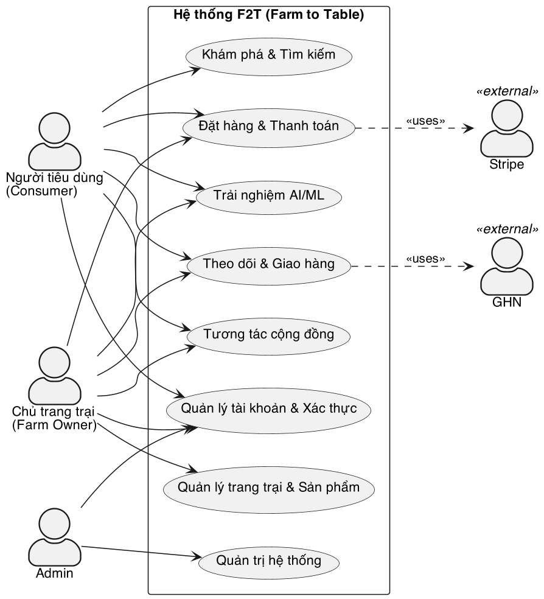

***Hình 2.2 — UC-02 — Phân rã “Đặt hàng và Thanh toán”***

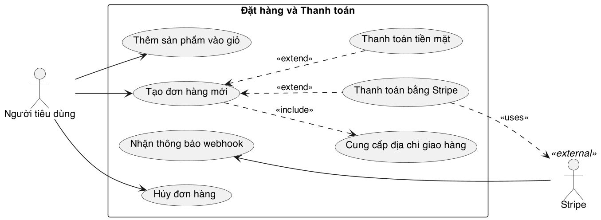

***Hình 2.3 — UC-03 — Phân rã “Quản lý sản phẩm”***

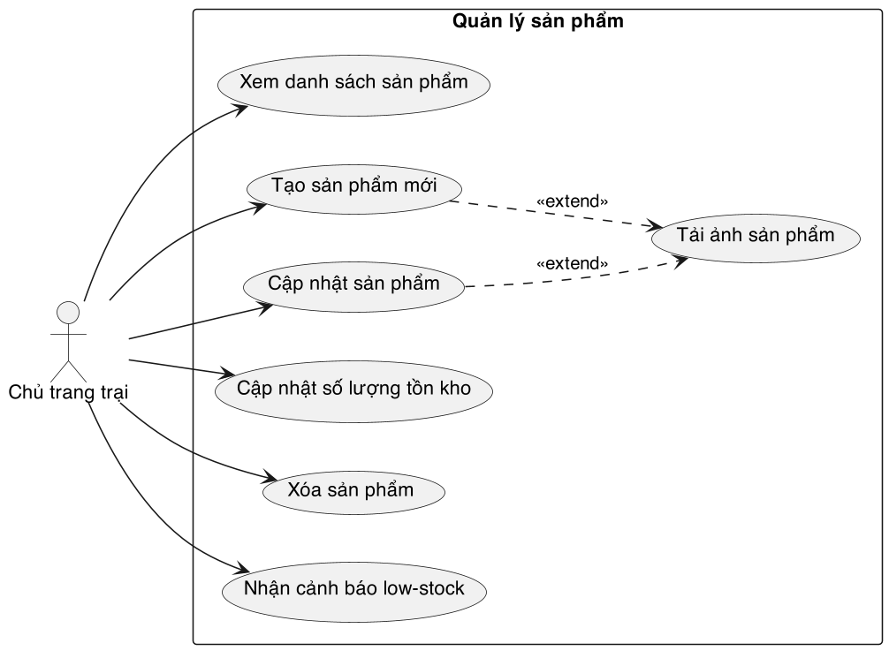

***Hình 2.4 — UC-04 — Phân rã “Quản lý trang trại”***

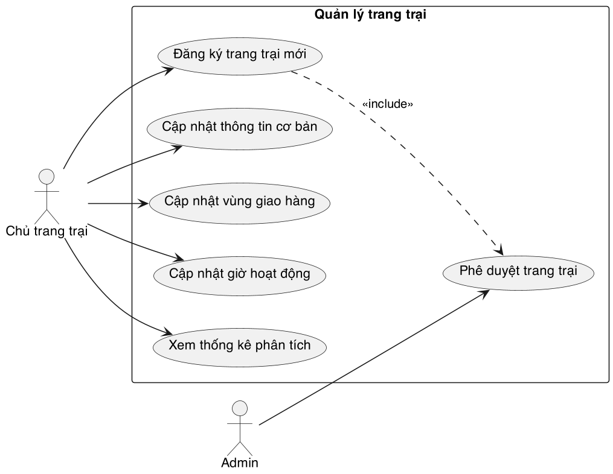

***Hình 2.5 — UC-05 — Phân rã “Theo dõi giao hàng”***

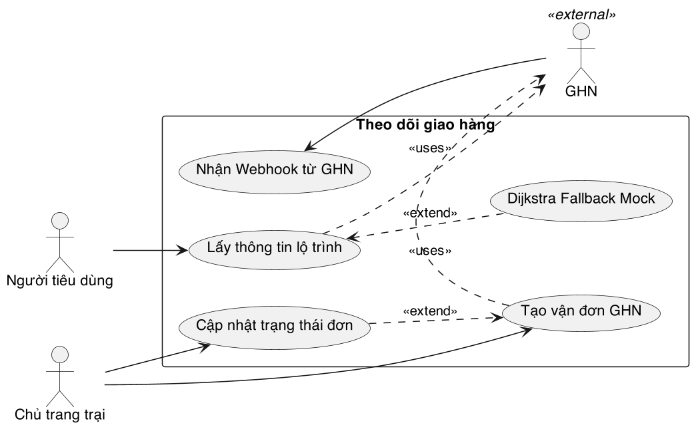

***Hình 2.6 — UC-06 — Phân rã “Quản lý Admin”***

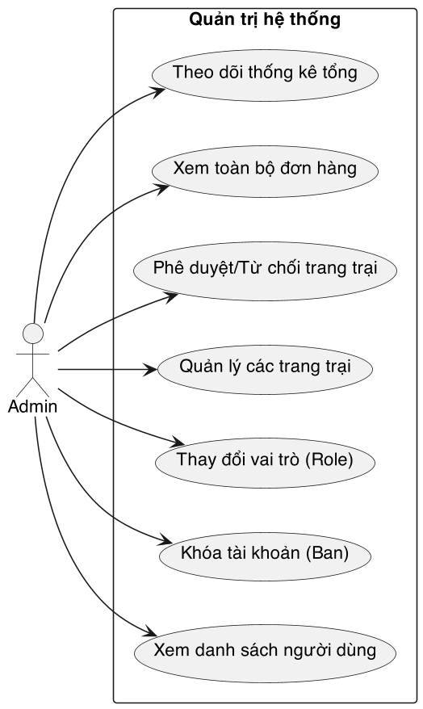

***Hình 2.7 — UC-07 — Phân rã “Tính năng AI/ML”***

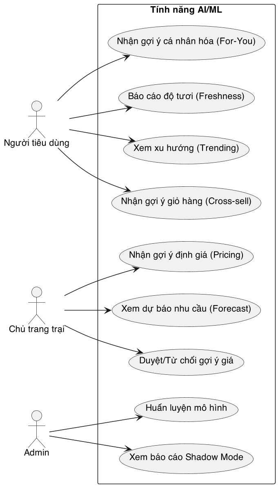

### 2.7 Đặc tả use case chi tiết

Phần này đặc tả chi tiết luồng thực thi của các use case quan trọng nhất theo mẫu đặc tả use case chuẩn: mã UC và độ phức tạp, mô tả, tác nhân, tiền điều kiện, hậu điều kiện (thành công/lỗi), và phần Đặc tả chức năng gồm luồng sự kiện chính và luồng phụ.

***Bảng 2.2 — Đặc tả use case UC#01 Đăng ký tài khoản***

<table>
<colgroup>
<col style="width: 33%" />
<col style="width: 33%" />
<col style="width: 33%" />
</colgroup>
<thead>
<tr>
<th><strong>UC#01</strong></th>
<th><strong>Đăng ký tài khoản</strong></th>
<th><strong>Độ phức tạp: Thấp</strong></th>
</tr>
<tr>
<th><strong>Mô tả</strong></th>
<th colspan="2">Người dùng mới tạo tài khoản trên hệ thống F2T.</th>
</tr>
<tr>
<th><strong>Tác nhân</strong></th>
<th colspan="2">Người tiêu dùng, Chủ trang trại</th>
</tr>
<tr>
<th><strong>Tiền điều kiện</strong></th>
<th colspan="2">Ứng dụng kết nối mạng; người dùng chưa có tài khoản.</th>
</tr>
<tr>
<th rowspan="2"><strong>Hậu điều kiện</strong></th>
<th><strong>Thành Công</strong></th>
<th>Tài khoản được tạo; accessToken &amp; refreshToken lưu vào MMKV; điều hướng vào giao diện chính.</th>
</tr>
<tr>
<th><strong>Lỗi</strong></th>
<th>Email đã tồn tại → 409 Conflict; hiển thị "Email đã được sử dụng".</th>
</tr>
<tr>
<th colspan="3" style="text-align: center;"><strong>ĐẶC TẢ CHỨC NĂNG</strong></th>
</tr>
<tr>
<th colspan="3"><strong>Luồng sự kiện chính / Kịch bản chính:</strong></th>
</tr>
<tr>
<th colspan="3">
<strong>Luồng chính:</strong>

1. Actor điền form: firstName, lastName, phoneNumber, email, password.

2. App gọi POST /api/auth/register.

3. ValidationPipe kiểm tra dữ liệu (whitelist, forbidNonWhitelisted).

4. Backend hash mật khẩu bằng bcrypt (10 rounds).

5. Lưu tài khoản mới vào collection users.

6. Trả về accessToken và refreshToken.

<strong>● Luồng phụ:</strong>

1. Email đã tồn tại → backend trả 409 Conflict → App báo "Email đã được sử dụng".
</th>
</tr>
</thead>
<tbody>
</tbody>
</table>

***Bảng 2.3 — Đặc tả use case UC#02 Đăng nhập***

<table>
<colgroup>
<col style="width: 33%" />
<col style="width: 33%" />
<col style="width: 33%" />
</colgroup>
<thead>
<tr>
<th><strong>UC#02</strong></th>
<th><strong>Đăng nhập</strong></th>
<th><strong>Độ phức tạp: Thấp</strong></th>
</tr>
<tr>
<th><strong>Mô tả</strong></th>
<th colspan="2">Người dùng xác thực để truy cập hệ thống.</th>
</tr>
<tr>
<th><strong>Tác nhân</strong></th>
<th colspan="2">Người tiêu dùng, Chủ trang trại, Admin</th>
</tr>
<tr>
<th><strong>Tiền điều kiện</strong></th>
<th colspan="2">Tài khoản đã tồn tại; trạng thái không bị isBanned.</th>
</tr>
<tr>
<th rowspan="2"><strong>Hậu điều kiện</strong></th>
<th><strong>Thành Công</strong></th>
<th>Cấp JWT Bearer + refreshToken; lưu Zustand store và MMKV; thiết lập phiên đăng nhập.</th>
</tr>
<tr>
<th><strong>Lỗi</strong></th>
<th>Sai mật khẩu / khóa tài khoản → HttpException; interceptor trả { success: false, data: null, message }.</th>
</tr>
<tr>
<th colspan="3" style="text-align: center;"><strong>ĐẶC TẢ CHỨC NĂNG</strong></th>
</tr>
<tr>
<th colspan="3"><strong>Luồng sự kiện chính / Kịch bản chính:</strong></th>
</tr>
<tr>
<th colspan="3">
<strong>Luồng chính:</strong>

1. Actor nhập email, password và bấm Đăng nhập.

2. App gửi POST /api/auth/login.

3. AuthService tìm user và so khớp hash bcrypt.

4. Ký và trả JWT (JWT_SECRET) + refreshToken (JWT_REFRESH_SECRET).

5. App lưu token vào Zustand + MMKV.

<strong>● Luồng phụ:</strong>

1. Mật khẩu sai hoặc isBanned → HttpException → envelope lỗi chuẩn hoá.
</th>
</tr>
</thead>
<tbody>
</tbody>
</table>

***Bảng 2.4 — Đặc tả use case UC#03 Đặt hàng***

<table>
<colgroup>
<col style="width: 33%" />
<col style="width: 33%" />
<col style="width: 33%" />
</colgroup>
<thead>
<tr>
<th><strong>UC#03</strong></th>
<th><strong>Đặt hàng</strong></th>
<th><strong>Độ phức tạp: Trung bình</strong></th>
</tr>
<tr>
<th><strong>Mô tả</strong></th>
<th colspan="2">Người tiêu dùng tạo đơn hàng từ giỏ hàng.</th>
</tr>
<tr>
<th><strong>Tác nhân</strong></th>
<th colspan="2">Người tiêu dùng</th>
</tr>
<tr>
<th><strong>Tiền điều kiện</strong></th>
<th colspan="2">Đã đăng nhập; có sản phẩm trong giỏ hàng Zustand.</th>
</tr>
<tr>
<th rowspan="2"><strong>Hậu điều kiện</strong></th>
<th><strong>Thành Công</strong></th>
<th>Đơn được tạo với status='pending'; notification tự động gửi cho Chủ trang trại.</th>
</tr>
<tr>
<th><strong>Lỗi</strong></th>
<th>Sản phẩm hết hàng / không đủ số lượng → BadRequest, hủy giao dịch.</th>
</tr>
<tr>
<th colspan="3" style="text-align: center;"><strong>ĐẶC TẢ CHỨC NĂNG</strong></th>
</tr>
<tr>
<th colspan="3"><strong>Luồng sự kiện chính / Kịch bản chính:</strong></th>
</tr>
<tr>
<th colspan="3">
<strong>Luồng chính:</strong>

1. Consumer kiểm tra giỏ và điền địa chỉ giao.

2. App gọi POST /api/orders.

3. OrdersService nhúng cứng items snapshot (productName, pricePerUnit, unit, farmName).

4. Trừ availableQuantity của tồn kho.

5. Trả về Order document với status='pending'.

<strong>● Luồng phụ:</strong>

1. Hết hàng / không đủ số lượng → BadRequest → hủy đơn.
</th>
</tr>
</thead>
<tbody>
</tbody>
</table>

***Bảng 2.5 — Đặc tả use case UC#04 Thanh toán Stripe***

<table>
<colgroup>
<col style="width: 33%" />
<col style="width: 33%" />
<col style="width: 33%" />
</colgroup>
<thead>
<tr>
<th><strong>UC#04</strong></th>
<th><strong>Thanh toán Stripe</strong></th>
<th><strong>Độ phức tạp: Trung bình</strong></th>
</tr>
<tr>
<th><strong>Mô tả</strong></th>
<th colspan="2">Thanh toán đơn hàng qua cổng Stripe Checkout (webhook là nguồn xác thực).</th>
</tr>
<tr>
<th><strong>Tác nhân</strong></th>
<th colspan="2">Người tiêu dùng, Stripe</th>
</tr>
<tr>
<th><strong>Tiền điều kiện</strong></th>
<th colspan="2">Đơn hàng vừa tạo thành công; paymentMethod = 'stripe'.</th>
</tr>
<tr>
<th rowspan="2"><strong>Hậu điều kiện</strong></th>
<th><strong>Thành Công</strong></th>
<th>paymentStatus='paid'; ghi stripePaymentIntentId; push "Thanh toán thành công".</th>
</tr>
<tr>
<th><strong>Lỗi</strong></th>
<th>Thoát trình duyệt / lỗi thẻ → webhook ghi nhận expired → paymentStatus='failed'.</th>
</tr>
<tr>
<th colspan="3" style="text-align: center;"><strong>ĐẶC TẢ CHỨC NĂNG</strong></th>
</tr>
<tr>
<th colspan="3"><strong>Luồng sự kiện chính / Kịch bản chính:</strong></th>
</tr>
<tr>
<th colspan="3">
<strong>Luồng chính:</strong>

1. App gọi POST /api/payments/checkout (truyền orderId).

2. PaymentsService tạo Stripe Checkout Session (currency 'vnd', metadata.orderId).

3. Trả về { sessionId, url }.

4. App dùng expo-web-browser mở trang thanh toán.

5. Consumer hoàn tất thanh toán bằng thẻ.

6. Stripe gọi ngược webhook POST /api/payments/webhook.

7. PaymentsService xác thực chữ ký (rawBody + STRIPE_WEBHOOK_SECRET), cập nhật paymentStatus='paid'.

<strong>● Luồng phụ:</strong>

1. checkout.session.expired → cập nhật paymentStatus='failed'.
</th>
</tr>
</thead>
<tbody>
</tbody>
</table>

***Bảng 2.6 — Đặc tả use case UC#05 Quản lý sản phẩm***

<table>
<colgroup>
<col style="width: 33%" />
<col style="width: 33%" />
<col style="width: 33%" />
</colgroup>
<thead>
<tr>
<th><strong>UC#05</strong></th>
<th><strong>Quản lý sản phẩm</strong></th>
<th><strong>Độ phức tạp: Trung bình</strong></th>
</tr>
<tr>
<th><strong>Mô tả</strong></th>
<th colspan="2">Chủ trang trại tạo / cập nhật sản phẩm và tồn kho.</th>
</tr>
<tr>
<th><strong>Tác nhân</strong></th>
<th colspan="2">Chủ trang trại</th>
</tr>
<tr>
<th><strong>Tiền điều kiện</strong></th>
<th colspan="2">Đã đăng nhập role 'farm'; trang trại có verificationStatus = 'verified'.</th>
</tr>
<tr>
<th rowspan="2"><strong>Hậu điều kiện</strong></th>
<th><strong>Thành Công</strong></th>
<th>Sản phẩm được lưu trữ, đánh chỉ mục text tự động để hỗ trợ tìm kiếm.</th>
</tr>
<tr>
<th><strong>Lỗi</strong></th>
<th>Thiếu quyền / không phải chủ sở hữu → ForbiddenException.</th>
</tr>
<tr>
<th colspan="3" style="text-align: center;"><strong>ĐẶC TẢ CHỨC NĂNG</strong></th>
</tr>
<tr>
<th colspan="3"><strong>Luồng sự kiện chính / Kịch bản chính:</strong></th>
</tr>
<tr>
<th colspan="3">
<strong>Luồng chính:</strong>

1. Farm truy cập danh mục kho.

2. Tạo / sửa sản phẩm qua POST /api/products hoặc PUT /api/products/:id.

3. Cập nhật category, unit, status (available, sold_out…).

4. (Tuỳ chọn) Upload ảnh qua POST /api/uploads/image (Cloudinary / local fallback).

<strong>● Luồng phụ:</strong>

1. PATCH /api/products/:id/stock đưa availableQuantity &lt; 10 → cron đẩy cảnh báo low_stock cho chủ trang trại.
</th>
</tr>
</thead>
<tbody>
</tbody>
</table>

***Bảng 2.7 — Đặc tả use case UC#06 Theo dõi giao hàng***

<table>
<colgroup>
<col style="width: 33%" />
<col style="width: 33%" />
<col style="width: 33%" />
</colgroup>
<thead>
<tr>
<th><strong>UC#06</strong></th>
<th><strong>Theo dõi giao hàng</strong></th>
<th><strong>Độ phức tạp: Trung bình</strong></th>
</tr>
<tr>
<th><strong>Mô tả</strong></th>
<th colspan="2">Theo dõi lộ trình của đơn hàng đang vận chuyển.</th>
</tr>
<tr>
<th><strong>Tác nhân</strong></th>
<th colspan="2">Người tiêu dùng, Chủ trang trại</th>
</tr>
<tr>
<th><strong>Tiền điều kiện</strong></th>
<th colspan="2">Đơn hàng có status = 'shipped'.</th>
</tr>
<tr>
<th rowspan="2"><strong>Hậu điều kiện</strong></th>
<th><strong>Thành Công</strong></th>
<th>Giao diện vẽ bản đồ lộ trình trực quan kèm trackingSteps.</th>
</tr>
<tr>
<th><strong>Lỗi</strong></th>
<th>GHN lỗi / không cấu hình → dùng dữ liệu mô phỏng (graceful degradation).</th>
</tr>
<tr>
<th colspan="3" style="text-align: center;"><strong>ĐẶC TẢ CHỨC NĂNG</strong></th>
</tr>
<tr>
<th colspan="3"><strong>Luồng sự kiện chính / Kịch bản chính:</strong></th>
</tr>
<tr>
<th colspan="3">
<strong>Luồng chính:</strong>

1. Farm chuyển trạng thái sang shipping → fire-and-forget POST /api/delivery/orders/:orderId/create-shipment.

2. Consumer mở màn hình tracking → GET /api/delivery/orders/:orderId/tracking.

3. DeliveryService lấy lộ trình thực tế từ GHN theo ghnOrderCode.

4. Trả về trackingSteps + driverLocation.

<strong>● Luồng phụ:</strong>

1. GHN_TOKEN rỗng → DeliveryService dùng Dijkstra mock trên mạng lưới đường HCMC.
</th>
</tr>
</thead>
<tbody>
</tbody>
</table>

***Bảng 2.8 — Đặc tả use case UC#07 Gợi ý sản phẩm & Dự báo nhu cầu (AI/ML)***

<table>
<colgroup>
<col style="width: 33%" />
<col style="width: 33%" />
<col style="width: 33%" />
</colgroup>
<thead>
<tr>
<th><strong>UC#07</strong></th>
<th><strong>Gợi ý sản phẩm &amp; Dự báo nhu cầu (AI/ML)</strong></th>
<th><strong>Độ phức tạp: Cao</strong></th>
</tr>
<tr>
<th><strong>Mô tả</strong></th>
<th colspan="2">Gợi ý sản phẩm cá nhân hoá và dự báo nhu cầu bằng các dịch vụ ML sidecar.</th>
</tr>
<tr>
<th><strong>Tác nhân</strong></th>
<th colspan="2">Người tiêu dùng, Chủ trang trại, System (Cron)</th>
</tr>
<tr>
<th><strong>Tiền điều kiện</strong></th>
<th colspan="2">Các sidecar (8001 recommender, 8002 forecast) sẵn sàng qua REST API.</th>
</tr>
<tr>
<th rowspan="2"><strong>Hậu điều kiện</strong></th>
<th><strong>Thành Công</strong></th>
<th>Trả danh sách gợi ý / dự báo 7 ngày; kết quả được cache tại NestJS (TTL 1 giờ).</th>
</tr>
<tr>
<th><strong>Lỗi</strong></th>
<th>Sidecar lỗi / timeout → fallback (sản phẩm mới nhất / { items: [], total: 0 }).</th>
</tr>
<tr>
<th colspan="3" style="text-align: center;"><strong>ĐẶC TẢ CHỨC NĂNG</strong></th>
</tr>
<tr>
<th colspan="3"><strong>Luồng sự kiện chính / Kịch bản chính:</strong></th>
</tr>
<tr>
<th colspan="3">
<strong>Luồng chính:</strong>

1. (Consumer) GET /api/recommendations/for-you → NestJS chuyển tới recommender-sidecar; định tuyến ItemItemCF / NeuralCF.

2. (Farm) GET /api/demand-forecast/farm/:farmId → forecast-sidecar; ForecastModel (Holt EWMA) trả dự báo 7 ngày.

<strong>● Luồng phụ:</strong>

1. order_count &lt; COLD_START_THRESHOLD (3) → bỏ qua NeuralCF/ItemItemCF, trả PopularityModel (trending).
</th>
</tr>
</thead>
<tbody>
</tbody>
</table>

## CHƯƠNG 3. THIẾT KẾ HỆ THỐNG

### 3.1 Thiết kế cơ sở dữ liệu

Trong kiến trúc của hệ thống F2T (Farm to Table), cơ sở dữ liệu đóng vai trò cốt lõi trong việc lưu trữ, quản lý và xử lý khối lượng lớn dữ liệu phi cấu trúc và bán cấu trúc liên quan đến các tác nhân tham gia (người tiêu dùng, nông trại), sản phẩm nông sản, các đơn hàng và các luồng thông tin gợi ý/dự báo. Hệ thống sử dụng hệ quản trị cơ sở dữ liệu NoSQL (MongoDB) để tối ưu hóa khả năng mở rộng ngang và linh hoạt trong thiết kế schema. Tất cả các phản hồi từ API đều tuân thủ định dạng gói gọn (response envelope) nghiêm ngặt bao gồm cấu trúc: { success, data, message? }, và các danh sách dữ liệu được phân trang theo chuẩn { items, total, page, limit, hasMore }.

Tổng quan về các thực thể trong hệ thống được thể hiện qua 10 collection chính.

***Bảng 3.1 — Danh sách 10 collection***

| Tên Collection | Mục đích cốt lõi |
|----|----|
| users | Lưu trữ thông tin tài khoản người dùng, phân quyền (consumer/farm/admin) và định danh. |
| farms | Quản lý thông tin chi tiết của nông trại, vị trí địa lý (GeoJSON) và trạng thái xác thực. |
| products | Lưu trữ danh mục nông sản, trạng thái tồn kho, định giá và thuộc tính sản phẩm. |
| orders | Quản lý vòng đời đơn hàng, tích hợp snapshot dữ liệu sản phẩm tại thời điểm đặt hàng. |
| posts | Nền tảng mạng xã hội thu nhỏ cho phép chia sẻ bài viết, video, hình ảnh nông sản. |
| notifications | Quản lý các thông báo đẩy, cảnh báo tồn kho và gợi ý giá cho người dùng. |
| price_overrides | Lưu trữ các đề xuất điều chỉnh giá tự động từ sidecar AI (Dynamic Pricing). |
| freshness_cache | Lưu trữ bộ đệm về điểm số độ tươi của sản phẩm nông sản (Freshness Score). |
| recommendation_caches | Lưu trữ kết quả gợi ý cá nhân hóa từ hệ thống Recommender. |
| forecast_caches | Lưu trữ dữ liệu dự báo nhu cầu tiêu thụ (Demand Forecast) từ AI sidecar. |

Dưới đây là chi tiết thiết kế các collection theo tiêu chuẩn lưu trữ của MongoDB.

***Bảng 3.2 — Thiết kế collection users***

| Trường dữ liệu (Field) | Kiểu dữ liệu | Ràng buộc / Mặc định | Mô tả chi tiết |
|----|----|----|----|
| email | String | unique: true, required: true | Địa chỉ email của người dùng, dùng làm định danh đăng nhập. |
| password | String | required: true, select: false | Mật khẩu đã được mã hóa (bcrypt), không trả về mặc định. |
| role | String | enum: \[‘consumer’, ‘farm’, ‘admin’\] | Vai trò của tài khoản trong hệ thống. |
| status | String | enum: \[‘active’, ‘suspended’, ‘pending’\] | Trạng thái hoạt động của tài khoản. |
| location.coordinates | Array\[Number\] | \[longitude, latitude\] | Tọa độ địa lý của người dùng để tính toán khoảng cách. |
| refreshToken | String | select: false | Token dùng để cấp lại JWT, ẩn khỏi các truy vấn thông thường. |
| pushToken | String | select: false | Token dùng cho dịch vụ Expo Push Notification. |
| emailVerified | Boolean | default: false | Đánh dấu email đã được xác minh hay chưa. |
| phoneVerified | Boolean | default: false | Đánh dấu số điện thoại đã được xác minh hay chưa. |
| isBanned | Boolean | default: false | Cờ đánh dấu tài khoản bị cấm khỏi hệ thống. |

***Bảng 3.3 — Thiết kế collection farms***

| Trường dữ liệu (Field) | Kiểu dữ liệu | Ràng buộc / Mặc định | Mô tả chi tiết |
|----|----|----|----|
| ownerId | ObjectId | ref: ‘users’ | Khóa ngoại liên kết tới người dùng (farm owner). |
| location | Object | kiểu GeoJSON Point | Dùng index 2dsphere để truy vấn không gian. |
| address | String | required: true | Địa chỉ chi tiết của nông trại. |
| verificationStatus | String | enum: \[‘pending’, ‘verified’, ‘rejected’\] | Trạng thái xác thực hồ sơ bởi Admin. |
| deliveryMethods | Array\[String\] | \- | Các phương thức giao hàng hỗ trợ (ví dụ: GHN, tự giao). |
| isActive | Boolean | default: true | Cờ kích hoạt/vô hiệu hóa tạm thời nông trại. |
| *(Index)* | Text Index | name_text_description_text | Hỗ trợ truy vấn full-text search trên tên và mô tả. |

***Bảng 3.4 — Thiết kế collection products***

| Trường dữ liệu (Field) | Kiểu dữ liệu | Ràng buộc / Mặc định | Mô tả chi tiết |
|----|----|----|----|
| farmId | ObjectId | ref: ‘farms’, required: true | Khóa ngoại chỉ định nông sản thuộc nông trại nào. |
| category | String | enum: \[‘vegetable’, ‘fruit’, ‘meat’, ‘dairy’, …\] | Phân loại danh mục nông sản. |
| pricePerUnit | Number | min: 0, required: true | Đơn giá cho mỗi đơn vị đo lường. |
| unit | String | enum: \[‘kg’, ‘g’, ‘box’, ‘piece’, ‘bundle’\] | Đơn vị tính của sản phẩm. |
| availableQuantity | Number | min: 0 | Số lượng khả dụng hiện tại trong kho. |
| status | String | enum: \[‘available’, ‘sold_out’, ‘unavailable’, ‘seasonal’\] | Trạng thái bán hàng của nông sản. |
| isOrganic | Boolean | default: false | Chứng nhận nông sản hữu cơ. |
| *(Indexes)* | Compound | { farmId: 1, category: 1 }, … | Đánh chỉ mục tối ưu hóa cho truy vấn lọc sản phẩm. |

***Bảng 3.5 — Thiết kế collection orders***

| Trường dữ liệu (Field) | Kiểu dữ liệu | Ràng buộc / Mặc định | Mô tả chi tiết |
|----|----|----|----|
| orderNumber | String | unique: true | Mã đơn hàng định danh duy nhất (ví dụ: F2T-XXX). |
| customerId | ObjectId | ref: ‘users’ | ID của người mua hàng (không dùng consumerId). |
| farmId | ObjectId | ref: ‘farms’ | ID của nông trại cung cấp đơn hàng này. |
| items | Array\[Object\] | Snapshot lưu trữ vĩnh viễn | Gồm: productId, productName, productImage, quantity, pricePerUnit, unit, totalPrice, farmId, farmName. Thiết kế dạng snapshot để bảo toàn dữ liệu khi sản phẩm đổi giá. |
| status | String | enum: 7 states (pending, confirmed, preparing, ready_for_pickup, shipped, delivered, cancelled) | Trạng thái vòng đời hiện tại của đơn hàng. |
| paymentStatus | String | enum: \[‘unpaid’, ‘paid’, ‘refunded’\] | Trạng thái thanh toán của đơn hàng. |
| paymentMethod | String | enum: \[‘cash’, ‘stripe’\] | Hình thức thanh toán người dùng lựa chọn. |
| stripeSessionId | String | unique: true, sparse: true | Mã phiên thanh toán liên kết với Stripe Checkout. |
| ghnOrderCode | String | unique: true, sparse: true | Mã vận đơn cấp bởi Giao Hàng Nhanh (nếu có). |
| trackingSteps | Array\[Object\] | \- | Lịch sử các bước trung chuyển trong quá trình vận chuyển. |
| timeline | Array\[Object\] | \- | Dấu thời gian cho từng lần cập nhật trạng thái đơn hàng. |

***Bảng 3.6 — Thiết kế collection posts***

| Trường dữ liệu (Field) | Kiểu dữ liệu | Ràng buộc / Mặc định | Mô tả chi tiết |
|----|----|----|----|
| authorId | ObjectId | ref: ‘users’ | Định danh tác giả bài viết. |
| authorRole | String | enum: \[‘consumer’, ‘farm’\] | Lưu trực tiếp vai trò tác giả để hạn chế join bảng. |
| media | Array\[Object\] | chứa url, type (image/video) | Danh sách tài nguyên đa phương tiện đính kèm bài viết. |
| tags | Array\[String\] | \- | Thẻ phân loại (hashtag) hỗ trợ tìm kiếm. |
| comments | Array\[Object\] | \- | Danh sách bình luận nhúng (embedded comments). |
| likesCount | Number | default: 0 | Tổng số lượt thích của bài viết. |

***Bảng 3.7 — Thiết kế collection notifications***

| Trường dữ liệu (Field) | Kiểu dữ liệu | Ràng buộc / Mặc định | Mô tả chi tiết |
|----|----|----|----|
| userId | ObjectId | ref: ‘users’ | Định danh người nhận thông báo. |
| type | String | enum: \[‘price_suggestion’, ‘low_stock’, ‘order_update’, …\] | Phân loại thông báo hệ thống. |
| isRead | Boolean | default: false | Đánh dấu người dùng đã đọc thông báo hay chưa. |
| pushSent | Boolean | default: false | Cờ xác nhận đã gửi push thành công qua Expo chưa. |

***Bảng 3.8 — Thiết kế collection price_overrides***

| Trường dữ liệu (Field) | Kiểu dữ liệu | Ràng buộc / Mặc định | Mô tả chi tiết |
|----|----|----|----|
| productId | ObjectId | ref: ‘products’ | Sản phẩm được áp dụng thay đổi giá. |
| farmId | ObjectId | ref: ‘farms’ | Nông trại sở hữu sản phẩm. |
| basePrice | Number | required: true | Giá cơ bản ban đầu của sản phẩm. |
| targetPrice | Number | required: true | Giá đích do hệ thống DynamicPricing đề xuất. |
| deltaPct | Number | \- | Tỉ lệ phần trăm chênh lệch (thay đổi). |
| freshnessScore | Number | min: 0, max: 1 | Điểm độ tươi tính toán được từ AI Vision. |
| freshnessTag | String | enum: \[‘fresh’, ‘aging’, ‘critical’\] | Nhãn phân loại độ tươi của nông sản. |
| safetyClipped | Boolean | default: false | Cờ đánh dấu giá đề xuất bị giới hạn biên độ an toàn. |
| mode | String | enum: \[‘shadow’, ‘advisory’\] | Chế độ chạy: ẩn (đánh giá model) hay gợi ý cho nông trại. |
| status | String | enum: \[‘shadow’, ‘pending_review’, ‘accepted’, ‘rejected’, ‘expired’\] | Trạng thái phê duyệt của đề xuất. |
| expiresAt | Date | chỉ mục TTL | Thời điểm hết hạn của đề xuất để tự dọn dẹp bộ nhớ. |
| *(Index)* | Compound | { productId: 1, status: 1 } | Hỗ trợ truy vấn nhanh các đề xuất đang chờ. |

***Bảng 3.9 — Thiết kế collection freshness_cache***

| Trường dữ liệu (Field) | Kiểu dữ liệu | Ràng buộc / Mặc định | Mô tả chi tiết |
|----|----|----|----|
| productId | ObjectId | unique: true | Mã sản phẩm được cache điểm số độ tươi. |
| readings | Array\[Object\] | max length: 5 | Mảng lưu trữ tối đa 5 lần quét gần nhất {score, scannedAt}. |
| medianScore | Number | default: 0.7 | Điểm trung vị đại diện độ tươi, mặc định 0.7 (bình thường). |
| expiresAt | Date | = updatedAt + 6h (TTL) | Cơ chế TTL tự động xóa cache sau 6 giờ cập nhật. |

***Bảng 3.10 — Thiết kế collection recommendation_caches***

| Trường dữ liệu (Field) | Kiểu dữ liệu | Ràng buộc / Mặc định | Mô tả chi tiết |
|----|----|----|----|
| key | String | unique: true | Khóa cache, thường gồm userId và ngữ cảnh. |
| productIds | Array\[ObjectId\] | \- | Danh sách các ID nông sản được hệ thống AI gợi ý. |
| expiresAt | Date | chỉ mục TTL | Hạn sử dụng của cache gợi ý cá nhân hóa. |

***Bảng 3.11 — Thiết kế collection forecast_caches***

| Trường dữ liệu (Field) | Kiểu dữ liệu | Ràng buộc / Mặc định | Mô tả chi tiết |
|----|----|----|----|
| key | String | unique: true | Khóa định danh của chuỗi dự báo (theo farm/product). |
| forecasts | Array\[Object\] | \- | Các điểm dữ liệu dự đoán nhu cầu tiêu thụ trong tương lai. |
| expiresAt | Date | chỉ mục TTL | Hạn sử dụng của dữ liệu dự báo. |

**Mô tả quan hệ thực thể (ER - Entity Relationship):** Hệ thống F2T được thiết kế theo tư duy của NoSQL, cân bằng giữa việc chuẩn hóa (Normalization) và phi chuẩn hóa (Denormalization) dựa trên tần suất truy cập dữ liệu (Read/Write ratio). Quan hệ giữa User và Farm là quan hệ Một-Nhiều (1-N), trong đó một User với vai trò là chủ trại (role farm) có thể sở hữu nhiều Farm (dù thực tế quy trình nghiệp vụ giới hạn 1-1, nhưng thiết kế database hỗ trợ mở rộng). Farm chứa ownerId để trỏ ngược lại User. Quan hệ giữa Farm và Product là 1-N. Mỗi sản phẩm bắt buộc phải tham chiếu đến một farmId. Quan hệ giữa User (người tiêu dùng) và Product bản chất là Nhiều-Nhiều (N-N), nhưng được biểu diễn gián tiếp thông qua Order. Đặc biệt, thay vì chuẩn hóa mạnh (lưu khóa ngoại productId trong Order và phải join bảng khi truy vấn), hệ thống F2T áp dụng kỹ thuật Embedded Document. Trường items trong collection orders lưu trữ **bản sao snapshot** của sản phẩm (bao gồm productId, productName, productImage, pricePerUnit, v.v.) ngay tại thời điểm đặt hàng. Quyết định kỹ thuật này tạo ra sự tách biệt (decoupling) hoàn hảo: nếu nông trại thay đổi giá hoặc tên sản phẩm sau đó, lịch sử đơn hàng của người mua vẫn giữ nguyên vẹn thông tin tài chính cũ, đảm bảo tính nhất quán kế toán và pháp lý. Các collection như price_overrides, freshness_cache, recommendation_caches và forecast_caches sử dụng TTL (Time-To-Live) index để hỗ trợ tính chất tạm thời của dữ liệu sinh ra bởi các sidecar AI, tự động giải phóng dung lượng theo vòng đời.

### 3.2 Biểu đồ tuần tự (Sequence Diagrams)

Kiến trúc API của hệ thống áp dụng tiêu chuẩn NestJS với các Guard và Interceptor chặt chẽ. Cơ chế xác thực dựa vào JWT (JSON Web Token) truyền qua header dạng Bearer. Ứng dụng di động lưu trữ token an toàn trong MMKV thay vì cookie.

Quá trình xác thực bắt đầu khi người dùng trên di động gửi yêu cầu, server sẽ ký và cấp phát các token tương ứng.

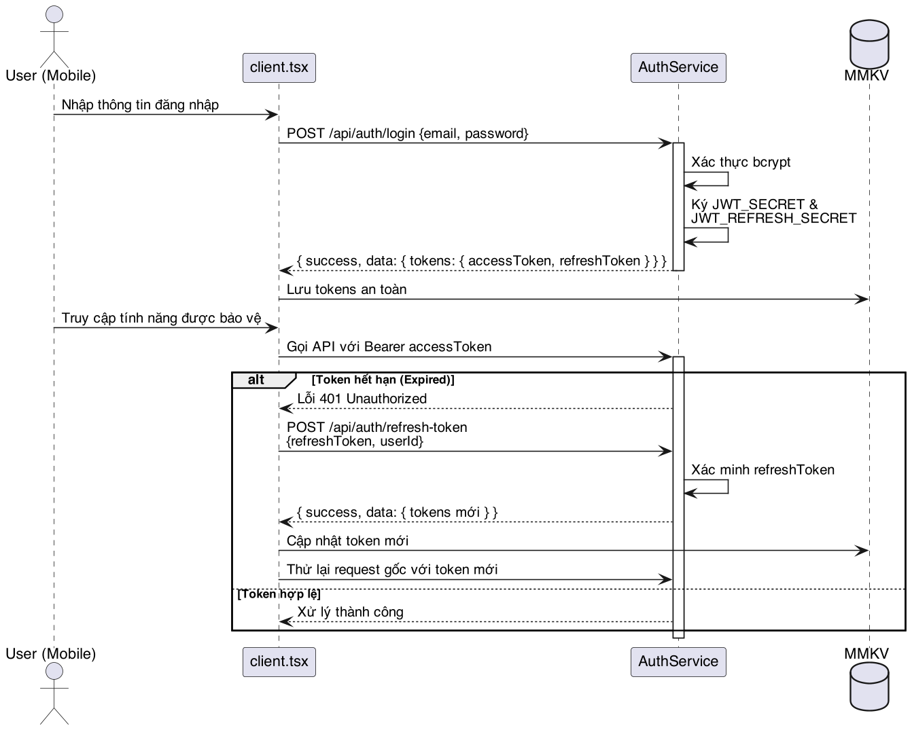

***Hình 3.1 — Tuần tự: SD-01 Đăng nhập & làm mới JWT***

Quy trình đăng ký tài khoản yêu cầu mã hóa mật khẩu một chiều trước khi lưu trữ.

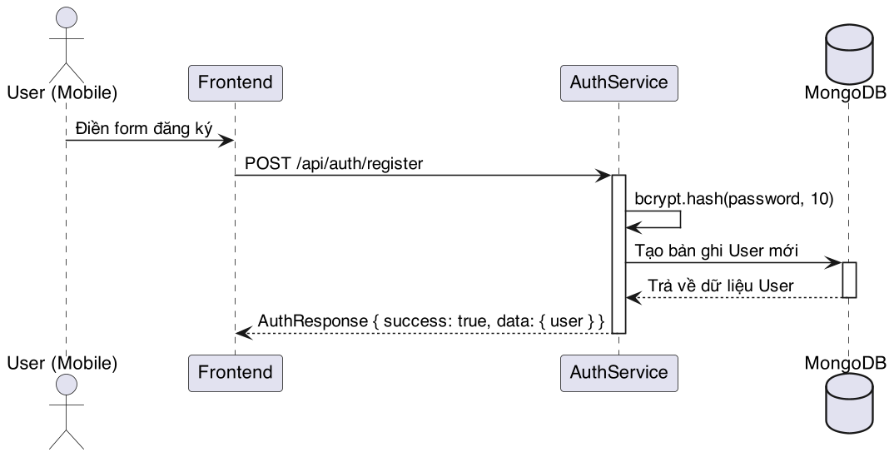

***Hình 3.2 — Tuần tự: SD-02 Đăng ký tài khoản***

Luồng tìm kiếm nông sản lân cận được chia làm 2 giai đoạn (2-stage query) nhằm khai thác sức mạnh của hệ tọa độ GeoJSON. Đầu tiên truy vấn các nông trại gần vị trí thiết bị thông qua \$near, sau đó mới lấy sản phẩm.

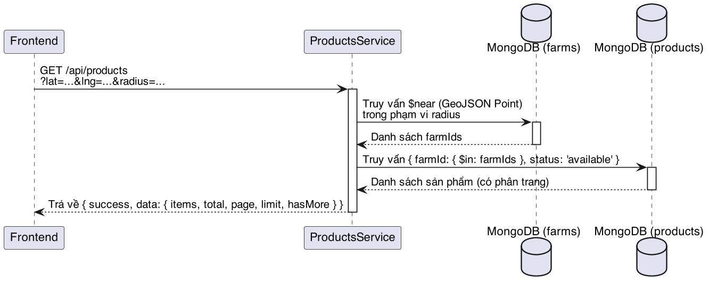

***Hình 3.3 — Tuần tự: SD-03 Tìm kiếm sản phẩm theo vị trí không gian***

Quá trình tạo đơn hàng thể hiện rõ kỹ thuật snapshot đã đề cập ở phần thiết kế dữ liệu. Tồn kho được trừ ngay lập tức khi đơn hàng xác nhận thành công.

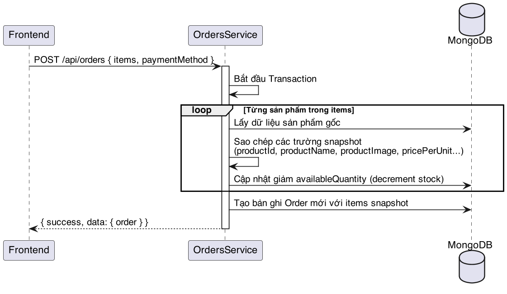

***Hình 3.4 — Tuần tự: SD-04 Tạo đơn hàng và cập nhật snapshot***

Đối với thanh toán không tiền mặt, F2T tích hợp Stripe. Kiến trúc chọn Webhook làm nguồn sự thật (Authoritative Source) để xác nhận thanh toán thay vì phản hồi trực tiếp từ giao diện để ngăn chặn các gian lận từ phía client.

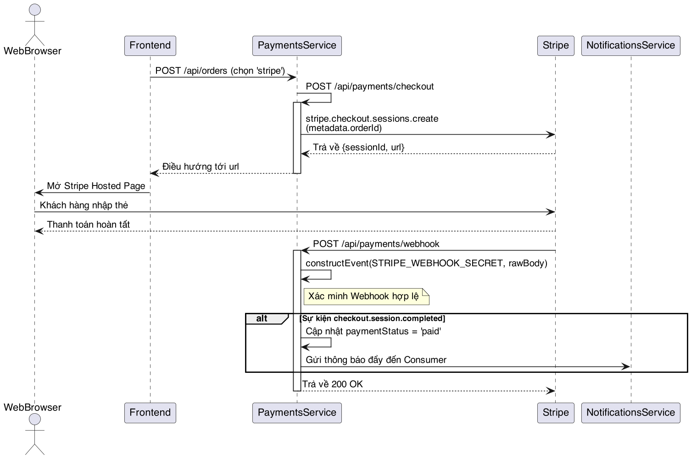

***Hình 3.5 — Tuần tự: SD-05 Thanh toán Stripe Checkout***

Để xử lý logic giao hàng phức tạp ở quy mô toàn quốc, dịch vụ giao hàng sử dụng Giao Hàng Nhanh (GHN). Trong môi trường phát triển (không có cấu hình GHN_TOKEN), hệ thống tự động fallback sử dụng thuật toán Dijkstra đóng vai trò như một Mock Route.

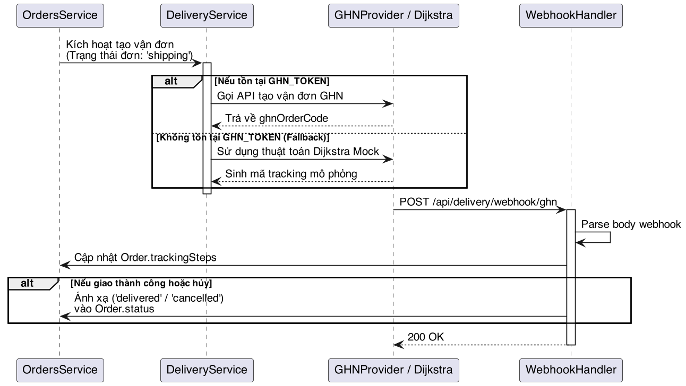

***Hình 3.6 — Tuần tự: SD-06 Tạo vận đơn GHN và xử lý Webhook***

Quá trình tra cứu vị trí trực tiếp cho phép người mua theo dõi bưu kiện. Tọa độ tuyến đường trả về sẽ được dùng để vẽ MapView trên ứng dụng React Native.

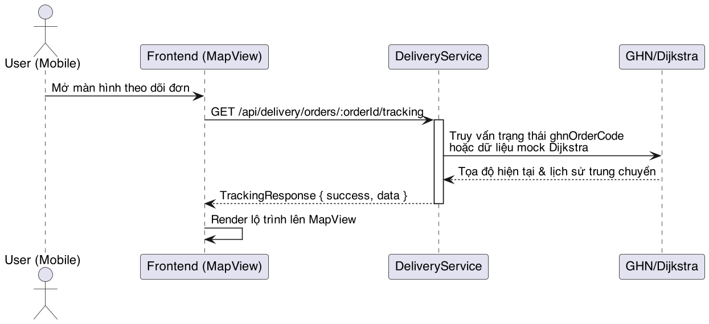

***Hình 3.7 — Tuần tự: SD-07 Theo dõi giao hàng***

Hệ thống cung cấp cơ chế thông báo đẩy (Push Notifications) toàn diện, bao gồm thông báo sự kiện thời gian thực và các kịch bản định kỳ (cron jobs). Nổi bật là tiến trình kiểm tra hàng tồn kho lúc nửa đêm.

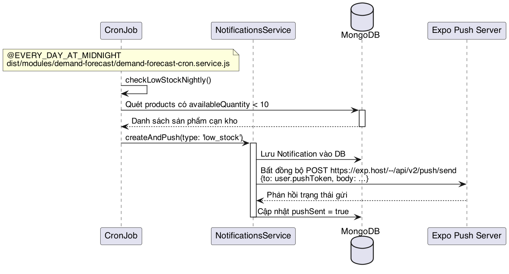

***Hình 3.8 — Tuần tự: SD-08 Thông báo đẩy và tác vụ quét tự động***

Chức năng kiểm duyệt trang trại bởi quản trị viên (Admin) được phân quyền chặt chẽ thông qua các Guard của framework NestJS.

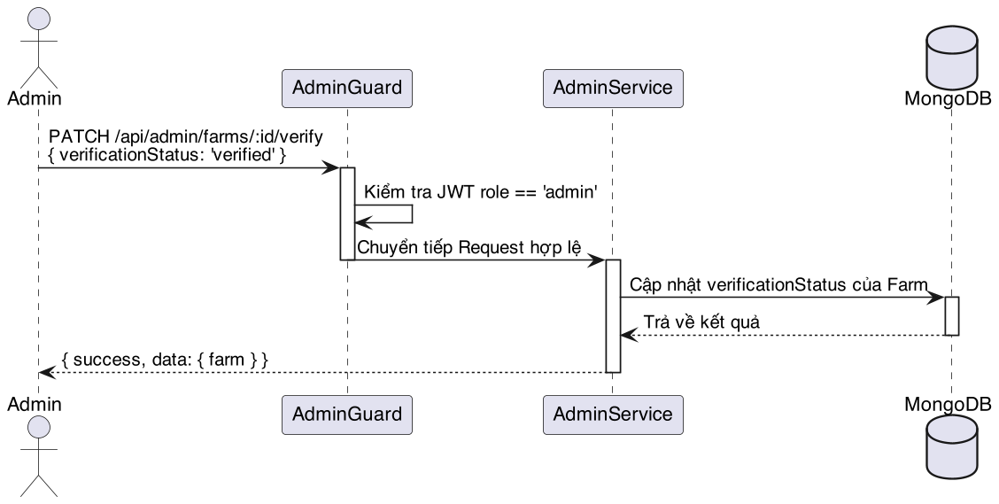

***Hình 3.9 — Tuần tự: SD-09 Admin xác thực hồ sơ trang trại***

### 3.3 Biểu đồ hoạt động (Activity Diagrams)

Biểu đồ hoạt động làm rõ các quy trình và sự chuyển đổi trạng thái (state transition) nội bộ của từng thực thể quan trọng trong hệ thống. Vòng đời của một đơn hàng nông sản bao gồm 7 trạng thái chuẩn.

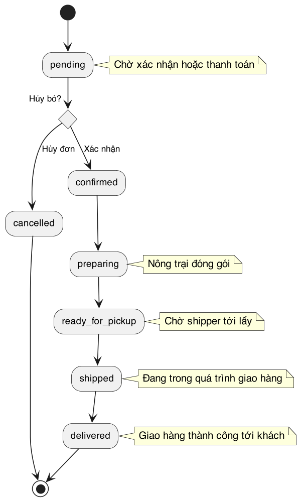

***Hình 3.10 — Hoạt động: AD-01 Vòng đời trạng thái đơn hàng***

Cơ chế xử lý Token vòng lặp đảm bảo người dùng có trải nghiệm liền mạch không bị văng khỏi ứng dụng khi phiên bản ngắn hạn (Access Token) hết hạn.

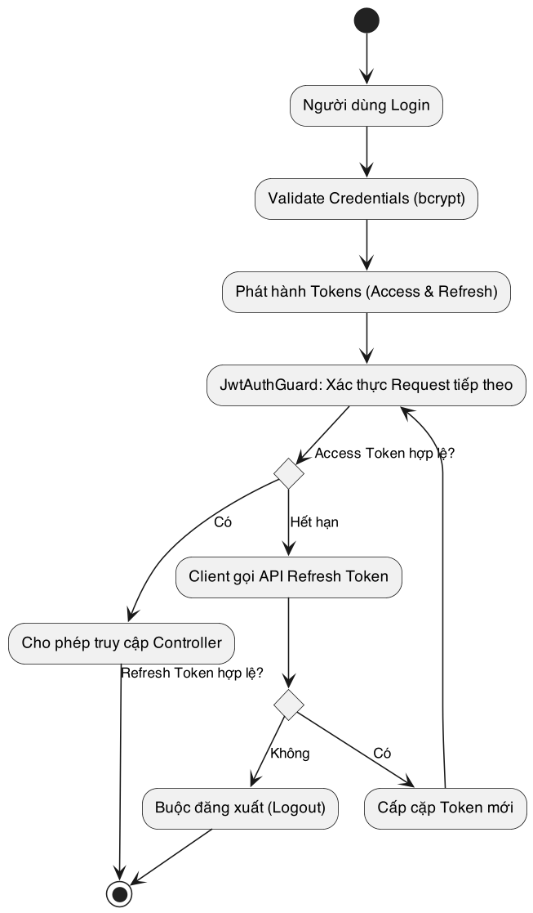

***Hình 3.11 — Hoạt động: AD-02 Quy trình xác thực JWT vòng lặp***

Việc đăng ký của nông trại đòi hỏi tính minh bạch cao nên luôn trải qua quá trình chờ phê duyệt nhân công từ phía hệ thống quản trị nội bộ.

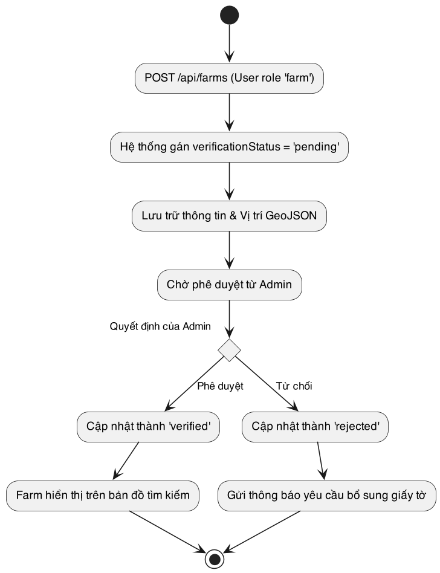

***Hình 3.12 — Hoạt động: AD-03 Đăng ký và xác thực hồ sơ trang trại***

Nông trại quản lý thông tin sản phẩm và cập nhật liên tục các biến động tồn kho. Nếu dưới ngưỡng an toàn, hệ thống sẽ kích hoạt luồng cảnh báo tự động.

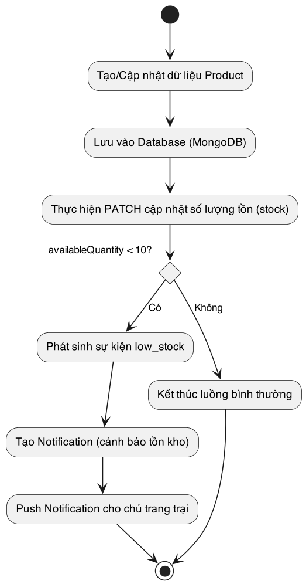

***Hình 3.13 — Hoạt động: AD-04 Quản lý sản phẩm và cảnh báo tồn kho***

### 3.4 Kiến trúc triển khai hệ thống

Hệ thống F2T được thiết kế theo tư tưởng Microservices mô phỏng thông qua kiến trúc Sidecar (Sidecar pattern). Tại phần lõi, ứng dụng di động React Native giao tiếp chặt chẽ với backend NestJS trung tâm (chạy tại cổng 3000), đây là nơi xử lý các nghiệp vụ (business logic) cốt lõi như đơn hàng, thanh toán, phân quyền và giao hàng. Gắn liền với backend trung tâm là ba module AI chuyên biệt chạy độc lập dưới dạng sidecar: Pricing Sidecar ở cổng 8000 tính toán định giá động (Dynamic Pricing), Recommender Sidecar ở cổng 8001 gợi ý sản phẩm và Forecast Sidecar ở cổng 8002 dự báo nhu cầu. Lợi thế của kiến trúc sidecar là hệ thống AI, vốn viết bằng Python/C++ cần nhiều tài nguyên tính toán tensor, có thể phát triển và mở rộng (scale) độc lập với cụm xử lý API Node.js/NestJS. Các sidecar giao tiếp với NestJS qua mạng nội bộ và ghi kết quả tính toán vào các bảng cache (như price_overrides hay forecast_caches) của MongoDB. Để phục vụ giao tiếp ngoại vi, NestJS sẽ gọi tới Stripe cho thanh toán thẻ, GHN cho lộ trình vận chuyển, Cloudinary để phân phối hình ảnh bài viết (POST /api/posts/add) và Expo Push cho việc đẩy thông báo thời gian thực. Biểu đồ dưới đây mô tả sự tương tác ở thời gian thực (runtime) của toàn bộ cụm kiến trúc triển khai.

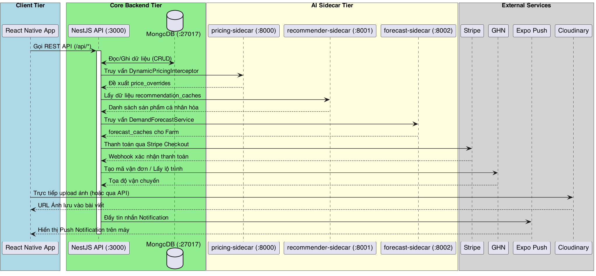

***Hình 3.14 — Tuần tự: AD-05 Tương tác hệ thống phân tán và các thành phần Sidecar***

## CHƯƠNG 4. CÀI ĐẶT, THỬ NGHIỆM

### 4.1. Thư viện và công cụ sử dụng

Để triển khai toàn vẹn hệ thống Farm to Table (F2T) theo đúng kiến trúc microservices kết hợp sidecar (bao gồm backend core xử lý nghiệp vụ và các sidecar Python phục vụ cho tính năng AI/ML), dự án đã lựa chọn và sử dụng một danh sách các thư viện và công cụ chuyên biệt. Tất cả đều được cập nhật lên phiên bản ổn định mới nhất, đảm bảo tính bảo mật, hiệu năng và khả năng mở rộng trong môi trường sản xuất thực tế.

Đối với phía máy chủ (Backend), ứng dụng phân tách rõ ràng thành hai phần: Core Backend sử dụng hệ sinh thái Node.js/NestJS và Machine Learning Sidecars sử dụng hệ sinh thái Python.

***Bảng 4.1 — Thư viện & công cụ Backend***

| Phân loại | Thư viện/Công cụ | Mục đích sử dụng |
|----|----|----|
| **Core Framework** | NestJS 11, TypeScript 5.7 | Xây dựng API RESTful theo kiến trúc module, quản lý Dependency Injection và luồng vòng đời ứng dụng. |
| **Cơ sở dữ liệu** | Mongoose | Lớp ODM giao tiếp với MongoDB, định nghĩa schema, xử lý các hàm virtual, pre/post hooks và schema validation. |
| **Xác thực & Bảo mật** | passport-jwt, bcrypt | Triển khai xác thực qua JWT Bearer token và băm mật khẩu người dùng với 10 vòng salt để lưu trữ an toàn. |
| **Bảo vệ hệ thống** | @nestjs/throttler | Giới hạn số lượng request (Rate limiting) cho các endpoint nhạy cảm như đăng nhập, quên mật khẩu nhằm chống spam. |
| **Tích hợp ngoài** | stripe | Giao tiếp với Stripe API để tạo Checkout Sessions và xử lý, xác thực toàn bộ sự kiện từ webhooks. |
| **Tác vụ ngầm** | @nestjs/schedule | Khởi chạy các cron jobs hệ thống theo giờ và nửa đêm (như quét tồn kho thấp, gửi thông báo push, kích hoạt tiến trình định giá động). |
| **Validation** | class-validator | Ràng buộc và xác thực dữ liệu đầu vào dựa trên cấu trúc DTO (Data Transfer Object) với chế độ whitelist bảo vệ payload. |
| **Tài liệu API** | Swagger | Tự động sinh tài liệu cấu trúc OpenAPI cung cấp tại endpoint /api-docs cho mục đích tích hợp và kiểm thử. |
| **ML Framework** | FastAPI, uvicorn | Xây dựng 3 sidecar độc lập với hiệu suất cao nhất chạy song song trên nền Python ASGI. |
| **ML Libraries** | PyTorch, numpy, scikit-learn, scipy | Xây dựng trực tiếp và huấn luyện các mô hình QMIX, MADDPG, cấu trúc NeuralCF hai tháp và tính toán ma trận tương đồng. |
| **ML Database** | motor | Driver MongoDB bất đồng bộ cho phép các sidecar load trực tiếp dữ liệu (orders, products) không cần đi vòng qua backend. |

Về phía ứng dụng di động đa nền tảng (Frontend), hệ sinh thái React Native và Expo được ứng dụng triệt để cùng với các thư viện quản lý trạng thái, fetching dữ liệu tối ưu nhất hiện nay.

***Bảng 4.2 — Thư viện & công cụ Frontend***

| Thư viện/Công cụ | Mục đích sử dụng |
|----|----|
| Expo SDK 53 | Framework gốc mạnh mẽ nhất của React Native hỗ trợ môi trường xây dựng ứng dụng (EAS Build), biên dịch và chạy trên nền tảng di động. |
| expo-router | Cung cấp file-based routing hiện đại để điều hướng trực quan, dễ bảo trì theo cấu trúc thư mục giữa các màn hình ứng dụng. |
| axios | HTTP Client xử lý các giao thức RESTful gọi tới cấu trúc API của Backend, đính kèm luồng JWT interceptor hỗ trợ làm mới token động (401 catch). |
| zustand | Công cụ quản lý global state siêu nhẹ, hiệu suất cao dùng trong Store cho tiến trình xác thực (Auth) và thao tác Giỏ hàng (Cart). |
| react-native-mmkv | Giải pháp lưu trữ key-value cục bộ đồng bộ siêu tốc, dùng để lưu trữ JWT tokens một cách tối ưu và không tạo độ trễ. |
| @tanstack/react-query + react-query-kit | Quản lý server state, bao bọc luồng fetching, hỗ trợ logic fallback, caching dữ liệu ML thời gian thực và quản lý các infinite queries. |
| nativewind | Hệ thống styling khai báo thông minh dựa trên logic Tailwind CSS, tự động chuyển đổi class components thành style prop của React Native. |
| react-native-maps | Triển khai giao diện bản đồ động tương tác, dùng để hiển thị điểm ghim Farm, theo dõi tọa độ tài xế thời gian thực và lộ trình MapView. |
| expo-web-browser | Cung cấp module trình duyệt in-app (In-App Browser) vô cùng bảo mật dùng để redirect an toàn tới trang thanh toán Hosted Page của Stripe. |

### 4.2. Môi trường thử nghiệm

Quá trình chạy và kiểm thử hệ thống F2T đòi hỏi một môi trường cấu hình chính xác, phản ánh sát với các thành phần thực tế trong mô hình microservices trên production nhưng được tối ưu hóa để có thể chạy mượt mà theo cụm cục bộ trên một máy chủ phát triển (Local Development Environment).

**Yêu cầu môi trường cốt lõi:** - **Node.js**: Phiên bản 20.x trở lên để đảm bảo khả năng tương thích toàn diện và hỗ trợ hiệu năng tốt nhất cho tiến trình của NestJS 11 và các native modules của Expo 53. - **Cơ sở dữ liệu**: MongoDB 7 chạy nguyên bản (local instance), sử dụng cổng chuẩn mặc định 27017, thiết lập kết nối qua chuỗi URL nội bộ mongodb://localhost:27017/f2t. - **Python**: Môi trường ảo (virtualenv) biệt lập chứa Python 3.10+ dành riêng cho cụm sidecar nhằm tránh xung đột package ML phức tạp. - **Biến môi trường**: Toàn bộ cấu hình nhạy cảm được tập trung quản lý thông qua file .env.development ở thư mục backend và file .env đối với frontend.

**Cấu hình mạng LAN và dịch vụ phụ trợ:** Vì ứng dụng di động sẽ được chạy trực tiếp trên thiết bị vật lý (hoặc máy ảo Android/iOS) và cần giao tiếp liên tục tới NestJS Backend trên máy tính cá nhân, nên thiết lập biến môi trường UPLOAD_BASE_URL bắt buộc phải được trỏ tới địa chỉ LAN IP cục bộ của máy tính phát triển (ví dụ: http://192.168.1.15:3000). Điều này nhằm bảo đảm toàn bộ hình ảnh upload (fallback cục bộ khi thiếu biến Cloudinary) sẽ load thành công lên thiết bị di động. Bên cạnh đó, nhằm nhận thông tin Webhook sự kiện thanh toán chính xác từ dịch vụ Stripe, tiến trình sẽ gọi lệnh hệ thống khởi chạy Stripe CLI qua cú pháp stripe listen --forward-to localhost:3000/api/payments/webhook, kết quả console sẽ sinh ra đoạn mã STRIPE_WEBHOOK_SECRET bắt buộc đặt vào file cấu hình gốc. Về mô-đun phân phối, Giao Hàng Nhanh (GHN) trong môi trường thử nghiệm không được khai báo GHN_TOKEN, từ đó tự động kích hoạt an toàn cơ chế fallback bên trong hệ thống sử dụng một thuật toán mô phỏng đồ thị không gian (Dijkstra) để giả lập sinh lộ trình đường đi liền mạch.

**Trình tự khởi động hệ thống (Start Order):** Dựa trên kiến trúc chịu lỗi thu thập từ thiết kế mã nguồn hệ thống, để môi trường chạy đồng bộ không dính lỗi kết nối, quá trình khởi động phải tuân theo thứ tự phân tầng nghiêm ngặt: 1. **Khởi động MongoDB**: Khởi tạo tiến trình mongod, luôn đảm bảo cổng 27017 ở trạng thái listening (sẵn sàng phục vụ các luồng kết nối Mongoose và Motor). 2. **Khởi chạy ML Sidecars (Lớp lõi dữ liệu nâng cao)**: Kích hoạt độc lập song song 3 uvicorn workers riêng rẽ cho 3 dịch vụ Machine Learning. - Dynamic Pricing Sidecar chạy thường trú tại cổng lưới 8000. - Recommender Sidecar xử lý gọi hàm song song tại cổng lưới 8001. - Demand Forecast Sidecar tính chuỗi thời gian tại cổng lưới 8002. 3. **Khởi chạy Core Backend (Lớp nghiệp vụ API)**: Chạy lệnh npm run start:dev đối với dự án NestJS (mặc định tại cổng 3000). Hệ thống boot sẽ lập tức thiết lập kết nối sâu tới MongoDB, ngay sau đó sẽ tự động ping HTTP đến các sidecar qua PRICING_SIDECAR_URL, RECOMMENDER_SIDECAR_URL, FORECAST_SIDECAR_URL. Quá trình kiểm tra liên kết sẽ diễn ra đồng bộ nhằm đảm bảo các dịch vụ hoạt động chuẩn. 4. **Khởi chạy Frontend (Lớp giao diện người dùng)**: Dùng lệnh khởi tạo ứng dụng npx expo start -c kết nối vào Metro Bundler server, quét mã QR tải toàn bộ logic ứng dụng lên công cụ Expo Go hoặc trình duyệt ảo simulator, trỏ thẳng tới IP gốc API.

### 4.3. Tài khoản seed cho thử nghiệm

Nhằm tăng tốc độ đánh giá, thử nghiệm UI UX và kiểm thử tự động các luồng nghiệp vụ phức tạp của nền tảng (chẳng hạn như theo dõi tình trạng thanh toán hay độ hội tụ AI gợi ý đồ thị), hệ thống backend trang bị sẵn một script tạo lập và cấu trúc dữ liệu (src/seed/seed.ts). Khi lập trình viên chạy lệnh khởi tạo npm run seed, hệ thống sẽ tự động quét và xóa hoàn toàn, sạch sẽ các thực thể dư thừa cũ (thông qua truy vấn lọc thuộc tính \_seeded: true) – tạo ra trạng thái khởi tạo idempotent vô cùng chuẩn mực và an toàn, cách ly hoàn toàn dữ liệu.

Ngay sau quá trình dọn dẹp, tiến trình bootstrap tiến hành bơm trực tiếp vào cơ sở dữ liệu hệ thống các cấp bậc tài khoản thiết yếu theo tiêu chuẩn:

***Bảng 4.3 — Tài khoản seed***

| Vai trò người dùng | Email đăng nhập | Mật khẩu truy cập | Ghi chú tài khoản |
|----|----|----|----|
| **Quản trị viên (Admin)** | admin@f2t.com | AdminF2T2026! | Sở hữu quyền hạn AdminGuard, kiểm soát toàn hệ thống, duyệt trang trại. |
| **Chủ trang trại (Farm)** | farm1@f2t.vn đến farm3@f2t.vn | SeedPass123! | Đã được xác thực hệ thống (verified), tạo sẵn mặt hàng thực tế. |
| **Khách hàng (Consumer)** | consumer1@f2t.vn đến consumer5@f2t.vn | SeedPass123! | Tài khoản đang kích hoạt, có gắn lịch sử tương tác và mua bán để ML sinh model. |
| **Tài khoản vi phạm** | suspended@f2t.vn | SeedPass123! | Tài khoản giả lập phục vụ kiểm tra hệ thống chặn, bắt exception khi status='suspended'. |

Luồng kịch bản tạo dữ liệu này cũng chủ động sinh sẵn chính xác 15 danh mục sản phẩm phức tạp, 8 đơn hàng trải dài ở các trạng thái khác nhau (từ pending, confirmed, đến shipped và cancelled), đồng thời bổ sung 5 mẫu bài đăng (posts) để làm phong phú, đa dạng hóa giao diện khi lướt feed trải nghiệm cộng đồng. Các thao tác đều đồng nhất trong một lần chạy lệnh.

### 4.4. Kết quả kiểm thử

Hệ thống Core Backend F2T được viết unit test bao phủ toàn bộ các class và dịch vụ (service) cốt lõi của phần mềm. Để đảm bảo độc lập dữ liệu tuyệt đối (không chạm hoặc vô tình chỉnh sửa cơ sở dữ liệu thật), hệ thống đã được tích hợp thư viện mạnh mẽ mongodb-memory-server nhằm tự động dựng một instance MongoDB hoàn toàn trong bộ nhớ (in-memory) chỉ dành riêng cho tiến trình test. Quá trình chạy thực địa qua bộ lệnh npm run test thể hiện mức độ thành công xuất sắc: 54/54 test cases đều Pass an toàn tuyệt đối. Môi trường biên dịch dự án cũng đạt được chứng nhận build clean (nghĩa là không hề phát sinh một dòng cảnh báo TypeScript type-check nào) và trạng thái kiểm lỗi cú pháp linting báo cáo hoàn toàn sạch, khẳng định chuẩn mực code rất cao.

***Bảng 4.4 — Kết quả unit test theo module***

| Module | Số lượng Test Cases | Kết quả | Ghi chú chi tiết luồng nghiệp vụ được test |
|----|----|----|----|
| **Auth / Users** | 6 | Pass | Kiểm tra chuẩn bảo mật băm bcrypt, sinh logic JWT Token an toàn, cũng như khả năng cấp phát và thu hồi Token Refresh. |
| **Farms / Products** | 6 | Pass | Kiểm tra chặt chẽ các ràng buộc của class-validator cho DTO, và test chức năng lọc địa lý qua toán tử 2dsphere \$geoNear. |
| **Orders** | 6 | Pass | Đảm bảo tính toán học an toàn và chức năng sao chép thông minh (embedded snapshot) giá tiền, đơn vị và tên sản phẩm chính xác vào mảng items. |
| **Payments** | 7 | Pass | Xác nhận hành vi của hệ thống sinh Checkout Session đúng tiền tệ (VND) và cập nhật database thành công khi nhận sự kiện Webhook từ Stripe. |
| **Delivery** | 4 | Pass | Kiểm tra mượt mà hai nhánh logic song song: kết nối tích hợp cấu trúc API GHN chuẩn xác và xử lý fallback giả lập đồ thị Dijkstra khi sập mạng ngoài. |
| **Admin** | 4 | Pass | Quá trình chạy test Role-based Guard, chỉ chặn mọi truy vấn nếu không phải role admin truy xuất tài nguyên báo cáo. |
| **Dynamic Pricing** | 12 | Pass | Trong đó 6 tests tập trung vào DynamicPricingService (tính toán hàm cache/Cron job định kỳ), và 6 tests phân tích riêng rẽ hiệu năng của DynamicPricingInterceptor (chỉnh sửa, ghi đè biến response). |
| **Recommendations** | 8 | Pass | Kiểm tra logic validation khi bắt luồng HTTP tới kết nối Sidecar, gọi hàm xử lý fallback an toàn khi tiến trình Sidecar gặp rủi ro timeout. |
| **Demand Forecast** | 4 | Pass | Kiểm tra sự chính xác cho API nội bộ, luồng gọi HTTP tới sidecar cho hàm getFarmForecast và ánh xạ dữ liệu json ra DTO chính xác. |
| **Mở rộng chức năng** | 5 | Pass | Tích hợp thành công và xác thực tính toàn vẹn của mô-đun bài viết Posts, thuật toán luồng tin, logic Notification Expo Push và Storage lưu cục bộ. |
| **Tổng cộng** | **54** | **Pass 100%** | Toàn bộ tiến trình chạy trong môi trường in-memory ảo hóa khép kín, độ bảo mật và tính nguyên vẹn dữ liệu được cam kết cao nhất. |

### 4.5. Cấu trúc mã nguồn

Cấu trúc tổ chức hệ thống file trong dự án F2T tuân thủ nguyên tắc mô-đun hóa độc lập và chuẩn mẫu “Domain-Driven Design” theo từng tính năng, giúp giảm thiểu độ dính chùm logic và tăng tính bao đóng mã nguồn.

***Hình 4.1 Cấu trúc thư mục Backend***

f2t-backend/  
├── src/  
│ ├── modules/  
│ │ ├── admin/  
│ │ ├── auth/  
│ │ ├── delivery/  
│ │ ├── demand-forecast/  
│ │ ├── dynamic-pricing/  
│ │ ├── farms/  
│ │ ├── notifications/  
│ │ ├── orders/  
│ │ ├── payments/  
│ │ ├── posts/  
│ │ ├── products/  
│ │ ├── recommendations/  
│ │ ├── uploads/  
│ │ └── users/  
│ ├── common/  
│ │ ├── decorators/  
│ │ ├── filters/  
│ │ ├── guards/  
│ │ └── interceptors/  
│ ├── seed/  
│ ├── app.module.ts  
│ └── main.ts  
├── test/  
├── .env.development  
└── package.json

Đối với phía hệ thống Frontend trên mobile, tổ chức thư mục khai báo bám cực kỳ sát kiến trúc Expo Router v5 hiện đại để map tự động đường dẫn ứng dụng, chia cụm bảo mật riêng cho các role thông qua Route Groups.

***Hình 4.2 Cấu trúc thư mục Frontend***

f2t-frontend/  
├── src/  
│ ├── app/  
│ │ ├── (admin)/  
│ │ ├── (app)/  
│ │ ├── checkout/  
│ │ ├── farms/  
│ │ ├── feed/  
│ │ ├── notifications/  
│ │ ├── products/  
│ │ ├── settings/  
│ │ ├── \_layout.tsx  
│ │ └── login.tsx  
│ ├── api/  
│ │ ├── admin/  
│ │ ├── auth/  
│ │ ├── common/  
│ │ │ └── client.tsx  
│ │ ├── dynamic-pricing/  
│ │ ├── orders/  
│ │ └── recommendations/  
│ ├── lib/  
│ │ ├── auth/  
│ │ └── cart/  
│ └── components/  
│ └── ui/  
├── tailwind.config.js  
├── app.json  
└── package.json

### 4.6. Demo sản phẩm

Ứng dụng thương mại điện tử đa nền tảng F2T hiện đã được đội ngũ phát triển và triển khai hoàn chỉnh. Ứng dụng mang trong mình giao diện thẩm mỹ cao, thao tác chạm lướt siêu mượt mà nhờ React Native, và trực quan ở mọi module xử lý nghiệp vụ nghiệp vụ phức tạp. Dưới đây là mô tả thật chi tiết từng tính năng cốt lõi thông qua cách điều hướng trên thiết bị thật.

**1. Màn hình Đăng nhập & Xác thực tự động** Ngay từ giây phút người dùng khởi động ứng dụng trên thiết bị di động, cơ chế kiểm tra Token bảo mật sẽ chạy ngầm truy vấn trực tiếp kho lưu trữ react-native-mmkv thông qua bộ quản lý trạng thái Zustand. Nếu hệ thống nhận diện hoàn toàn chưa có phiên làm việc tồn tại (trạng thái là signOut), ứng dụng sẽ uyển chuyển điều hướng đến ngay màn hình Đăng nhập cơ bản. Ở giao diện này, Consumer hoặc Farm Owner được cung cấp quyền điền thông định dạng chuẩn và chuỗi mật khẩu mã hóa. Sau khi xác nhận thao tác bấm nút đăng nhập, hệ thống sẽ xác thực và được Backend trả về, cấp JWT token (bao gồm cả access và refresh) lưu ngược vào MMKV, rồi chuyển hướng mạnh mẽ, mượt mà vào giao diện chính tương ứng với quyền (role) người dùng.

**2. Màn hình Trang chủ (Home) và Tính năng AI Gợi ý ForYouSection** Trường hợp truy cập ở góc độ khách hàng (Consumer), giao diện màn hình chính lộng lẫy nhất đập ngay vào mắt là mục ForYouSection. Component thông minh này tự động xử lý gửi một luồng GET request động (useForYouPosts hook gọi đến đường dẫn backend /api/recommendations/for-you). Ở máy chủ ML backend, nhờ vào lịch sử lưu dấu ấn đặt mua hàng, hệ thống Recommender Sidecar tự động định tuyến tinh vi: Nếu tập lệnh đơn hàng người dùng dưới 3, hệ thống cung cấp dữ liệu bằng mô hình PopularityModel (độ phổ biến sản phẩm), nhưng ngay khi tài khoản đó có từ 3 dữ liệu lịch sử đặt hàng trở lên, Sidecar chuyển hướng ngay lập tức áp dụng thuật toán mạng nơ-ron hai tháp NeuralCF cực kỳ mạnh mẽ để tiến hành tính toán điểm nội suy, lọc lấy điểm gợi ý, trả về chuỗi các thẻ hiển thị nông sản tươi mát có khả năng người mua quan tâm nhiều nhất, nằm ngay ở vị trí danh dự đầu trang Home.

**3. Khám phá Danh sách, Tìm kiếm Sản phẩm & Trang chi tiết rành mạch** Người dùng được thoải mái trải nghiệm thao tác cuộn, lướt xem hàng ngàn sản phẩm nông nghiệp dưới dạng lưới hai cột. Khi Consumer bấm click vào bất kỳ một khung hình sản phẩm nào cụ thể, hệ thống ứng dụng nhanh chóng dẫn đến màn hình chi tiết, hiển thị sắc nét với các mô tả dinh dưỡng tiêu chuẩn, quy trình nuôi trồng, giấy phép chất lượng. Ở một vùng đặc biệt ngay bên dưới là cấu trúc Component SimilarProducts. Nhánh dữ liệu này được gọi thẳng thông qua GET request kết nối tới /api/recommendations/similar-to/:productId, sinh kết quả hoàn hảo theo thuật toán xác suất ItemItemCF. Nếu kịch bản đang ghi nhận tính năng định giá thông minh (Dynamic Pricing) ở chế độ hiển thị nâng cao advisory (chế độ tư vấn đã bật mở) và người nông dân (Farm owner) đã duyệt áp dụng gợi ý AI, thẻ giá gốc tiền của sản phẩm đó sẽ tự động bị vẽ gạch bỏ thanh thoát, thay thế vào hiển thị là nhãn thông báo cực hấp dẫn DynamicPriceBadge. Badge này sở hữu dải ruy băng màu cam tươi hoặc đỏ sẫm báo nhãn ‘AI’, cho biết sản phẩm đang được chiết khấu mức bao nhiêu % nhằm kích cầu sức mua.

**4. Luồng xử lý Giỏ hàng hiện đại & Cụm điểm nhấn Cart Cross-Sell** Sau quá trình duyệt tìm sản phẩm, người dùng chọn và nhấn nút hành động “Thêm vào giỏ hàng”. Tính năng này đẩy lệnh lên cơ chế lưu trữ ảo Zustand nhanh tức thì. Khi người tiêu dùng điều hướng sang màn hình Giỏ hàng chuyên biệt, bên cạnh tổng danh sách các nông sản tươi sạch vừa được thêm, ngay phía dưới đáy khung hiển thị sẽ xuất hiện vùng thông minh thứ ba mang tên CartCrossSellSection, thể hiện thông điệp cực quen thuộc “Khách hàng mua kèm”. Luồng AI này có được kết quả là nhờ mạng tính toán MarketBasketModel âm thầm phân tích, mổ xẻ dữ liệu phân bố của hàng nghìn mẫu giỏ hàng phức tạp trong quá khứ thông qua khoảng thời gian 30 ngày, nhằm liên tục nhận diện chính xác các sản phẩm thường xuyên xuất hiện đi đôi với nhau, tạo ra một lưới liên kết các gợi ý lôi kéo thêm sản phẩm thiết thực nhất.

**5. Luồng Thanh toán bảo mật Checkout qua Cổng Stripe** Từ Giỏ hàng, Consumer nhấn chốt quyết định qua nút “Đặt hàng”. Ứng dụng dẫn lưu vào form bước cuối nhằm yêu cầu chốt xác nhận rõ thông tin địa chỉ GPS và chọn ra phương thức trả phí cuối cùng. Trong kịch bản người dùng chọn biểu tượng “Thanh toán Stripe”, phía giao thức API hệ thống sẽ nhanh chóng yêu cầu mở một luồng Checkout Session nội tại và trả lại liên kết đường link url mã hóa SSL. Ngay sau đó, phía UI ứng dụng Expo trên di động tự động kích hoạt component expo-web-browser nhằm dựng lên một WebView với chứng chỉ kết nối HTTPS an toàn truy cập vào trang Hosted Page thanh toán tuyệt đối của Stripe để nhập chuỗi thẻ thanh toán. Khi chu kỳ kết thúc thành công, dịch vụ Stripe gửi sự kiện thành công và tự động định tuyến ứng dụng Expo thông qua phương thức Deep Link đặc thù trả về URI ứng dụng qua prefix f2t://checkout/success. Cảnh báo “Thanh toán thành công” lập tức phát ra kèm luồng giỏ hàng đã sạch bóng.

**6. Màn hình Theo dõi Giao hàng bản đồ (Map Tracking theo lộ trình)** Khi trạng thái cho đơn hàng đã thực sự được trang trại đổi thành shipped (đã giao), toàn bộ tính năng theo dõi sẽ kích hoạt gọi thiết lập lên vận đơn cho cấu trúc GHN. Khi người tiêu dùng quay ngược trở vào chức năng xem màn hình Tracking giao đơn, nền tảng sử dụng thư viện xử lý thông tin đồ họa MapView mạnh mẽ từ react-native-maps. Một hệ thống tuyến tính phân mảng đồ thị đa hình (routePolyline) sẽ kết nối xuyên suốt bắt đầu vị trí định vị từ nông trại thẳng tới nhà người đặt hàng. Đóng vai trò là dấu mốc quan trọng, một Marker hình biểu tượng tài xế nhỏ gọn sẽ trượt dần và luôn được gọi cập nhật thay đổi lại vị trí điểm tọa độ liên tục, kèm theo ngay bên dưới là một khối thanh lịch trình timeline sự kiện thực từ giao thức gọi API Webhook của Giao Hàng Nhanh.

**7. Màn hình Dashboard Tổng Quan dành cho Chủ Trang trại (Farm Dashboard)** Khi các tài khoản là Nông dân tiếp cận vào ứng dụng thông qua cụm module RouteGuard của họ, giao diện đầu tiên hiện diện là bảng thống kê số liệu Dashboard tài chính sinh động. Cụm quan trọng và ấn tượng nhất chính là khu vực DemandForecastSection chuyên phụ trách dự báo khối lượng tiêu thụ mặt hàng. Module phần mềm này gọi lấy dữ liệu sidecar (chạy tính toán chuỗi Holt’s EWMA), hiển thị đồ thị thống kê biểu đồ dưới dạng dải dữ liệu thanh chéo nhỏ gọn (sparkline) trong đúng biên độ 7 ngày liên tục. Nổi bật trên giao diện phân tích sẽ là một dải băng bóng mờ mang giá trị dự báo cận dưới (Interval Confidence) phản ánh trực quan rủi ro chênh lệch. Nếu điểm số mức độ tín nhiệm AI báo hiệu vọt lên cao hơn mức 0.70, giao diện đồ thị lấp lánh biểu trưng sang nền ánh sắc xanh, thậm chí sẽ hiển thị trực tiếp cờ cảnh báo (restock warning label) thông tin bổ sung cực khẩn cấp khi trí tuệ nhân tạo nhận định rằng đang có khuynh hướng gia tăng nhu cầu tăng vọt mua sản phẩm ở tuần tới (trend === 'up'), nhằm cảnh tỉnh giúp chủ trang trại lo nhanh nhập hàng trước khi hết sạch tồn kho (stock ratio vơi cạn).

**8. Tính Năng Tư Vấn Giá Động (Price Suggestions) & Hệ thống Quét Độ Tươi (Freshness Scanner)** Song hành các nghiệp vụ tổng quan, Chủ trang trại được cấp hẳn một màn hình riêng tại mục price-suggestions thuộc vùng cấm bảo vệ. Giao diện hiển thị trực quan thông qua hàng loạt các tấm vé dạng card chuyên nghiệp có tên SuggestionCard. Mỗi dòng thẻ mô tả cụ thể phần giá trị ban đầu, kết hợp gợi ý mức giá mục tiêu được AI tối ưu chỉ điểm (định rõ chỉ số thay đổi delta %). Nông dân hoàn toàn nắm thế chủ động: chỉ việc bấm xác nhận “Áp dụng” (hệ thống sẽ tự động kích hoạt mã lệnh trigger theo phương thức PATCH /api/dynamic-pricing/suggestions/:id/accept) để lập tức ấn định gán chốt mức giá mới vào cơ sở dữ liệu. Thú vị hơn, giao diện Frontend F2T còn nhúng sâu công nghệ mang tên FreshnessScanner. Component này kích hoạt người nông dân phân loại trực diện mức độ độ tươi qua giao diện ba cấp: Tươi 90%, Già 60%, và Khẩn 20%. Sau thao tác xác nhận Gửi đánh giá, giá trị này được bơm thẳng trực tiếp xuống API RESTful /api/dynamic-pricing/freshness/:productId. Hệ thống tính toán chỉ số trung vị (medianScore) rồi nạp vào thuật toán Agent ML QMIX để điều chỉnh luồng tín hiệu làm bộ hạ giá khẩn cấp kịp thời cứu rỗi sản phẩm trước rủi ro tồn ế (ép giá mức thấp giảm tới 75% giá trị nếu độ tươi thấp dưới ngưỡng an toàn 0.4).

**9. Bảng Giao diện Điều khiển Quản trị viên (Admin Screens)** Chỉ duy nhất một tài khoản chuyên biệt mang role quyền hạn admin (thiết lập khi seed hệ thống) mới được phép hiển thị, truy cập vào em màn hình (admin). Tại vị trí không gian quyền năng này, hệ thống đem lại cái nhìn toàn cảnh về nền tảng: Bộ đếm số lượng Farm mới, User mới. Các quản trị viên được hỗ trợ bảng điều khiển dùng để thẩm định thay đổi trạng thái của các hệ sinh thái đăng ký Farm (cho phép duyệt đổi từ pending sang verified hoặc cấm loại bỏ rejected). Đi kèm các tác vụ quyền lực đó là toàn vẹn khả năng thay đổi chức danh tài khoản role cho bất kỳ người dùng nào thông qua giao thức bảo mật tối đa của phân tầng AdminGuard. Mọi thông tin hiển thị tại trang này đều được cập nhật tốc độ cao, đảm bảo phân tích dữ liệu chuyên sâu thông qua API AdminAnalyticsDto.

## 

## 

## 

## 

## CHƯƠNG 5. HỆ THỐNG ĐỊNH GIÁ ĐỘNG THÔNG MINH (AI DYNAMIC PRICING)

### 5.1. Tổng quan kiến trúc hệ thống

Hệ thống Định giá Động Thông minh (AI Dynamic Pricing) được xây dựng theo kiến trúc lai hai tầng: một sidecar Python độc lập chịu trách nhiệm suy luận (inference) mô hình học máy, và một module NestJS tích hợp vào lõi backend của ứng dụng F2T, đảm nhận điều phối luồng dữ liệu và tương tác cơ sở dữ liệu.

**Sidecar Python (FastAPI)** chạy tại cổng 8000, phơi ba điểm cuối REST:

- POST /predict — nhận vector trạng thái 10 chiều, trả về hành động định giá và điểm giải thích;

- POST /forecast — nhận chuỗi thời gian lịch sử, trả về dự báo nhu cầu 7 ngày và xác suất lãng phí;

- POST /freshness/classify — nhận ảnh base64 từ iPhone nông dân, trả về điểm tươi liên tục \[0.0, 1.0\].

**Module NestJS DynamicPricingModule** nằm tại f2t-backend/src/modules/dynamic-pricing/, bao gồm:

- DynamicPricingService — lớp dịch vụ trung tâm;

- DynamicPricingInterceptor — đăng ký như APP_INTERCEPTOR, làm giàu phản hồi /api/products;

- PricingTickCron — cron job chạy mỗi giờ (mặc định "0 \* \* \* \*", cấu hình qua biến môi trường PRICING_CRON_SCHEDULE).

Hệ thống hỗ trợ hai chế độ vận hành được điều khiển qua biến môi trường PRICING_MODE:

- **shadow** — hệ thống tính toán gợi ý và ghi nhận KPI nhưng không hiển thị cho nông dân, không gửi thông báo đẩy. Chế độ này phục vụ đánh giá A/B và giám sát an toàn trong giai đoạn triển khai thử.

- **advisory** — nông dân nhận thông báo đẩy về gợi ý giá mới và có thể chấp nhận hoặc từ chối từng đề xuất.

Hai collection MongoDB được sử dụng: freshness_cache lưu trữ cache độ tươi theo cửa sổ trượt, và price_overrides lưu vòng đời của mỗi gợi ý giá.

*Hình 5.1:* *Kiến trúc tổng thể hệ thống Định giá Động.*

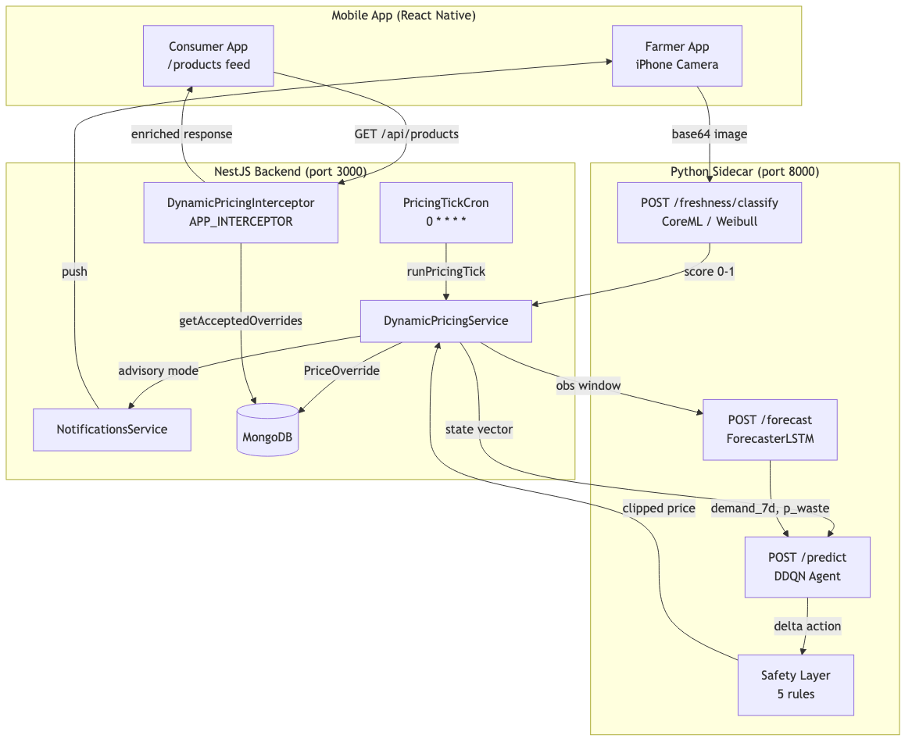

*Hình 5.1: Kiến trúc tổng thể hệ thống Định giá Động.*

### 5.2. Phân loại độ tươi sản phẩm

Độ tươi là tín hiệu trung tâm của toàn bộ hệ thống định giá. Một sản phẩm gần hết hạn cần được giảm giá kịp thời để tránh lãng phí; ngược lại, sản phẩm còn tươi tốt có thể duy trì hoặc tăng giá nhẹ nhằm tối đa hóa doanh thu.

#### 5.2.1. Mô hình CoreML trên thiết bị

Hệ thống sử dụng hai mô hình CoreML được chuyển đổi từ kiến trúc MobileNetV3 và triển khai trực tiếp trên thiết bị Apple:

- MyFreshnessClassifier-fruit.mlmodel — chuyên biệt cho em quả (fruit);

- MyFreshnessClassifier-root.mlmodel — chuyên biệt cho em củ (root).

Nông dân chụp ảnh sản phẩm trực tiếp từ iPhone; ảnh được mã hóa base64 và gửi lên endpoint POST /freshness/classify. Đầu ra là một điểm số liên tục trong khoảng \[0.0, 1.0\], trong đó 1.0 tương ứng với độ tươi hoàn hảo.

#### 5.2.2. Hàm fallback Weibull

Khi CoreML không khả dụng (thiết bị không phải Apple, hoặc chạy trên môi trường server), hệ thống áp dụng hàm suy giảm Weibull theo thời gian:

$`f = \lambda^{t_{age}}`$

trong đó $`t_{age}`$ là tuổi sản phẩm theo đơn vị 24 giờ, và $`\lambda`$ là hằng số suy giảm đặc thù theo loại:

| Loại sản phẩm    | λ     |
|------------------|-------|
| Rau lá (leafy)   | 0.970 |
| Thảo mộc (herbs) | 0.960 |
| Trái cây (fruit) | 0.985 |
| Mặc định         | 0.995 |

#### 5.2.3. FreshnessCache và nhãn tươi

Mỗi lần đọc độ tươi được lưu vào collection freshness_cache theo cơ chế cửa sổ trượt 5 giá trị gần nhất mỗi sản phẩm, với TTL 6 giờ và chỉ mục duy nhất trên productId. Giá trị điểm tươi được ánh xạ sang ba nhãn ngữ nghĩa:

| Nhãn     | Điều kiện      | Ý nghĩa      |
|----------|----------------|--------------|
| fresh    | f ≥ 0.8        | Tươi tốt     |
| aging    | 0.4 ≤ f \< 0.8 | Đang lão hoá |
| critical | f \< 0.4       | Sắp hỏng     |

### 5.3. Mô hình dự báo nhu cầu ForecasterLSTM

ForecasterLSTM là thành phần dự báo chuỗi thời gian được tích hợp bên trong sidecar Python. Mô hình cung cấp hai đầu ra quan trọng cho tác nhân DDQN: dự báo nhu cầu 7 ngày tới (demand_7d) và xác suất lãng phí (p_waste).

#### 5.3.1. Kiến trúc mạng

Mô hình gồm một nhánh nhúng danh mục (category embedding) kết hợp với bộ mã hóa LSTM hai tầng và hai đầu dự báo độc lập:

- **Category embedding**: nn.Embedding(4 → 8) — ánh xạ 4 loại sản phẩm sang không gian 8 chiều;

- **LSTM encoder**: obs_dim=10, hidden=128, layers=2, dropout=0.2 — xử lý chuỗi 21 bước thời gian;

- **Demand head**: Linear(136→1) — dự báo nhu cầu tích luỹ 7 ngày;

- **Waste head**: Linear(136→64→1) — ước tính xác suất lãng phí.

Đầu vào là cửa sổ 21 bước thời gian, mỗi bước là vector 10 chiều. Vector ẩn cuối cùng (128-dim) được nối với embedding danh mục (8-dim) tạo thành vector 136 chiều trước khi qua hai đầu dự báo.

#### 5.3.2. Hàm mất mát và huấn luyện

Hàm mất mát kết hợp hai thành phần với trọng số khác nhau nhằm ưu tiên giảm lãng phí:

$`L = 1.0 \times Huber(\widehat{d},d) + 4.0 \times FocalLoss({\widehat{p}}_{w},y_{w},\gamma = 2.0)`$

Focal Loss với $`\gamma = 2.0`$ giúp mô hình tập trung vào các mẫu lãng phí khó phân loại — vốn chiếm thiểu số trong tập dữ liệu thực tế. Quá trình huấn luyện sử dụng Adam với tốc độ học $`3 \times 10^{- 4}`$, lịch trình CosineAnnealingLR(T\_{max}=50), và dừng sớm với patience=5. Checkpoint tốt nhất được lưu tại forecaster_v4_best.pt và tối ưu hóa trên MPS (Apple Silicon) hoặc CPU.

### 5.4. Tác nhân học tăng cường DDQN

#### 5.4.1. Biểu diễn trạng thái (State Vector)

Vector trạng thái gồm 10 chiều được thiết kế để mã hoá đầy đủ các yếu tố ảnh hưởng đến quyết định giá:

| Chỉ số | Đặc trưng | Công thức chuẩn hoá |
|----|----|----|
| 0 | Độ tươi | $`clip(f,0,1)`$ |
| 1 | Tỷ lệ tồn kho | $`min(inv\_ ratio,2.0)`$ |
| 2 | Sin ngày trong tuần | $`sin(2\pi \cdot dow/7)`$ |
| 3 | Cos ngày trong tuần | $`cos(2\pi \cdot dow/7)`$ |
| 4 | Ngày đến đợt nhập (norm) | $`min(days/30,1.0)`$ |
| 5 | Tỷ lệ nhu cầu | $`clip((demand\_ 7d/7)/BASE\_ DEMAND\lbrack cat\rbrack,0,3.0)`$ |
| 6 | Delta giá trước | $`clip(\delta_{prev}, - 0.30,0.20)`$ |
| 7 | Tỷ lệ giá cạnh tranh | $`clip(p_{comp}/p_{base},0.5,2.0)`$ |
| 8 | Ngày đến hỏng (norm) | $`clip(log(0.5/f)/log(\lambda),0,14)/14`$ |
| 9 | Độ phủ tồn kho | $`clip(inv\_ units/demand\_ 7d,0,3.0)/3.0`$ |

Các hằng số nhu cầu nền (BASE_DEMAND) và tốc độ suy giảm hàng ngày (DAILY_DECAY) theo loại sản phẩm:

| Loại  | BASE_DEMAND (đơn vị/ngày) | DAILY_DECAY |
|-------|---------------------------|-------------|
| leafy | 7.463                     | 0.850       |
| root  | 5.631                     | 0.950       |
| fruit | 2.050                     | 0.880       |
| herbs | 4.575                     | 0.800       |

#### 5.4.2. Không gian hành động và mặt nạ hành động

Tác nhân lựa chọn từ 11 hành động rời rạc tương ứng với 11 mức điều chỉnh giá $`\delta`$ phân bố đều trên $`\lbrack - 0.30, + 0.20\rbrack`$ (CANDIDATES = np.linspace(-0.30, 0.20, 11)). Hành động thứ 6 ($`\delta = 0`$) là giữ nguyên giá.

Cơ chế mặt nạ hành động được áp dụng để đảm bảo tính hợp lệ về nghiệp vụ:

| Điều kiện | Ràng buộc |
|----|----|
| $`f \leq 0.50`$ | Chỉ hành động $`\delta = 0`$ hợp lệ |
| Loại leafy hoặc herbs | Không được tăng giá ($`\delta > 0`$) |
| Loại fruit/root, $`f < 0.70`$ | Không được tăng giá |
| Loại fruit/root, $`0.70 \leq f < 0.85`$ | Tăng giá tối đa đến freshness_target_delta(f) |
| Loại fruit/root, $`f \geq 0.85`$ | Tất cả 11 hành động hợp lệ |

#### 5.4.3. Hàm phần thưởng

Phần thưởng được cấu thành từ 5 thành phần phản ánh các mục tiêu kinh doanh khác nhau:

$`r = r_{revenue} + r_{waste} + r_{target} + r_{premium} + r_{smooth}`$

| Thành phần | Công thức | Mục tiêu |
|----|----|----|
| $`r_{revenue}`$ | $`(p/p_{ref}) \times sold`$ | Tối đa hoá doanh thu |
| $`r_{waste}`$ | $`- 15.0 \times waste\_ units`$ | Phạt lãng phí |
| $`r_{target}`$ | $`- 100.0 \times (\delta - \delta_{target}(f,cat))^{2}`$ | Bám sát giá mục tiêu theo độ tươi |
| $`r_{premium}`$ | $`15.0 \times \delta \times max(0,f - 0.80)`$ (chỉ fruit/root) | Khuyến khích giá cao khi sản phẩm tươi |
| $`r_{smooth}`$ | $`- 0.5 \times |\delta - \delta_{prev}|`$ | Phạt biến động giá đột ngột |

#### 5.4.4. Kiến trúc mạng SharedMLPDuelingQNet

Mạng Q được thiết kế theo kiến trúc Dueling DQN với chia sẻ trọng số giữa 4 loại sản phẩm:

*Hình 5.2: Kiến trúc mạng Dueling Q và luồng suy luận DDQN.*

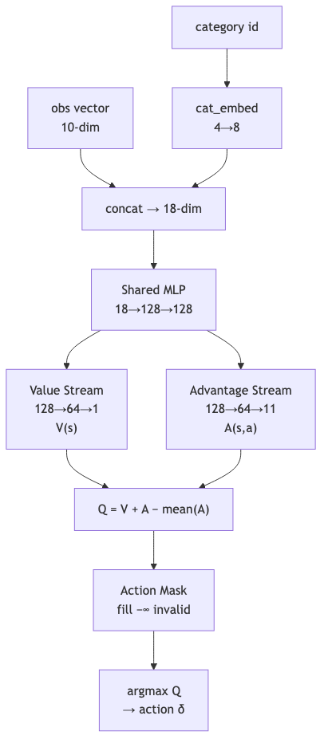

*Hình 5.2: Kiến trúc mạng Dueling Q và luồng suy luận DDQN.*

Kiến trúc Dueling tách rời việc ước lượng giá trị trạng thái V(s) và lợi thế hành động A(s,a), giúp mô hình học hiệu quả hơn ở những trạng thái mà hầu hết các hành động đều tương đương nhau (ví dụ: khi sản phẩm còn rất tươi và tồn kho đủ, giữ giá hoặc tăng nhẹ đều hợp lý).

#### 5.4.5. Quá trình huấn luyện

**MultiCatDDQNAgent** duy trì 4 replay buffer độc lập theo danh mục sản phẩm (mỗi buffer 50,000 mẫu) nhưng chia sẻ chung một mạng tham số. Cấu hình huấn luyện:

- Tối ưu hóa: Adam, lr=$`10^{- 4}`$, gradient clipping norm=10.0;

- Hệ số chiết khấu: $`\gamma = 0.99`$;

- Batch size: 256;

- Lịch trình epsilon-greedy: $`\varepsilon:1.0 \rightarrow 0.05`$ tuyến tính qua 2000 episode đầu;

- Tổng: 3,000 episode × 91 bước/episode.

**Khởi động bằng MPC Behavioral Cloning (BC):** Trước khi bắt đầu học tăng cường, tác nhân được khởi động bằng 500 bước BC sử dụng hàm mất mát cross-entropy giữa phân phối Q và hành động từ bộ điều khiển MPC dựa trên quy tắc. Sau đó, bộ đệm được điền sẵn các trải nghiệm MPC để tăng tốc hội tụ.

*Hình 5.3: Luồng huấn luyện và ra quyết định của tác nhân DDQN.*

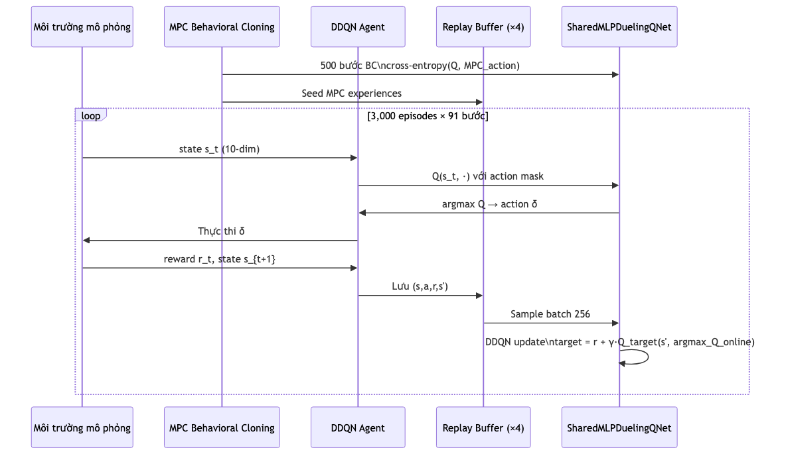

*Hình 5.3: Luồng huấn luyện và ra quyết định của tác nhân DDQN.*

#### 5.4.6. Kết quả benchmark

Thực nghiệm đánh giá được thực hiện trên N=200 episode, seed=42, so sánh ba hệ thống:

| Hệ thống | Tỷ lệ lãng phí ± SEM | Doanh thu | Δwaste vs MPC \[KTC 95%\] | p-value |
|----|----|----|----|----|
| MPC (baseline) | 0.0883 ± 0.0012 | 2097.9 | — | — |
| DDQN+forecaster | **0.0622 ± 0.0007** | **2283.6** | \[−0.0290, −0.0232\] | 8.2×10⁻⁴³ |
| DDQN-MLP (không forecaster) | 0.0628 ± 0.0008 | 2252.8 | \[−0.0285, −0.0226\] | 4.5×10⁻⁴¹ |

DDQN+forecaster đạt **giảm 29.5% lãng phí** và **tăng 8.8% doanh thu** so với MPC (p \<\< 0.001). Khoảng tin cậy 95% không bao gồm giá trị 0, xác nhận ý nghĩa thống kê.

### 5.5. Lớp an toàn (Safety Layer)

Trước khi bất kỳ mức giá nào được ghi vào cơ sở dữ liệu, đầu ra của tác nhân DDQN phải đi qua một chuỗi 5 quy tắc kiểm tra an toàn áp dụng tuần tự. Lớp này đảm bảo hệ thống không bao giờ tạo ra giá không hợp lệ về mặt nghiệp vụ dù tác nhân có đưa ra hành động bất thường nào.

| Thứ tự | Quy tắc | Điều kiện áp dụng | Ràng buộc |
|----|----|----|----|
| 1 | Giới hạn thay đổi theo tick | Luôn | $`p \in \lbrack p_{base} \times 0.70,\ p_{base} \times 1.20\rbrack`$ |
| 2 | Bắt buộc theo độ tươi | $`f < 0.4`$ | $`p \leq p_{base} \times 0.75`$ |
| 3 | Sàn giá vốn | Luôn | $`p \geq p_{base} \times 0.55`$ |
| 4 | Trần giá tuyệt đối | Luôn | $`p \leq p_{base} \times 2.0`$ |
| 5 | Giá tối thiểu khả thi | Luôn | $`p \geq 1,000`$ VND |

Hàm trả về cặp (clipped_price, safety_clipped: bool). Cờ safety_clipped=True được ghi nhận vào log KPI để theo dõi tần suất tác nhân vi phạm ràng buộc an toàn trong quá trình vận hành thực tế.

### 5.6. Tích hợp NestJS và vòng đời hệ thống

#### 5.6.1. Dịch vụ DynamicPricingService

Lớp dịch vụ trung tâm điều phối toàn bộ luồng dữ liệu. Các phương thức chính:

- **generateSuggestionForProduct(productId)**: truy vấn độ tươi, giá cạnh tranh (từ các trang trại trong bán kính 10km qua \$geoNear), lịch nhập kho và dự báo nhu cầu; gọi POST /predict đến sidecar; lưu kết quả vào price_overrides.

- **runPricingTick()**: xử lý hàng loạt toàn bộ sản phẩm có trạng thái "available"; em giá cạnh tranh theo (farmId, category); lấy dự báo qua DemandForecastingService.getForecast(); gọi POST /predict theo lô; tạo các bản ghi PriceOverride; ở chế độ advisory, gửi thông báo đẩy đến chủ trang trại.

- **getAcceptedOverridesForProducts(ids)**: trả về Map\<productId, PriceOverride\> để interceptor tra cứu nhanh.

- **reviewSuggestion(id, ownerId, decision)**: cho phép nông dân chấp nhận/từ chối gợi ý với kiểm tra quyền sở hữu.

#### 5.6.2. Interceptor làm giàu phản hồi sản phẩm

DynamicPricingInterceptor được đăng ký như APP_INTERCEPTOR toàn cục. Logic hoạt động:

1.  Bỏ qua nếu PRICING_MODE=shadow;

2.  Chỉ xử lý các đường dẫn khớp /products/\*;

3.  Sau khi handler trả về, truy vấn các PriceOverride đã được chấp nhận;

4.  Bổ sung vào mỗi đối tượng sản phẩm: dynamicPrice, freshnessScore, priceTag;

5.  priceTag = "flash_discount" nếu deltaPct \< 0, ngược lại "standard".

#### 5.6.3. Tích hợp thông báo đẩy (chế độ advisory)

Trong runPricingTick(), sau khi tạo xong các bản ghi PriceOverride, hệ thống em các gợi ý theo farmId. Với mỗi trang trại có gợi ý mới, NotificationsService.createAndPush() được gọi với:

{  
"type": "system",  
"title": "Gợi ý giá mới",  
"message": "Hệ thống vừa tạo gợi ý giá mới cho nông trại {farm.name}",  
"data": { "screen": "/(app)/farm/price-suggestions" }  
}

#### 5.6.4. Vòng đời PriceOverride

*Hình 5.4: Vòng đời trạng thái của một bản ghi PriceOverride.*

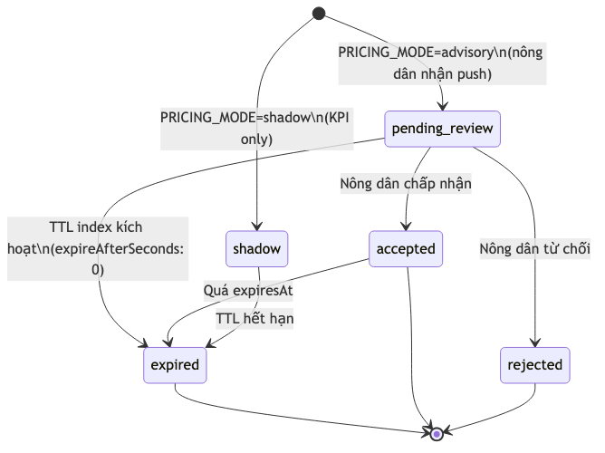

*Hình 5.4: Vòng đời trạng thái của một bản ghi PriceOverride.*

Thời gian sống của mỗi bản ghi: expiresAt = computedAt + PRICING_SUGGESTION_TTL_HOURS (mặc định 1 giờ). MongoDB TTL index trên trường expiresAt tự động xóa bản ghi hết hạn mà không cần tác vụ dọn dẹp thủ công.

*Hình 5.5: Luồng tổng thể của một chu kỳ PricingTick.*

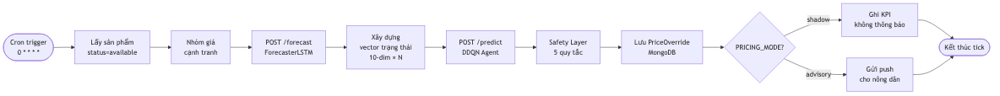

*Hình 5.5: Luồng tổng thể của một chu kỳ PricingTick.*

### 5.7. So sánh với các nghiên cứu liên quan

Hệ thống F2T Dynamic Pricing được định vị trong bối cảnh tổng thể của các nghiên cứu định giá động và dự báo nhu cầu cho hàng nông sản dễ hỏng. Bảng sau tổng hợp so sánh với bốn công trình tiêu biểu.

| Tiêu chí | F2T (hệ thống này) | Nassibi et al. (2023) \[10\] | Xue et al. (2025) \[11\] | Wen & He (2024) \[3\] | Kayikci et al. (2022) \[5\] |
|----|----|----|----|----|----|
| Phương pháp định giá | DDQN + Dueling + action masking | Không có (dự báo thuần tuý) | Lập trình phi tuyến + ARIMA | Không có | SDP ngẫu nhiên |
| Dự báo nhu cầu | ForecasterLSTM (giờ/ngày) | LSTM (tháng/quý) | ARIMA | Không có | Thống kê đơn giản |
| Tín hiệu độ tươi | CoreML liên tục \[0,1\] + Weibull | Không có | Tốc độ hỏng cố định | 3-tier rời rạc (95.12% acc) | Cảm biến hyperspectral |
| Thiết bị đầu cuối | iPhone (CoreML, không phí) | Không có | ESL phần cứng (~nghìn USD) | Server/Edge GPU | Camera hyperspectral (~nghìn USD) |
| Hàm độ nhạy giá | Học qua DDQN (không cần đặc tả) | Không áp dụng | Đặc tả riêng từng SKU | Không áp dụng | Hàm cầu tĩnh |
| Độ hạt (granularity) | Mỗi sản phẩm × mỗi giờ | Tháng/quý | Ngày | Không có | Không rõ |
| Nền tảng triển khai | Mobile app B2C trực tiếp | Không có | Hệ thống bán lẻ ESL | Nghiên cứu học thuật | Pilot cửa hàng đơn lẻ |
| Cải thiện lãng phí | −29.5% vs MPC baseline | Không đo | Giảm ngầm định | Không áp dụng | ~5–6% hiệu quả kinh tế |
| Cải thiện doanh thu | +8.8% vs MPC baseline | MAPE=8.71% (−77% vs SVM) | Không rõ | Không áp dụng | ~5–6% hiệu quả kinh tế |

#### 5.7.1. So sánh với Nassibi et al. (2023)

Nassibi et al. \[10\] đề xuất sử dụng LSTM để dự báo nhu cầu hàng thực phẩm dễ hỏng với MAPE=8.71%, cải thiện 77% so với SVM. Đây là nền tảng kỹ thuật quan trọng xác nhận tính hiệu quả của LSTM cho bài toán chuỗi thời gian nông sản. Tuy nhiên, nghiên cứu hoạt động ở độ hạt tháng/quý và yêu cầu dữ liệu lịch sử 2–3 năm để vượt qua cold-start. Quan trọng hơn, đầu ra dự báo không được nối với bất kỳ cơ chế định giá nào, tạo ra khoảng trống mà F2T lấp đầy bằng cách đưa demand_7d trực tiếp vào chiều \[5\] của vector trạng thái DDQN. ForecasterLSTM trong F2T hoạt động ở độ hạt giờ/ngày phù hợp với chu kỳ nông sản tươi sống tại Việt Nam.

#### 5.7.2. So sánh với Xue et al. (2025)

Xue et al. \[11\] giải quyết bài toán kết hợp định giá và bổ sung hàng rau củ bằng lập trình phi tuyến kết hợp với ước lượng co giãn cầu và ARIMA. Cách tiếp cận này đòi hỏi hàm co giãn cầu được đặc tả trước cho từng SKU — một giả thiết khó đáp ứng trong môi trường marketplace đa nông trại nơi mỗi sản phẩm có đặc tính cầu khác nhau. Thêm vào đó, hệ thống của Xue et al. yêu cầu phần cứng ESL (Electronic Shelf Label) có chi phí đầu tư lớn và chỉ hoạt động qua backtest lịch sử. F2T tránh yêu cầu đặc tả hàm co giãn bằng cách để tác nhân DDQN tự học mối quan hệ giá–cầu qua tương tác, và triển khai trên smartphone phổ thông không phát sinh chi phí phần cứng đặc biệt.

#### 5.7.3. So sánh với Wen & He (2024)

Wen & He \[3\] đề xuất mô hình EfficientNet nhẹ (5M tham số, 95.12% độ chính xác) với cơ chế chú ý CA+CBAM để phân loại chất lượng rau củ thành 3 mức rời rạc. Công trình này xác nhận tính khả thi của phân loại chất lượng trực quan trên thiết bị đầu cuối hạn chế tài nguyên. F2T kế thừa nguyên tắc suy luận nhẹ tại thiết bị biên nhưng mở rộng theo hai hướng: (1) đầu ra là điểm liên tục \[0.0, 1.0\] thay vì nhãn rời rạc, cho phép biểu diễn mịn hơn trong vector trạng thái DDQN; (2) mô hình CoreML được triển khai trực tiếp trên iPhone của nông dân, không cần cơ sở hạ tầng GPU riêng biệt.

#### 5.7.4. So sánh với Kayikci et al. (2022)

Kayikci et al. \[5\] là nghiên cứu có tính tương đồng khái niệm gần nhất với F2T: sử dụng cảm biến IoT để thu thập tín hiệu chất lượng theo thời gian thực làm đầu vào cho Stochastic Dynamic Programming (SDP) nhằm tối ưu hóa giá. Hệ thống đạt cải thiện hiệu quả kinh tế ~5–6% trong pilot tại một cửa hàng. Tuy nhiên, ba hạn chế chính cản trở khả năng nhân rộng: (i) camera hyperspectral có giá hàng nghìn USD không khả thi cho hộ nông dân nhỏ; (ii) SDP giả định phân phối cầu cố định (stationary), không thích ứng được khi điều kiện thị trường thay đổi; (iii) pilot đơn lẻ không kiểm chứng khả năng mở rộng đa nông trại. F2T thay thế camera hyperspectral bằng CoreML trên iPhone sẵn có của nông dân, thay thế SDP bằng DDQN có khả năng học phân phối cầu phi dừng qua thời gian, đồng thời bổ sung tín hiệu dự báo LSTM để tăng hiệu quả quyết định — kết quả là cải thiện lãng phí 29.5% và doanh thu 8.8%, vượt trội so với mức ~5–6% của Kayikci et al.KẾT LUẬN

### Kết quả đạt được

Em đã xây dựng thành công ứng dụng F2T với đầy đủ các tính năng đề ra:

- **12 module backend** hoàn chỉnh với unit test (Jest + mongodb-memory-server), lint sạch, và Swagger documentation

- **Tích hợp Stripe** với Checkout Sessions + webhook (7 test cases)

- **Tích hợp GHN** với Dijkstra fallback + MapView tracking (4 test cases)

- **Hệ thống thông báo** với Expo Push + cron job cảnh báo tồn kho thấp

- **Admin module** với đầy đủ quyền quản trị (8 endpoints, 4 test cases)

- **Frontend React Native** với 40+ màn hình, phân quyền theo role, JWT refresh tự động

- **Geospatial search** hai giai đoạn: tìm trang trại → lọc sản phẩm theo bán kính

### Hạn chế và hướng phát triển

| Hạn chế hiện tại | Hướng phát triển |
|----|----|
| Email/SMS verification bị tắt ở frontend | Tích hợp provider SMTP/Twilio |
| GHN tracking là pull-based (không có webhook) | Thêm endpoint POST /api/delivery/webhook/ghn |
| Trọng lượng vận đơn hardcoded 500g | Tính toán động từ items.reduce() |
| Cloudinary chưa cấu hình (local fallback) | Cấu hình Cloudinary CDN cho production |
| Không có rating/review sản phẩm | Thêm module Reviews |
| Không có real-time chat | Thêm WebSocket chat Farm–Consumer |

## TÀI LIỆU THAM KHẢO

\[1\] Beck, K., et al. (2001). *Manifesto for Agile Software Development*. https://agilemanifesto.org

\[2\] Meta Open Source. (2024). *React Native Documentation*. https://reactnative.dev

\[3\] Expo. (2024). *Expo SDK 53 Documentation*. https://docs.expo.dev

\[4\] Kamil Mysliwiec. (2024). *NestJS Documentation*. https://docs.nestjs.com

\[5\] MongoDB, Inc. (2024). *MongoDB 7.0 Manual*. https://docs.mongodb.com

\[6\] Mongoose. (2024). *Mongoose ODM Documentation*. https://mongoosejs.com

\[7\] Stripe, Inc. (2024). *Stripe API Documentation*. https://stripe.com/docs

\[8\] GHN. (2024). *GHN API Documentation*. https://khachhang.ghn.vn

\[9\] Expo. (2024). *Expo Push Notifications*. https://docs.expo.dev/push-notifications/overview

\[10\] Dijkstra, E. W. (1959). A note on two problems in connexion with graphs. *Numerische Mathematik*, 1(1), 269–271.

\[3\] Wen, J., & He, J. (2024). Agricultural development driven by the digital economy: improved EfficientNet vegetable quality grading. *Frontiers in Sustainable Food Systems*. https://doi.org/10.3389/fsufs.2024.1310042

\[5\] Kayikci, Y., et al. (2022). Data-driven optimal dynamic pricing strategy for reducing perishable food waste at retailers. *ResearchGate*. https://www.researchgate.net/publication/358814594

\[10\] Nassibi, N., Fasihuddin, H., & Hsairi, L. (2023). Demand Forecasting Models for Food Industry by Utilizing Machine Learning Approaches. *International Journal of Advanced Computer Science and Applications (IJACSA)*, 14(3). https://thesai.org/Downloads/Volume14No3/Paper_101-Demand_Forecasting_Models_for_Food_Industry_by_Utilizing_Machine_Learning.pdf

\[11\] Xue, X., et al. (2025). Automated Pricing and Replenishment Decisions for Vegetables Based on Price Elasticity. *ACM DEAI 2025*. https://dl.acm.org/doi/10.1145/3745238.3745430

\[12\] Mnih, V., et al. (2015). Human-level control through deep reinforcement learning. *Nature*, 518(7540), 529–533.

\[13\] Wang, Z., Schaul, T., Hessel, M., van Hasselt, H., Lanctot, M., & de Freitas, N. (2016). Dueling network architectures for deep reinforcement learning. *ICML 2016*.

\[14\] van Hasselt, H., Guez, A., & Silver, D. (2016). Deep reinforcement learning with Double Q-learning. *AAAI 2016*.

\[15\] Lin, T.-Y., Goyal, P., Girshick, R., He, K., & Dollár, P. (2017). Focal loss for dense object detection. *ICCV 2017*.

\[16\] Howard, A., et al. (2019). Searching for MobileNetV3. *ICCV 2019*.

## 
