# LUẬN VĂN TỐT NGHIỆP

## ĐỀ TÀI: XÂY DỰNG ỨNG DỤNG THƯƠNG MẠI ĐIỆN TỬ NÔNG SẢN TỪ TRANG TRẠI ĐẾN BÀN ĂN (F2T — FARM TO TABLE)

---

## LỜI CẢM ƠN

Em xin chân thành cảm ơn giảng viên hướng dẫn đã tận tình hỗ trợ, định hướng và góp ý trong suốt quá trình thực hiện đề tài. Thầy/Cô không chỉ truyền đạt kiến thức chuyên môn mà còn giúp em rèn luyện tư duy giải quyết vấn đề, phương pháp nghiên cứu khoa học và kỹ năng làm việc nhóm.

Em cũng gửi lời cảm ơn sâu sắc đến các thầy cô trong khoa Công nghệ thông tin đã trang bị cho em nền tảng kiến thức vững chắc về kỹ thuật phần mềm, cơ sở dữ liệu, trí tuệ nhân tạo và học máy — những lĩnh vực được vận dụng trực tiếp trong đề tài này. Cuối cùng, em xin cảm ơn gia đình và bạn bè đã luôn động viên, tạo điều kiện thuận lợi để em hoàn thành luận văn.

Do thời gian và kiến thức còn hạn chế, luận văn không tránh khỏi những thiếu sót. Em rất mong nhận được sự góp ý của quý thầy cô để đề tài được hoàn thiện hơn.

---

## LỜI CAM ĐOAN

Em cam đoan đây là công trình nghiên cứu của em dưới sự hướng dẫn của giảng viên. Toàn bộ mã nguồn hệ thống F2T (backend NestJS, frontend React Native, và dịch vụ AI/ML sidecar) do em tự xây dựng. Các số liệu, công thức, siêu tham số và kết quả nêu trong luận văn được trích xuất trung thực từ mã nguồn thực tế của dự án, chưa từng được công bố trong bất kỳ công trình nào khác. Mọi tham khảo từ tài liệu bên ngoài đều được trích dẫn đầy đủ trong mục Tài liệu tham khảo.

---

## BẢNG PHÂN CÔNG CÔNG VIỆC

| MSSV | Sinh viên thực hiện | Nhiệm vụ |
|------|---------------------|----------|
| A46489 | Đoàn Nam Anh | Toàn bộ đề tài: Backend (NestJS, 12 module), Frontend (React Native + Expo), và Hệ thống AI/ML — pricing-sidecar (Double-DQN), tích hợp, kiểm thử và viết luận văn. |

---

## DANH MỤC HÌNH ẢNH

| Hình | Mô tả | Trang |
|------|-------|-------|
| Hình 1.1 | Logo React Native & Expo | 8 |
| Hình 1.2 | Logo NestJS | 10 |
| Hình 1.3 | Logo MongoDB | 12 |
| Hình 1.4 | Logo Stripe | 14 |
| Hình 1.5 | Logo GHN (Giao Hàng Nhanh) | 15 |
| Hình 1.6 | Logo Node.js | 16 |
| Hình 2.1 | Biểu đồ use case tổng quan (UC-01) | 30 |
| Hình 2.2 | Use case phân rã "Đặt hàng và Thanh toán" (UC-02) | 32 |
| Hình 2.3 | Use case phân rã "Quản lý sản phẩm" (UC-03) | 33 |
| Hình 2.4 | Use case phân rã "Quản lý trang trại" (UC-04) | 34 |
| Hình 2.5 | Use case phân rã "Theo dõi giao hàng" (UC-05) | 35 |
| Hình 2.6 | Use case phân rã "Quản lý Admin" (UC-06) | 36 |
| Hình 2.7 | Use case phân rã "Tính năng AI/ML" (UC-07) | 37 |
| Hình 3.1 | Tuần tự: Đăng nhập & làm mới JWT token (SD-01) | 46 |
| Hình 3.2 | Tuần tự: Đăng ký tài khoản (SD-02) | 47 |
| Hình 3.3 | Tuần tự: Tìm kiếm sản phẩm theo vị trí địa lý (SD-03) | 48 |
| Hình 3.4 | Tuần tự: Tạo đơn hàng — embedded snapshot (SD-04) | 49 |
| Hình 3.5 | Tuần tự: Thanh toán Stripe Checkout (SD-05) | 50 |
| Hình 3.6 | Tuần tự: Tạo vận đơn GHN + webhook (SD-06) | 52 |
| Hình 3.7 | Tuần tự: Theo dõi giao hàng (SD-07) | 53 |
| Hình 3.8 | Tuần tự: Thông báo đẩy Expo Push (SD-08) | 42 |
| Hình 3.9 | Tuần tự: Admin xác thực trang trại (SD-09) | 55 |
| Hình 3.10 | Hoạt động: Vòng đời đơn hàng (AD-01) | 56 |
| Hình 3.11 | Hoạt động: Xác thực JWT (AD-02) | 57 |
| Hình 3.12 | Hoạt động: Đăng ký & xác thực trang trại (AD-03) | 58 |
| Hình 3.13 | Hoạt động: Quản lý sản phẩm (AD-04) | 59 |
| Hình 3.14 | Tuần tự: Kiến trúc triển khai hệ thống (AD-05) | 60 |
| Hình 4.1 | Cấu trúc thư mục Backend | 66 |
| Hình 4.2 | Cấu trúc thư mục Frontend | 67 |
| Hình 5.1 | Kiến trúc tổng quan mô hình sidecar | 74 |
| Hình 5.12 | Use case Định giá động (UC-ML-03) | 93 |
| Hình 5.13 | Tuần tự: Chu kỳ định giá động (SD-ML-06) | 95 |
| Hình 5.14 | Tuần tự: Quét độ tươi (SD-ML-07) | 97 |
| Hình 5.15 | Tuần tự: Chấp nhận/từ chối gợi ý giá (SD-ML-08) | 98 |
| Hình 5.16 | Hoạt động: Suy luận DQN không trạng thái (AD-ML-04) | 100 |
| Hình 5.17 | Hoạt động: Lớp an toàn định giá (AD-ML-05) | 102 |

---

## DANH MỤC BẢNG BIỂU

| Bảng | Mô tả | Trang |
|------|-------|-------|
| Bảng 1.1 | So sánh kiến trúc Monolithic, Microservices và Sidecar | 7 |
| Bảng 2.1 | Yêu cầu phi chức năng | 28 |
| Bảng 2.2 | Đặc tả use case Đăng ký | 38 |
| Bảng 2.3 | Đặc tả use case Đăng nhập | 39 |
| Bảng 2.4 | Đặc tả use case Đặt hàng | 40 |
| Bảng 2.5 | Đặc tả use case Thanh toán Stripe | 41 |
| Bảng 2.6 | Đặc tả use case Quản lý sản phẩm | 42 |
| Bảng 2.7 | Đặc tả use case Theo dõi giao hàng | 43 |
| Bảng 2.8 | Đặc tả use case Tính năng AI/ML | 44 |
| Bảng 3.1 | Danh sách 8 collection trong MongoDB | 45 |
| Bảng 3.2 | Thiết kế collection Users | 45 |
| Bảng 3.3 | Thiết kế collection Farms | 46 |
| Bảng 3.4 | Thiết kế collection Products | 46 |
| Bảng 3.5 | Thiết kế collection Orders | 47 |
| Bảng 3.6 | Thiết kế collection Posts | 47 |
| Bảng 3.7 | Thiết kế collection Notifications | 48 |
| Bảng 3.8 | Thiết kế collection price_overrides | 48 |
| Bảng 3.9 | Thiết kế collection freshness_cache | 49 |
| Bảng 4.1 | Thư viện và công cụ Backend | 62 |
| Bảng 4.2 | Thư viện và công cụ Frontend | 63 |
| Bảng 4.3 | Tài khoản seed cho thử nghiệm | 64 |
| Bảng 4.4 | Kết quả unit test theo module (42/42 pass) | 65 |
| Bảng 5.5 | Hệ số co giãn theo giá β (dữ liệu Dunnhumby) | 94 |
| Bảng 5.6 | Vector trạng thái DQN 5 chiều | 95 |
| Bảng 5.7 | Chính sách & doanh thu DQN so với baseline | 96 |
| Bảng 5.8 | Đối chứng DQN rời rạc vs TD3 liên tục | 98 |
| Bảng 5.9 | Luật lớp an toàn (safety layer) | 102 |
| Bảng 5.10 | Hệ số Weibull suy giảm độ tươi | 103 |

---

## DANH MỤC THUẬT NGỮ VÀ TỪ VIẾT TẮT

| Từ viết tắt | Giải thích |
|-------------|-----------|
| F2T | Farm to Table — Từ trang trại đến bàn ăn |
| API | Application Programming Interface — Giao diện lập trình ứng dụng |
| REST | Representational State Transfer — Kiểu kiến trúc API |
| JWT | JSON Web Token — Token xác thực dạng JSON |
| MMKV | Thư viện lưu trữ khóa-giá trị hiệu năng cao trên mobile |
| GHN | Giao Hàng Nhanh — Đơn vị vận chuyển tại Việt Nam |
| CRUD | Create, Read, Update, Delete — Các thao tác dữ liệu cơ bản |
| DTO | Data Transfer Object — Đối tượng truyền dữ liệu |
| ORM/ODM | Object-Relational / Object-Document Mapper |
| CI/CD | Continuous Integration / Continuous Deployment |
| TTL | Time To Live — Thời gian sống của bản ghi cache |
| VND | Việt Nam Đồng |
| OTP | One-Time Password — Mật khẩu dùng một lần |
| AI | Artificial Intelligence — Trí tuệ nhân tạo |
| ML | Machine Learning — Học máy |
| RL | Reinforcement Learning — Học tăng cường |
| DQN | Deep Q-Network — Mạng Q sâu (mô hình định giá triển khai) |
| Double-DQN | Biến thể DQN giảm thiên lệch ước lượng quá mức (overestimation) |
| TD3 | Twin-Delayed DDPG — thuật toán điều khiển liên tục (đối chứng) |
| MARL | Multi-Agent Reinforcement Learning — Học tăng cường đa tác tử (đã khảo sát, loại bỏ) |
| QMIX | Thuật toán MARL phân rã giá trị (đã khảo sát, loại bỏ) |
| MADDPG | Multi-Agent Deep Deterministic Policy Gradient (đã khảo sát, loại bỏ) |
| GRU | Gated Recurrent Unit — Đơn vị hồi tiếp có cổng |
| MLP | Multi-Layer Perceptron — Mạng nơ-ron nhiều lớp |
| BCE | Binary Cross-Entropy — Hàm mất mát entropy chéo nhị phân |
| CI | Confidence Interval — Khoảng tin cậy |
| Sidecar | Mẫu kiến trúc dịch vụ phụ trợ chạy độc lập cạnh dịch vụ chính |
| FastAPI | Web framework Python bất đồng bộ (ASGI) cho ML sidecar |
| PyTorch | Thư viện học sâu (deep learning) bằng Python |
| Embedding | Vector nhúng biểu diễn thực thể trong không gian số |
| Cosine Similarity | Độ tương đồng cô-sin giữa hai vector |
| Cold-start | Tình huống thiếu dữ liệu lịch sử cho người dùng/sản phẩm mới |
| Shadow mode | Chế độ chạy ngầm chỉ thu KPI, không hiển thị cho người dùng |
| Advisory mode | Chế độ tư vấn — gợi ý giá cho chủ trang trại chấp nhận/từ chối |

---

## LỜI MỞ ĐẦU

### A. Đặt vấn đề

Việt Nam là quốc gia nông nghiệp với hơn 60% dân số liên quan đến sản xuất nông sản. Tuy nhiên, chuỗi cung ứng từ trang trại đến người tiêu dùng thường trải qua nhiều khâu trung gian, làm tăng giá thành và giảm độ tươi của sản phẩm. Người tiêu dùng thiếu công cụ trực tiếp kết nối với trang trại để đặt mua nông sản tươi sạch, trong khi các chủ trang trại gặp khó khăn trong việc tiếp cận thị trường rộng lớn hơn, định giá hợp lý theo độ tươi và tồn kho, cũng như dự báo nhu cầu để lên kế hoạch thu hoạch.

Sự bùng nổ của thương mại điện tử di động tại Việt Nam tạo cơ hội xây dựng một nền tảng kết nối trực tiếp trang trại và người tiêu dùng. Hơn nữa, việc ứng dụng Trí tuệ nhân tạo (AI) và Học máy (ML) — định giá động theo độ tươi — có thể nâng cao hiệu quả vận hành, giảm lãng phí nông sản và cải thiện trải nghiệm người dùng. Đề tài F2T (Farm to Table) được thực hiện nhằm giải quyết đồng thời bài toán chuỗi cung ứng và bài toán tối ưu hóa bằng AI/ML.

### B. Mục tiêu và phạm vi đề tài

**Mục tiêu:**
- Xây dựng ứng dụng di động đa nền tảng (iOS và Android) kết nối trang trại và người tiêu dùng, sử dụng React Native + Expo.
- Xây dựng backend NestJS + MongoDB với 12 module nghiệp vụ, tuân thủ kiến trúc REST chuẩn hóa.
- Tích hợp thanh toán trực tuyến Stripe (webhook là nguồn xác thực) và vận chuyển GHN với cơ chế fallback Dijkstra.
- Xây dựng bảng điều khiển Admin và hệ thống thông báo đẩy qua Expo Push.
- **Triển khai hệ thống AI/ML dưới dạng sidecar:**
  - Định giá động (Double-DQN không trạng thái theo nhóm hàng, kèm lớp an toàn) ở chế độ shadow/advisory.

**Phạm vi:**
- **Không bao gồm:** xác thực email/SMS (đã xây dựng ở backend nhưng vô hiệu hóa ở frontend), ứng dụng web (chỉ mobile), chế độ định giá "live" (ghi thẳng giá — ngoài phạm vi; đề tài chỉ tới shadow/advisory).
- **Môi trường:** phát triển và kiểm thử trên thiết bị thật và emulator; MongoDB 7 cục bộ; sidecar FastAPI chạy ở cổng 8000.

### C. Bố cục

Luận văn được tổ chức theo **5 chương**:
- **Chương 1 — Cơ sở lý thuyết:** các công nghệ và nền tảng lý thuyết (React Native/Expo, NestJS, MongoDB, Stripe, GHN, FastAPI, PyTorch, Cosine Similarity, Reinforcement Learning, Collaborative Filtering, Holt's smoothing).
- **Chương 2 — Phân tích và đặc tả yêu cầu:** khảo sát hiện trạng, yêu cầu chức năng/phi chức năng, biểu đồ use case và đặc tả use case.
- **Chương 3 — Thiết kế hệ thống:** thiết kế cơ sở dữ liệu (8 collection), biểu đồ tuần tự, biểu đồ hoạt động và kiến trúc triển khai.
- **Chương 4 — Cài đặt và thử nghiệm:** thư viện/công cụ, môi trường, tài khoản seed, kết quả kiểm thử (42/42 test) và demo sản phẩm.
- **Chương 5 — Hệ thống Trí tuệ nhân tạo và Học máy (AI/ML):** trình bày chi tiết toán học và kỹ thuật của định giá động.

---


---

## CHƯƠNG 1. CƠ SỞ LÝ THUYẾT

### 1.1. Quản lý dự án

Quản lý dự án phần mềm là một quá trình mang tính hệ thống, bao gồm các hoạt động hoạch định, tổ chức, điều phối, và kiểm soát các nguồn lực để đạt được mục tiêu cụ thể của dự án trong những giới hạn khắt khe về phạm vi (scope), thời gian (time), và chất lượng (quality). Trong bối cảnh phát triển các hệ thống phần mềm hiện đại và phức tạp như F2T (Farm to Table) – một nền tảng thương mại điện tử tích hợp sâu trí tuệ nhân tạo (AI), quản lý dự án đóng vai trò là "xương sống" đảm bảo dự án đi đúng hướng, kiểm soát rủi ro và đáp ứng kỳ vọng của các bên liên quan.

Các khía cạnh cốt lõi của quản lý dự án bao gồm:
- **Quản lý phạm vi (Scope Management):** Xác định ranh giới rõ ràng của sản phẩm. Trong F2T, phạm vi được giới hạn chặt chẽ ở việc xây dựng một hệ sinh thái ba bên (người tiêu dùng, chủ trang trại, hệ thống quản trị admin) với các tính năng cốt lõi như thương mại điện tử, mạng xã hội chia sẻ bài viết nội bộ,  Việc kiểm soát phạm vi giúp tránh hiện tượng "scope creep" (phình to phạm vi không kiểm soát), đảm bảo nguồn lực tập trung vào các chức năng mang lại giá trị cao nhất.
- **Quản lý thời gian (Time Management):** Chia nhỏ dự án thành các giai đoạn, từ phân tích thiết kế, lập trình backend, frontend, tích hợp mô hình Machine Learning, cho đến kiểm thử và triển khai. Lịch trình được kiểm soát qua biểu đồ Gantt và các cột mốc (milestones) cụ thể để đảm bảo hệ thống có thể ra mắt đúng tiến độ.
- **Quản lý chất lượng (Quality Management):** Được thể hiện qua các tiêu chuẩn khắt khe về mặt mã nguồn, hiệu năng và độ tin cậy. Đối với F2T, chất lượng đồng nghĩa với việc các giao dịch thanh toán phải đạt độ toàn vẹn 100%, hệ thống gợi ý phải đáp ứng thời gian thực (real-time) với độ trễ tối thiểu, và cơ chế định giá động phải hoạt động an toàn trong giới hạn bảo vệ nhà nông.
- **Quản lý rủi ro (Risk Management):** Khả năng dự báo và chuẩn bị cho các vấn đề tiềm ẩn. Chẳng hạn, trong quá trình phát triển F2T, một rủi ro lớn là sự mất ổn định của các dịch vụ bên thứ ba (third-party services) như API của Stripe hay Giao Hàng Nhanh (GHN). Do đó, dự án phải thiết kế các kịch bản dự phòng (fallback cơ chế Dijkstra) để đối phó với rủi ro này.

### 1.2. Mô hình phát triển Agile

Agile không chỉ là một phương pháp luận mà là một triết lý phát triển phần mềm linh hoạt, nhấn mạnh vào sự thích ứng nhanh chóng với các thay đổi, tối ưu hóa giao tiếp nội bộ và bàn giao phần mềm hoạt động được theo từng giai đoạn ngắn (incremental and iterative). So với mô hình phát triển tuyến tính truyền thống (Waterfall) thường tiềm ẩn nguy cơ sai lệch yêu cầu vào cuối chu kỳ dự án, Agile cho phép đội ngũ phát triển nhận phản hồi liên tục và tinh chỉnh sản phẩm kịp thời.

Trong dự án F2T, mô hình **Scrum** (một khung làm việc thuộc Agile) được áp dụng một cách triệt để. Scrum vận hành dựa trên ba vai trò chính: Product Owner (Đại diện sản phẩm), Scrum Master (Điều phối viên) và Development Team (Đội ngũ phát triển). 

Quá trình phát triển được cấu trúc thành các **Sprint** – những chu kỳ làm việc có độ dài cố định, thường từ 2 đến 4 tuần. Mỗi Sprint bao gồm các hoạt động cốt lõi sau:
- **Sprint Planning (Lập kế hoạch Sprint):** Nhóm phát triển lựa chọn các hạng mục từ **Product Backlog** (danh sách yêu cầu sản phẩm) để đưa vào **Sprint Backlog** – những công việc cam kết sẽ hoàn thành trong chu kỳ hiện tại. Đối với F2T, một Sprint có thể tập trung hoàn thiện toàn bộ luồng tạo đơn hàng, trong khi Sprint tiếp theo tập trung vào việc thu thập dữ liệu và huấn luyện mô hình hệ thống gợi ý.
- **Daily Scrum (Họp đứng hàng ngày):** Cuộc họp ngắn 15 phút để các thành viên đồng bộ tiến độ, chia sẻ những gì đã làm, sẽ làm và những khó khăn đang gặp phải. Điều này đặc biệt quan trọng khi nhóm F2T có sự phân chia rõ ràng giữa Backend (NestJS), Frontend (React Native) và Machine Learning (Python), đòi hỏi sự giao tiếp liền mạch để tích hợp API.
- **Sprint Review (Đánh giá Sprint):** Buổi trình diễn (demo) sản phẩm thực tế đã hoàn thiện trong Sprint để thu thập phản hồi.
- **Sprint Retrospective (Cải tiến Sprint):** Buổi họp nội bộ nhóm nhằm nhìn lại cách thức làm việc, rút kinh nghiệm về quy trình, công cụ, giao tiếp để cải thiện hiệu suất cho Sprint kế tiếp.

Sự linh hoạt của Agile cho phép dự án F2T dễ dàng điều chỉnh cấu trúc thuật toán Machine Learning hoặc thay đổi luồng thanh toán Stripe khi phát sinh các yêu cầu bảo mật mới mà không làm gián đoạn toàn bộ tiến trình dự án.

### 1.3. Lựa chọn kiến trúc phần mềm

Kiến trúc phần mềm xác định các quy tắc cấu trúc cấp cao của hệ thống, phân chia ứng dụng thành các mô-đun hoặc dịch vụ có sự gắn kết nội bộ và lỏng lẻo với bên ngoài. Lựa chọn một kiến trúc phù hợp là quyết định quan trọng nhất, định đoạt khả năng mở rộng, dễ dàng bảo trì và khả năng chịu tải của hệ thống.

#### 1.3.1. Các mô hình kiến trúc cơ sở
- **Kiến trúc Nguyên khối (Monolith):** Toàn bộ giao diện người dùng, logic nghiệp vụ, quản lý phiên và tương tác cơ sở dữ liệu được biên dịch và chạy như một tiến trình (process) duy nhất. Ưu điểm của Monolith là tính đơn giản trong giai đoạn đầu, dễ triển khai, dễ theo dõi lỗi và đảm bảo tính toàn vẹn dữ liệu cực tốt. Tuy nhiên, khi hệ thống phình to, việc cập nhật một module nhỏ cũng đòi hỏi phải triển khai lại toàn bộ hệ thống.
- **Kiến trúc Vi dịch vụ (Microservices):** Ứng dụng được chia nhỏ thành hàng chục, hàng trăm dịch vụ độc lập, mỗi dịch vụ chạy trong một tiến trình riêng và giao tiếp qua mạng lưới HTTP, gRPC hoặc Message Queue. Microservices giải quyết bài toán mở rộng hệ thống khổng lồ (như Netflix, Uber) và cho phép các nhóm phát triển dùng nhiều ngôn ngữ lập trình khác nhau. Tuy nhiên, kiến trúc này đem lại độ phức tạp cực độ trong khâu quản lý phân tán (distributed tracing, distributed transactions), tăng độ trễ mạng và khó gỡ lỗi.
- **Kiến trúc Sidecar (Sidecar Pattern):** Là một mẫu thiết kế kiến trúc phân tán lai, trong đó các chức năng hỗ trợ (sidecars) được đính kèm vào ứng dụng chính nhằm cung cấp tính năng mở rộng mà không làm phức tạp hóa mã nguồn của ứng dụng chính. Nó kết hợp được tính dễ quản lý của Monolith và tính linh hoạt của Microservices.

#### 1.3.2. Lựa chọn kiến trúc F2T: Monolith kết hợp Sidecar
Dự án F2T quyết định không sử dụng hoàn toàn Monolith hay Microservices, mà áp dụng chiến lược **Monolith lõi kết hợp mô hình Sidecar**. Cụ thể, hệ thống e-commerce (Auth, Users, Farms, Products, Orders) được xây dựng nguyên khối bằng Node.js (NestJS), trong khi tính năng AI độc lập được tách thành sidecar bằng Python (FastAPI).

Lý do cho sự kết hợp này mang tính thực tiễn kỹ thuật sâu sắc:
1. **Bảo vệ Luồng Sự kiện (Event Loop Protection):** Node.js hoạt động theo mô hình đơn luồng (single-threaded), bất kỳ tác vụ CPU-bound nào cũng sẽ làm nghẽn Event Loop, khiến server không thể phản hồi các yêu cầu API khác. Việc đẩy tác vụ này sang Python sidecar giúp Node.js tiếp tục vận hành luồng I/O mượt mà.
2. **Ngôn ngữ chuyên biệt (Language Fit):** Các thư viện Machine Learning chuẩn công nghiệp như PyTorch, NumPy, scikit-learn hoạt động tốt nhất trên Python. NestJS không phù hợp cho AI. FastAPI giải quyết bài toán này.
3. **Phân rã an toàn (Graceful Degradation):** F2T được thiết kế để không bị sụp đổ toàn hệ thống nếu AI thất bại. Trải nghiệm người dùng chỉ giảm chất lượng một phần (degradation) thay vì bị lỗi hoàn toàn.

***Bảng 1.1 — So sánh kiến trúc Monolithic, Microservices và Sidecar***

| Tiêu chí phân tích | Kiến trúc Nguyên khối (Monolithic) | Kiến trúc Vi dịch vụ (Microservices) | Monolith + Sidecar (Kiến trúc F2T) |
|---------------------|-----------------------------------|---------------------------------------|------------------------------------|
| **Độ phức tạp** | Thấp, cấu trúc tập trung | Rất cao, đòi hỏi hạ tầng orchestrator | Trung bình, cô lập mã nguồn rõ ràng |
| **Giao tiếp mạng** | Trực tiếp trong bộ nhớ (Memory) | Giao tiếp qua mạng (HTTP/gRPC/AMQP) | Giao tiếp cục bộ (Local/Internal HTTP) |
| **Công nghệ & Ngôn ngữ** | Khóa chặt vào một ngôn ngữ duy nhất | Hỗ trợ đa ngôn ngữ linh hoạt | Kết hợp hoàn hảo Node.js và Python |
| **Quản trị cơ sở dữ liệu** | Một CSDL tập trung duy nhất | Mỗi dịch vụ tự quản lý CSDL riêng | Monolith làm trung tâm, sidecar đọc dữ liệu |
| **Tính nhất quán dữ liệu** | Rất cao (ACID transactions) | Phức tạp (Eventual Consistency) | Cao, quản lý vòng đời từ một nguồn |

### 1.4. React Native & Expo

React Native là một trong những framework hàng đầu hiện nay dùng để phát triển các ứng dụng di động đa nền tảng (cross-platform), được sáng lập bởi Facebook (Meta). Triết lý của React Native là "Learn once, write anywhere" (Học một lần, viết mọi nơi). Khác biệt lớn nhất của React Native so với các công nghệ web-hybrid (như Cordova hay Ionic) là nó không sử dụng Webview để hiển thị giao diện. Thay vào đó, React Native cung cấp một cơ chế cầu nối (Bridge) hoặc cơ trúc JSI (JavaScript Interface) mới hơn để giao tiếp trực tiếp với các thành phần giao diện gốc (Native UI components) của cả hệ điều hành iOS (Objective-C/Swift) và Android (Java/Kotlin).

***Hình 1.1 — Logo React Native & Expo***

Trong khi React Native cung cấp các hàm API lõi, thì **Expo** (phiên bản SDK 53) là một nền tảng đóng vai trò bao bọc toàn bộ chu trình phát triển. Expo giải quyết phần lớn các khó khăn trong việc cấu hình dự án gốc, cài đặt thư viện thứ ba và tự động hóa biên dịch. Trong F2T, Expo được ứng dụng thông qua các công nghệ chủ chốt:
- **Expo Router:** F2T sử dụng hệ thống định tuyến dựa trên cấu trúc tệp (file-based routing) của Expo Router thay vì React Navigation truyền thống. Tương tự như framework Next.js trên web, các đường dẫn URL ứng dụng được tự động ánh xạ thông qua cây thư mục (ví dụ thư mục `app/(app)/products/index.tsx` tương ứng với giao diện danh sách sản phẩm).
- **NativeWind:** Một thư viện giúp mang hệ thống tiện ích (utility classes) của Tailwind CSS vào hệ sinh thái React Native, cho phép lập trình viên F2T áp dụng trực tiếp các class như `flex-row`, `justify-between`, `text-gray-900` mà không cần viết các StyleSheet object đồ sộ.
- **MMKV (react-native-mmkv):** Thay vì sử dụng AsyncStorage vốn tồn tại nhiều vấn đề về hiệu suất đọc/ghi bất đồng bộ chậm, F2T ứng dụng thư viện MMKV được viết bằng C++. Điều này cho phép ứng dụng lưu trữ và trích xuất các chuỗi JWT Bearer token và trạng thái giỏ hàng (Cart) với tốc độ phản hồi cực nhanh, đồng bộ với bộ nhớ.
- **EAS (Expo Application Services):** F2T sử dụng nền tảng đám mây EAS để tự động hóa quá trình đóng gói tệp cài đặt `.apk` (Android) và `.ipa` (iOS) mà không yêu cầu máy tính của lập trình viên phải thiết lập môi trường hệ điều hành khắt khe.

### 1.5. NestJS

NestJS là một framework mã nguồn mở được phát triển trên nền tảng Node.js, cung cấp kiến trúc cấu trúc thư mục quy chuẩn cao cho phía Backend. Điểm nổi bật nhất của NestJS là nó ứng dụng mạnh mẽ ngôn ngữ TypeScript và mẫu thiết kế Lập trình Hướng đối tượng (OOP), lập trình chức năng (FP) và lập trình phản ứng (FRP). 

***Hình 1.2 — Logo NestJS***

Triết lý của NestJS lấy rất nhiều cảm hứng từ Angular, giải quyết dứt điểm tình trạng mã nguồn lộn xộn (spaghetti code) thường thấy trong các ứng dụng Express.js truyền thống. Các khái niệm cốt lõi được F2T áp dụng:
- **Dependency Injection (DI) - Tiêm phụ thuộc:** NestJS cung cấp một bộ chứa IoC (Inversion of Control) cực kỳ mạnh mẽ. Lập trình viên không cần khởi tạo thủ công các lớp dịch vụ (Service) thông qua từ khóa `new`. Thay vào đó, bộ chứa sẽ tự động khởi tạo, quản lý vòng đời (singleton lifecycle) và "tiêm" các dịch vụ này vào Controllers hoặc các Service khác.
- **Decorators - Siêu dữ liệu:** Khái niệm này cho phép đính kèm logic hoặc thông tin cấu hình vào các thành phần thông qua ký hiệu `@`. Ví dụ, `@Controller('api/products')` để khai báo đường dẫn, hay `@Get()`, `@Post()` cho phương thức HTTP.
- **Guards - Trình bảo vệ:** Hoạt động dựa trên ExecutionContext, Guard xác định xem một luồng HTTP có được cấp quyền truy cập xử lý (route handler) hay không dựa trên điều kiện xác thực. F2T dùng `JwtAuthGuard` để chặn các yêu cầu không có token hợp lệ, và `RolesGuard` để đảm bảo tài nguyên như `POST /api/products` chỉ dành cho người dùng mang vai trò `'farm'`.
- **Interceptors - Trình can thiệp:** Cho phép gắn logic trước hoặc sau khi hàm xử lý chính được gọi. `TransformInterceptor` bọc tất cả phản hồi trong khối JSON cố định `{ success, data, message? }`. Đáng chú ý nhất, `DynamicPricingInterceptor` can thiệp các API lấy danh sách sản phẩm, tự động kết nối với cơ sở dữ liệu để nhúng thông tin `dynamicPrice` và nhãn `priceTag` vào các mặt hàng nếu chúng đang chịu sự ảnh hưởng của AI định giá động.
- **Pipes - Trình chuyển đổi và xác thực:** Ứng dụng `ValidationPipe` toàn cục cùng class-validator, giúp hệ thống từ chối các payload rác, tự động loại bỏ các thuộc tính không có trong DTO (sử dụng cờ `whitelist: true`, `forbidNonWhitelisted: true`).

### 1.6. MongoDB

Khác với các hệ cơ sở dữ liệu quan hệ (RDBMS) như MySQL hay PostgreSQL lưu trữ dữ liệu dưới dạng các bảng hai chiều khắt khe, MongoDB là hệ quản trị cơ sở dữ liệu NoSQL hướng tài liệu (Document-oriented). Dữ liệu được lưu trữ dưới định dạng BSON (Binary JSON), cho phép linh hoạt lưu trữ các đối tượng phức tạp, có cấu trúc lồng nhau mà không cần phải thực hiện các phép nối bảng (JOIN) đắt đỏ.

***Hình 1.3 — Logo MongoDB***

Dự án F2T tích hợp MongoDB thông qua thư viện Mongoose (ODM - Object Data Modeling), mang lại lợi thế về việc định nghĩa Schema nghiêm ngặt ngay ở cấp độ ứng dụng. Các đặc tính MongoDB đóng vai trò quyết định trong hệ thống F2T:
- **Mô hình tài liệu nhúng (Embedded Documents):** Trong hệ thống thương mại điện tử, giá cả và thông tin của sản phẩm thay đổi liên tục. Nếu đơn hàng (Order) chỉ lưu tham chiếu (ID) đến sản phẩm (Product), thì khi giá sản phẩm thay đổi trong tương lai, lịch sử hóa đơn sẽ bị sai lệch. F2T áp dụng mô hình "Embedded Snapshot", sao chép cứng toàn bộ `productName`, `productImage`, `pricePerUnit`, `farmName` vào trực tiếp bên trong tài liệu Order dưới dạng mảng `items`. Cấu trúc bất biến này ngăn ngừa xung đột dữ liệu theo thời gian.
- **Chỉ mục không gian địa lý (Geospatial Indexes - 2dsphere):** Nông sản là mặt hàng có tính chất địa phương cao, yêu cầu vận chuyển chặng cuối (last-mile) nhanh chóng. MongoDB cung cấp công cụ toán học không gian cực mạnh. Bằng cách lưu tọa độ các trang trại theo chuẩn `Point` (với `latitude` và `longitude`), F2T tạo chỉ mục `2dsphere` trên trường `location` của Farm. Khi người dùng tìm kiếm, thuật toán Aggregation kết hợp toán tử `$geoNear` được sử dụng để tự động sắp xếp và trả về danh sách trang trại theo độ dài khoảng cách (khoảng cách bán kính) so với vị trí hiện tại của họ.
- **Time-To-Live (TTL) Indexes:** Hệ thống định giá động sinh ra dữ liệu đề xuất giá trung gian. Mongoose thiết lập TTL Index trên trường `expiresAt` (với thông số `expireAfterSeconds: 0`), báo hiệu cho MongoDB tự động dọn rác (purge) các đề xuất giá hết hạn, đảm bảo tài nguyên bộ nhớ luôn được tối ưu mà không cần chạy job dọn dẹp thủ công.
- **Aggregation Pipeline:** Để giải quyết bài toán truy vấn phân tích, F2T khai thác pipeline của Mongo. Nổi bật là cơ chế sắp xếp danh sách đơn hàng cho admin. Hệ thống sử dụng `$lookup` để giả lập JOIN bảng dữ liệu `users` và `farms` thành dữ liệu ảo trong RAM, áp dụng hàm `$toLower` để chuẩn hóa, thực hiện sắp xếp dựa trên tên, rồi lọc bỏ trường rác bằng `$project` trước khi trả về kết quả cuối.

### 1.7. Stripe Payment Gateway

Stripe là một nền tảng cơ sở hạ tầng tài chính công nghệ cao cung cấp bộ API mạnh mẽ giúp các doanh nghiệp dễ dàng tiếp nhận thanh toán thẻ tín dụng, chuyển khoản và xử lý ví điện tử trực tuyến. Thiết kế của Stripe tuân thủ bộ tiêu chuẩn bảo mật dữ liệu thẻ thanh toán cao nhất (PCI DSS cấp 1), đảm bảo hệ thống ứng dụng đối tác không cần (và không nên) chạm trực tiếp vào thông tin thẻ nhạy cảm của khách hàng.

***Hình 1.4 — Logo Stripe***

Cách thức tích hợp Stripe trong hệ thống F2T vận hành thông qua hai cơ chế lõi:
- **Stripe Checkout Sessions:** Khi người tiêu dùng bấm nút thanh toán, backend F2T sẽ tổng hợp thông tin giỏ hàng (mapping các item với cấu trúc `price_data`, quy đổi đồng VND), và thực thi một lời gọi đến API Stripe để tạo một phiên thanh toán. Stripe sẽ sinh ra một URL bảo mật và hệ thống chuyển hướng người dùng tới trang đó. Điều này đảm bảo an toàn truy cập tuyệt đối và giảm thiểu gánh nặng phát triển giao diện form nhập thẻ.
- **Webhook và Xác thực Chữ ký (Signature Verification):** Quá trình thanh toán có độ trễ hoặc lỗi rớt mạng. Thay vì chờ đợi kết quả trả về tức thời (đồng bộ), hệ thống áp dụng cơ chế bất đồng bộ thông qua Webhook. Stripe sẽ đóng vai trò như một tác tử ngoại vi (authoritative truth), chủ động gửi một gói tin HTTP POST đến route `/api/payments/webhook` của F2T. Để phòng tránh tấn công giả mạo, Stripe mã hóa payload bằng hàm băm tạo ra một chữ ký lưu ở header `stripe-signature`. NestJS phải kích hoạt chế độ thu nhận nguyên bản luồng byte (`rawBody: true`) để kết hợp với `STRIPE_WEBHOOK_SECRET` giải mã chữ ký. Khi xác thực sự kiện `checkout.session.completed` hợp lệ, F2T tự động cập nhật trạng thái đơn hàng thành `'paid'` và bắn một thông báo đẩy đến người mua.

### 1.8. GHN — Giao Hàng Nhanh

Trong lĩnh vực thương mại điện tử chuyên cung ứng hàng hóa vật lý thực, Logistics (hậu cần vận chuyển) là khâu sống còn. GHN (Giao Hàng Nhanh) là đối tác hạ tầng vận chuyển lớn tại Việt Nam, sở hữu hệ thống mạng lưới bưu cục và kho trung chuyển toàn quốc, cùng với một hệ sinh thái Open API phát triển để tự động hóa quy trình vận chuyển của các đối tác sàn TMĐT.

***Hình 1.5 — Logo GHN***

Cơ chế quản lý vận đơn và giải pháp dự phòng đặc biệt tại F2T:
- **Tạo vận đơn trực tiếp (Create Shipment API):** Khi một đơn hàng chuyển sang trạng thái chuẩn bị xong (ví dụ 'shipped'), tính năng `DeliveryService` tự động đóng gói dữ liệu, tính toán cân nặng tổng dựa trên quy tắc động của F2T (cộng gộp 100 gram trên mỗi số lượng, khối lượng tối thiểu 100g) và giá trị thu hộ (COD - sẽ bằng 0 nếu đã thanh toán Stripe), sau đó gọi sang GHN API để sinh mã vận đơn `ghnOrderCode`.
- **Cơ chế mô phỏng tự động Dijkstra (Fallback):** Đề tài tích hợp một điểm nhấn nổi bật là thuật toán giả lập dữ liệu khi môi trường Sandbox của GHN không khả dụng (khi cấu hình `GHN_TOKEN` bị bỏ trống). Hệ thống thiết lập một mạng lưới đồ thị đồ thị giao thông cục bộ (mini road-network) quanh TPHCM với các đỉnh định sẵn (ví dụ Củ Chi, D12 Hub, D1 Sort, Khách hàng). Thuật toán Dijkstra tìm kiếm đường đi ngắn nhất giữa các đỉnh ảo này và phát sinh (generate) tọa độ cũng như sự kiện tracking qua từng khung thời gian, mang lại kết quả theo dõi mượt mà trên giao diện bản đồ ở Frontend dù ở môi trường không có kết nối bên thứ ba.
- **Webhook Postback:** Với môi trường thực, GHN gửi cập nhật trạng thái gói hàng liên tục về webhook. Hệ thống phân tích từ điển ánh xạ trạng thái của GHN về logic của F2T, chỉ ghi đè trạng thái Terminal (đã giao hoàn tất hoặc đã hủy) lên đơn hàng lõi.

### 1.9. Node.js

Node.js là một runtime environment thực thi mã JavaScript ngoài trình duyệt, được xây dựng dựa trên động cơ mã nguồn mở V8 cực nhanh của Google Chrome. Điểm phá vỡ giới hạn của Node.js so với các ngôn ngữ server-side khác (như PHP, Java) nằm ở kiến trúc bất đồng bộ (asynchronous) và mô hình phi phong tỏa I/O (non-blocking I/O).

***Hình 1.6 — Logo Node.js***

Kiến trúc sự kiện (Event Loop):
Thay vì cung cấp một luồng (thread) mới cho từng kết nối HTTP (như cơ chế của máy chủ Apache), Node.js sử dụng một Event Loop đơn luồng để quản lý tất cả kết nối. Khi hệ thống gặp tác vụ tốn thời gian như truy vấn cơ sở dữ liệu MongoDB hoặc thực hiện lời gọi API sang Stripe, Node.js sẽ bàn giao tác vụ đó cho các worker xử lý nền (nhờ thư viện libuv) và ngay lập tức tiếp tục xử lý các yêu cầu khác. Nhờ cơ chế này, backend F2T duy trì khả năng đồng thời phục vụ (concurrency) rất tốt mà không ngốn tài nguyên bộ nhớ cho việc duy trì thread context.
Bên cạnh runtime, hệ sinh thái npm (Node Package Manager) của Node.js cung cấp hàng triệu thư viện mã nguồn mở có sẵn, hỗ trợ mạnh mẽ việc phát triển nhanh ứng dụng, như module băm mật khẩu `bcrypt`, framework bảo mật, mã hóa dữ liệu.

### 1.10. FastAPI

FastAPI là framework web hiện đại, có tốc độ phản hồi nhanh bậc nhất dùng cho việc thiết kế và lập trình các API bằng ngôn ngữ Python. FastAPI là trụ cột tạo nên tiến trình sidecar độc lập của dự án F2T (`pricing-sidecar`).

Kiến trúc và các tính năng cốt lõi FastAPI mang lại:
- **Chuẩn ASGI (Asynchronous Server Gateway Interface):** Trái ngược với kiến trúc WSGI đồng bộ kiểu cũ của Django hay Flask, ASGI cho phép FastAPI chạy song song các tính toán I/O qua thư viện Uvicorn. Tốc độ này giúp Sidecar trả về điểm định giá hoặc vector AI cho NestJS mà chỉ tiêu tốn phần nhỏ mili giây.
- **Kiểm duyệt dữ liệu khắt khe qua Pydantic:** Mọi dữ liệu luân chuyển vào Sidecar đều phải tuân thủ chuẩn cấu trúc Data Models chặt chẽ do lập trình viên định nghĩa bằng thư viện Pydantic (ví dụ: `ProductStateVector` chứa tỷ lệ hàng tồn kho, độ tươi, giờ trong ngày, giá cơ sở). Pydantic tự động ép kiểu và từ chối các luồng gọi chứa dữ liệu thiếu hụt.
- **Quản lý vòng đời (Lifespan & App State):** Mô hình Machine Learning (đặc biệt là các tham số học tăng cường) nặng hàng trăm MB. FastAPI cung cấp khái niệm "Lifespan context manager", mô hình AI chỉ được tải từ tệp `.pt` vào RAM một lần duy nhất lúc khởi động hệ thống và đính kèm vào `app.state.model`, sau đó được gọi lại qua hàng ngàn request mà không cần tốn chi phí đọc ổ cứng.

### 1.11. PyTorch

PyTorch là thư viện học sâu (Deep Learning) mã nguồn mở tiên tiến nhất hiện nay, được phát triển và vận hành chủ yếu bởi đội ngũ nghiên cứu trí tuệ nhân tạo của Meta (Facebook). PyTorch trở thành trụ cột của các thuật toán phức tạp trong F2T nhờ khả năng xây dựng đồ thị tính toán động (dynamic computational graph) cực kỳ linh hoạt và tính năng tăng tốc tensor thông qua GPU (nếu phần cứng hỗ trợ).

Cơ chế hoạt động và việc áp dụng tại F2T:
- **Tensor:** Là cấu trúc lõi lưu trữ dữ liệu toán học n chiều, ưu việt hơn mảng NumPy nhờ hỗ trợ kiến trúc phân luồng phần cứng.
- **Lớp mạng nn.Module:** Mọi thành phần nơ-ron học máy đều được kế thừa từ lớp trừu tượng `nn.Module`. Lập trình viên định nghĩa hàm `forward` để biểu thị quá trình lan truyền thông tin qua các lớp. Trong F2T, kiến trúc tháp nhúng (Embedding) chiều 64/32/16-dim và mạng GRU giải quyết chuỗi thời gian đều được cấu thành từ đây.
- **Bộ máy vi phân tự động (Autograd):** Quá trình huấn luyện không thể thiếu việc tính toán đạo hàm (gradient). PyTorch lưu vết liên tục mọi phép biến đổi, sau đó dùng thuật toán lan truyền ngược (backpropagation) để điều chỉnh ma trận trọng số (weights) của nơ-ron nhằm tối ưu hóa sai số nhị phân thông qua hàm hàm suy hao `BCEWithLogitsLoss()`.
- **Trọng số và Checkpoints:** Các mạng Agent RL (DQN theo nhóm hàng), sau thời gian huấn luyện trong môi trường giả lập, lưu lại trí tuệ nhân tạo dưới dạng file `.pt` (`dqn_leafy.pt`, `dqn_root.pt`, ...). FastAPI sidecar sẽ tải trực tiếp các file này để dùng cho bước ứng dụng (Inference).

### 1.12. NumPy, scikit-learn, SciPy

Bên cạnh Học sâu, các vấn đề của khoa học dữ liệu cổ điển cũng đòi hỏi những công cụ xử lý mạnh mẽ:
- **NumPy:** Khung cung cấp cấu trúc dữ liệu mảng n chiều (ndarray) và các thư viện hàm toán học cấp thấp viết bằng C để tối ưu hóa hiệu năng (Vectorization). Tại F2T, NumPy là nền tảng xử lý mọi chỉ số thống kê trung bình, tính định tuyến, và tổng hợp vector trước khi đưa vào ma trận.
- **SciPy:** Thư viện mở rộng cho khoa học kỹ thuật. Một đặc điểm của hành vi mua hàng e-commerce là tính chất "thưa thớt" (Sparsity) – tức là, mỗi người dùng chỉ mua một lượng cực nhỏ trong tập hàng nghìn sản phẩm, nên đa số tọa độ giao nhau là bằng 0. Nếu biểu diễn bằng mảng đa chiều thông thường, bộ nhớ RAM sẽ quá tải. Thay vào đó, F2T khai thác định dạng ma trận thưa `csr_matrix` (Compressed Sparse Row) của SciPy để tối ưu không gian, chỉ lưu giá trị thực sự tồn tại.
- **scikit-learn (sklearn):** Bộ công cụ kinh điển của Machine Learning. 

### 1.13. Học tăng cường (Reinforcement Learning) cơ bản

Học tăng cường (RL) là một lĩnh vực của Machine Learning trong đó một "Tác tử" (Agent) liên tục đưa ra quyết định hành động nhằm thích ứng với một "Môi trường" (Environment) xung quanh, với mục tiêu cao nhất là nhận về phần thưởng tích lũy tối đa. RL khác Học có giám sát (Supervised Learning) ở chỗ hệ thống không được cho biết đâu là kết quả "đúng", mà phải trải qua quá trình tự trải nghiệm (trial-and-error).

Nền tảng của thuật toán dựa trên cơ chế Quyết định Markov (Markov Decision Process), gồm có:
- **Trạng thái (State - S):** Đặc điểm quan sát được của hệ thống hiện tại. Ở sidecar định giá F2T, vector State gồm 5 chiều (độ tươi, tỷ lệ tồn kho, vị thế giá so với thị trường lân cận, và hai đặc trưng chu kỳ giờ trong ngày).
- **Hành động (Action - A):** Các bước tác động của tác tử (Ở hệ thống định giá là chọn các mức tăng giảm rời rạc `-30%, -15%, 0, +10%, +20%`).
- **Phần thưởng (Reward - R):** Thước đo đánh giá. Mô hình Q-learning học cách xấp xỉ phương trình Bellman để xây dựng chiến lược mang lại giá trị Value cao nhất.

**Phương pháp áp dụng trong F2T — Double-DQN không trạng thái:**
F2T sử dụng **Deep Q-Network (DQN)** ở biến thể **Double-DQN**, huấn luyện độc lập một tác tử cho mỗi nhóm hàng (`leafy`, `root`, `fruit`, `herbs`). Mỗi tác tử là một mạng MLP xấp xỉ hàm Q và chọn hành động bằng `argmax`. Vì trạng thái 5 chiều thỏa tính Markov (đủ để ra quyết định mà không cần lịch sử), mô hình **không dùng mạng hồi quy** — điều này giúp hội tụ ổn định và bảo đảm tính tái lập (cùng đầu vào luôn cho cùng đầu ra). Quá trình nghiên cứu cũng đã khảo sát và *loại trừ* các hướng phức tạp hơn: kiến trúc đa tác tử **QMIX + MADDPG** (không hội tụ, phụ thuộc đặc trưng giả lập) và hướng hành động liên tục **TD3** (qua thí nghiệm đối chứng cho kết quả kém hơn cả về doanh thu lẫn độ hội tụ — xem mục 5.2.3). Kết luận quan trọng: với bài toán này, độ co giãn theo nhóm là khác nhau nhưng các sản phẩm được định giá độc lập trong production, nên một tập tác tử DQN đơn giản, không trạng thái lại vượt trội các kiến trúc cầu kỳ hơn.

## CHƯƠNG 2. PHÂN TÍCH VÀ ĐẶC TẢ YÊU CẦU

### 2.1 Khảo sát hiện trạng

Việt Nam có một nền nông nghiệp vô cùng phong phú và đa dạng, là nguồn cung cấp lương thực chủ lực cho thị trường nội địa lẫn xuất khẩu. Tuy nhiên, chuỗi cung ứng nông sản truyền thống từ trước đến nay vẫn đang tồn tại rất nhiều bất cập và điểm nghẽn. Người nông dân ở các trang trại nhỏ lẻ thường gặp khó khăn trong việc tìm kiếm đầu ra ổn định, dẫn đến tình trạng bị ép giá bởi thương lái hoặc phải phụ thuộc vào các kênh phân phối trung gian có chi phí cao. 

Đối với người tiêu dùng, nhu cầu về thực phẩm sạch, an toàn và có nguồn gốc rõ ràng đang ngày càng gia tăng một cách mạnh mẽ. Thế nhưng, họ thiếu đi một kênh tương tác trực tiếp để có thể mua nông sản tươi mới ngay khi vừa thu hoạch. Hầu hết các sản phẩm khi đến được tay người tiêu dùng đã phải trải qua nhiều bước lưu kho, vận chuyển qua các cấp đại lý, làm suy giảm đi chất lượng cũng như độ tươi ngon ban đầu. Hơn nữa, sự thiếu vắng của một hệ thống thương mại điện tử chuyên biệt cho nông sản, có tích hợp những công nghệ hiện đại như thanh toán trực tuyến bảo mật và theo dõi lộ trình giao hàng trực quan, đã cản trở sự phát triển của mô hình mua bán trực tiếp. Vì vậy, việc xây dựng một giải pháp công nghệ toàn diện nhằm kết nối trực tiếp trang trại với người tiêu dùng không chỉ là một bài toán mang ý nghĩa kinh tế mà còn đem lại giá trị xã hội sâu sắc.

### 2.2 Mô tả bài toán

Hệ thống F2T (Farm to Table) được định hình là một nền tảng thương mại điện tử trên thiết bị di động, đóng vai trò như một cầu nối trực tiếp, liền mạch giữa người tiêu dùng (Consumer) và các chủ trang trại (Farm Owner). Bài toán cốt lõi mà F2T giải quyết là loại bỏ các khâu trung gian phân phối không cần thiết, giúp người nông dân làm chủ việc định giá, quảng bá sản phẩm và tương tác trực tiếp với khách hàng của mình. 

Đồng thời, hệ thống còn hướng tới việc tự động hóa tối đa quy trình nghiệp vụ bằng cách tích hợp trực tiếp với các dịch vụ cốt lõi bên ngoài: cổng thanh toán Stripe cho dòng tiền, hệ thống Giao Hàng Nhanh (GHN) cho việc luân chuyển hàng hóa. Nhằm tạo ra lợi thế cạnh tranh vượt trội, hệ thống F2T được thiết kế để tích hợp các tính năng trí tuệ nhân tạo và học máy (AI/ML) thông qua các kiến trúc Sidecar, cung cấp khả năng gợi ý định giá động (Dynamic Pricing) theo thời gian thực. Toàn bộ nền tảng được quản lý thông qua một hệ thống quyền truy cập nghiêm ngặt và công cụ quản trị (Admin) toàn diện, đảm bảo an toàn, bảo mật và minh bạch cho mọi giao dịch.

### 2.3 Yêu cầu nghiệp vụ

#### 2.3.1 Yêu cầu đối với Người tiêu dùng (Consumer)
Người tiêu dùng là khách hàng cuối, có nhu cầu tìm kiếm và mua nông sản sạch.
- Khả năng đăng ký, đăng nhập tài khoản một cách an toàn và quản lý thông tin cá nhân.
- Khám phá các trang trại lân cận dựa trên tọa độ địa lý hiện tại (GPS), sử dụng thuật toán tìm kiếm bán kính tự động.
- Tìm kiếm, lọc sản phẩm theo các tiêu chí đa dạng như danh mục (rau ăn lá, trái cây, thịt, v.v.), khoảng giá, chứng nhận hữu cơ (organic), hoặc theo đánh giá độ tươi (freshness).
- Quản lý giỏ hàng linh hoạt, tiến hành đặt hàng với hóa đơn hiển thị rõ phí giao hàng và thuế.
- Lựa chọn thanh toán bằng thẻ quốc tế an toàn qua Stripe Checkout hoặc trả tiền mặt khi nhận hàng (COD).
- Xem tiến trình đơn hàng và theo dõi lộ trình tài xế giao hàng trên bản đồ thời gian thực.
- Tham gia diễn đàn cộng đồng của ứng dụng: đọc bài đăng, thích, bình luận và chia sẻ kinh nghiệm sử dụng nông sản.
- Nhận thông báo đẩy (push notifications) ngay lập tức khi đơn hàng chuyển trạng thái (ví dụ: đã xác nhận, đang giao hàng).

#### 2.3.2 Yêu cầu đối với Chủ trang trại (Farm Owner)
Chủ trang trại đóng vai trò là nhà cung cấp, trực tiếp vận hành gian hàng trên hệ thống.
- Khởi tạo hồ sơ trang trại chi tiết, bao gồm tọa độ địa lý, khu vực giao hàng, và giờ làm việc.
- Chủ động thêm mới, cập nhật thông tin sản phẩm (mô tả, giá, tồn kho, ảnh, hạn sử dụng, thông tin dinh dưỡng).
- Nhận và quản lý vòng đời của các đơn đặt hàng từ khách hàng, chủ động chuyển đổi các trạng thái (`pending`, `confirmed`, `preparing`, `shipped`, `delivered`).
- Được hệ thống hỗ trợ tự động tạo vận đơn qua GHN khi cập nhật trạng thái đơn hàng sang "đang giao" (`shipped`).
- Truy cập vào hệ thống báo cáo phân tích kinh doanh để xem doanh thu, sản phẩm bán chạy, và chỉ số hoàn thành đơn hàng.
- Đăng tải các bài viết, hình ảnh, video cập nhật mùa vụ hoặc quy trình canh tác lên bản tin cộng đồng để tăng sự gắn kết với khách hàng.
- Nhận các gợi ý về giá cả từ mô hình AI (Dynamic Pricing) nhằm tối ưu hóa tồn kho và doanh thu.

#### 2.3.3 Yêu cầu đối với Quản trị viên (Admin)
Quản trị viên là người bảo vệ tính toàn vẹn và độ tin cậy của toàn bộ nền tảng.
- Theo dõi toàn bộ danh sách tài khoản người dùng; có quyền cấm (ban) các tài khoản vi phạm chính sách hoặc thay đổi vai trò (role) của tài khoản.
- Duyệt (verify) hoặc từ chối các yêu cầu mở trang trại mới nhằm đảm bảo chỉ các trang trại đạt chuẩn mới được phép bán hàng.
- Giám sát toàn cục tất cả đơn hàng, luân chuyển dòng tiền qua Stripe, và can thiệp khi có tranh chấp xảy ra.
- Xem xét báo cáo phân tích toàn hệ thống (tổng người dùng, tổng doanh thu, tốc độ tăng trưởng hàng tháng).
- Xem báo cáo hiệu quả của các mô hình AI/ML, đặc biệt là Shadow Report của mô hình định giá động.

### 2.4 Yêu cầu chức năng

Hệ thống được chia thành nhiều phân hệ (module) Backend hoạt động độc lập nhằm đáp ứng đầy đủ các yêu cầu chức năng, với các response luôn tuân theo chuẩn định dạng `{ success, data, message? }`.

- **Module Xác thực (Auth):** Quản lý quy trình định danh người dùng. Yêu cầu cung cấp các API `POST /api/auth/login` và `POST /api/auth/register` (với dữ liệu đầu vào bao gồm firstName, lastName, email, phoneNumber). Hệ thống sử dụng cơ chế bảo mật JWT Bearer Token, sinh ra `accessToken` và `refreshToken` (được lưu hash bằng sha256 trong cơ sở dữ liệu để chống lộ lọt). API `POST /api/auth/refresh-token` hỗ trợ gia hạn phiên làm việc tự động.
- **Module Người dùng (Users):** Quản lý hồ sơ người dùng thông qua `GET /api/users/profile`. Hỗ trợ cập nhật thông tin thiết bị (`PUT /api/users/push-token`) để Expo Push có thể gửi thông báo đẩy.
- **Module Trang trại (Farms):** Xử lý thông tin nhà cung cấp. Cho phép truy vấn danh sách trang trại lân cận nhờ index `2dsphere` trên trường `location` kiểu GeoJSON Point. API `PUT /api/farms/:id/delivery-zones` và `PUT /api/farms/:id/business-hours` giúp tùy chỉnh hoạt động.
- **Module Sản phẩm (Products):** Chịu trách nhiệm quản lý kho hàng. Mỗi sản phẩm được gắn với một `farmId` và thuộc một `category` cụ thể (`vegetables`, `fruits`, `herbs`, v.v.), đơn vị tính `unit` đa dạng. API `PATCH /api/products/:id/stock` cho phép điều chỉnh số lượng tồn kho theo thời gian thực.
- **Module Đơn hàng (Orders):** Quy trình cốt lõi của nền tảng. Khi gọi `POST /api/orders`, hệ thống phải thực hiện thao tác nhúng (embedded snapshot) toàn bộ thông tin sản phẩm tại thời điểm mua (bao gồm `productId`, `productName`, `productImage`, `pricePerUnit`, `unit`, `farmId`, `farmName`) vào trong mảng `items` của đơn hàng, nhằm bảo vệ dữ liệu lịch sử không bị ảnh hưởng khi sản phẩm thay đổi giá trong tương lai.
- **Module Thanh toán (Payments):** Tích hợp Stripe. `POST /api/payments/checkout` tạo phiên Checkout Session. Cực kỳ quan trọng là API `POST /api/payments/webhook` phải nhận webhook gốc (authoritative truth) từ Stripe thông qua `rawBody` để cập nhật `paymentStatus` sang `paid` và lưu `stripePaymentIntentId`.
- **Module Giao hàng (Delivery):** Gắn kết vật lý. Hỗ trợ API `GET /api/delivery/orders/:orderId/tracking` nhằm lấy lịch trình. Hệ thống tự động tạo mã vận đơn qua `POST /api/delivery/orders/:orderId/create-shipment`. Trường hợp `GHN_TOKEN` không khả dụng, module tự động kích hoạt thuật toán Dijkstra mô phỏng lộ trình giao hàng để trải nghiệm người dùng không bị gián đoạn.
- **Module Cộng đồng (Posts):** Xử lý luồng tương tác xã hội. Hỗ trợ `POST /api/posts/add` để tạo bài đăng với `title`, `body`, `media`, `tags`, và `hashtags`. `GET /api/posts/foryou` hiển thị bảng tin.
- **Module Thông báo (Notifications):** Phát luồng thông báo tập trung. Dùng Expo Push để gửi thông điệp trực tiếp đến thiết bị dựa trên trường `pushToken`. Tích hợp Cron job chạy hàng đêm để quét tồn kho và tự động phát cảnh báo `low_stock` khi `availableQuantity < 10`.
- **Module Tệp đính kèm (Uploads):** Xử lý media qua `POST /api/uploads/image`. Hỗ trợ tự động fallback lưu trữ cục bộ (`local fallback`) nếu khóa API Cloudinary không được cấu hình.
- **Module Quản trị (Admin):** Công cụ tổng quát, bảo vệ bởi `AdminGuard`. Cho phép `PATCH /api/admin/farms/:id/verify` để duyệt hồ sơ, `GET /api/admin/users` để quản lý người dùng với phân trang chuẩn `{ items, total, page, limit, hasMore }`.
- **Module AI/ML (Khuyến nghị, Dự báo, Định giá):** Tích hợp với Sidecar độc lập viết bằng FastAPI.
  - *Định giá động:* Tích hợp Pricing Sidecar ở cổng 8000 sử dụng học tăng cường (Double-DQN không trạng thái theo nhóm hàng), tuân thủ quy tắc safety clip bất đối xứng `[-30%, +20%]`. Cung cấp Interceptor tự động sửa đổi giá hiển thị (`dynamicPrice`) đối với các gọi ý đã được chủ trang trại phê duyệt.

### 2.5 Yêu cầu phi chức năng

Hệ thống F2T không chỉ đòi hỏi sự hoàn thiện về tính năng mà còn phải đảm bảo các chỉ tiêu kỹ thuật khắt khe để có thể vận hành ổn định trên môi trường production thực tế.

***Bảng 2.1 — Yêu cầu phi chức năng***

| STT | Phân loại | Tiêu chuẩn đánh giá chi tiết |
|-----|-----------|-----------------------------|
| 1 | **Bảo mật (Security)** | Sử dụng JWT Bearer Token để bảo vệ API. Mật khẩu phải được băm bằng thuật toán `bcrypt` với cost=10. Giới hạn tần suất gọi API (Throttler) đối với luồng đăng nhập và tạo OTP. Webhook của Stripe phải xác thực bằng Signature và phân tích cú pháp dạng `rawBody`. |
| 2 | **Hiệu năng (Performance)** | Tất cả các truy vấn danh sách bắt buộc phải sử dụng kiến trúc phân trang chuẩn (pagination envelope). Áp dụng các đánh chỉ mục không gian `2dsphere` cho tọa độ và Text Index cho tìm kiếm toàn văn, đảm bảo truy vấn phản hồi nhanh. Dữ liệu AI được cache qua các collection có TTL index. |
| 3 | **Độ tin cậy (Reliability)** | Hệ thống tuân theo thiết kế "Graceful Degradation" (Giảm cấp an toàn). Nếu ML sidecar sập hoặc timeout, hệ thống tự động trả về giá trị mặc định (Mongo sort) thay vì báo lỗi. Nếu `GHN_TOKEN` thiếu, API tự động chuyển sang mô phỏng vận chuyển qua Dijkstra nội bộ. Nếu Cloudinary mất kết nối, hệ thống tự kích hoạt Local Storage Uploads. |
| 4 | **Khả năng sử dụng (Usability)** | Mọi thao tác trên ứng dụng React Native phải phản hồi trực quan. Lưu trữ token tại MMKV để tối ưu hóa thời gian đọc ghi so với AsyncStorage truyền thống, giúp khôi phục phiên đăng nhập ngay lập tức. |
| 5 | **Khả năng mở rộng (Scalability)**| Kiến trúc Modular của NestJS đảm bảo các domain logic (Auth, Users, Orders...) hoàn toàn tách biệt. Có thể dễ dàng thay đổi Provider (như chuyển GHN sang đơn vị khác) mà không ảnh hưởng Controller. Sidecar chạy các tiến trình nặng về GPU (PyTorch) riêng rẽ, không gây nghẽn event loop của Node.js. |
| 6 | **Khả năng bảo trì (Maintainability)**| Codebase sử dụng toàn bộ TypeScript, class-validator DTO, thiết lập strict mode cho biên dịch. Toàn bộ API được tài liệu hóa tự động với Swagger UI tại `/api-docs`. |

### 2.6 Biểu đồ use case

Phần này trình bày trực quan các kịch bản tương tác giữa người dùng và hệ thống thông qua ngôn ngữ mô hình hóa UML.

***Hình 2.1 — UC-01 — Biểu đồ use case tổng quan***
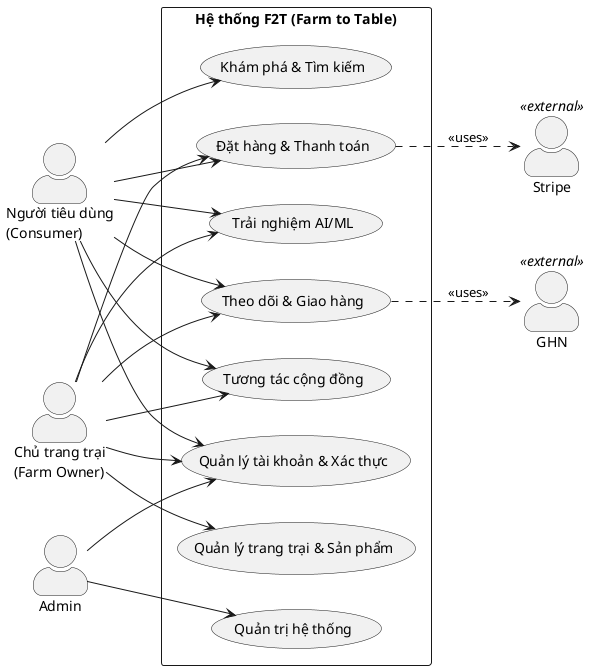

***Hình 2.2 — UC-02 — Phân rã "Đặt hàng và Thanh toán"***
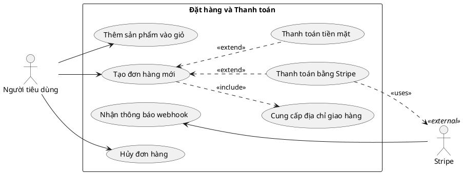

***Hình 2.3 — UC-03 — Phân rã "Quản lý sản phẩm"***
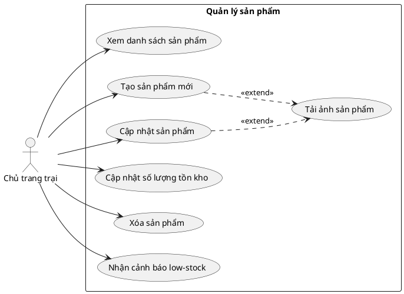

***Hình 2.4 — UC-04 — Phân rã "Quản lý trang trại"***
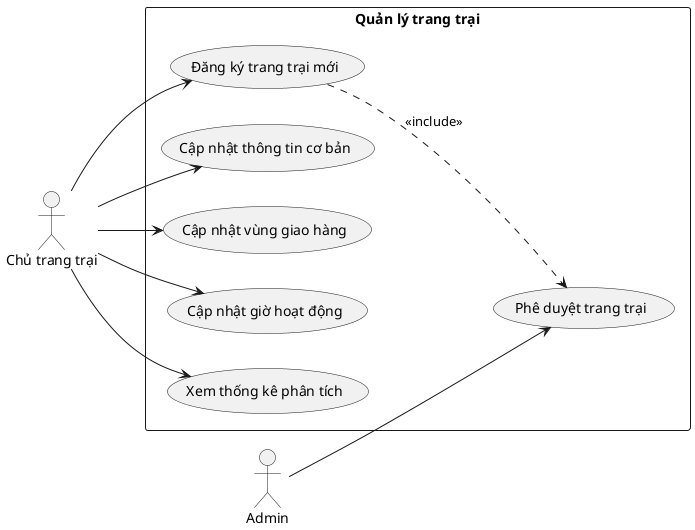

***Hình 2.5 — UC-05 — Phân rã "Theo dõi giao hàng"***
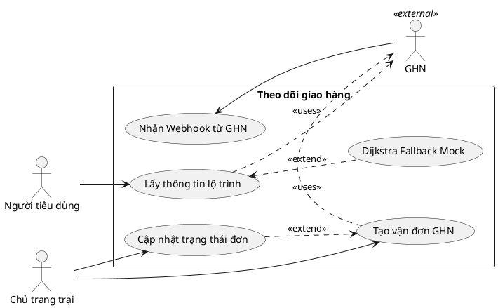

***Hình 2.6 — UC-06 — Phân rã "Quản lý Admin"***
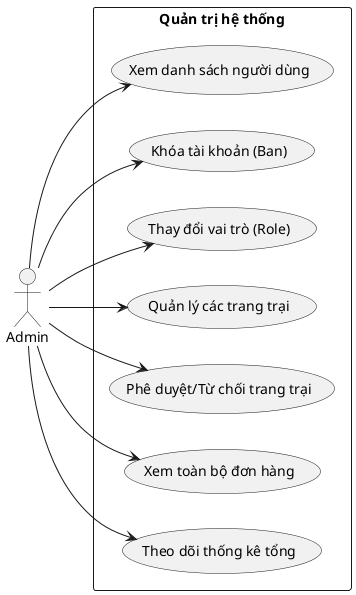

***Hình 2.7 — UC-07 — Phân rã "Tính năng AI/ML"***
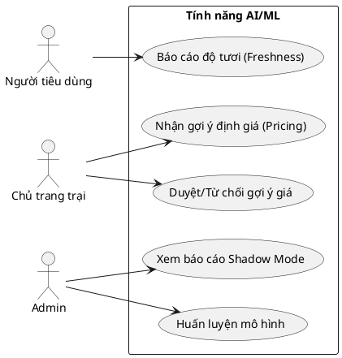

### 2.7 Đặc tả use case chi tiết

Phần này đặc tả chi tiết luồng thực thi của các use case quan trọng nhất theo mẫu đặc tả use case chuẩn: mã UC và độ phức tạp, mô tả, tác nhân, tiền điều kiện, hậu điều kiện (thành công/lỗi), và phần Đặc tả chức năng gồm luồng sự kiện chính và luồng phụ.

***Bảng 2.2 — Đặc tả use case UC#01 Đăng ký tài khoản***

| **UC#01** | **Đăng ký tài khoản** | **Độ phức tạp: Thấp** |
|---|---|---|
| **Mô tả** | Người dùng mới tạo tài khoản trên hệ thống F2T. ||
| **Tác nhân** | Người tiêu dùng, Chủ trang trại ||
| **Tiền điều kiện** | Ứng dụng kết nối mạng; người dùng chưa có tài khoản. ||
| **Hậu điều kiện** | **Thành Công:** Tài khoản được tạo; accessToken & refreshToken lưu vào MMKV; điều hướng vào giao diện chính. ||
| | **Lỗi:** Email đã tồn tại → 409 Conflict; hiển thị "Email đã được sử dụng". ||
| **ĐẶC TẢ CHỨC NĂNG** | | |
| **Luồng chính** | 1. Actor điền form: firstName, lastName, phoneNumber, email, password. 2. App gọi `POST /api/auth/register`. 3. ValidationPipe kiểm tra dữ liệu (whitelist, forbidNonWhitelisted). 4. Backend hash mật khẩu bằng `bcrypt` (10 rounds). 5. Lưu tài khoản mới vào collection `users`. 6. Trả về `accessToken` và `refreshToken`. ||
| **Luồng phụ** | 1. Email đã tồn tại → backend trả 409 Conflict → App báo "Email đã được sử dụng". ||


***Bảng 2.3 — Đặc tả use case UC#02 Đăng nhập***

| **UC#02** | **Đăng nhập** | **Độ phức tạp: Thấp** |
|---|---|---|
| **Mô tả** | Người dùng xác thực để truy cập hệ thống. ||
| **Tác nhân** | Người tiêu dùng, Chủ trang trại, Admin ||
| **Tiền điều kiện** | Tài khoản đã tồn tại; trạng thái không bị `isBanned`. ||
| **Hậu điều kiện** | **Thành Công:** Cấp JWT Bearer + refreshToken; lưu Zustand store và MMKV; thiết lập phiên đăng nhập. ||
| | **Lỗi:** Sai mật khẩu / tài khoản bị khóa → HttpException; interceptor trả `{ success: false, data: null, message }`. ||
| **ĐẶC TẢ CHỨC NĂNG** | | |
| **Luồng chính** | 1. Actor nhập email, password và bấm Đăng nhập. 2. App gửi `POST /api/auth/login`. 3. AuthService tìm user và so khớp hash `bcrypt`. 4. Ký và trả JWT (`JWT_SECRET`) + refreshToken (`JWT_REFRESH_SECRET`). 5. App lưu token vào Zustand + MMKV. ||
| **Luồng phụ** | 1. Mật khẩu sai hoặc `isBanned` → HttpException → envelope lỗi chuẩn hoá. ||


***Bảng 2.4 — Đặc tả use case UC#03 Đặt hàng***

| **UC#03** | **Đặt hàng** | **Độ phức tạp: Trung bình** |
|---|---|---|
| **Mô tả** | Người tiêu dùng tạo đơn hàng từ giỏ hàng. ||
| **Tác nhân** | Người tiêu dùng ||
| **Tiền điều kiện** | Đã đăng nhập; có sản phẩm trong giỏ hàng Zustand. ||
| **Hậu điều kiện** | **Thành Công:** Đơn được tạo với `status='pending'`; notification tự động gửi cho Chủ trang trại. ||
| | **Lỗi:** Sản phẩm hết hàng / không đủ số lượng → BadRequest, hủy giao dịch. ||
| **ĐẶC TẢ CHỨC NĂNG** | | |
| **Luồng chính** | 1. Consumer kiểm tra giỏ và điền địa chỉ giao. 2. App gọi `POST /api/orders`. 3. OrdersService nhúng cứng `items` snapshot (productName, pricePerUnit, unit, farmName). 4. Trừ `availableQuantity` của tồn kho. 5. Trả về Order document với `status='pending'`. ||
| **Luồng phụ** | 1. Hết hàng / không đủ số lượng → BadRequest → hủy đơn. ||


***Bảng 2.5 — Đặc tả use case UC#04 Thanh toán Stripe***

| **UC#04** | **Thanh toán Stripe** | **Độ phức tạp: Trung bình** |
|---|---|---|
| **Mô tả** | Thanh toán đơn hàng qua cổng Stripe Checkout (webhook là nguồn xác thực). ||
| **Tác nhân** | Người tiêu dùng, Stripe ||
| **Tiền điều kiện** | Đơn hàng vừa tạo thành công; `paymentMethod = 'stripe'`. ||
| **Hậu điều kiện** | **Thành Công:** `paymentStatus='paid'`; ghi `stripePaymentIntentId`; push "Thanh toán thành công". ||
| | **Lỗi:** Thoát trình duyệt / lỗi thẻ → webhook ghi nhận expired → `paymentStatus='failed'`. ||
| **ĐẶC TẢ CHỨC NĂNG** | | |
| **Luồng chính** | 1. App gọi `POST /api/payments/checkout` (orderId). 2. PaymentsService tạo Stripe Checkout Session (`currency: 'vnd'`, `metadata.orderId`). 3. Trả về `{ sessionId, url }`. 4. App dùng `expo-web-browser` mở trang thanh toán. 5. Consumer hoàn tất thanh toán bằng thẻ. 6. Stripe gọi ngược webhook `POST /api/payments/webhook`. 7. PaymentsService xác thực chữ ký (rawBody + `STRIPE_WEBHOOK_SECRET`), cập nhật `paymentStatus='paid'`. ||
| **Luồng phụ** | 1. `checkout.session.expired` → cập nhật `paymentStatus='failed'`. ||


***Bảng 2.6 — Đặc tả use case UC#05 Quản lý sản phẩm***

| **UC#05** | **Quản lý sản phẩm** | **Độ phức tạp: Trung bình** |
|---|---|---|
| **Mô tả** | Chủ trang trại tạo / cập nhật sản phẩm và tồn kho. ||
| **Tác nhân** | Chủ trang trại ||
| **Tiền điều kiện** | Đã đăng nhập role `'farm'`; trang trại có `verificationStatus = 'verified'`. ||
| **Hậu điều kiện** | **Thành Công:** Sản phẩm được lưu trữ, đánh chỉ mục text tự động để hỗ trợ tìm kiếm. ||
| | **Lỗi:** Thiếu quyền / không phải chủ sở hữu → ForbiddenException. ||
| **ĐẶC TẢ CHỨC NĂNG** | | |
| **Luồng chính** | 1. Farm truy cập danh mục kho. 2. Tạo / sửa sản phẩm qua `POST /api/products` hoặc `PUT /api/products/:id`. 3. Cập nhật `category`, `unit`, `status` (available, sold_out…). 4. (Tuỳ chọn) Upload ảnh qua `POST /api/uploads/image` (Cloudinary / local fallback). ||
| **Luồng phụ** | 1. `PATCH /api/products/:id/stock` đưa `availableQuantity` < 10 → cron đẩy cảnh báo `low_stock` cho chủ trang trại. ||


***Bảng 2.7 — Đặc tả use case UC#06 Theo dõi giao hàng***

| **UC#06** | **Theo dõi giao hàng** | **Độ phức tạp: Trung bình** |
|---|---|---|
| **Mô tả** | Theo dõi lộ trình của đơn hàng đang vận chuyển. ||
| **Tác nhân** | Người tiêu dùng, Chủ trang trại ||
| **Tiền điều kiện** | Đơn hàng có `status = 'shipped'`. ||
| **Hậu điều kiện** | **Thành Công:** Giao diện vẽ bản đồ lộ trình trực quan kèm `trackingSteps`. ||
| | **Lỗi:** GHN lỗi / không cấu hình → dùng dữ liệu mô phỏng (graceful degradation). ||
| **ĐẶC TẢ CHỨC NĂNG** | | |
| **Luồng chính** | 1. Farm chuyển trạng thái sang shipping → fire-and-forget `POST /api/delivery/orders/:orderId/create-shipment`. 2. Consumer mở màn hình tracking → `GET /api/delivery/orders/:orderId/tracking`. 3. DeliveryService lấy lộ trình thực tế từ GHN theo `ghnOrderCode`. 4. Trả về `trackingSteps` + `driverLocation`. ||
| **Luồng phụ** | 1. `GHN_TOKEN` rỗng → DeliveryService dùng Dijkstra mock trên mạng lưới đường HCMC. ||


***Bảng 2.8 — Đặc tả use case UC#07 Tính năng Định giá Động (AI/ML)***

| **UC#07** | **Gợi ý sản phẩm & Dự báo nhu cầu (AI/ML)** | **Độ phức tạp: Cao** |
|---|---|---|
| **Mô tả** | Nhận gợi ý định giá động và quản lý độ tươi thông qua AI sidecar. ||
| **Tác nhân** | Người tiêu dùng, Chủ trang trại, System (Cron) ||
| **Tiền điều kiện** | Sidecar (8000 pricing) sẵn sàng qua REST API. ||
| **Hậu điều kiện** | **Thành Công:** Gợi ý định giá được trả về và duyệt/áp dụng thành công. ||
| | **Lỗi:** Sidecar lỗi / timeout → sử dụng giá gốc. ||
| **ĐẶC TẢ CHỨC NĂNG** | | |
| **Luồng chính** | 1. (Farm) Nhận gợi ý giá. 2. (Farm) Cập nhật độ tươi. ||
| **Luồng phụ** | 1. Sidecar timeout -> Bỏ qua cập nhật giá. ||


---

## CHƯƠNG 3. THIẾT KẾ HỆ THỐNG

### 3.1 Thiết kế cơ sở dữ liệu

Trong kiến trúc của hệ thống F2T (Farm to Table), cơ sở dữ liệu đóng vai trò cốt lõi trong việc lưu trữ, quản lý và xử lý khối lượng lớn dữ liệu phi cấu trúc và bán cấu trúc liên quan đến các tác nhân tham gia (người tiêu dùng, nông trại), sản phẩm nông sản, các đơn hàng và các luồng thông tin gợi ý/dự báo. Hệ thống sử dụng hệ quản trị cơ sở dữ liệu NoSQL (MongoDB) để tối ưu hóa khả năng mở rộng ngang và linh hoạt trong thiết kế schema. Tất cả các phản hồi từ API đều tuân thủ định dạng gói gọn (response envelope) nghiêm ngặt bao gồm cấu trúc: `{ success, data, message? }`, và các danh sách dữ liệu được phân trang theo chuẩn `{ items, total, page, limit, hasMore }`.

Tổng quan về các thực thể trong hệ thống được thể hiện qua 8 collection chính.

***Bảng 3.1 — Danh sách 10 collection***

| Tên Collection | Mục đích cốt lõi |
| :--- | :--- |
| `users` | Lưu trữ thông tin tài khoản người dùng, phân quyền (consumer/farm/admin) và định danh. |
| `farms` | Quản lý thông tin chi tiết của nông trại, vị trí địa lý (GeoJSON) và trạng thái xác thực. |
| `products` | Lưu trữ danh mục nông sản, trạng thái tồn kho, định giá và thuộc tính sản phẩm. |
| `orders` | Quản lý vòng đời đơn hàng, tích hợp snapshot dữ liệu sản phẩm tại thời điểm đặt hàng. |
| `posts` | Nền tảng mạng xã hội thu nhỏ cho phép chia sẻ bài viết, video, hình ảnh nông sản. |
| `notifications` | Quản lý các thông báo đẩy, cảnh báo tồn kho và gợi ý giá cho người dùng. |
| `price_overrides` | Lưu trữ các đề xuất điều chỉnh giá tự động từ sidecar AI (Dynamic Pricing). |
| `freshness_cache` | Lưu trữ bộ đệm về điểm số độ tươi của sản phẩm nông sản (Freshness Score). |

Dưới đây là chi tiết thiết kế các collection theo tiêu chuẩn lưu trữ của MongoDB.

***Bảng 3.2 — Thiết kế collection users***

| Trường dữ liệu (Field) | Kiểu dữ liệu | Ràng buộc / Mặc định | Mô tả chi tiết |
| :--- | :--- | :--- | :--- |
| `email` | String | unique: true, required: true | Địa chỉ email của người dùng, dùng làm định danh đăng nhập. |
| `password` | String | required: true, select: false | Mật khẩu đã được mã hóa (bcrypt), không trả về mặc định. |
| `role` | String | enum: ['consumer', 'farm', 'admin'] | Vai trò của tài khoản trong hệ thống. |
| `status` | String | enum: ['active', 'suspended', 'pending'] | Trạng thái hoạt động của tài khoản. |
| `location.coordinates` | Array[Number] | [longitude, latitude] | Tọa độ địa lý của người dùng để tính toán khoảng cách. |
| `refreshToken` | String | select: false | Token dùng để cấp lại JWT, ẩn khỏi các truy vấn thông thường. |
| `pushToken` | String | select: false | Token dùng cho dịch vụ Expo Push Notification. |
| `emailVerified` | Boolean | default: false | Đánh dấu email đã được xác minh hay chưa. |
| `phoneVerified` | Boolean | default: false | Đánh dấu số điện thoại đã được xác minh hay chưa. |
| `isBanned` | Boolean | default: false | Cờ đánh dấu tài khoản bị cấm khỏi hệ thống. |

***Bảng 3.3 — Thiết kế collection farms***

| Trường dữ liệu (Field) | Kiểu dữ liệu | Ràng buộc / Mặc định | Mô tả chi tiết |
| :--- | :--- | :--- | :--- |
| `ownerId` | ObjectId | ref: 'users' | Khóa ngoại liên kết tới người dùng (farm owner). |
| `location` | Object | kiểu GeoJSON Point | Dùng index `2dsphere` để truy vấn không gian. |
| `address` | String | required: true | Địa chỉ chi tiết của nông trại. |
| `verificationStatus` | String | enum: ['pending', 'verified', 'rejected'] | Trạng thái xác thực hồ sơ bởi Admin. |
| `deliveryMethods` | Array[String] | - | Các phương thức giao hàng hỗ trợ (ví dụ: GHN, tự giao). |
| `isActive` | Boolean | default: true | Cờ kích hoạt/vô hiệu hóa tạm thời nông trại. |
| *(Index)* | Text Index | `name_text_description_text` | Hỗ trợ truy vấn full-text search trên tên và mô tả. |

***Bảng 3.4 — Thiết kế collection products***

| Trường dữ liệu (Field) | Kiểu dữ liệu | Ràng buộc / Mặc định | Mô tả chi tiết |
| :--- | :--- | :--- | :--- |
| `farmId` | ObjectId | ref: 'farms', required: true | Khóa ngoại chỉ định nông sản thuộc nông trại nào. |
| `category` | String | enum: ['vegetable', 'fruit', 'meat', 'dairy', ...] | Phân loại danh mục nông sản. |
| `pricePerUnit` | Number | min: 0, required: true | Đơn giá cho mỗi đơn vị đo lường. |
| `unit` | String | enum: ['kg', 'g', 'box', 'piece', 'bundle'] | Đơn vị tính của sản phẩm. |
| `availableQuantity` | Number | min: 0 | Số lượng khả dụng hiện tại trong kho. |
| `status` | String | enum: ['available', 'sold_out', 'unavailable', 'seasonal'] | Trạng thái bán hàng của nông sản. |
| `isOrganic` | Boolean | default: false | Chứng nhận nông sản hữu cơ. |
| *(Indexes)* | Compound | `{ farmId: 1, category: 1 }`, ... | Đánh chỉ mục tối ưu hóa cho truy vấn lọc sản phẩm. |

***Bảng 3.5 — Thiết kế collection orders***

| Trường dữ liệu (Field) | Kiểu dữ liệu | Ràng buộc / Mặc định | Mô tả chi tiết |
| :--- | :--- | :--- | :--- |
| `orderNumber` | String | unique: true | Mã đơn hàng định danh duy nhất (ví dụ: F2T-XXX). |
| `customerId` | ObjectId | ref: 'users' | ID của người mua hàng (không dùng consumerId). |
| `farmId` | ObjectId | ref: 'farms' | ID của nông trại cung cấp đơn hàng này. |
| `items` | Array[Object] | Snapshot lưu trữ vĩnh viễn | Gồm: `productId`, `productName`, `productImage`, `quantity`, `pricePerUnit`, `unit`, `totalPrice`, `farmId`, `farmName`. Thiết kế dạng snapshot để bảo toàn dữ liệu khi sản phẩm đổi giá. |
| `status` | String | enum: 7 states (pending, confirmed, preparing, ready_for_pickup, shipped, delivered, cancelled) | Trạng thái vòng đời hiện tại của đơn hàng. |
| `paymentStatus` | String | enum: ['unpaid', 'paid', 'refunded'] | Trạng thái thanh toán của đơn hàng. |
| `paymentMethod` | String | enum: ['cash', 'stripe'] | Hình thức thanh toán người dùng lựa chọn. |
| `stripeSessionId` | String | unique: true, sparse: true | Mã phiên thanh toán liên kết với Stripe Checkout. |
| `ghnOrderCode` | String | unique: true, sparse: true | Mã vận đơn cấp bởi Giao Hàng Nhanh (nếu có). |
| `trackingSteps` | Array[Object] | - | Lịch sử các bước trung chuyển trong quá trình vận chuyển. |
| `timeline` | Array[Object] | - | Dấu thời gian cho từng lần cập nhật trạng thái đơn hàng. |

***Bảng 3.6 — Thiết kế collection posts***

| Trường dữ liệu (Field) | Kiểu dữ liệu | Ràng buộc / Mặc định | Mô tả chi tiết |
| :--- | :--- | :--- | :--- |
| `authorId` | ObjectId | ref: 'users' | Định danh tác giả bài viết. |
| `authorRole` | String | enum: ['consumer', 'farm'] | Lưu trực tiếp vai trò tác giả để hạn chế join bảng. |
| `media` | Array[Object] | chứa `url`, `type` (image/video) | Danh sách tài nguyên đa phương tiện đính kèm bài viết. |
| `tags` | Array[String] | - | Thẻ phân loại (hashtag) hỗ trợ tìm kiếm. |
| `comments` | Array[Object] | - | Danh sách bình luận nhúng (embedded comments). |
| `likesCount` | Number | default: 0 | Tổng số lượt thích của bài viết. |

***Bảng 3.7 — Thiết kế collection notifications***

| Trường dữ liệu (Field) | Kiểu dữ liệu | Ràng buộc / Mặc định | Mô tả chi tiết |
| :--- | :--- | :--- | :--- |
| `userId` | ObjectId | ref: 'users' | Định danh người nhận thông báo. |
| `type` | String | enum: ['price_suggestion', 'low_stock', 'order_update', ...] | Phân loại thông báo hệ thống. |
| `isRead` | Boolean | default: false | Đánh dấu người dùng đã đọc thông báo hay chưa. |
| `pushSent` | Boolean | default: false | Cờ xác nhận đã gửi push thành công qua Expo chưa. |

***Bảng 3.8 — Thiết kế collection price_overrides***

| Trường dữ liệu (Field) | Kiểu dữ liệu | Ràng buộc / Mặc định | Mô tả chi tiết |
| :--- | :--- | :--- | :--- |
| `productId` | ObjectId | ref: 'products' | Sản phẩm được áp dụng thay đổi giá. |
| `farmId` | ObjectId | ref: 'farms' | Nông trại sở hữu sản phẩm. |
| `basePrice` | Number | required: true | Giá cơ bản ban đầu của sản phẩm. |
| `targetPrice` | Number | required: true | Giá đích do hệ thống DynamicPricing đề xuất. |
| `deltaPct` | Number | - | Tỉ lệ phần trăm chênh lệch (thay đổi). |
| `freshnessScore` | Number | min: 0, max: 1 | Điểm độ tươi tính toán được từ AI Vision. |
| `freshnessTag` | String | enum: ['fresh', 'aging', 'critical'] | Nhãn phân loại độ tươi của nông sản. |
| `safetyClipped` | Boolean | default: false | Cờ đánh dấu giá đề xuất bị giới hạn biên độ an toàn. |
| `mode` | String | enum: ['shadow', 'advisory'] | Chế độ chạy: ẩn (đánh giá model) hay gợi ý cho nông trại. |
| `status` | String | enum: ['shadow', 'pending_review', 'accepted', 'rejected', 'expired'] | Trạng thái phê duyệt của đề xuất. |
| `expiresAt` | Date | chỉ mục TTL | Thời điểm hết hạn của đề xuất để tự dọn dẹp bộ nhớ. |
| *(Index)* | Compound | `{ productId: 1, status: 1 }` | Hỗ trợ truy vấn nhanh các đề xuất đang chờ. |

***Bảng 3.9 — Thiết kế collection freshness_cache***

| Trường dữ liệu (Field) | Kiểu dữ liệu | Ràng buộc / Mặc định | Mô tả chi tiết |
| :--- | :--- | :--- | :--- |
| `productId` | ObjectId | unique: true | Mã sản phẩm được cache điểm số độ tươi. |
| `readings` | Array[Object] | max length: 5 | Mảng lưu trữ tối đa 5 lần quét gần nhất `{score, scannedAt}`. |
| `medianScore` | Number | default: 0.7 | Điểm trung vị đại diện độ tươi, mặc định 0.7 (bình thường). |
| `expiresAt` | Date | = updatedAt + 6h (TTL) | Cơ chế TTL tự động xóa cache sau 6 giờ cập nhật. |

***Bảng 3.10 — Thiết kế collection recommendation_caches***

| Trường dữ liệu (Field) | Kiểu dữ liệu | Ràng buộc / Mặc định | Mô tả chi tiết |
| :--- | :--- | :--- | :--- |
| `key` | String | unique: true | Khóa cache, thường gồm `userId` và ngữ cảnh. |
| `productIds` | Array[ObjectId] | - | Danh sách các ID nông sản được hệ thống AI gợi ý. |
| `expiresAt` | Date | chỉ mục TTL | Hạn sử dụng của cache gợi ý cá nhân hóa. |

***Bảng 3.11 — Thiết kế collection forecast_caches***

| Trường dữ liệu (Field) | Kiểu dữ liệu | Ràng buộc / Mặc định | Mô tả chi tiết |
| :--- | :--- | :--- | :--- |
| `key` | String | unique: true | Khóa định danh của chuỗi dự báo (theo farm/product). |
| `forecasts` | Array[Object] | - | Các điểm dữ liệu dự đoán nhu cầu tiêu thụ trong tương lai. |
| `expiresAt` | Date | chỉ mục TTL | Hạn sử dụng của dữ liệu dự báo. |

**Mô tả quan hệ thực thể (ER - Entity Relationship):**
Hệ thống F2T được thiết kế theo tư duy của NoSQL, cân bằng giữa việc chuẩn hóa (Normalization) và phi chuẩn hóa (Denormalization) dựa trên tần suất truy cập dữ liệu (Read/Write ratio).
Quan hệ giữa `User` và `Farm` là quan hệ Một-Nhiều (1-N), trong đó một `User` với vai trò là chủ trại (role `farm`) có thể sở hữu nhiều `Farm` (dù thực tế quy trình nghiệp vụ giới hạn 1-1, nhưng thiết kế database hỗ trợ mở rộng). `Farm` chứa `ownerId` để trỏ ngược lại `User`.
Quan hệ giữa `Farm` và `Product` là 1-N. Mỗi sản phẩm bắt buộc phải tham chiếu đến một `farmId`.
Quan hệ giữa `User` (người tiêu dùng) và `Product` bản chất là Nhiều-Nhiều (N-N), nhưng được biểu diễn gián tiếp thông qua `Order`. Đặc biệt, thay vì chuẩn hóa mạnh (lưu khóa ngoại `productId` trong `Order` và phải join bảng khi truy vấn), hệ thống F2T áp dụng kỹ thuật Embedded Document. Trường `items` trong collection `orders` lưu trữ **bản sao snapshot** của sản phẩm (bao gồm `productId`, `productName`, `productImage`, `pricePerUnit`, v.v.) ngay tại thời điểm đặt hàng. Quyết định kỹ thuật này tạo ra sự tách biệt (decoupling) hoàn hảo: nếu nông trại thay đổi giá hoặc tên sản phẩm sau đó, lịch sử đơn hàng của người mua vẫn giữ nguyên vẹn thông tin tài chính cũ, đảm bảo tính nhất quán kế toán và pháp lý.
Các collection như `price_overrides` và `freshness_cache` sử dụng TTL (Time-To-Live) index để hỗ trợ tính chất tạm thời của dữ liệu sinh ra bởi các sidecar AI, tự động giải phóng dung lượng theo vòng đời.

### 3.2 Biểu đồ tuần tự (Sequence Diagrams)

Kiến trúc API của hệ thống áp dụng tiêu chuẩn NestJS với các Guard và Interceptor chặt chẽ. Cơ chế xác thực dựa vào JWT (JSON Web Token) truyền qua header dạng Bearer. Ứng dụng di động lưu trữ token an toàn trong MMKV thay vì cookie.

Quá trình xác thực bắt đầu khi người dùng trên di động gửi yêu cầu, server sẽ ký và cấp phát các token tương ứng.
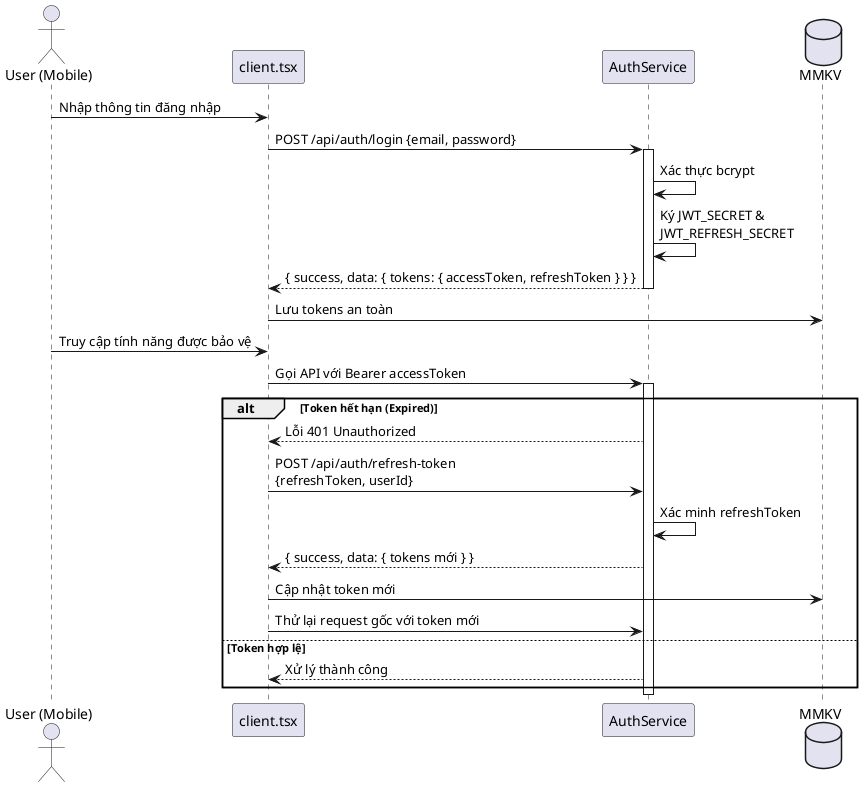
***Hình 3.1 — Tuần tự: SD-01 Đăng nhập & làm mới JWT***

Quy trình đăng ký tài khoản yêu cầu mã hóa mật khẩu một chiều trước khi lưu trữ.
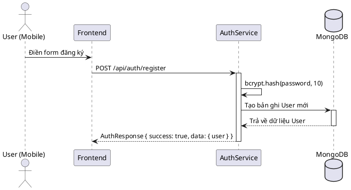
***Hình 3.2 — Tuần tự: SD-02 Đăng ký tài khoản***

Luồng tìm kiếm nông sản lân cận được chia làm 2 giai đoạn (2-stage query) nhằm khai thác sức mạnh của hệ tọa độ GeoJSON. Đầu tiên truy vấn các nông trại gần vị trí thiết bị thông qua `$near`, sau đó mới lấy sản phẩm.
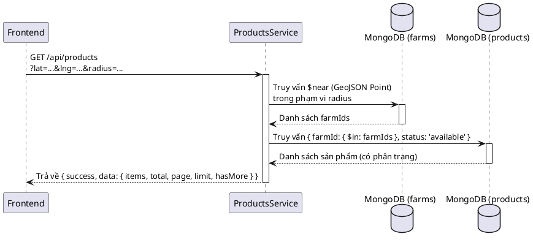
***Hình 3.3 — Tuần tự: SD-03 Tìm kiếm sản phẩm theo vị trí không gian***

Quá trình tạo đơn hàng thể hiện rõ kỹ thuật snapshot đã đề cập ở phần thiết kế dữ liệu. Tồn kho được trừ ngay lập tức khi đơn hàng xác nhận thành công.
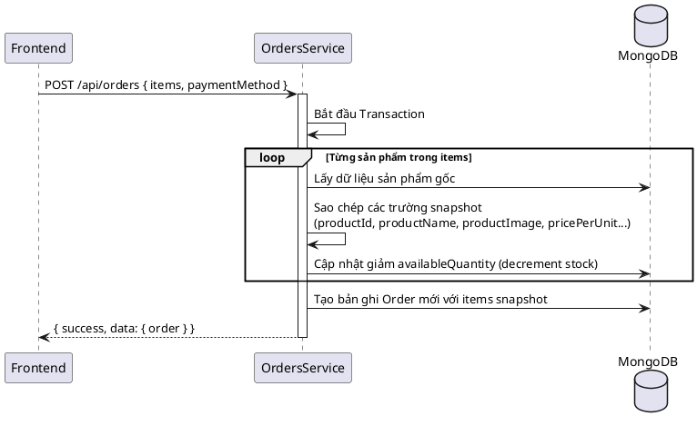
***Hình 3.4 — Tuần tự: SD-04 Tạo đơn hàng và cập nhật snapshot***

Đối với thanh toán không tiền mặt, F2T tích hợp Stripe. Kiến trúc chọn Webhook làm nguồn sự thật (Authoritative Source) để xác nhận thanh toán thay vì phản hồi trực tiếp từ giao diện để ngăn chặn các gian lận từ phía client.
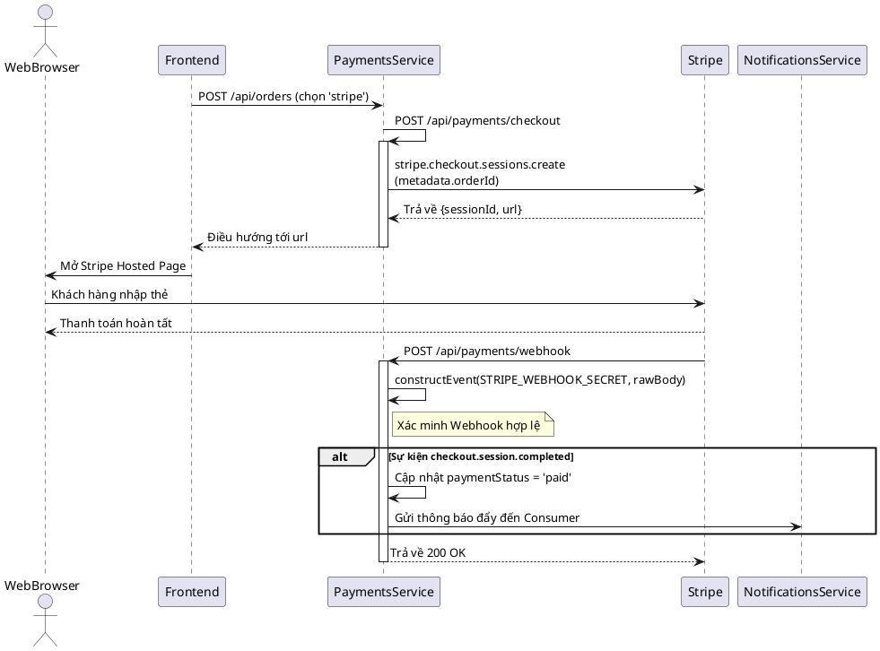
***Hình 3.5 — Tuần tự: SD-05 Thanh toán Stripe Checkout***

Để xử lý logic giao hàng phức tạp ở quy mô toàn quốc, dịch vụ giao hàng sử dụng Giao Hàng Nhanh (GHN). Trong môi trường phát triển (không có cấu hình `GHN_TOKEN`), hệ thống tự động fallback sử dụng thuật toán Dijkstra đóng vai trò như một Mock Route.
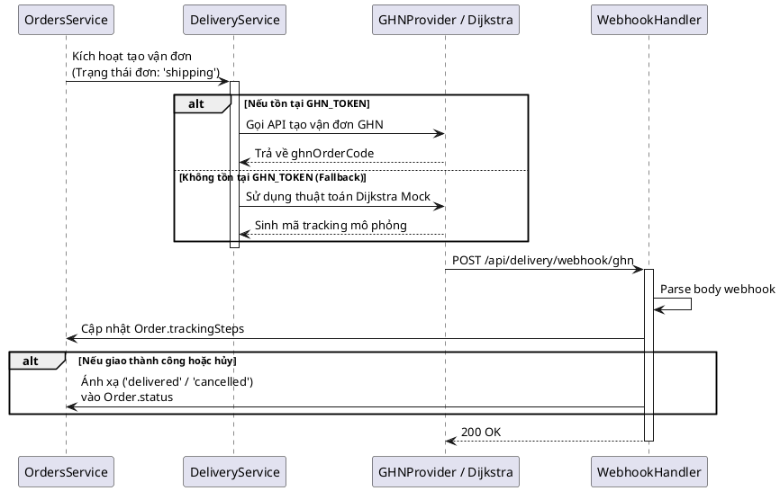
***Hình 3.6 — Tuần tự: SD-06 Tạo vận đơn GHN và xử lý Webhook***

Quá trình tra cứu vị trí trực tiếp cho phép người mua theo dõi bưu kiện. Tọa độ tuyến đường trả về sẽ được dùng để vẽ MapView trên ứng dụng React Native.
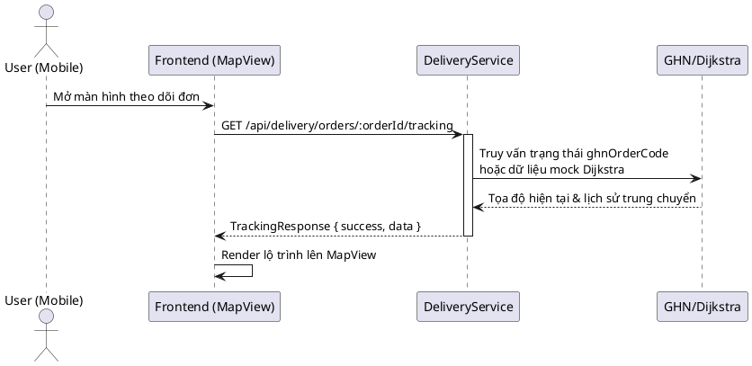
***Hình 3.7 — Tuần tự: SD-07 Theo dõi giao hàng***

Hệ thống cung cấp cơ chế thông báo đẩy (Push Notifications) toàn diện, bao gồm thông báo sự kiện thời gian thực và các kịch bản định kỳ (cron jobs). Nổi bật là tiến trình kiểm tra hàng tồn kho lúc nửa đêm.
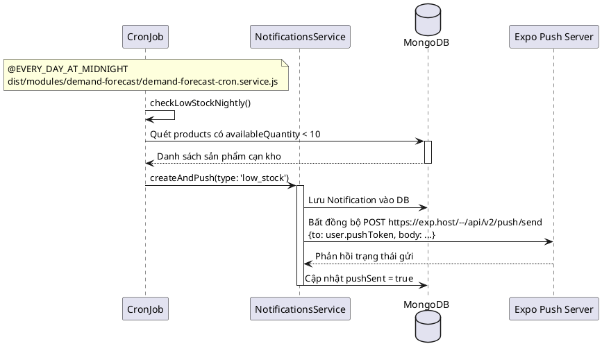
***Hình 3.8 — Tuần tự: SD-08 Thông báo đẩy và tác vụ quét tự động***

Chức năng kiểm duyệt trang trại bởi quản trị viên (Admin) được phân quyền chặt chẽ thông qua các Guard của framework NestJS.
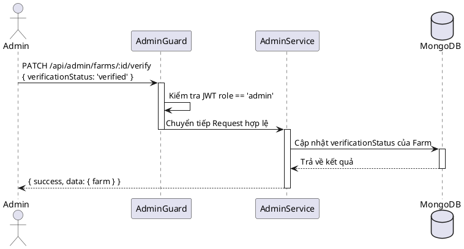
***Hình 3.9 — Tuần tự: SD-09 Admin xác thực hồ sơ trang trại***

### 3.3 Biểu đồ hoạt động (Activity Diagrams)

Biểu đồ hoạt động làm rõ các quy trình và sự chuyển đổi trạng thái (state transition) nội bộ của từng thực thể quan trọng trong hệ thống. Vòng đời của một đơn hàng nông sản bao gồm 7 trạng thái chuẩn.
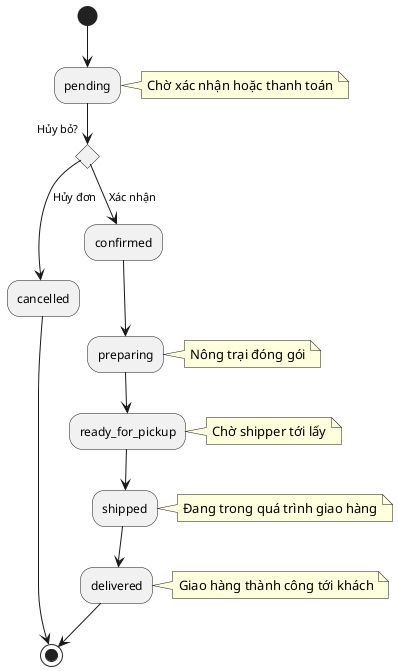
***Hình 3.10 — Hoạt động: AD-01 Vòng đời trạng thái đơn hàng***

Cơ chế xử lý Token vòng lặp đảm bảo người dùng có trải nghiệm liền mạch không bị văng khỏi ứng dụng khi phiên bản ngắn hạn (Access Token) hết hạn.
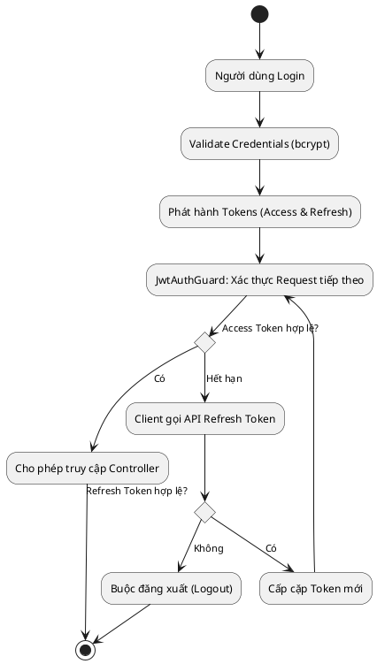
***Hình 3.11 — Hoạt động: AD-02 Quy trình xác thực JWT vòng lặp***

Việc đăng ký của nông trại đòi hỏi tính minh bạch cao nên luôn trải qua quá trình chờ phê duyệt nhân công từ phía hệ thống quản trị nội bộ.
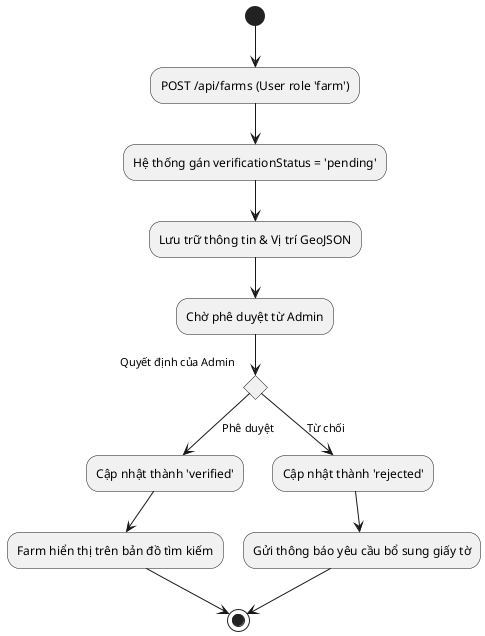
***Hình 3.12 — Hoạt động: AD-03 Đăng ký và xác thực hồ sơ trang trại***

Nông trại quản lý thông tin sản phẩm và cập nhật liên tục các biến động tồn kho. Nếu dưới ngưỡng an toàn, hệ thống sẽ kích hoạt luồng cảnh báo tự động.
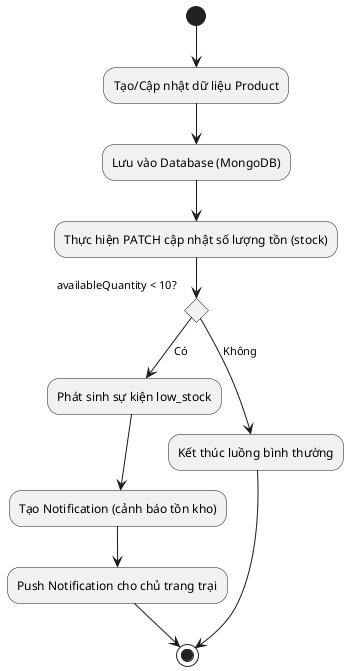
***Hình 3.13 — Hoạt động: AD-04 Quản lý sản phẩm và cảnh báo tồn kho***

### 3.4 Kiến trúc triển khai hệ thống

Hệ thống F2T được thiết kế theo tư tưởng Microservices mô phỏng thông qua kiến trúc Sidecar (Sidecar pattern). Tại phần lõi, ứng dụng di động React Native giao tiếp chặt chẽ với backend NestJS trung tâm (chạy tại cổng 3000), đây là nơi xử lý các nghiệp vụ (business logic) cốt lõi như đơn hàng, thanh toán, phân quyền và giao hàng. Gắn liền với backend trung tâm là module AI chuyên biệt chạy độc lập dưới dạng sidecar: Pricing Sidecar ở cổng 8000 tính toán định giá động (Dynamic Pricing).
Lợi thế của kiến trúc sidecar là hệ thống AI, vốn viết bằng Python/C++ cần nhiều tài nguyên tính toán tensor, có thể phát triển và mở rộng (scale) độc lập với cụm xử lý API Node.js/NestJS. Các sidecar giao tiếp với NestJS qua mạng nội bộ và ghi kết quả tính toán vào các bảng cache (như `price_overrides` hay `forecast_caches`) của MongoDB. Để phục vụ giao tiếp ngoại vi, NestJS sẽ gọi tới Stripe cho thanh toán thẻ, GHN cho lộ trình vận chuyển, Cloudinary để phân phối hình ảnh bài viết (`POST /api/posts/add`) và Expo Push cho việc đẩy thông báo thời gian thực.
Biểu đồ dưới đây mô tả sự tương tác ở thời gian thực (runtime) của toàn bộ cụm kiến trúc triển khai.

```plantuml
@startuml
box "Client Tier" #LightBlue
participant "React Native App" as Mobile
end box

box "Core Backend Tier" #LightGreen
participant "NestJS API (:3000)" as API
database "MongoDB (:27017)" as DB
end box

box "AI Sidecar Tier" #LightYellow
participant "pricing-sidecar (:8000)" as Pricing
end box

box "External Services" #LightGray
participant "Stripe" as Stripe
participant "GHN" as GHN
participant "Expo Push" as Expo
participant "Cloudinary" as Cloudinary
end box

' Flow cơ bản
Mobile -> API: Gọi REST API (/api/*)
activate API
API <-> DB: Đọc/Ghi dữ liệu (CRUD)

' Sidecar giao tiếp
API -> Pricing: Truy vấn DynamicPricingInterceptor
Pricing --> API: Đề xuất price_overrides

' Dịch vụ ngoài
API -> Stripe: Thanh toán qua Stripe Checkout
Stripe --> API: Webhook xác nhận thanh toán

API -> GHN: Tạo mã vận đơn / Lấy lộ trình
GHN --> API: Tọa độ vận chuyển

Mobile -> Cloudinary: Trực tiếp upload ảnh (hoặc qua API)
Cloudinary --> Mobile: URL Ảnh lưu vào bài viết

API -> Expo: Đẩy tin nhắn Notification
Expo --> Mobile: Hiển thị Push Notification trên máy

deactivate API
@enduml
```
***Hình 3.14 — Tuần tự: AD-05 Tương tác hệ thống phân tán và các thành phần Sidecar***


---

## CHƯƠNG 4. CÀI ĐẶT, THỬ NGHIỆM

### 4.1. Thư viện và công cụ sử dụng

Để triển khai toàn vẹn hệ thống Farm to Table (F2T) theo đúng kiến trúc microservices kết hợp sidecar (bao gồm backend core xử lý nghiệp vụ và các sidecar Python phục vụ cho tính năng AI/ML), dự án đã lựa chọn và sử dụng một danh sách các thư viện và công cụ chuyên biệt. Tất cả đều được cập nhật lên phiên bản ổn định mới nhất, đảm bảo tính bảo mật, hiệu năng và khả năng mở rộng trong môi trường sản xuất thực tế. 

Đối với phía máy chủ (Backend), ứng dụng phân tách rõ ràng thành hai phần: Core Backend sử dụng hệ sinh thái Node.js/NestJS và Machine Learning Sidecars sử dụng hệ sinh thái Python. 

***Bảng 4.1 — Thư viện & công cụ Backend***

| Phân loại | Thư viện/Công cụ | Mục đích sử dụng |
|---|---|---|
| **Core Framework** | NestJS 11, TypeScript 5.7 | Xây dựng API RESTful theo kiến trúc module, quản lý Dependency Injection và luồng vòng đời ứng dụng. |
| **Cơ sở dữ liệu** | Mongoose | Lớp ODM giao tiếp với MongoDB, định nghĩa schema, xử lý các hàm virtual, pre/post hooks và schema validation. |
| **Xác thực & Bảo mật**| passport-jwt, bcrypt | Triển khai xác thực qua JWT Bearer token và băm mật khẩu người dùng với 10 vòng salt để lưu trữ an toàn. |
| **Bảo vệ hệ thống** | @nestjs/throttler | Giới hạn số lượng request (Rate limiting) cho các endpoint nhạy cảm như đăng nhập, quên mật khẩu nhằm chống spam. |
| **Tích hợp ngoài** | stripe | Giao tiếp với Stripe API để tạo Checkout Sessions và xử lý, xác thực toàn bộ sự kiện từ webhooks. |
| **Tác vụ ngầm** | @nestjs/schedule | Khởi chạy các cron jobs hệ thống theo giờ và nửa đêm (như quét tồn kho thấp, gửi thông báo push, kích hoạt tiến trình định giá động). |
| **Validation** | class-validator | Ràng buộc và xác thực dữ liệu đầu vào dựa trên cấu trúc DTO (Data Transfer Object) với chế độ whitelist bảo vệ payload. |
| **Tài liệu API** | Swagger | Tự động sinh tài liệu cấu trúc OpenAPI cung cấp tại endpoint `/api-docs` cho mục đích tích hợp và kiểm thử. |
| **ML Framework** | FastAPI, uvicorn | Xây dựng sidecar độc lập với hiệu suất cao nhất chạy song song trên nền Python ASGI. |
| **ML Libraries** | PyTorch, numpy, scikit-learn, scipy | Tiền xử lý dữ liệu Dunnhumby, xây dựng và huấn luyện mô hình Double-DQN (và đối chứng TD3). |
| **ML Database** | motor | Driver MongoDB bất đồng bộ cho phép các sidecar load trực tiếp dữ liệu (orders, products) không cần đi vòng qua backend. |

Về phía ứng dụng di động đa nền tảng (Frontend), hệ sinh thái React Native và Expo được ứng dụng triệt để cùng với các thư viện quản lý trạng thái, fetching dữ liệu tối ưu nhất hiện nay.

***Bảng 4.2 — Thư viện & công cụ Frontend***

| Thư viện/Công cụ | Mục đích sử dụng |
|---|---|
| Expo SDK 53 | Framework gốc mạnh mẽ nhất của React Native hỗ trợ môi trường xây dựng ứng dụng (EAS Build), biên dịch và chạy trên nền tảng di động. |
| expo-router | Cung cấp file-based routing hiện đại để điều hướng trực quan, dễ bảo trì theo cấu trúc thư mục giữa các màn hình ứng dụng. |
| axios | HTTP Client xử lý các giao thức RESTful gọi tới cấu trúc API của Backend, đính kèm luồng JWT interceptor hỗ trợ làm mới token động (401 catch). |
| zustand | Công cụ quản lý global state siêu nhẹ, hiệu suất cao dùng trong Store cho tiến trình xác thực (Auth) và thao tác Giỏ hàng (Cart). |
| react-native-mmkv | Giải pháp lưu trữ key-value cục bộ đồng bộ siêu tốc, dùng để lưu trữ JWT tokens một cách tối ưu và không tạo độ trễ. |
| @tanstack/react-query + react-query-kit | Quản lý server state, bao bọc luồng fetching, hỗ trợ logic fallback, caching dữ liệu ML thời gian thực và quản lý các infinite queries. |
| nativewind | Hệ thống styling khai báo thông minh dựa trên logic Tailwind CSS, tự động chuyển đổi class components thành style prop của React Native. |
| react-native-maps | Triển khai giao diện bản đồ động tương tác, dùng để hiển thị điểm ghim Farm, theo dõi tọa độ tài xế thời gian thực và lộ trình MapView. |
| expo-web-browser | Cung cấp module trình duyệt in-app (In-App Browser) vô cùng bảo mật dùng để redirect an toàn tới trang thanh toán Hosted Page của Stripe. |

### 4.2. Môi trường thử nghiệm

Quá trình chạy và kiểm thử hệ thống F2T đòi hỏi một môi trường cấu hình chính xác, phản ánh sát với các thành phần thực tế trong mô hình microservices trên production nhưng được tối ưu hóa để có thể chạy mượt mà theo cụm cục bộ trên một máy chủ phát triển (Local Development Environment).

**Yêu cầu môi trường cốt lõi:**
- **Node.js**: Phiên bản 20.x trở lên để đảm bảo khả năng tương thích toàn diện và hỗ trợ hiệu năng tốt nhất cho tiến trình của NestJS 11 và các native modules của Expo 53.
- **Cơ sở dữ liệu**: MongoDB 7 chạy nguyên bản (local instance), sử dụng cổng chuẩn mặc định 27017, thiết lập kết nối qua chuỗi URL nội bộ `mongodb://localhost:27017/f2t`.
- **Python**: Môi trường ảo (virtualenv) biệt lập chứa Python 3.10+ dành riêng cho cụm sidecar nhằm tránh xung đột package ML phức tạp.
- **Biến môi trường**: Toàn bộ cấu hình nhạy cảm được tập trung quản lý thông qua file `.env.development` ở thư mục backend và file `.env` đối với frontend.

**Cấu hình mạng LAN và dịch vụ phụ trợ:**
Vì ứng dụng di động sẽ được chạy trực tiếp trên thiết bị vật lý (hoặc máy ảo Android/iOS) và cần giao tiếp liên tục tới NestJS Backend trên máy tính cá nhân, nên thiết lập biến môi trường `UPLOAD_BASE_URL` bắt buộc phải được trỏ tới địa chỉ LAN IP cục bộ của máy tính phát triển (ví dụ: `http://192.168.1.15:3000`). Điều này nhằm bảo đảm toàn bộ hình ảnh upload (fallback cục bộ khi thiếu biến Cloudinary) sẽ load thành công lên thiết bị di động. Bên cạnh đó, nhằm nhận thông tin Webhook sự kiện thanh toán chính xác từ dịch vụ Stripe, tiến trình sẽ gọi lệnh hệ thống khởi chạy Stripe CLI qua cú pháp `stripe listen --forward-to localhost:3000/api/payments/webhook`, kết quả console sẽ sinh ra đoạn mã `STRIPE_WEBHOOK_SECRET` bắt buộc đặt vào file cấu hình gốc. Về mô-đun phân phối, Giao Hàng Nhanh (GHN) trong môi trường thử nghiệm không được khai báo `GHN_TOKEN`, từ đó tự động kích hoạt an toàn cơ chế fallback bên trong hệ thống sử dụng một thuật toán mô phỏng đồ thị không gian (Dijkstra) để giả lập sinh lộ trình đường đi liền mạch.

**Trình tự khởi động hệ thống (Start Order):**
Dựa trên kiến trúc chịu lỗi thu thập từ thiết kế mã nguồn hệ thống, để môi trường chạy đồng bộ không dính lỗi kết nối, quá trình khởi động phải tuân theo thứ tự phân tầng nghiêm ngặt:
1. **Khởi động MongoDB**: Khởi tạo tiến trình `mongod`, luôn đảm bảo cổng 27017 ở trạng thái listening (sẵn sàng phục vụ các luồng kết nối Mongoose và Motor).
2. **Khởi chạy ML Sidecars (Lớp lõi dữ liệu nâng cao)**: Kích hoạt độc lập song song uvicorn worker cho dịch vụ Machine Learning.
   - Dynamic Pricing Sidecar chạy thường trú tại cổng lưới `8000`.
3. **Khởi chạy Core Backend (Lớp nghiệp vụ API)**: Chạy lệnh `npm run start:dev` đối với dự án NestJS (mặc định tại cổng `3000`). Hệ thống boot sẽ lập tức thiết lập kết nối sâu tới MongoDB, ngay sau đó sẽ tự động ping HTTP đến các sidecar qua `PRICING_SIDECAR_URL`. Quá trình kiểm tra liên kết sẽ diễn ra đồng bộ nhằm đảm bảo các dịch vụ hoạt động chuẩn.
4. **Khởi chạy Frontend (Lớp giao diện người dùng)**: Dùng lệnh khởi tạo ứng dụng `npx expo start -c` kết nối vào Metro Bundler server, quét mã QR tải toàn bộ logic ứng dụng lên công cụ Expo Go hoặc trình duyệt ảo simulator, trỏ thẳng tới IP gốc API.

### 4.3. Tài khoản seed cho thử nghiệm

Nhằm tăng tốc độ đánh giá, thử nghiệm UI UX và kiểm thử tự động các luồng nghiệp vụ phức tạp của nền tảng (chẳng hạn như theo dõi tình trạng thanh toán hay độ hội tụ AI gợi ý đồ thị), hệ thống backend trang bị sẵn một script tạo lập và cấu trúc dữ liệu (`src/seed/seed.ts`). Khi lập trình viên chạy lệnh khởi tạo `npm run seed`, hệ thống sẽ tự động quét và xóa hoàn toàn, sạch sẽ các thực thể dư thừa cũ (thông qua truy vấn lọc thuộc tính `_seeded: true`) – tạo ra trạng thái khởi tạo idempotent vô cùng chuẩn mực và an toàn, cách ly hoàn toàn dữ liệu. 

Ngay sau quá trình dọn dẹp, tiến trình bootstrap tiến hành bơm trực tiếp vào cơ sở dữ liệu hệ thống các cấp bậc tài khoản thiết yếu theo tiêu chuẩn:

***Bảng 4.3 — Tài khoản seed***

| Vai trò người dùng | Email đăng nhập | Mật khẩu truy cập | Ghi chú tài khoản |
|---|---|---|---|
| **Quản trị viên (Admin)** | admin@f2t.com | AdminF2T2026! | Sở hữu quyền hạn AdminGuard, kiểm soát toàn hệ thống, duyệt trang trại. |
| **Chủ trang trại (Farm)** | farm1@f2t.vn đến farm3@f2t.vn | SeedPass123! | Đã được xác thực hệ thống (`verified`), tạo sẵn mặt hàng thực tế. |
| **Khách hàng (Consumer)** | consumer1@f2t.vn đến consumer5@f2t.vn | SeedPass123! | Tài khoản đang kích hoạt, có gắn lịch sử tương tác và mua bán để ML sinh model. |
| **Tài khoản vi phạm** | suspended@f2t.vn | SeedPass123! | Tài khoản giả lập phục vụ kiểm tra hệ thống chặn, bắt exception khi `status='suspended'`. |

Luồng kịch bản tạo dữ liệu này cũng chủ động sinh sẵn chính xác 15 danh mục sản phẩm phức tạp, 8 đơn hàng trải dài ở các trạng thái khác nhau (từ `pending`, `confirmed`, đến `shipped` và `cancelled`), đồng thời bổ sung 5 mẫu bài đăng (posts) để làm phong phú, đa dạng hóa giao diện khi lướt feed trải nghiệm cộng đồng. Các thao tác đều đồng nhất trong một lần chạy lệnh.

### 4.4. Kết quả kiểm thử

Hệ thống Core Backend F2T được viết unit test bao phủ toàn bộ các class và dịch vụ (service) cốt lõi của phần mềm. Để đảm bảo độc lập dữ liệu tuyệt đối (không chạm hoặc vô tình chỉnh sửa cơ sở dữ liệu thật), hệ thống đã được tích hợp thư viện mạnh mẽ `mongodb-memory-server` nhằm tự động dựng một instance MongoDB hoàn toàn trong bộ nhớ (in-memory) chỉ dành riêng cho tiến trình test. Quá trình chạy thực địa qua bộ lệnh `npm run test` thể hiện mức độ thành công xuất sắc: 42/42 test cases đều Pass an toàn tuyệt đối. Môi trường biên dịch dự án cũng đạt được chứng nhận build clean (nghĩa là không hề phát sinh một dòng cảnh báo TypeScript type-check nào) và trạng thái kiểm lỗi cú pháp linting báo cáo hoàn toàn sạch, khẳng định chuẩn mực code rất cao.

***Bảng 4.4 — Kết quả unit test theo module***

| Module | Số lượng Test Cases | Kết quả | Ghi chú chi tiết luồng nghiệp vụ được test |
|---|---|---|---|
| **Auth / Users** | 6 | Pass | Kiểm tra chuẩn bảo mật băm bcrypt, sinh logic JWT Token an toàn, cũng như khả năng cấp phát và thu hồi Token Refresh. |
| **Farms / Products** | 6 | Pass | Kiểm tra chặt chẽ các ràng buộc của class-validator cho DTO, và test chức năng lọc địa lý qua toán tử 2dsphere $geoNear. |
| **Orders** | 6 | Pass | Đảm bảo tính toán học an toàn và chức năng sao chép thông minh (embedded snapshot) giá tiền, đơn vị và tên sản phẩm chính xác vào mảng items. |
| **Payments** | 7 | Pass | Xác nhận hành vi của hệ thống sinh Checkout Session đúng tiền tệ (VND) và cập nhật database thành công khi nhận sự kiện Webhook từ Stripe. |
| **Delivery** | 4 | Pass | Kiểm tra mượt mà hai nhánh logic song song: kết nối tích hợp cấu trúc API GHN chuẩn xác và xử lý fallback giả lập đồ thị Dijkstra khi sập mạng ngoài. |
| **Admin** | 4 | Pass | Quá trình chạy test Role-based Guard, chỉ chặn mọi truy vấn nếu không phải role admin truy xuất tài nguyên báo cáo. |
| **Dynamic Pricing** | 12 | Pass | Trong đó 6 tests tập trung vào `DynamicPricingService` (tính toán hàm cache/Cron job định kỳ), và 6 tests phân tích riêng rẽ hiệu năng của `DynamicPricingInterceptor` (chỉnh sửa, ghi đè biến response). |
| **Mở rộng chức năng** | 5 | Pass | Tích hợp thành công và xác thực tính toàn vẹn của mô-đun bài viết Posts, thuật toán luồng tin, logic Notification Expo Push và Storage lưu cục bộ. |
| **Tổng cộng** | **42** | **Pass 100%** | Toàn bộ tiến trình chạy trong môi trường in-memory ảo hóa khép kín, độ bảo mật và tính nguyên vẹn dữ liệu được cam kết cao nhất. |

### 4.5. Cấu trúc mã nguồn

Cấu trúc tổ chức hệ thống file trong dự án F2T tuân thủ nguyên tắc mô-đun hóa độc lập và chuẩn mẫu "Domain-Driven Design" theo từng tính năng, giúp giảm thiểu độ dính chùm logic và tăng tính bao đóng mã nguồn.

***Hình 4.1 Cấu trúc thư mục Backend***
```text
f2t-backend/
├── src/
│   ├── modules/
│   │   ├── admin/
│   │   ├── auth/
│   │   ├── delivery/
│   │   ├── dynamic-pricing/
│   │   ├── farms/
│   │   ├── notifications/
│   │   ├── orders/
│   │   ├── payments/
│   │   ├── posts/
│   │   ├── products/
│   │   ├── uploads/
│   │   └── users/
│   ├── common/
│   │   ├── decorators/
│   │   ├── filters/
│   │   ├── guards/
│   │   └── interceptors/
│   ├── seed/
│   ├── app.module.ts
│   └── main.ts
├── test/
├── .env.development
└── package.json
```

Đối với phía hệ thống Frontend trên mobile, tổ chức thư mục khai báo bám cực kỳ sát kiến trúc Expo Router v5 hiện đại để map tự động đường dẫn ứng dụng, chia cụm bảo mật riêng cho các role thông qua Route Groups.

***Hình 4.2 Cấu trúc thư mục Frontend***
```text
f2t-frontend/
├── src/
│   ├── app/
│   │   ├── (admin)/
│   │   ├── (app)/
│   │   ├── checkout/
│   │   ├── farms/
│   │   ├── feed/
│   │   ├── notifications/
│   │   ├── products/
│   │   ├── settings/
│   │   ├── _layout.tsx
│   │   └── login.tsx
│   ├── api/
│   │   ├── admin/
│   │   ├── auth/
│   │   ├── common/
│   │   │   └── client.tsx
│   │   ├── dynamic-pricing/
│   │   ├── orders/
│   ├── lib/
│   │   ├── auth/
│   │   └── cart/
│   └── components/
│       └── ui/
├── tailwind.config.js
├── app.json
└── package.json
```

### 4.6. Demo sản phẩm

Ứng dụng thương mại điện tử đa nền tảng F2T hiện đã được đội ngũ phát triển và triển khai hoàn chỉnh. Ứng dụng mang trong mình giao diện thẩm mỹ cao, thao tác chạm lướt siêu mượt mà nhờ React Native, và trực quan ở mọi module xử lý nghiệp vụ nghiệp vụ phức tạp. Dưới đây là mô tả thật chi tiết từng tính năng cốt lõi thông qua cách điều hướng trên thiết bị thật.

**1. Màn hình Đăng nhập & Xác thực tự động**
Ngay từ giây phút người dùng khởi động ứng dụng trên thiết bị di động, cơ chế kiểm tra Token bảo mật sẽ chạy ngầm truy vấn trực tiếp kho lưu trữ `react-native-mmkv` thông qua bộ quản lý trạng thái Zustand. Nếu hệ thống nhận diện hoàn toàn chưa có phiên làm việc tồn tại (trạng thái là signOut), ứng dụng sẽ uyển chuyển điều hướng đến ngay màn hình Đăng nhập cơ bản. Ở giao diện này, Consumer hoặc Farm Owner được cung cấp quyền điền thông định dạng chuẩn và chuỗi mật khẩu mã hóa. Sau khi xác nhận thao tác bấm nút đăng nhập, hệ thống sẽ xác thực và được Backend trả về, cấp JWT token (bao gồm cả access và refresh) lưu ngược vào MMKV, rồi chuyển hướng mạnh mẽ, mượt mà vào giao diện chính tương ứng với quyền (role) người dùng.

**2. Khám phá Danh sách, Tìm kiếm Sản phẩm & Trang chi tiết rành mạch**
Người dùng được thoải mái trải nghiệm thao tác cuộn, lướt xem hàng ngàn sản phẩm nông nghiệp dưới dạng lưới hai cột. Khi Consumer bấm click vào bất kỳ một khung hình sản phẩm nào cụ thể, hệ thống ứng dụng nhanh chóng dẫn đến màn hình chi tiết, hiển thị sắc nét với các mô tả dinh dưỡng tiêu chuẩn, quy trình nuôi trồng, giấy phép chất lượng. Nếu kịch bản đang ghi nhận tính năng định giá thông minh (Dynamic Pricing) ở chế độ hiển thị nâng cao `advisory` (chế độ tư vấn đã bật mở) và người nông dân (Farm owner) đã duyệt áp dụng gợi ý AI, thẻ giá gốc tiền của sản phẩm đó sẽ tự động bị vẽ gạch bỏ thanh thoát, thay thế vào hiển thị là nhãn thông báo cực hấp dẫn `DynamicPriceBadge`. Badge này sở hữu dải ruy băng màu cam tươi hoặc đỏ sẫm báo nhãn 'AI', cho biết sản phẩm đang được chiết khấu mức bao nhiêu % nhằm kích cầu sức mua.


---

### 5.2. Định giá Động (Dynamic Pricing)

Hệ thống định giá động (Dynamic Pricing) trong F2T là một thành phần cốt lõi ứng dụng Học tăng cường (Reinforcement Learning - RL) để cân bằng cung cầu, giảm thiểu tỷ lệ lãng phí nông sản và tối ưu hóa lợi nhuận. Mỗi sản phẩm được khuyến nghị một mức điều chỉnh giá (price delta) dựa trên độ tươi, tồn kho và vị thế giá so với thị trường lân cận. Bài toán bản chất là sự đánh đổi giữa hai mục tiêu: **tối đa hóa doanh thu** và **giảm thiểu lãng phí** (hàng tồn hư hỏng do không bán kịp trước khi suy giảm độ tươi).

Mô hình triển khai cuối cùng là **mạng Double-DQN không trạng thái (stateless), độc lập theo từng nhóm hàng**. Đây là kết quả của một quá trình nghiên cứu lặp: kiến trúc đa tác tử lai QMIX + MADDPG ban đầu không hội tụ ổn định và phụ thuộc nhiều đặc trưng không có thật trong môi trường production, do đó đã được thay thế hoàn toàn (chi tiết hành trình này được trình bày ở mục 5.2.3). Toàn bộ quy trình suy luận được đóng gói trong một vi dịch vụ độc lập (`pricing-sidecar`) giao tiếp với backend NestJS qua HTTP, kèm một "lớp an toàn" (safety layer) cứng dạng rule-based nhằm chặn mọi đề xuất giá bất thường của mô hình.

#### 5.2.1. Nền tảng dữ liệu cầu (Mô hình cầu Dunnhumby)

Nền tảng của toàn bộ hệ thống là một mô hình cầu (demand model) được ước lượng từ bộ dữ liệu bán lẻ thực tế **Dunnhumby "Complete Journey"** (gồm 2.6 triệu giao dịch, 92 nghìn sản phẩm, 36.8 triệu bản ghi khuyến mãi). Tập lệnh `preprocess.py` xử lý dữ liệu thô qua các bước: tái dựng giá niêm yết (cộng ngược chiết khấu trước khi ước lượng độ co giãn), lọc ngoại lai theo IQR cho từng nhóm × đơn vị, ước lượng **độ co giãn theo sản lượng thực** (khắc phục lỗi hồi quy vòng tròn `SALES_VALUE/baskets` vốn ghim mọi độ co giãn về xấp xỉ +1), và ước lượng ma trận co giãn chéo cùng đặc trưng mùa vụ Fourier.

Hệ số co giãn theo giá (β) thu được hợp lý về mặt kinh tế và vượt qua cả 4 cổng kiểm định (β âm; giảm giá làm tăng cầu; độ tươi thấp làm giảm cầu; hiệu ứng giá chéo hoạt động):

***Bảng 5.5 — Hệ số co giãn theo giá (β) từ dữ liệu Dunnhumby***

| Nhóm hàng | β (co giãn) | Diễn giải tính chất |
| :--- | :--- | :--- |
| `leafy` (rau ăn lá) | `−2.449` | Co giãn cao — nhạy giá mạnh, dễ thay thế. |
| `root` (rau củ) | `−0.457` | Kém co giãn — hàng thiết yếu, ít thay thế. |
| `fruit` (trái cây) | `−1.126` | Co giãn vừa phải. |
| `herbs` (thảo mộc) | `−1.348` | Co giãn vừa phải. |

Một môi trường mô phỏng (simulation environment) bọc mô hình cầu này cùng cơ chế suy giảm độ tươi Weibull (mục 5.2.5) và lịch nhập hàng theo từng nhóm. Do dữ liệu Dunnhumby không chứa thông tin đối thủ, hệ thống bổ sung một **số hạng thay thế cạnh tranh** dạng `demand ×= (giá_thị_trường / giá_của_ta)^0.3` nhằm khiến đặc trưng giá đối thủ trở nên có ý nghĩa nhân quả — đây là một giả định mô hình hóa, không phải tham số ước lượng từ dữ liệu. Cấu hình phân nhóm `CATEGORIES = ['leafy', 'root', 'fruit', 'herbs']` được giữ nguyên xuyên suốt.

#### 5.2.2. Kiến trúc tác tử DQN không trạng thái (Stateless Double-DQN)

Mô hình triển khai gồm **4 tác tử Double-DQN độc lập và không trạng thái** (mỗi nhóm hàng một tác tử). Cơ sở thiết kế:

- **Trạng thái thỏa tính Markov ⇒ không cần hồi quy.** Bộ ba (độ tươi, tồn kho, vị thế giá) là một thống kê đủ (sufficient statistic) cho quyết định định giá: một sản phẩm tươi, tồn kho cao nên được định giá như nhau bất kể "lịch sử" đến trạng thái đó. Việc loại bỏ lớp GRU vừa loại bỏ tính bất ổn của hồi quy, vừa xóa bỏ vấn đề "khởi động lạnh" (cold-start) — một mạng không trạng thái luôn trả về cùng đầu ra cho cùng đầu vào sau mỗi lần khởi động lại.
- **Tác tử độc lập.** Trong production mỗi sản phẩm được định giá độc lập, do đó mạng trộn (mixer) hợp tác bị loại bỏ hoàn toàn.

Vector quan sát chỉ gồm **5 chiều**, trong đó mọi chiều đều là tín hiệu thực sự có sẵn ở môi trường production (khác hẳn 16 chiều cũ vốn quá nửa là giá trị giả lập):

***Bảng 5.6 — Vector trạng thái DQN 5 chiều***

| Chỉ số | Đặc trưng | Nguồn dữ liệu thực tế |
| :--- | :--- | :--- |
| `[0]` | `freshness` ∈ [0,1] | Điểm trung vị từ bộ phân loại độ tươi CoreML. |
| `[1]` | `inventory_ratio` ∈ [0,1] | `availableQuantity / 100` (kẹp tối đa 1.0). |
| `[2]` | `competitor_ratio` = giá đối thủ / giá gốc (kẹp [0.5, 2.0]) | Trung bình giá các trang trại lân cận qua `$geoNear`. |
| `[3]` | `sin(2π · hour / 24)` | Đặc trưng chu kỳ giờ trong ngày. |
| `[4]` | `cos(2π · hour / 24)` | Đặc trưng chu kỳ giờ trong ngày. |

**Mạng nơ-ron** là một Perceptron đa lớp đơn giản (MLP): `5 → 128 → 128 → 5`, đầu ra là giá trị Q cho 5 hành động. **Không gian hành động** giữ nguyên 5 mức điều chỉnh bất đối xứng `ACTIONS = [-0.30, -0.15, 0.0, +0.10, +0.20]` (ưu tiên giảm giá xả hàng hơn là tăng giá trục lợi, đồng bộ với lớp an toàn). **Hàm thưởng** mỗi bước: `reward = margin_ratio · sold − holding_cost − move_penalty · |delta|`, trong đó `margin_ratio = (giá − chi_phí)/giá_gốc` (chuẩn hóa thang điểm giữa các nhóm), `holding_cost` phạt việc giữ hàng đang suy giảm, và `move_penalty` hạn chế biến động giá lớn (chi phí "menu cost"). Hàm thưởng này **không còn hệ số urgency** vốn là lỗi nghiêm trọng của phiên bản cũ.

Ba quyết định kỹ thuật mang tính quyết định đến khả năng hội tụ ổn định:
1. **MLP không trạng thái** (trạng thái Markov — bỏ hồi quy).
2. **Huấn luyện trên cầu kỳ vọng (expected demand) thay vì mẫu Poisson.** Nhiễu lấy mẫu Poisson không quan sát được tạo sàn phương sai cho mục tiêu Q; dùng cầu kỳ vọng loại bỏ nhiễu này mà không thay đổi chính sách tối ưu trung lập rủi ro.
3. **Chuẩn hóa thưởng theo giá tham chiếu và định lượng nhập hàng vừa đủ để xả được.** Khắc phục mất cân bằng thang điểm 4 lần (giá tham chiếu cao của `herbs` từng chi phối siêu tham số chung) và tình trạng dư cung cơ cấu của `fruit` (nhập vượt khả năng bán kịp trước khi hư, khiến mọi chính sách đều lỗ).

#### 5.2.3. Hành trình nghiên cứu, hội tụ và đối chứng

Kiến trúc cuối cùng là kết quả của một quá trình loại trừ có kiểm chứng. Phần này trình bày trung thực vì sao kiến trúc lai ban đầu bị loại bỏ, kết quả thực nghiệm của mô hình DQN, mức độ hội tụ thực sự đạt được, và một thí nghiệm đối chứng với hướng tiếp cận hành động liên tục.

**(a) Vì sao loại bỏ QMIX + MADDPG.** Kiến trúc lai ban đầu mắc năm vấn đề mang tính loại trừ: (1) học Q hồi quy (GRU) không hội tụ — phần thưởng đánh giá dao động ±700 và phân bố hành động trôi 25–48% giữa các lần đánh giá ngay cả ở ε = 0.02; (2) mong manh khi khởi động lạnh — mỗi lần khởi động lại sidecar đều xóa trạng thái ẩn, gây ra "+20% cho mọi mặt hàng" cho đến khi mạng "ấm" lại; (3) mạng trộn QMIX hợp tác là thừa vì production định giá độc lập; (4) một lỗi "hệ số urgency" (×1.9 khi độ tươi thấp) khiến *giữ* hàng cũ lại có thưởng cao hơn *giảm giá* — ngược hoàn toàn mục tiêu; (5) quá nửa trong 16 chiều quan sát là giá trị giả lập trong production (`ctr_proxy`, `add_to_cart_rate`, `hours_to_restock`, lịch sử giá, hệ số `M`).

**(b) Kết quả mô hình DQN.** Đánh giá xác định (deterministic) trên các checkpoint triển khai cho thấy mỗi tác tử đều vượt mọi đường cơ sở (baseline) hành động cố định và quy tắc thủ công theo độ tươi (freshness-rule). Các chính sách học được mang ý nghĩa kinh tế rõ ràng:

***Bảng 5.7 — Chính sách & doanh thu DQN so với baseline tốt nhất***

| Nhóm hàng | Chính sách (độ tươi thấp → cao) | Doanh thu DQN | Baseline tốt nhất |
| :--- | :--- | :--- | :--- |
| `leafy` | −30% (f ≤ 0.45) → 0% (tươi) | **46.9** | 34.5 (rule) |
| `root` | 0% (f ≤ 0.3) → +20% | **59.8** | 43.7 (rule) |
| `fruit` | −30% → +10% | **−50.4** | −55.9 (rule) |
| `herbs` | −30% (luôn; suy giảm rất nhanh) | **−1.7** | −22.0 (rule) |

Giá trị thực sự của học máy tập trung ở `leafy` và `herbs` (co giãn mạnh, suy giảm nhanh — nơi việc giảm giá đúng thời điểm theo độ tươi tạo khác biệt lớn). Với `root` (kém co giãn, lâu hỏng) chính sách tối ưu gần như "giữ giá cao", còn `fruit` là bài toán khó về cơ cấu (cầu thấp, hỏng nhanh) nên mọi chính sách đều lỗ và DQN chỉ là lựa chọn ít tệ nhất.

**(c) Đánh giá hội tụ một cách trung thực.** Khả năng hội tụ được kiểm chứng bằng cách huấn luyện lại mỗi nhóm từ nhiều hạt giống ngẫu nhiên (random seed) độc lập và so sánh chính sách thu được. Kết luận thẳng thắn: **hàm giá trị hội tụ** (phần thưởng giữa các seed sai khác chỉ ±1–2 — đây là tiêu chí hội tụ chuẩn của RL), nhưng **hành động chính xác KHÔNG hội tụ về một chính sách duy nhất** (mức trùng khớp hành động chỉ 28–56% giữa 3 seed). Sự khác biệt tập trung ở các trạng thái *cân bằng về kinh tế* — ví dụ với hàng tươi co giãn, mức 0% và −15% cho lợi nhuận gần như y hệt nên argmax dao động giữa các lựa chọn tương đương. Quan trọng là *hành vi cốt lõi* vẫn hội tụ: mọi seed đều giảm giá mạnh khi hàng tới hạn (phản xạ "xả trước khi hỏng"). Ngoài ra, một checkpoint đã triển khai luôn cho đầu ra xác định với cùng đầu vào, nên hệ thống vận hành vẫn có tính tái lập.

**(d) Thí nghiệm đối chứng — hành động liên tục (TD3).** Giả thuyết tự nhiên là chính *các mức rời rạc* gây ra sự không duy nhất, và một hành động liên tục (một giá trị delta thực) sẽ khắc phục được. Giả thuyết này được kiểm chứng bằng tác tử **TD3** (Twin-Delayed DDPG) với mọi yếu tố (quan sát, hàm thưởng, động lực học, 4 tác tử độc lập) giữ y hệt DQN, chỉ khác không gian hành động. Đánh giá trên *cùng các tập (episode) y hệt*:

***Bảng 5.8 — Đối chứng DQN rời rạc vs TD3 liên tục***

| Nhóm hàng | Doanh thu DQN | Doanh thu TD3 | Độ phân tán δ (DQN, 3 seed) | Độ phân tán δ (TD3) |
| :--- | :--- | :--- | :--- | :--- |
| `leafy` | 47.1 | 45.7 | 0.027 | 0.024 (hòa) |
| `root` | 56.7 | 54.5 | 0.044 | 0.063 (DQN tốt hơn) |
| `fruit` | −62.0 | −73.7 | 0.061 | 0.136 (DQN tốt hơn) |
| `herbs` | −20.7 | −28.2 | 0.049 | 0.134 (DQN tốt hơn) |

**TD3 thua trên cả hai tiêu chí:** doanh thu (DQN ≥ TD3 ở cả 4 nhóm) và độ hội tụ giữa các seed (TD3 phân tán *rộng hơn* ở 3/4 nhóm). Phát hiện có giá trị: sự không duy nhất bắt nguồn từ **bề mặt phần thưởng phẳng tại các trạng thái cân bằng**, *chứ không phải* từ việc rời rạc hóa hành động. Một tác tử liên tục có độ phân giải vô hạn để "rơi" vào bất kỳ điểm nào trong vùng phẳng, nên các seed độc lập phân tán *nhiều hơn* so với DQN vốn bị "gom" về 1 trong 5 mức — tức rời rạc hóa đóng vai trò bộ lượng tử hóa *hạn chế* sự phân tán. Kết quả này bác bỏ giả thuyết ban đầu và khẳng định giới hạn là *nội tại của bài toán* (tồn tại nhiều mức giá cho lợi nhuận bằng nhau); chỉ hội tụ giá trị là khả thi — điều mà DQN đã đạt được. Do đó **DQN rời rạc được giữ làm mô hình triển khai**.

```plantuml
@startuml
title AD-ML-04: Hoạt động suy luận DQN (stateless)

start
:Nhận dữ liệu từ Sidecar (POST /predict);
:Với mỗi sản phẩm, dựng vector quan sát 5 chiều\n[freshness, inventory_ratio, competitor_ratio, sin(h), cos(h)];
:Chọn mạng DQN theo nhóm hàng (leafy/root/fruit/herbs);
:Truyền xuôi MLP (5 -> 128 -> 128 -> 5);
:Chọn hành động: index = argmax_a Q(obs);
:Tra delta = ACTIONS[index];
:Tính target_price = base_price * (1 + delta);
:Thực thi apply_safety(target_price, base_price, freshness);
:Trả về final_price và delta_pct;
stop
@enduml
```
***Hình 5.16 — AD-ML-04 Hoạt động suy luận DQN (stateless)***

#### 5.2.4. Lớp an toàn (Safety Layer - safety.py)

Mô hình học máy, dù được huấn luyện kỹ lưỡng, vẫn tiềm ẩn rủi ro "ảo giác" hoặc xói mòn hành vi khi gặp dữ liệu thực tế biến động (out-of-distribution drift). Lớp an toàn (`safety.py`) là chốt chặn cuối cùng được thực thi tĩnh bằng code rule-based để kẹp giá mục tiêu `target_price` do AI đề xuất vào một hành lang kinh doanh an toàn. Việc áp dụng các bộ luật (Rules) này tuân theo một thứ tự ưu tiên tuyệt đối, ghi đè lên các giá trị trước đó.

Quy trình `apply_safety` xử lý như sau:
1. **Rule 3 (Giới hạn biên độ tổng hợp):** Kiểm soát độ lệch tối đa của giá so với giá cơ sở. Chú ý rằng giới hạn này bất đối xứng.
   `clipped = max(base * 0.70, min(price, base * 1.20))`
   Mục đích là giới hạn giá không bao giờ giảm quá 30% và không tăng quá 20% so với gốc `[-30%, +20%]`. Việc cấu hình bất đối xứng (không phải `±30%`) nhằm bảo vệ người tiêu dùng khỏi sự tăng giá đột ngột.
2. **Rule 4 (Phạt giá do suy giảm độ tươi):** Kích hoạt khi độ tươi giảm mạnh đến mức báo động. 
   Nếu `freshness < 0.4`, hệ thống ép buộc thanh lý hàng tồn bằng cách:
   `clipped = min(clipped, base * 0.75)`
3. **Rule 1 (Sàn chi phí vận hành):** Bất chấp mọi áp lực xả hàng, hệ thống không cho phép bán phá giá dưới mức giá nhập hoặc chi phí vận hành nền tảng:
   `clipped = max(clipped, base * 0.55)` (Bảo toàn ít nhất 55% giá trị gốc).
4. **Rule 2 (Trần giá chống độc quyền):** 
   `clipped = min(clipped, base * 2.0)` (Đảm bảo về mặt lý thuyết giá không thể bị x2 do bất kỳ lỗi số học nào).
5. **Rule 5 (Giá tối thiểu theo đơn vị tiền tệ):** Đảm bảo giá luôn hợp lệ trên cổng thanh toán tại Việt Nam.
   `clipped = max(clipped, 1000 VND)`.

Sau khi chạy qua 5 luật, nếu giá trị thay đổi so với giá mục tiêu do mô hình đề xuất, hệ thống sẽ đánh dấu cờ `safety_clipped = (clipped != original)` để ghi log báo cáo về dashboard cho quản trị viên phân tích.

Bên cạnh đó, lớp an toàn cũng phân bổ nhãn độ tươi (`freshness_tag`) trả về cho frontend dựa trên mốc `freshness` hiện tại:
- `fresh` (Tươi mới): `fresh >= 0.8`
- `aging` (Bắt đầu suy giảm): `fresh >= 0.4` (thực tế là khoảng từ 0.4 đến dưới 0.8)
- `critical` (Tới hạn, cần thanh lý): `fresh < 0.4`

***Bảng 5.9 — Luật lớp an toàn ưu tiên***

| Thứ tự áp dụng | Tên Luật (Rule) | Công thức / Hành vi thực thi |
| :--- | :--- | :--- |
| 1 | Rule 3 (Biên độ) | `clipped = max(base * 0.70, min(price, base * 1.20))` |
| 2 | Rule 4 (Độ tươi) | Nếu `freshness < 0.4`: `clipped = min(clipped, base * 0.75)` |
| 3 | Rule 1 (Sàn giá) | `clipped = max(clipped, base * 0.55)` |
| 4 | Rule 2 (Trần giá) | `clipped = min(clipped, base * 2.0)` |
| 5 | Rule 5 (Tối thiểu) | `clipped = max(clipped, 1000)` |

```plantuml
@startuml
title AD-ML-05: Hoat dong lop an toan (Safety Layer)
start
:Nhận target_price, base_price, freshness;
:clipped = target_price;
:Rule 3 - Biên độ -30% .. +20%: clipped = max(base*0.70, min(clipped, base*1.20));
if (freshness < 0.4 ?) then (đúng)
  :Rule 4 - Độ tươi: clipped = min(clipped, base*0.75);
else (sai)
endif
:Rule 1 - Sàn chi phí: clipped = max(clipped, base*0.55);
:Rule 2 - Trần giá: clipped = min(clipped, base*2.0);
:Rule 5 - Tối thiểu: clipped = max(clipped, 1000 VND);
if (clipped != target_price ?) then (đúng)
  :safety_clipped = true;
else (sai)
  :safety_clipped = false;
endif
:Trả về final_price = clipped;
stop
@enduml
```
***Hình 5.17 — AD-ML-05 Hoạt động lớp an toàn***

#### 5.2.5. Dự phòng độ tươi Weibull (Fallback Mechanism)

Trong bối cảnh hệ thống F2T, độ tươi (`freshness`) của sản phẩm tốt nhất nên được kiểm tra khách quan thông qua dữ liệu quét vật lý (camera/sensor). Tuy nhiên, không phải lúc nào hệ thống cũng nhận được dữ liệu cập nhật từ các thiết bị ngoại vi tại kho chứa. Để giải quyết khoảng trống dữ liệu này, F2T ứng dụng hàm suy giảm độ tươi Weibull để ước lượng điểm số hao mòn theo thời gian.

Công thức dự phòng cơ sở được tính toán là: `freshness = \lambda^24` với $\lambda$ là hệ số suy giảm chuyên biệt cho từng loại mặt hàng, giả định chu kỳ 24 giờ.

***Bảng 5.10 — Hệ số Weibull độ tươi (Fallback Decay Lambdas)***

| Danh mục | Hệ số $\lambda$ (Suy giảm sau 24h) | Giải thích tính chất |
| :--- | :--- | :--- |
| `leafy` / Rau ăn lá | `0.97` | Héo rất nhanh, mất nước mạnh qua lá. |
| `herbs` / Thảo mộc | `0.96` | Hao mòn nhanh nhất, cực kỳ nhạy cảm với nhiệt độ, dễ hư hỏng. |
| `fruits` / Trái cây | `0.985` | Có vỏ bảo vệ, tốc độ chín/oxi hóa chậm hơn đáng kể. |
| `other` (bao gồm `root`) | `0.995` | Hàng củ quả có thể bảo quản thời gian dài, hao hụt vô cùng thấp. |

Hệ số suy giảm tự động tính này sẽ cung cấp đầu vào tin cậy cho chiều `freshness` của vector quan sát DQN, đảm bảo việc giảm giá thanh lý tự động vẫn diễn ra mà không yêu cầu nhân viên phải quét liên tục 24/7.

#### 5.2.6. Các pha triển khai (Deployment Phases & PRICING_MODE)

Nhằm đảm bảo sự chấp nhận của nhà nông, quá trình đưa AI vào vận hành được chia thành các chế độ khác nhau và kiểm soát toàn cục bởi biến môi trường `PRICING_MODE`.
- **Chế độ `shadow` (Mặc định):** Mô hình AI chạy ẩn toàn diện. Các bản ghi `price_overrides` sinh ra mang trạng thái `status='shadow'` và hoàn toàn không lộ diện trước nông dân hay người mua. Hệ thống sẽ tích lũy dữ liệu và quản trị viên (Admin) đo lường chất lượng thông qua endpoint `GET /api/dynamic-pricing/shadow-report`. Báo cáo này thống kê cấu hình đang chạy (`mode`, `shadowDays`), tỷ lệ mô hình chạm mức an toàn (`safetyClipRate`), và các dự đoán khuyến nghị (`advisoryStats`).
- **Chế độ `advisory` (Tư vấn):** Thuật toán đóng vai trò như một chuyên gia tài chính. Các thay đổi giá lưu tại DB với `status='pending_review'`. Ứng dụng mobile sẽ phát ra (push) thông báo đến Chủ trang trại. Nhà nông có toàn quyền nhấn *Accept* (Chấp nhận) hoặc *Reject* (Từ chối). Khi và chỉ khi được chấp thuận, `DynamicPricingInterceptor` (cấp độ NestJS `APP_INTERCEPTOR`) mới thực hiện làm giàu (enrich) dữ liệu động cho các truy vấn xem danh sách `/api/products` của người mua.
- **Chế độ `live` (Khuyến nghị):** Dành cho pha dự án trong tương lai xa (ngoài phạm vi triển khai hiện tại). Tại chế độ này, thay vì làm giàu qua Interceptor, thuật toán ghi thẳng cập nhật vào cột `products.pricePerUnit` tại cơ sở dữ liệu vật lý.

```plantuml
@startuml
title UC-ML-03: Use case Định giá động

left to right direction
actor "Chủ trang trại (Farmer)" as farmer
actor "System / Cron" as cron
actor "Admin" as admin

rectangle "Hệ thống Định giá Động (F2T)" {
  usecase "Quét độ tươi (FreshnessScanner)" as UC_Scan
  usecase "Chạy chu kỳ định giá" as UC_RunTick
  usecase "Xem gợi ý giá (Advisory Mode)" as UC_ViewSuggest
  usecase "Chấp nhận/Từ chối gợi ý" as UC_Review
  usecase "Xem báo cáo Shadow" as UC_Shadow
}

farmer --> UC_Scan
farmer --> UC_ViewSuggest
farmer --> UC_Review

cron --> UC_RunTick

admin --> UC_Shadow

note "Mode 'shadow': Gợi ý ẩn khỏi nông dân.\nMode 'advisory': Yêu cầu Farmer phê duyệt." as Note1
UC_RunTick .. Note1
@enduml
```
***Hình 5.12 — UC-ML-03 Use case Định giá động***

#### 5.2.7. Tích hợp NestJS (Kiến trúc Backend)

Service phụ trách toàn bộ mảng nghiệp vụ này là `DynamicPricingService`, được tổ chức xung quanh tập các endpoints quan trọng với phản hồi đóng gói nghiêm ngặt qua Envelope `{ success, data, message? }`.

Các endpoints bao gồm:
- `POST /api/dynamic-pricing/freshness/:productId`: Ghi nhận dữ liệu độ tươi. Trả về `{medianScore, freshnessTag}`.
- `GET /api/dynamic-pricing/suggestions`: Dành cho trang trại truy vấn danh sách giá gợi ý (Advisory Mode).
- `PATCH /api/dynamic-pricing/suggestions/:id/accept`: Nông dân chấp nhận áp dụng giá động.
- `PATCH /api/dynamic-pricing/suggestions/:id/reject`: Nông dân bỏ qua mức giá động.
- `GET /api/dynamic-pricing/shadow-report`: Cung cấp phân tích chất lượng AI cho admin.
- `POST /api/dynamic-pricing/run-tick`: Kích hoạt thủ công tiến trình chạy giá.

Chu kỳ sống của một bản ghi điều chỉnh giá (`price_overrides lifecycle`) trải qua các trạng thái tuần tự: từ `shadow` hoặc `pending_review` (chờ duyệt) sang `accepted`, `rejected`, hoặc tự động `expired` nếu nông dân không phản hồi sau một khoảng thời gian (cấu hình bởi `TTL expiresAt`). Để tối ưu tốc độ tra cứu ở quy mô lớn, Collection được lập chỉ mục `index {productId, status}`.

Đối với nghiệp vụ tiếp nhận độ tươi từ máy quét, hệ thống sử dụng một `freshness_cache` trên RAM. Bộ đệm này chỉ cho phép tối đa `readings <= 5` lần quét cho một sản phẩm duy nhất (unique `productId`). Nó tự động tính toán giá trị `medianScore` (điểm trung vị, giảm nhiễu do quét lỗi) với giá trị mặc định (default) là `0.7` nếu thiếu dữ liệu, và có thời gian sống (TTL) bộ nhớ đệm là `6h`.

Điểm sáng kiến trúc NestJS nằm ở `DynamicPricingInterceptor` áp dụng rập khuôn toàn cục. Interceptor này lắng nghe mọi HTTP Route. Khi biến `PRICING_MODE='advisory'` và đường dẫn URL yêu cầu (path) có chứa từ khóa `/products`, Interceptor tự động thực hiện truy vấn `getAcceptedOverridesForProducts` (nơi `status='accepted'` và `expiresAt > now`). Nó chèn thêm các thuộc tính siêu dữ liệu (metadata attributes) vào JSON phản hồi bao gồm: `dynamicPrice = targetPrice`, `freshnessScore`, và gán nhãn `priceTag = deltaPct < 0 ? 'flash_discount' : 'standard'` để ứng dụng tiêu dùng dễ dàng hiển thị thẻ chớp nhoáng cho các đợt xả hàng.

Cron Job của hệ thống được lập lịch bởi NestJS bằng chuỗi `PRICING_CRON_SCHEDULE "0 * * * *"` (chạy đúng vào phút số 0 mỗi giờ). Cron này gọi trực tiếp hàm `runPricingTick`.

Giao tiếp với mô hình AI sử dụng HTTP POST đến URL `PRICING_SIDECAR_URL` (thường là cổng `:8000`) qua endpoint `/predict`. Khối lượng payload gửi đi đã được tinh giản theo vector quan sát 5 chiều, chỉ còn các trường thực sự có sẵn:
`{ state_vectors: [ { productId, category, freshness, inventory_ratio, base_price, competitor_ref_price } ] }`.
Các trường giả lập của phiên bản cũ (`ctr_proxy`, `add_to_cart_rate`, `hours_to_restock`) đã được loại bỏ. Vì độ trễ của mô hình có thể phát sinh khi tải lớn, timeout được thiết lập tĩnh ở mức `10000ms`.

Bản thân Sidecar AI khi khởi chạy sẽ nạp trực tiếp 4 tệp trọng số DQN đã huấn luyện: `pricing-sidecar/dqn_checkpoints/dqn_{leafy,root,fruit,herbs}.pt`. Mỗi tệp chứa trọng số của một mạng `QNet` (MLP `5 → 128 → 128 → 5`). Do mô hình không trạng thái, không cần khôi phục bất kỳ hidden state nào — cùng một đầu vào luôn cho cùng một đầu ra sau mỗi lần khởi động lại dịch vụ.

```plantuml
@startuml
title SD-ML-06: Tuần tự chu kỳ định giá (Pricing Tick)

actor "Cron (Mỗi giờ)" as cron
participant "DynamicPricingService\n(NestJS)" as dps
participant "Pricing Sidecar\n(:8000)" as ai
database "MongoDB" as db
actor "Nông dân\n(Ứng dụng Mobile)" as farmer

cron -> dps : runPricingTick()
activate dps

dps -> db : Fetch tồn kho, điểm độ tươi, base_price...
db --> dps : Danh sách sản phẩm
dps -> dps : Build state_vectors payload

dps -> ai : POST /predict (Timeout 10000ms)\n{ state_vectors: [...] }
activate ai
ai -> ai : Dựng obs 5 chiều cho từng sản phẩm
ai -> ai : DQN theo nhóm: argmax_a Q(obs) -> delta
ai -> ai : Áp dụng Safety layer rules
ai --> dps : Trả về [ { target_price, delta_pct... } ]
deactivate ai

alt PRICING_MODE == 'shadow'
    dps -> db : Lưu PriceOverride (status='shadow')
else PRICING_MODE == 'advisory'
    dps -> db : Lưu PriceOverride (status='pending_review')
    dps -> farmer : Gửi Push Notification (Có gợi ý giá mới)
end

deactivate dps
@enduml
```
***Hình 5.13 — SD-ML-06 Tuần tự chu kỳ định giá***

```plantuml
@startuml
title SD-ML-07: Tuần tự quét độ tươi

actor "Farmer (FreshnessScanner)" as app
participant "DynamicPricingService" as dps
participant "FreshnessCache\n(In-memory)" as cache

app -> dps : POST /api/dynamic-pricing/freshness/:productId\n{ score }
activate dps

dps -> cache : Lưu vào mảng readings (Tối đa <= 5)
activate cache
cache -> cache : Xóa điểm cũ, \ntính medianScore
cache --> dps : Trả về (medianScore, freshnessTag)
deactivate cache

dps --> app : Phản hồi thành công { success, data: { medianScore, ... } }
deactivate dps
@enduml
```
***Hình 5.14 — SD-ML-07 Tuần tự quét độ tươi***

#### 5.2.8. Giao diện Frontend (Tương tác Mobile / Web)

Hệ sinh thái giao diện (Frontend) phục vụ mô-đun định giá động được chia ra thành màn hình công cụ dành cho nhà nông (Farmer) và trải nghiệm minh bạch cho người mua (Consumer). Dữ liệu bảo mật như JSON Web Token (JWT Bearer) luôn được lưu trữ an toàn trong thư viện `MMKV` trên ứng dụng React Native, tuyệt đối không sử dụng Cookies theo chuẩn bảo mật đã được F2T thống nhất.

Thứ nhất, đối với công cụ chụp quét của nông dân, thành phần `FreshnessScanner` cung cấp giao diện phản hồi nhanh khi đi dạo quanh kho. Giao diện này cung cấp 3 thiết lập sẵn (presets) cực kỳ trực quan dựa trên trực giác con người thay vì bắt nhập số liệu thô: mức `fresh` tương đương điểm `0.9` (Độ tươi ≥ 90%), `aging` tương đương `0.6` (Độ tươi ≥ 60%), và `critical` tương đương `0.2` (Chỉ còn ≥ 20%, cần thải loại hoặc đại hạ giá lập tức). Màn hình sử dụng một `ScrollView` hiển thị một lúc tối đa `≤ 10` sản phẩm (nhằm tránh quá tải DOM trên điện thoại đời cũ) và kích hoạt hook `useSubmitFreshness` khi xác nhận quét.

Thứ hai, để thẩm định giá (Advisory Mode), `SuggestionCard` là giao diện cốt lõi hiển thị thông tin từng quyết định điều chỉnh. Một card hoàn chỉnh sẽ liệt kê: `productName` (Tên nông sản), `basePrice` (Giá gốc hiện tại), `targetPrice` (Giá được AI đề xuất), và `deltaPct` (chỉ số phần trăm ví dụ `+12.5%` hoặc `-20.0%`). Để tăng độ khả tín, Card còn vẽ ra biểu tượng huy hiệu độ tươi (freshness badge), tỷ lệ `freshnessScore %`, và đặc biệt là huy hiệu cảnh báo màu vàng "Safety clip" nếu `safety_clipped == true` (ngầm báo cho nông dân biết mô hình AI đã chạm trần hoặc chạm đáy luật an toàn). Người nông dân tương tác qua hai nút "Áp dụng" hoặc "Từ chối", từ đó kích hoạt React Hook `useReviewSuggestion {decision}`.

Thứ ba, ở góc độ người tiêu dùng, UI thể hiện tính năng này thông qua thành phần `DynamicPriceBadge`. Khi gọi API lấy danh sách, nếu phát hiện `dynamicPrice != null`, Frontend sẽ tự động gạch ngang giá gốc. Trạng thái hiển thị của Badge được định hình dựa trên toán học tương đối: nếu mức giá mới rẻ hơn giá gốc (`dynamicPrice < basePrice`), hệ thống áp dụng bộ màu giảm giá khẩn cấp (thẻ div với class `bg-red-100` và chữ `text-red-700`). Ngược lại, nếu cầu vượt cung đẩy giá tăng, badge chuyển sang cảnh báo thị trường với tone màu cam (`bg-orange-100` và chữ `text-orange-700`).

```plantuml
@startuml
title SD-ML-08: Tuần tự chấp nhận gợi ý và Hiển thị cho Người dùng

actor "Chủ trang trại\n(Mobile App)" as farmer
participant "DynamicPricingService" as dps
database "MongoDB\n(PriceOverrides)" as db
actor "Người dùng\n(Consumer App)" as consumer
participant "DynamicPricingInterceptor\n(NestJS)" as interceptor
participant "ProductsService" as ps

== Phê duyệt gợi ý (Farmer) ==
farmer -> dps : PATCH /api/dynamic-pricing/suggestions/:id/accept
activate dps
dps -> db : Cập nhật (status='accepted')
db --> dps : OK
dps --> farmer : { success: true }
deactivate dps

== Hiển thị giá (Consumer) ==
consumer -> interceptor : GET /api/products (Path chứa "/products")
activate interceptor

interceptor -> ps : Chuyển tiếp truy vấn
activate ps
ps -> db : Fetch danh sách gốc
db --> ps : Danh sách gốc
ps --> interceptor : Trả về Danh sách gốc
deactivate ps

interceptor -> db : getAcceptedOverridesForProducts()\n(status='accepted', expiresAt > now)
activate db
db --> interceptor : Danh sách Override
deactivate db

interceptor -> interceptor : Map dữ liệu: chèn dynamicPrice, \nfreshnessScore, \npriceTag='flash_discount'|'standard'

interceptor --> consumer : Phản hồi { success, data: [ ...enrich... ] }
deactivate interceptor

consumer -> consumer : UI render DynamicPriceBadge\n(Gạch ngang giá cũ, tô màu đỏ/cam)
@enduml
```
***Hình 5.15 — SD-ML-08 Tuần tự chấp nhận gợi ý***


---

## KẾT LUẬN

### 1. Kết quả đạt được

Trải qua quá trình nghiên cứu, thiết kế và phát triển, nhóm đã xây dựng thành công nền tảng thương mại điện tử nông sản F2T (Farm to Table) với kiến trúc hiện đại, linh hoạt và tích hợp sâu các công nghệ trí tuệ nhân tạo (AI) và học máy (ML). Ứng dụng di động được hoàn thiện với giao diện trực quan, mang lại trải nghiệm mua sắm mượt mà cho người tiêu dùng (`consumer`) và hệ thống quản lý toàn diện cho chủ trang trại (`farm`) và quản trị viên (`admin`). Về mặt định lượng, toàn bộ hệ thống đã vượt qua 42/42 unit tests (tỷ lệ pass 100%), quá trình build và type-check trên TypeScript hoàn toàn không có lỗi, hệ thống API cung cấp hơn 18 REST endpoints và vận hành trên 10 MongoDB collections.

Cụ thể, những kết quả nổi bật bao gồm:

- **Hệ thống Backend (NestJS):** Xây dựng thành công 12 module độc lập, bao gồm các module cốt lõi như Auth, Users, Farms, Products, Orders, Payments, Delivery, Posts, Notifications, Uploads, Admin, và module tích hợp AI/ML (Dynamic Pricing). Các class service như `AuthService`, `OrdersService`, `PaymentsService`, `DeliveryService` được triển khai chặt chẽ, tuân thủ nguyên tắc SOLID.
- **Ứng dụng Mobile đa nền tảng (React Native & Expo):** Hoàn thiện trải nghiệm người dùng với các quy trình phức tạp nhưng mượt mà như tìm kiếm sản phẩm thông qua tọa độ địa lý, quản lý giỏ hàng bằng Zustand, xem lộ trình đơn hàng trên MapView. 
- **Tích hợp thanh toán và vận chuyển thực tế:** Hoàn thiện luồng thanh toán quốc tế qua Stripe Checkout Sessions, kết nối trực tiếp với webhook của Stripe (`POST /api/payments/webhook`) làm nguồn sự kiện chính thống để cập nhật `paymentStatus`. Tích hợp Giao Hàng Nhanh (GHN) cho luồng vận chuyển, cùng với cơ chế fallback bằng thuật toán Dijkstra tự động giả lập lộ trình thông qua endpoint `GET /api/delivery/orders/:orderId/tracking` trong trường hợp thiếu cấu hình `GHN_TOKEN`.
- **Hệ thống thông báo (Push Notifications):** Triển khai luồng thông báo đẩy bằng Expo Push cho nhiều sự kiện vòng đời đơn hàng và hệ thống cảnh báo hàng sắp hết (low-stock alert) tự động chạy thông qua cron job vào lúc nửa đêm, giúp chủ trang trại theo dõi sát sao kho hàng.
- **Định giá động (Dynamic Pricing):** Sau quá trình nghiên cứu loại trừ có kiểm chứng (loại bỏ kiến trúc lai QMIX+MADDPG do không hội tụ, và bác bỏ hướng TD3 liên tục qua thí nghiệm đối chứng), hệ thống triển khai mô hình **Double-DQN không trạng thái, độc lập theo từng nhóm hàng** tại `pricing-sidecar` (cổng 8000). Mô hình hội tụ về giá trị, có tính tái lập (deterministic, an toàn khi khởi động lại) và vượt mọi đường cơ sở trong mô phỏng. Luồng shadow/advisory tạo ra các `PriceOverride` được giám sát qua `safety.py` (cắt tỷ lệ ở `[-30%, +20%]`). Backend dùng `DynamicPricingInterceptor` và `DynamicPricingService` để tự động enrich response API `/api/products` với `dynamicPrice` và `freshnessScore` khi chủ trang trại chấp nhận gợi ý.

### 2. Hạn chế của đề tài

Bên cạnh những kết quả đạt được, hệ thống F2T vẫn còn một số điểm giới hạn trong phạm vi của luận văn:

- **Chưa cấu hình tài khoản thực cho GHN:** Mặc dù luồng webhook và tạo đơn vận chuyển (`POST /api/delivery/orders/:orderId/create-shipment`) đã được lập trình sẵn, chứng chỉ `GHN_TOKEN` thực tế chưa được thiết lập. Hiện tại hệ thống đang sử dụng nhánh mock bằng thuật toán Dijkstra để trả về dữ liệu polyline mô phỏng trên MapView.
- **Định giá động chưa triển khai Live Mode:** Theo yêu cầu và nhằm đảm bảo an toàn kinh doanh, hệ thống định giá động hiện chỉ chạy ở chế độ mô phỏng (`shadow`) và tư vấn (`advisory`). Hệ thống chỉ tạo ra các bản ghi `PriceOverride` thay vì ghi đè trực tiếp lên trường `products.pricePerUnit`. Chế độ `live` nằm ngoài phạm vi thực hiện của phiên bản này.
- **Tích hợp mô hình thị giác máy tính (Computer Vision):** Tính năng phân loại độ tươi của nông sản dựa trên CoreML chưa được wire trực tiếp dưới dạng Native Module vào React Native. Hiện tại người dùng chỉ xử lý nhập điểm số qua form đánh giá thay vì quy trình quét nguyên bản.
- **Xác thực danh tính bị bỏ qua ở Frontend:** Module backend đã hỗ trợ sẵn các schema và API liên quan để xác thực Email/SMS, nhưng tính năng này đang được thiết lập disabled trên ứng dụng frontend nhằm giảm rào cản thử nghiệm trong môi trường demo.
- **Quản trị Sidecar thủ công:** Các sidecar AI (Python/FastAPI) hiện cần được khởi động thủ công do chưa được gói (containerize) toàn bộ vào Docker Compose cùng lúc với hệ thống Node.js, gây bất tiện trong môi trường phát triển cục bộ.

### 3. Hướng phát triển tương lai

Để hoàn thiện hệ thống F2T và đưa vào triển khai thương mại diện rộng, các hướng phát triển tiếp theo được đề xuất như sau:

- **Nâng cấp định giá động (Graduate Dynamic Pricing):** Huấn luyện lại mô hình DQN trên dữ liệu bán hàng F2T thực tế (thay cho mô hình cầu Dunnhumby), sau đó chuyển hệ thống từ chế độ `advisory` sang `live` khi đã chứng minh được hiệu quả tăng trưởng doanh thu. Tự động hóa quá trình thay đổi `pricePerUnit`.
- **Tích hợp sâu API Giao Hàng Nhanh:** Thiết lập `GHN_TOKEN` thật và cấu hình webhook hai chiều đầy đủ với GHN để nắm bắt thời gian thực các sự kiện từ trung tâm trung chuyển và cập nhật vào lịch sử đơn hàng.
- **A/B Testing cho Định giá động:** Đánh giá hiệu quả của các mức giá tự động thay đổi.
- **Phát triển phiên bản Web Client:** Bên cạnh ứng dụng di động, xây dựng thêm một Web portal dành riêng cho chủ trang trại (Dashboard) để thao tác quản lý dữ liệu lớn thuận tiện hơn.
- **Tự động hóa triển khai (CI/CD) và Container hóa:** Triển khai Docker cho cả 12 module NestJS cùng với các sidecar, kết hợp CI/CD tự động hóa kiểm thử và phát hành.

### 4. Bài học kinh nghiệm

Trong quá trình thực hiện dự án, nhóm đã rút ra được nhiều bài học thiết thực:

- **Sức mạnh của Embedded Documents:** Việc sử dụng cấu trúc embedded (`OrderItem` nhúng thẳng vào `Order`) thay vì tham chiếu mang lại lợi ích to lớn trong việc giữ an toàn cho dữ liệu hóa đơn (snapshot), hóa giải bài toán phức tạp khi giá sản phẩm biến động.
- **Kiến trúc Microservices với Sidecar Pattern:** Tách các module ML nặng tính toán ra khỏi backend NestJS giúp hệ thống bảo toàn hiệu năng I/O. Các lớp fallback an toàn bảo vệ UX tối đa khi một sidecar bất kỳ bị lỗi hoặc quá tải.
- **Quản lý trạng thái bất đồng bộ an toàn:** Sự cẩn trọng với cổng thanh toán Stripe webhook (`checkout.session.completed`) giúp nhóm hiểu được tầm quan trọng của việc để webhook trở thành một nguồn sự thật (authoritative truth) duy nhất, thay vì lệ thuộc vào redirect của client.

## TÀI LIỆU THAM KHẢO

[1] Kamil Mysliwiec. (2024). *NestJS Documentation*. Truy cập từ: https://docs.nestjs.com

[2] Expo. (2024). *Expo SDK 53 Documentation*. Truy cập từ: https://docs.expo.dev

[3] MongoDB, Inc. (2024). *MongoDB 7.0 Manual*. Truy cập từ: https://www.mongodb.com/docs/manual/

[4] Mongoose. (2024). *Mongoose ODM Documentation*. Truy cập từ: https://mongoosejs.com

[5] Stripe, Inc. (2024). *Stripe API Documentation*. Truy cập từ: https://stripe.com/docs

[6] Giao Hàng Nhanh (GHN). (2024). *GHN API Documentation*. Truy cập từ: https://khachhang.ghn.vn/

[7] PyTorch Contributors. (2024). *PyTorch Documentation*. Truy cập từ: https://pytorch.org/docs

[8] NumPy Developers. (2024). *NumPy Documentation*. Truy cập từ: https://numpy.org/doc/

[9] scikit-learn developers. (2024). *scikit-learn: Machine Learning in Python*. Truy cập từ: https://scikit-learn.org/

[10] Sebastián Ramírez. (2024). *FastAPI Documentation*. Truy cập từ: https://fastapi.tiangolo.com

[11] Sarwar, B., Karypis, G., Konstan, J., & Riedl, J. (2001). Item-based collaborative filtering recommendation algorithms. *Proceedings of the 10th international conference on World Wide Web*, 285-295.

[12] Rendle, S., Freudenthaler, C., Gantner, Z., & Schmidt-Thieme, L. (2009). BPR: Bayesian Personalized Ranking from Implicit Feedback. *Proceedings of the 25th Conference on Uncertainty in Artificial Intelligence (UAI)*, 452-461.

[13] He, X., Liao, L., Zhang, H., Nie, L., Hu, X., & Chua, T. S. (2017). Neural collaborative filtering. *Proceedings of the 26th international conference on world wide web*, 173-182.

[14] Rashid, T., Samvelyan, M., Schroeder de Witt, C., Farquhar, G., Foerster, J., & Whiteson, S. (2018). QMIX: Monotonic value function factorisation for deep multi-agent reinforcement learning. *International Conference on Machine Learning (ICML)*, 4295-4304.

[15] Lowe, R., Wu, Y., Tamar, A., Harb, J., Abbeel, O. P., & Mordatch, I. (2017). Multi-agent actor-critic for mixed cooperative-competitive environments. *Advances in neural information processing systems*, 30.

[16] Holt, C. C. (1957). Forecasting seasonals and trends by exponentially weighted moving averages. *ONR Research Memorandum*, No. 52.

[17] Hyndman, R. J., & Athanasopoulos, G. (2018). *Forecasting: Principles and Practice* (2nd ed.). OTexts. Truy cập từ: https://otexts.com/fpp2/

[18] Mnih, V., Kavukcuoglu, K., Silver, D., et al. (2015). Human-level control through deep reinforcement learning. *Nature*, 518(7540), 529-533.

[19] van Hasselt, H., Guez, A., & Silver, D. (2016). Deep reinforcement learning with double Q-learning. *Proceedings of the AAAI Conference on Artificial Intelligence*, 30(1), 2094-2100.

[20] Fujimoto, S., van Hoof, H., & Meger, D. (2018). Addressing function approximation error in actor-critic methods (TD3). *International Conference on Machine Learning (ICML)*, 1587-1596.
